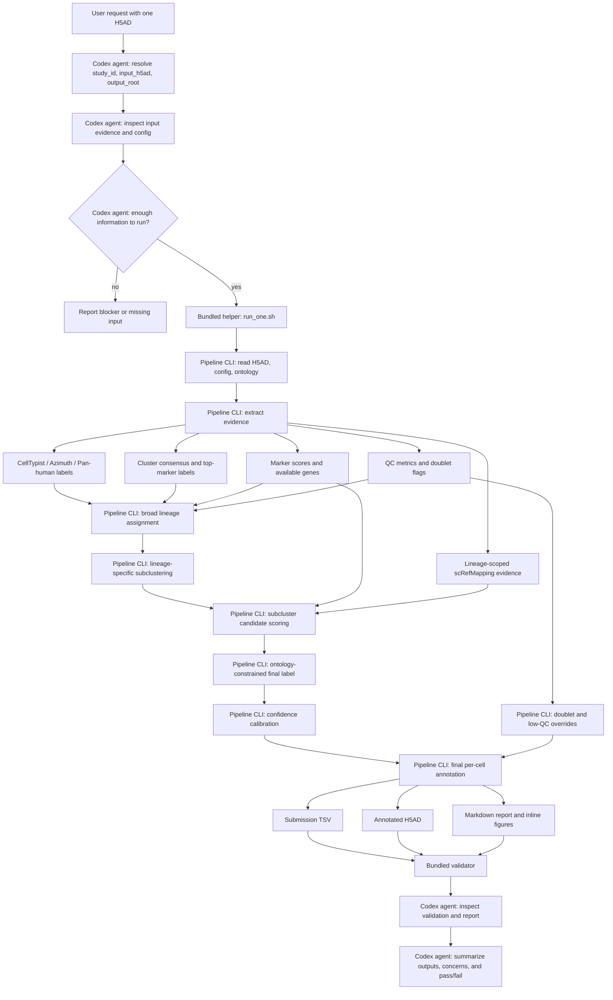

# HIPC scRNA-seq Annotation Submission

Updated: 2026-05-26 EDT

Clean implementation repository for the HIPC scRNA-seq Annotation Benchmark independent annotation workflow.

## Purpose

This repository holds the portable submission implementation. The primary interface is **one dataset in, one annotated dataset out**. Multi-dataset work should be handled by Codex, another agent, or an external scheduler by repeating the single-dataset workflow.

The repository is intentionally organized around a Codex skill. The shell scripts are bundled deterministic helpers used by Codex; they are not the main user interface. Per-dataset reports are template-driven and should emphasize dataset-specific alerts, interpretation, marker availability, and expression figures rather than restating the fixed workflow.

## Directory Map

- `scripts/pipeline/`: deterministic annotation CLIs
- `configs/`: pipeline config, manifest templates, and reference manifests
- `data/reference/`: small official ontology/reference tables only
- `skills/`: Codex operating procedure for annotation concept, execution, validation, and reporting contract
- `skills/hipc-annotation/templates/`: Markdown templates owned by the skill
- `outputs/`: generated outputs, ignored by git
- `reports/`: committed report bundles only

## Standard Codex Use

Ask Codex to apply the `hipc-annotation` skill to one dataset. Codex should inspect the input, run the deterministic helper internally, validate outputs, inspect the report, and return a concise completion summary.

Example request:

```text
Use the hipc-annotation skill on this dataset.
Study ID: infection_study_04
Input H5AD: /path/to/infection_study_04.h5ad
Output root: outputs/single_dataset/infection_study_04
Report languages: en,ja
Run end-to-end and report back only after validation passes.
```

Validation-only request:

```text
Use the hipc-annotation skill to validate this existing output.
Study ID: infection_study_04
Output root: outputs/single_dataset/infection_study_04
Inspect the report links and summarize any remaining concerns.
```

Developer helper scripts live under `skills/hipc-annotation/scripts/`. They are bundled resources for Codex, not the primary user interface.

## Input Contract

Primary input is one processed H5AD evidence container.

Required task inputs:

- `study_id`: stable dataset identifier
- `input_h5ad`: processed H5AD evidence container
- `output_root`: output directory for this dataset
- `config`: annotation config, default `configs/annotation_pipeline.json`
- `report_languages`: usually `en` or `en,ja`

Expected H5AD evidence, when available:

- `celltypist_v3_label`
- `panhuman_fine_v3_label`
- `cluster_consensus_v3_label`
- `top_marker_v3_label`
- raw CellTypist or Azimuth labels such as `majority_voting_Immune_All_Low` and `panhuman_azimuth_fine`
- marker score columns or genes sufficient to compute marker scores
- QC fields such as detected genes, mitochondrial fraction, total counts, and scrublet/doublet calls
- lineage-scoped scRefMapping evidence for B or CD4T, if available

If expected evidence is missing, Codex should report it as an input limitation rather than silently inventing labels.

## Output Contract

For one dataset:

```text
<output_root>/
  submissions/<study_id>_annotation.tsv
  cellxgene/<study_id>.final_annotation.cxg.h5ad
  report_en.md
  report_ja.md
  assets/*.png
  figures/*.png
  tables/final_annotation_summary.tsv
  tables/final_annotation_validation.tsv
  tables/lineage_subcluster_evidence.tsv.gz
  tables/source_disagreement_summary.tsv
```

The submission TSV contains:

```text
cell_barcode
predicted_cell_type
confidence_score
```

The output is valid only if the validator passes.

## Agent-Centered Workflow



scRefMapping is intentionally **not** connected to broad lineage assignment. It is only used after broad lineage assignment as lineage-scoped auxiliary evidence during subcluster candidate scoring.

## Method Details

1. **Codex input audit**: Codex resolves the dataset identity, checks the requested output location, and verifies that the H5AD path and config are available.
2. **Evidence extraction**: the deterministic CLI reads reference labels, raw labels, marker information, QC metrics, doublet flags, and optional lineage-scoped scRefMapping evidence.
3. **Broad lineage assignment**: broad lineage is assigned from CellTypist, Azimuth/Pan-human, cluster/top-marker labels, marker scores, raw labels, and QC context. Prior-version submitted labels are not used as the base annotation.
4. **Lineage-specific subclustering**: B, T/NK, and myeloid lineages are reclustered separately so fine labels are judged inside the relevant local structure.
5. **Candidate scoring**: candidate official labels are scored from subcluster marker support, reference-label fractions, raw-label fractions, marker availability, and best-vs-second margins.
6. **scRefMapping use**: scRefMapping is allowed only after broad lineage assignment and only inside the appropriate lineage. B references can support B subtype adjudication; CD4T references can support CD4/T subtype adjudication. It cannot vote in broad lineage assignment.
7. **Ontology-constrained labels**: final labels must be official ontology labels after configured exclusions. Known problematic labels such as `Effector B` are excluded by config when appropriate.
8. **Doublet and QC handling**: doublet evidence is not a filter. Supported doublets are submitted as `Doublet`; low-QC or mixed-marker cells receive confidence caps or review concerns.
9. **Confidence calibration**: confidence reflects reference agreement, marker support, subcluster coherence, score margin, QC penalties, and doublet/mixed-lineage flags.
10. **Report generation**: reports are generated from Markdown templates in `skills/hipc-annotation/templates/` and focus on dataset-specific summary, marker availability alerts, source disagreement, interpretation notes, UMAPs, marker dotplots, lineage-specific subcluster plots, and output files. The fixed workflow is documented in this README and is not repeated in every report.
11. **Validation**: Codex must confirm submission row counts, official labels, non-missing predictions, H5AD/submission agreement, confidence fields, and report image links.
12. **Codex report assessment**: after generation, Codex reads the report and updates the dataset-specific assessment when the automated text is too generic.
13. **Codex review response**: Codex returns output paths, validation status, and notable review concerns. It should not hand commands back to the user unless blocked.

## Core Principles

1. Do not use prior-version submitted labels as the base annotation.
2. Assign broad lineage from independent reference, marker, raw-label, and QC evidence.
3. Recluster B, T/NK, and myeloid lineages separately.
4. Use marker support and subcluster coherence before accepting fine labels.
5. Treat scRefMapping as lineage-scoped auxiliary evidence after broad lineage assignment; it must not vote in broad lineage assignment.
6. Submit `Doublet` only when supported; do not filter cells out silently.
7. Prefer documented uncertainty over hard-coded local fixes.
8. Reports must expose UMAPs, marker dotplots, disagreement, parent-label residuals, confidence, and validation.

## Validation Contract

Codex should not mark a run complete unless validation confirms:

- submission row counts match H5AD observations
- `predicted_cell_type` has no missing values
- predicted labels are valid official ontology labels after configured exclusions
- H5AD annotation labels match submission TSV labels
- confidence columns are present
- report image links resolve
- source-disagreement diagnostics and dataset-specific assessment are present

## Why No Batch CLI

Batch execution is orchestration, not annotation logic. Keeping the implementation single-dataset first reduces failure surface, simplifies validation, and lets Codex or a scheduler parallelize datasets independently by repeating the same single-dataset skill workflow.

## Current Single-Dataset Report Bundles

- Updated: 2026-05-26 EDT
- Report bundles:
  - `reports/260526_annotation_single_dataset_infection_study_01/`
  - `reports/260526_annotation_single_dataset_infection_study_04/`
  - `reports/260526_annotation_single_dataset_vaccination_study_04/`
  - `reports/260526_annotation_single_dataset_vaccination_study_06/`
  - `reports/260526_annotation_single_dataset_vaccination_study_09/`
- Execution path: Codex skill `hipc-annotation` -> bundled helper `run_one.sh` -> annotation CLI -> validator -> report inspection.
- Validation: all five datasets reached `VALIDATION_PASSED`; submission row counts match H5AD observations, predicted labels are valid official ontology labels, H5AD annotation labels match submission TSVs, confidence columns are present, and report image links resolve.
- Repository policy: only Markdown reports and inline figure assets are committed; generated H5ADs, submission TSVs, and diagnostics tables remain ignored under `outputs/`.

## Data Policy

Large input H5ADs and generated outputs are not committed. Team04 shared evidence containers currently live in the working repository output area and are referenced by `configs/manifest.team04.shared.tsv` for reproducibility on the Yale server.

## Submission Philosophy

The implementation should remain independent of prior-version submission labels. The skill decision contract defines the annotation principles: broad lineage assignment from independent evidence, lineage-specific subclustering, marker/reference/QC/ontology adjudication, explicit doublet handling, and rich report diagnostics. The shell helpers are bundled resources for Codex to execute; they are not the skill itself.
