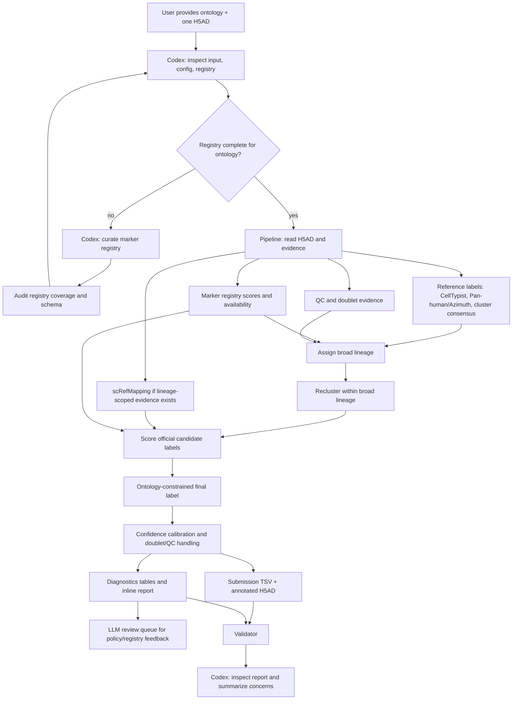

# HIPC scRNA-seq Annotation Submission

Updated: 2026-06-05 15:57:25 EDT

Clean implementation repository for the HIPC scRNA-seq Annotation Benchmark Team04 workflow.

This repository is organized around a Codex skill plus deterministic helper scripts. The intended interface is not a hand-written one-off notebook: Codex receives an ontology and one dataset, checks or builds the marker registry, runs the deterministic annotation workflow, validates outputs, inspects the generated report, and only then returns a completion summary.

## Submission Scope

Team04 beta target set contains 10 processed-template datasets:

- `infection_study_01`
- `infection_study_03`
- `infection_study_04`
- `infection_study_06`
- `infection_study_07`
- `vaccination_study_01`
- `vaccination_study_04`
- `vaccination_study_06`
- `vaccination_study_09`
- `vaccination_study_10`

The all-target manifest is `configs/manifest.team04.beta_all.tsv`. The reviewed evidence-container manifest used during method development is `configs/manifest.team04.shared.tsv`.

Large H5ADs, generated H5ADs, and upload TSVs are not committed to GitHub. They are generated under the Yale server workspace and packaged separately.

## Directory Map

- `skills/hipc-annotation/`: Codex operating procedure and report templates.
- `configs/annotation_pipeline.json`: deterministic thresholds, ontology path, report options, and reference manifests.
- `configs/marker_registry.yaml`: frozen marker registry used by deterministic scoring.
- `configs/manifest.team04.beta_all.tsv`: all 10 Team04 beta processed-template inputs.
- `data/reference/`: small official ontology/reference files.
- `scripts/pipeline/`: deterministic annotation implementation.
- `scripts/package_clean_reports.py`: packages generated per-dataset reports into `reports/current/`.
- `scripts/package_submission_files.py`: packages per-study submission TSVs into a review/upload directory and ZIP.
- `reports/current/`: committed lightweight report bundle only.

## Standard Codex Workflow

### Step 1: Ontology-to-Registry Preparation

Input:

- official ontology TSV, usually `data/reference/CT_Ontology_Spreadsheet_20260323.tsv`
- target tissue/context notes, if available
- optional existing marker registry

Codex should:

1. Read the ontology labels and identify terminal, parent, ambiguous, artifact, and difficult-to-separate labels.
2. Create or revise `configs/marker_registry.yaml` with positive, key, negative, and confound markers for candidate labels.
3. Add conservative notes for labels expected to be hard to distinguish, for example `Plasma Cell` vs `Plasmablast`, `gdT Cell` vs cytotoxic T/MAIT, or `NKT Cell` vs NK/cytotoxic T.
4. Run `scripts/pipeline/hipc_audit_marker_registry.py` and stop if coverage or schema validation fails.
5. Freeze the registry before final deterministic annotation. Runtime LLM per-cell labeling is not allowed.

### Step 2: Single-Dataset Annotation and Review

Input:

- one processed H5AD
- `study_id`
- output directory
- frozen marker registry
- official ontology config

Codex should:

1. Run the `hipc-annotation` skill on one dataset.
2. Use the bundled helper internally; do not ask the user to run shell commands unless blocked.
3. Validate submission row counts, official labels, H5AD/submission agreement, confidence fields, and report image links.
4. Inspect `tables/source_effectiveness_summary.tsv`, `tables/source_disagreement_summary.tsv`, `tables/marker_assignment_feedback.tsv`, and `tables/llm_subcluster_review_queue.tsv`.
5. If the report is too generic, improve the dataset-specific assessment and rerun/package cleanly rather than manually patching `reports/current/`.

Example Codex request:

```text
Use the hipc-annotation skill.
Study ID: infection_study_04
Input H5AD: /path/to/infection_study_04_processed.h5ad
Output root: /path/to/outputs/submission_final/infection_study_04
Report languages: en,ja
Run end-to-end and report back only after validation passes.
```

## Deterministic Annotation Method



scRefMapping is intentionally lineage-scoped. It is not used for broad lineage assignment.

## Evidence and Source-Effectiveness Reporting

The report includes `Annotation Source Effectiveness`. This is not accuracy against external ground truth. It summarizes how much each source contributed to the final annotation:

- `coverage`: fraction of cells where a source returned an informative label.
- `final_concordance`: fraction of informative cells where that source agreed with the final label.
- `high_conf_concordance`: concordance restricted to high-confidence final labels.
- `unique_support`: cells where only that source agreed with the final label.
- `discordant`: informative cells where that source disagreed with the final label.

These statistics are intended to show which sources supported the deterministic result in each dataset. They should not be reported as benchmark accuracy without organizer ground truth.

## Output Contract

For one dataset:

```text
<output_root>/
  submissions/<study_id>_annotation.tsv
  cellxgene/<study_id>.final_annotation.cxg.h5ad
  report_en.md
  report_ja.md
  assets/*.png
  figures/*.png or *.pdf
  tables/final_annotation_summary.tsv
  tables/final_annotation_validation.tsv
  tables/source_effectiveness_summary.tsv
  tables/source_disagreement_summary.tsv
  tables/marker_assignment_feedback.tsv
  tables/llm_subcluster_review_queue.tsv
```

Submission TSV schema:

```text
cell_barcode
predicted_cell_type
confidence_score
```

## Packaging Reports and Submission Files

Report bundle packaging:

```bash
python scripts/package_clean_reports.py   --run-root /vast/palmer/pi/hafler/yy693/HIPC-scRNAseq-Annotation/outputs/submission_final_v22   --report-root reports/current   --replace
python scripts/validate_report_bundle.py --report-root reports/current
```

Submission TSV package:

```bash
python scripts/package_submission_files.py   --run-root /vast/palmer/pi/hafler/yy693/HIPC-scRNAseq-Annotation/outputs/submission_final_v22   --out /vast/palmer/pi/hafler/yy693/HIPC-scRNAseq-Annotation/outputs/submission_package_v22   --replace
```

The package helper writes per-study TSVs, a summary table, a README, and a ZIP archive.

## Validation Contract

A run is not complete unless validation confirms:

- submission rows match H5AD observations
- `predicted_cell_type` has no missing values
- predicted labels are official ontology labels after configured exclusions
- H5AD `submission_cell_type` matches the submission TSV
- `confidence_score` is present
- report inline image links resolve
- source-effectiveness and source-disagreement diagnostics are present

## Core Guardrails

- Do not use prior-version submitted labels as the base annotation.
- Do not hard-code study-specific rescues that cannot be explained as marker/reference/QC/ontology policy.
- Use marker genes through `configs/marker_registry.yaml`, not ad hoc code lists.
- Keep doublets as submitted labels when supported; do not silently filter cells out.
- Use parent/root labels conservatively when evidence is weak, and expose that uncertainty in confidence and reports.
- If a report is insufficient, update the pipeline/template and rerun cleanly; do not manually patch committed reports.
