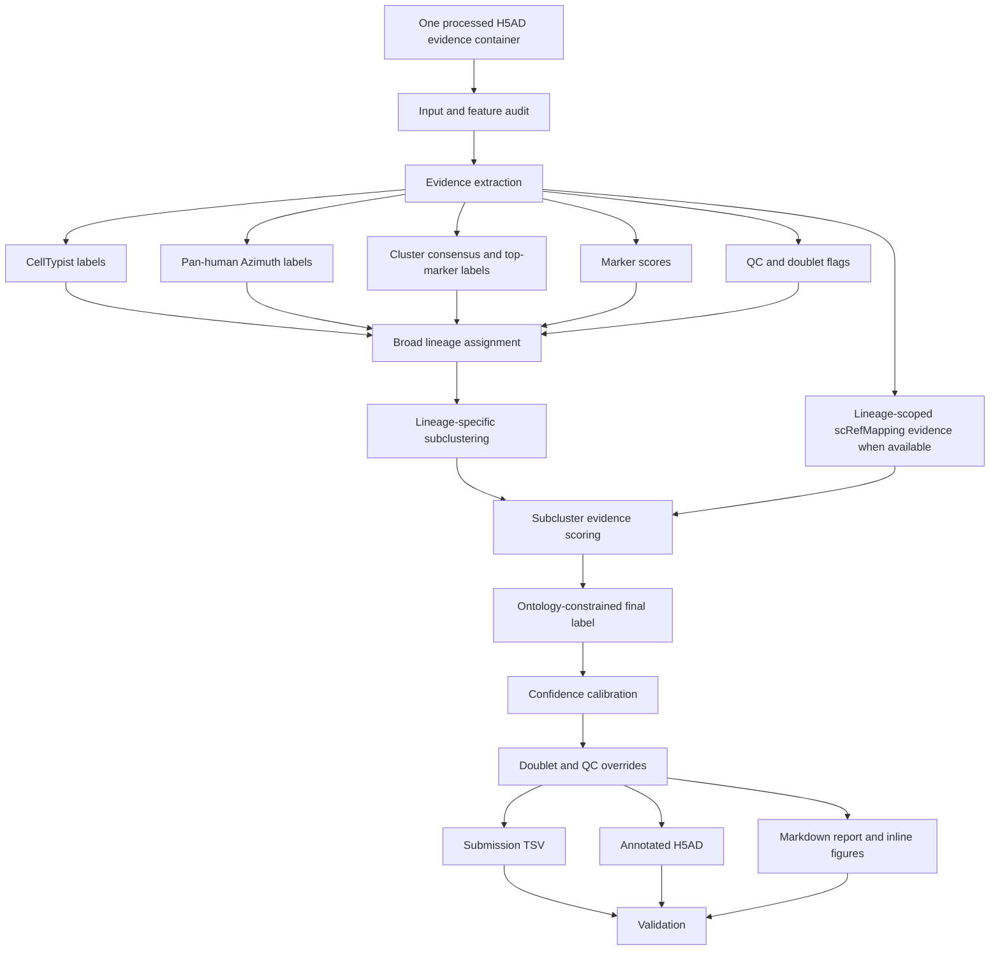

# HIPC scRNA-seq Annotation Submission

Updated: 2026-05-23 EDT

Clean implementation repository for the HIPC scRNA-seq Annotation Benchmark v12 independent annotation workflow.

## Purpose

This repository holds the portable submission implementation. The primary interface is **one dataset in, one annotated dataset out**. Multi-dataset runs should be handled by an agent or external scheduler by repeating the single-dataset command.

## Directory Map

- `scripts/pipeline/`: deterministic annotation CLIs
- `configs/`: pipeline config, manifest templates, and reference manifests
- `data/reference/`: small official ontology/reference tables only
- `skills/`: Codex operating procedure for annotation concept, execution, validation, and reporting contract
- `docs/`: design notes for submission strategy
- `outputs/`: generated outputs, ignored by git
- `reports/`: committed report bundles only

## Primary Input

A single processed H5AD evidence container with per-cell reference and QC evidence. The current v12 implementation expects columns such as CellTypist labels, Pan-human Azimuth labels, cluster consensus labels, marker scores, QC metrics, and doublet flags when available.

Required command-level inputs:

- `--study-id`: stable dataset identifier
- `--input-h5ad`: processed H5AD evidence container
- `--out`: output directory for this dataset
- `--config`: v12 config, default `configs/v12_pipeline.json`
- `--report-languages`: comma-separated report languages, e.g. `en,ja`

## Primary Output

For one dataset:

```text
<out>/
  submissions/<study_id>_annotation.tsv
  cellxgene/<study_id>.final_v12_recursive_screfmapping.cxg.h5ad
  reports/report_en.md
  reports/report_ja.md
  report_assets/*.png
  figures/*.png
  tables/*
```

The submission TSV contains `cell_barcode`, `predicted_cell_type`, and `confidence_score`.

## Standard Codex Use

Use this repository by asking Codex to apply the `hipc-annotation-v12` skill to one dataset. Codex should inspect the input, run the deterministic helper internally, validate outputs, inspect the report, and return a concise completion summary.

Example request:

```text
Use the hipc-annotation-v12 skill on this dataset.
Study ID: infection_study_04
Input H5AD: /path/to/infection_study_04.h5ad
Output root: outputs/single_dataset/infection_study_04
Report languages: en,ja
Run end-to-end and report back only after validation passes.
```

Validation-only request for existing output:

```text
Use the hipc-annotation-v12 skill to validate this existing output.
Study ID: infection_study_04
Output root: outputs/single_dataset/infection_study_04
Inspect the report links and summarize any remaining concerns.
```

Developer helper scripts live under `skills/hipc-annotation-v12/scripts/`. They are bundled resources for Codex, not the primary user interface.

## Workflow



## Full Run Report Bundle

- Updated: 2026-05-23 EDT
- Report bundle: `reports/260523_v12_full_run/`
- Execution command: `HIPC_V12_OUT=outputs/final_annotations/260523_v12_full_run HIPC_V12_MANIFEST=configs/v12_manifest.team04.shared.tsv REPORT_LANGUAGES=en,ja skills/hipc-annotation-v12/scripts/run_v12.sh`
- Validation: `VALIDATION_PASSED`; submission row counts match H5AD observations, predicted labels are valid official ontology labels, H5AD v12 labels match submission TSVs, confidence columns are present, and report image links resolve.
- Repository policy: only Markdown reports and inline figure assets are committed; generated H5ADs, submission TSVs, and diagnostics tables remain ignored under `outputs/`.

## Data Policy

Large input H5ADs and generated outputs are not committed. Team04 shared evidence containers currently live in the working repository output area and are referenced by `configs/v12_manifest.team04.shared.tsv` for reproducibility on the Yale server.

## Submission Philosophy

The implementation should remain independent of prior-version submission labels. The skill decision contract defines the annotation principles: broad lineage assignment from independent evidence, lineage-specific subclustering, marker/reference/QC/ontology adjudication, explicit doublet handling, and rich report diagnostics. The shell helpers are bundled resources for Codex to execute; they are not the skill itself.
