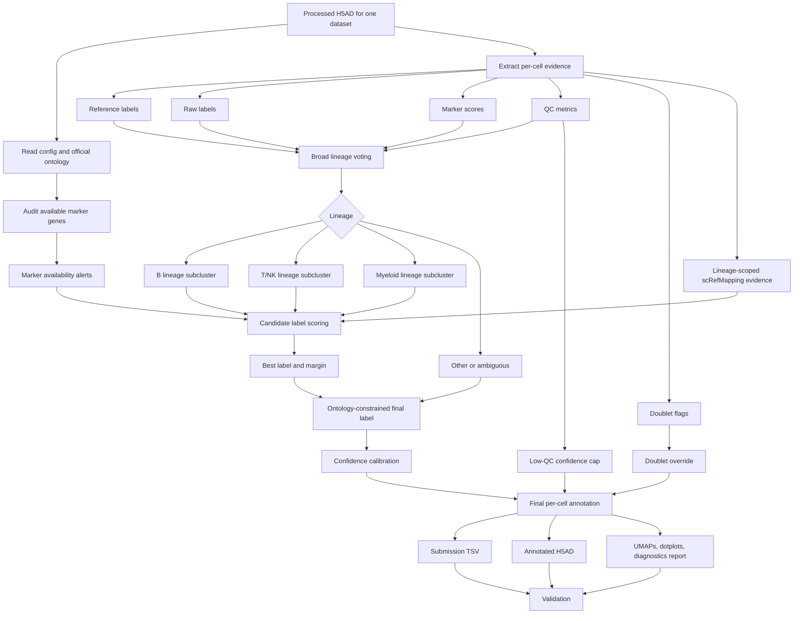

# Annotation Strategy

Updated: 2026-05-23 EDT

The v12 workflow separates deterministic execution from annotation reasoning. The minimal submission interface is one dataset in, one annotated dataset out.

## Roles

- CLI role: reproducibly produce submission TSV, annotated H5AD, diagnostics, and report for one dataset.
- Skill role: preserve the manual-annotation decision contract and force validation/reporting after execution.
- Agent role: if multiple datasets are needed, repeat the single-dataset workflow rather than relying on a separate batch abstraction.

## Input Contract

Primary input is one processed H5AD evidence container.

Expected evidence, when available:

- `celltypist_v3_label`
- `panhuman_fine_v3_label`
- `cluster_consensus_v3_label`
- `top_marker_v3_label`
- raw CellTypist or Azimuth labels such as `majority_voting_Immune_All_Low` and `panhuman_azimuth_fine`
- marker score columns or genes sufficient to compute marker scores
- QC fields such as detected genes, mitochondrial fraction, total counts, and scrublet/doublet calls
- lineage-scoped scRefMapping evidence for B or CD4T, if available

## Output Contract

For `--study-id STUDY --out OUT`, the workflow writes:

```text
OUT/
  submissions/STUDY_annotation.tsv
  cellxgene/STUDY.final_v12_recursive_screfmapping.cxg.h5ad
  reports/report_en.md
  reports/report_ja.md
  report_assets/*.png
  tables/final_annotation_summary_v12_recursive_screfmapping.tsv
  tables/final_annotation_validation_v12_recursive_screfmapping.tsv
  tables/v12_lineage_subcluster_evidence.tsv.gz
```

The output is valid only if the validator passes.

## Decision Flow



## Core Principles

1. Do not use prior-version submitted labels as the base annotation.
2. Assign broad lineage from independent reference, marker, raw-label, and QC evidence.
3. Recluster B, T/NK, and myeloid lineages separately.
4. Use marker support and subcluster coherence before accepting fine labels.
5. Treat scRefMapping as lineage-scoped auxiliary evidence after broad lineage assignment; it must not vote in broad lineage assignment, especially when marker availability is low.
6. Submit `Doublet` only when supported; do not filter cells out silently.
7. Prefer documented uncertainty over hard-coded local fixes.
8. Reports must expose UMAPs, marker dotplots, disagreement, parent-label residuals, confidence, and validation.

## Why No Batch CLI

Batch execution is orchestration, not annotation logic. Keeping the implementation single-dataset first reduces the surface area for failures, simplifies validation, and lets an agent or scheduler parallelize datasets independently.
