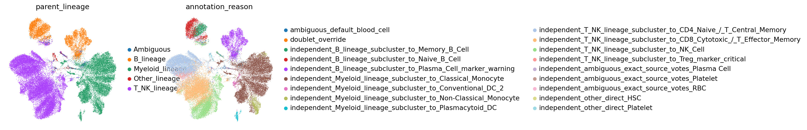
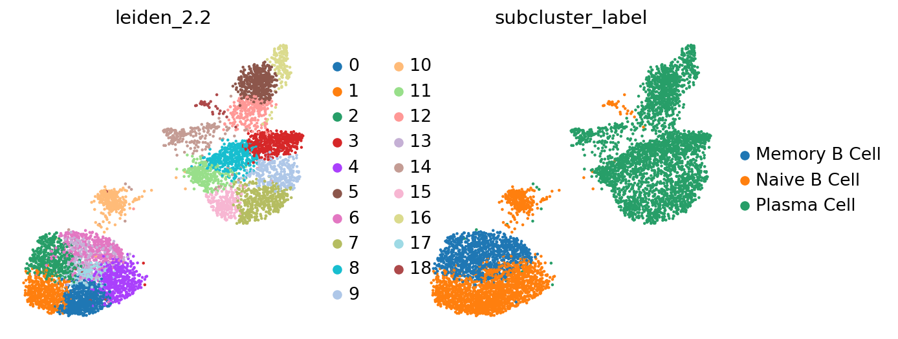
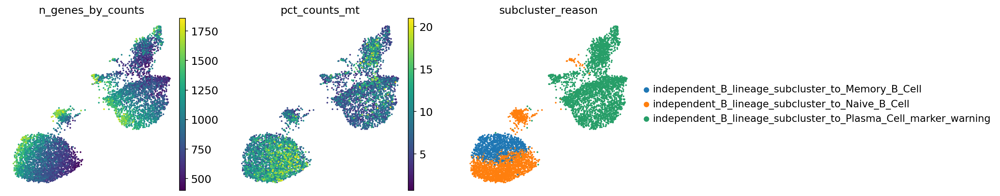
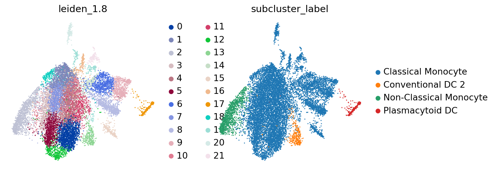
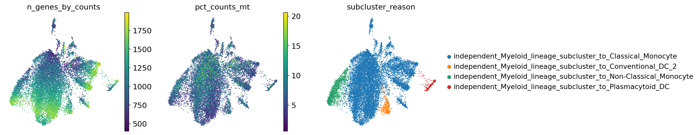

# HIPC Dataset Annotation Report: infection_study_04

Updated: 2026-05-23 EDT

This report was generated by the `hipc-annotation` Codex workflow. It is a dataset-specific review document: the fixed method lives in the repository README, while this report should expose the actual evidence, weak points, and review priorities for this dataset.

## Dataset Summary

| study | cells | genes | labels | parent_or_blood_fraction | Blood Cell | Doublet | artifact_like | median_confidence | low_confidence | source_disagreement | invalid_labels |
| --- | --- | --- | --- | --- | --- | --- | --- | --- | --- | --- | --- |
| infection_study_04 | 43,767 | 3,933 | 16 | 0.012 | 529 | 61 | 353 | 0.838 | 751 | 11,680 (0.267) | none |

## Run Summary

- Execution unit: one dataset in, one annotated dataset out.
- Execution path: Codex skill `hipc-annotation` -> bundled helper `run_one.sh` -> annotation CLI -> validator -> report inspection.
- Validation checks: submission row count, H5AD observation count, official label validity, H5AD/submission agreement, confidence column, and report image links.
- This report is for dataset-specific marker availability, UMAPs, label composition, and review concerns rather than repeating the fixed workflow.

## Dataset-Specific Interpretation

- `infection_study_04`: 43,767 cells, 3,933 genes, 16 submitted labels, parent/Blood residual fraction 0.012, median confidence 0.838.
  - 751 cells have low confidence and should be inspected on QC/confidence UMAPs.
  - 61 cells are submitted as `Doublet`; inspect mixed-lineage marker expression before final submission.
  - 529 cells remain `Blood Cell`; these are residual ambiguous cells rather than filtered cells.
  - Marker availability alerts are present for: Treg, Plasma_ASC. Fine labels relying on these marker sets should be treated cautiously.

## Dataset-Specific Assessment

- Overall: 43,767 cells / 3,933 genes. Parent/Blood residual fraction is 0.012; low-confidence cells are 751; source-disagreement flags affect 11,680 cells (0.267).
- Review priority: check whether low-confidence regions co-localize with QC artifacts or source-disagreement regions on UMAP.
- Review priority: inspect whether residual `Blood Cell` cells form isolated clusters or dispersed ambiguous zones across lineages.
- Marker availability: Treg, Plasma_ASC are confidence-capped; validate affected labels on marker-expression UMAPs and dotplots.
- Codex review: source disagreement affects 26.7% of cells and should be treated as a major review signal. `Memory B Cell` (72.4% disagreement) and `Treg` (70.2% disagreement) are the highest-priority fine labels for manual review.
- Codex review: `Treg` lacks FOXP3/IL2RA/CTLA4 in `var`, so this call depends on limited markers such as IKZF2/TIGIT. It is retained as a submitted label, but should be interpreted as a confidence-capped provisional fine label.
- Codex review: `Plasma Cell` lacks JCHAIN, but MZB1/XBP1/PRDM1/IRF4 are present and source-disagreement fraction is low (9.2%). This is more robust than Treg, while the JCHAIN absence remains noteworthy.
- Codex review: `Blood Cell` and `Doublet` have disagreement fraction 1.0 because they are parent/override labels. The relevant review question is whether they form isolated ambiguous regions or dispersed QC/mixed-lineage artifacts on UMAP.
- Codex review: CD4/CD8 T labels have many disagreement cells because the populations are large, but fractions are moderate (33-37%). If disagreement concentrates in a specific subcluster, T subtype scoring should be revisited.

## Marker Gene Availability

| study | marker_set | alert | present_fraction | missing_critical_markers | missing_genes |
| --- | --- | --- | --- | --- | --- |
| infection_study_04 | Treg | critical | 0.286 | FOXP3;IL2RA;CTLA4 | FOXP3;IL2RA;CTLA4;TNFRSF18;CCR8 |
| infection_study_04 | Plasma_ASC | warning | 0.667 | JCHAIN | JCHAIN;SDC1;TNFRSF17 |

## Source Disagreement

| study | predicted_cell_type | cells | median_source_agreement | disagreement_cells | disagreement_fraction |
| --- | --- | --- | --- | --- | --- |
| infection_study_04 | Blood Cell | 529 | 0.000 | 529 | 1.000 |
| infection_study_04 | Doublet | 61 | 0.000 | 61 | 1.000 |
| infection_study_04 | Memory B Cell | 1,136 | 0.400 | 823 | 0.724 |
| infection_study_04 | Treg | 554 | 0.400 | 389 | 0.702 |
| infection_study_04 | Naive B Cell | 2,070 | 0.600 | 811 | 0.392 |
| infection_study_04 | CD4 Naive / T Central Memory | 7,824 | 0.600 | 2,925 | 0.374 |
| infection_study_04 | CD8 Cytotoxic / T Effector Memory | 8,696 | 0.500 | 2,933 | 0.337 |
| infection_study_04 | Classical Monocyte | 11,755 | 0.750 | 1,979 | 0.168 |
| infection_study_04 | NK Cell | 6,007 | 1.000 | 852 | 0.142 |
| infection_study_04 | Conventional DC 2 | 306 | 0.750 | 34 | 0.111 |
| infection_study_04 | Plasma Cell | 3,145 | 0.800 | 288 | 0.092 |
| infection_study_04 | Non-Classical Monocyte | 1,102 | 1.000 | 48 | 0.044 |

## Review Priorities

| study | concern | cells |
| --- | --- | --- |
| infection_study_04 | High source disagreement for Blood Cell | 529 |
| infection_study_04 | High source disagreement for Doublet | 61 |
| infection_study_04 | High source disagreement for Memory B Cell | 823 |
| infection_study_04 | High source disagreement for Treg | 389 |
| infection_study_04 | High dataset-level source disagreement | 11,680 |
| infection_study_04 | critical marker availability for Treg | 554 |
| infection_study_04 | warning marker availability for Plasma_ASC | 3,145 |

## Label Composition

| study | predicted_cell_type | cells |
| --- | --- | --- |
| infection_study_04 | Classical Monocyte | 11,755 |
| infection_study_04 | CD8 Cytotoxic / T Effector Memory | 8,696 |
| infection_study_04 | CD4 Naive / T Central Memory | 7,824 |
| infection_study_04 | NK Cell | 6,007 |
| infection_study_04 | Plasma Cell | 3,145 |
| infection_study_04 | Naive B Cell | 2,070 |
| infection_study_04 | Memory B Cell | 1,136 |
| infection_study_04 | Non-Classical Monocyte | 1,102 |
| infection_study_04 | Treg | 554 |
| infection_study_04 | Blood Cell | 529 |
| infection_study_04 | Conventional DC 2 | 306 |
| infection_study_04 | Plasmacytoid DC | 229 |
| infection_study_04 | Platelet | 148 |
| infection_study_04 | RBC | 132 |
| infection_study_04 | HSC | 73 |
| infection_study_04 | Doublet | 61 |

## Figures

### infection_study_04

#### infection_study_04 B_lineage subcluster UMAP

#### infection_study_04 T_NK_lineage subcluster UMAP

#### infection_study_04 Myeloid_lineage subcluster UMAP

## Output Files

- Submission TSVs: `outputs/single_dataset_checks/260523_infection_study_04_assessment_v2/submissions/`
- cellxgene H5ADs: `outputs/single_dataset_checks/260523_infection_study_04_assessment_v2/cellxgene/`
- Marker availability table: `outputs/single_dataset_checks/260523_infection_study_04_assessment_v2/tables/marker_gene_availability.tsv`
- Marker availability alerts: `outputs/single_dataset_checks/260523_infection_study_04_assessment_v2/tables/marker_gene_availability_alerts.tsv`
- Subcluster evidence: `outputs/single_dataset_checks/260523_infection_study_04_assessment_v2/tables/lineage_subcluster_evidence.tsv.gz`
- Source disagreement summary: `outputs/single_dataset_checks/260523_infection_study_04_assessment_v2/tables/source_disagreement_summary.tsv`
- Diagnostics tables: `outputs/single_dataset_checks/260523_infection_study_04_assessment_v2/tables/`

## Follow-Up Review Prompt

Review this dataset-specific HIPC annotation report.
Focus on marker availability alerts, residual parent/Blood labels, low-confidence regions, doublet calls, and whether marker-expression UMAPs support the submitted labels.
Do not restate the fixed pipeline workflow from README; provide dataset-specific concerns and suggested next checks only.
