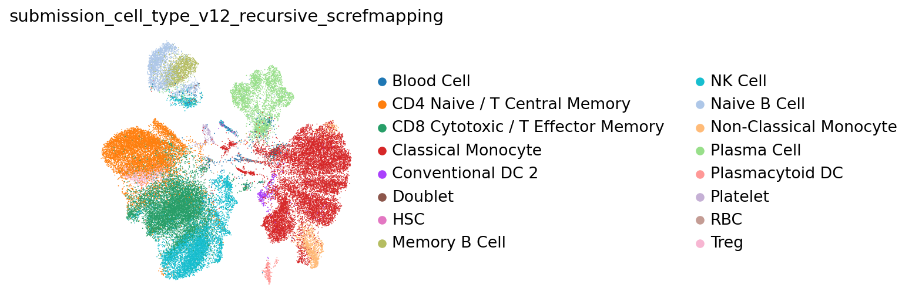
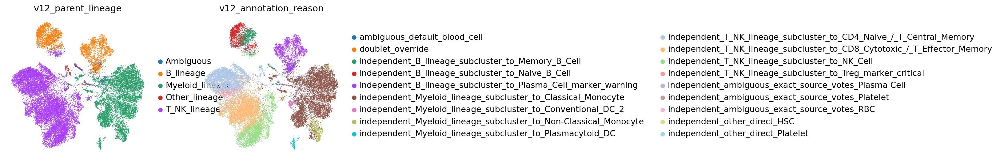
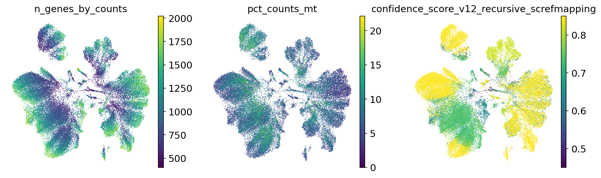
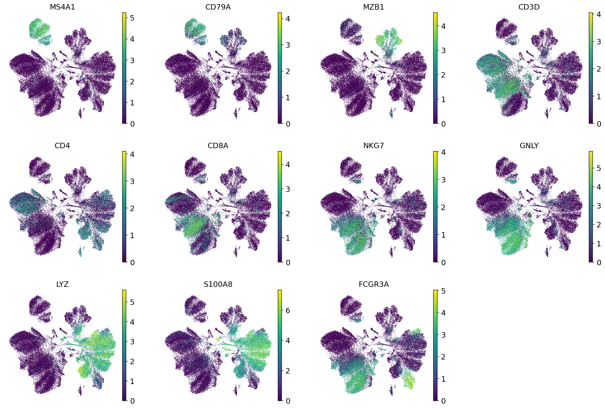
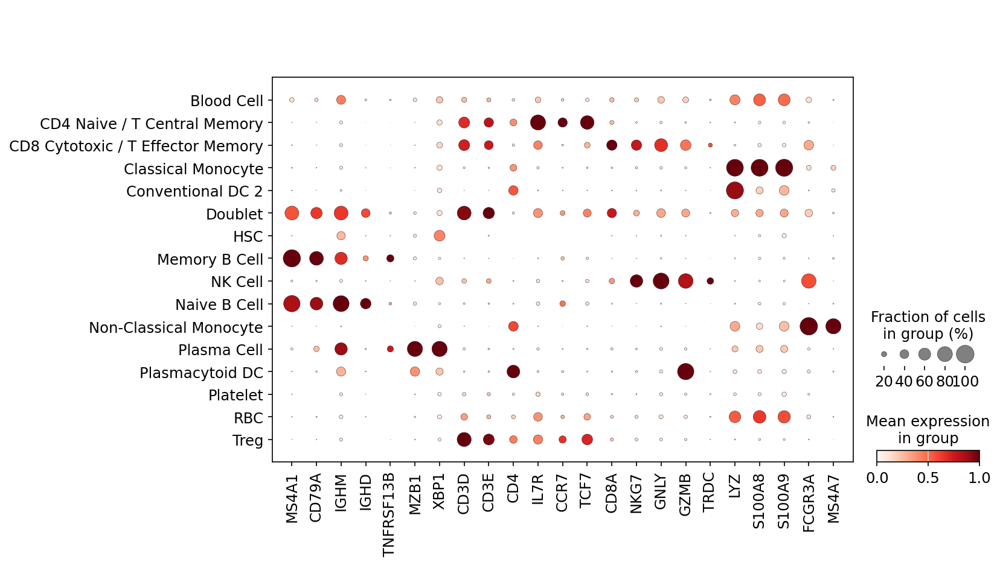
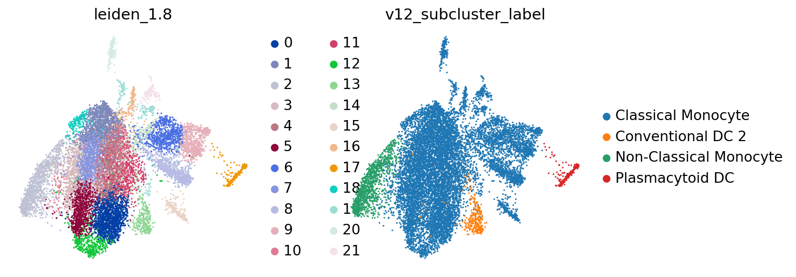

# HIPC v12 データセットアノテーションレポート: infection_study_04

更新日: 2026-05-23 EDT

このレポートは `hipc-annotation-v12` Codex workflow によって生成したデータセット別レポートです。固定の workflow 図ではなく、このデータセットの annotation 結果、marker gene 欠損、解釈、レビュー上の懸念、UMAP / dotplot を中心にまとめます。

## データセット概要

| study | cells | labels | parent_or_blood_fraction | Blood Cell | Doublet | artifact_like | median_confidence | low_confidence | invalid_labels |
| --- | --- | --- | --- | --- | --- | --- | --- | --- | --- |
| infection_study_04 | 43,767 | 16 | 0.012 | 529 | 61 | 353 | 0.838 | 751 | none |

## 実行概要

- 実行単位: one dataset in, one annotated dataset out。
- 実行経路: Codex skill `hipc-annotation-v12` -> bundled helper `run_one.sh` -> v12 CLI -> validator -> report inspection。
- 検証: submission row count、H5AD observation count、official label validity、H5AD/submission agreement、confidence column、report image link を確認する。
- このレポートは workflow の再掲ではなく、このデータセットの marker 欠損、UMAP、label 構成、review concern を読むためのもの。

## 解釈メモ

- `infection_study_04`: 43,767 cells、submitted label 16 種、parent/Blood residual fraction 0.012、median confidence 0.838。
  - 751 cells は low confidence。QC / confidence UMAP 上で局在を確認する。
  - 61 cells は `Doublet` として提出。mixed-lineage marker expression と scrublet support を確認する。
  - 529 cells は `Blood Cell` として残存。これは filter-out ではなく、曖昧な細胞を公式 parent label で残したもの。
  - Marker gene 欠損アラート: Treg, Plasma_ASC。該当 marker set に依存する fine label は慎重に見る。

## Marker Gene 欠損アラート

| study | marker_set | alert | present_fraction | missing_critical_markers | missing_genes |
| --- | --- | --- | --- | --- | --- |
| infection_study_04 | Treg | critical | 0.286 | FOXP3;IL2RA;CTLA4 | FOXP3;IL2RA;CTLA4;TNFRSF18;CCR8 |
| infection_study_04 | Plasma_ASC | warning | 0.667 | JCHAIN | JCHAIN;SDC1;TNFRSF17 |

## レビュー上の懸念

なし。

## ラベル構成

| study | predicted_cell_type | cells |
| --- | --- | --- |
| infection_study_04 | Classical Monocyte | 11,755 |
| infection_study_04 | CD8 Cytotoxic / T Effector Memory | 8,696 |
| infection_study_04 | CD4 Naive / T Central Memory | 7,824 |
| infection_study_04 | NK Cell | 6,007 |
| infection_study_04 | Plasma Cell | 3,145 |
| infection_study_04 | Naive B Cell | 2,070 |
| infection_study_04 | Memory B Cell | 1,136 |
| infection_study_04 | Non-Classical Monocyte | 1,102 |
| infection_study_04 | Treg | 554 |
| infection_study_04 | Blood Cell | 529 |
| infection_study_04 | Conventional DC 2 | 306 |
| infection_study_04 | Plasmacytoid DC | 229 |
| infection_study_04 | Platelet | 148 |
| infection_study_04 | RBC | 132 |
| infection_study_04 | HSC | 73 |
| infection_study_04 | Doublet | 61 |

## 図

### infection_study_04

#### infection_study_04 B_lineage subcluster UMAP

#### infection_study_04 T_NK_lineage subcluster UMAP

#### infection_study_04 Myeloid_lineage subcluster UMAP

## 出力ファイル

- Submission TSVs: `outputs/single_dataset_checks/260523_infection_study_04_flat_report/submissions/`
- cellxgene H5ADs: `outputs/single_dataset_checks/260523_infection_study_04_flat_report/cellxgene/`
- Marker availability table: `outputs/single_dataset_checks/260523_infection_study_04_flat_report/tables/marker_gene_availability.tsv`
- Marker availability alerts: `outputs/single_dataset_checks/260523_infection_study_04_flat_report/tables/marker_gene_availability_alerts.tsv`
- Subcluster evidence: `outputs/single_dataset_checks/260523_infection_study_04_flat_report/tables/v12_lineage_subcluster_evidence.tsv.gz`
- Diagnostics tables: `outputs/single_dataset_checks/260523_infection_study_04_flat_report/tables/`

## LLM レビュー用プロンプト

このデータセット別 HIPC v12 annotation report をレビューしてください。
marker gene 欠損アラート、parent/Blood label の残存、low-confidence 領域、doublet call、marker-expression UMAP が submitted label を支持しているかに注目してください。
README の固定 workflow は繰り返さず、このデータセット固有の懸念点と次に確認すべき点だけを返してください。

