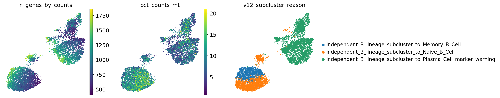
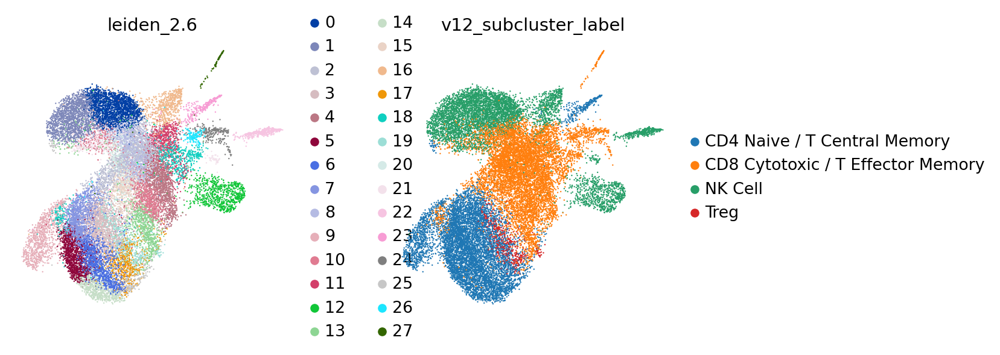

# HIPC v12 Dataset Annotation Report: infection_study_04

Updated: 2026-05-23 EDT

This is a dataset-specific annotation report generated by the `hipc-annotation-v12` Codex workflow. The fixed method and workflow diagram live in the repository README; this report focuses on dataset-specific outputs, alerts, interpretation, and review items.

## Dataset Summary

| study | cells | labels | parent_or_blood_fraction | Blood Cell | Doublet | artifact_like | median_confidence | low_confidence | invalid_labels |
| --- | --- | --- | --- | --- | --- | --- | --- | --- | --- |
| infection_study_04 | 43,767 | 16 | 0.012 | 529 | 61 | 353 | 0.838 | 751 | none |

## Dataset-Specific Interpretation

- `infection_study_04`: 43,767 cells, 16 submitted labels, parent/Blood residual fraction 0.012, median confidence 0.838.
  - 751 cells have low confidence and should be inspected on QC/confidence UMAPs.
  - 61 cells are submitted as `Doublet`; inspect mixed-lineage marker expression before final submission.
  - 529 cells remain `Blood Cell`; these are residual ambiguous cells rather than filtered cells.
  - Marker availability alerts are present for: Treg, Plasma_ASC. Fine labels relying on these marker sets should be treated cautiously.

## Marker Gene Availability Alerts

| study | marker_set | alert | present_fraction | missing_critical_markers | missing_genes |
| --- | --- | --- | --- | --- | --- |
| infection_study_04 | Treg | critical | 0.286 | FOXP3;IL2RA;CTLA4 | FOXP3;IL2RA;CTLA4;TNFRSF18;CCR8 |
| infection_study_04 | Plasma_ASC | warning | 0.667 | JCHAIN | JCHAIN;SDC1;TNFRSF17 |

## Review Concerns

None.

## Label Composition

| study | predicted_cell_type | cells |
| --- | --- | --- |
| infection_study_04 | Classical Monocyte | 11,755 |
| infection_study_04 | CD8 Cytotoxic / T Effector Memory | 8,696 |
| infection_study_04 | CD4 Naive / T Central Memory | 7,824 |
| infection_study_04 | NK Cell | 6,007 |
| infection_study_04 | Plasma Cell | 3,145 |
| infection_study_04 | Naive B Cell | 2,070 |
| infection_study_04 | Memory B Cell | 1,136 |
| infection_study_04 | Non-Classical Monocyte | 1,102 |
| infection_study_04 | Treg | 554 |
| infection_study_04 | Blood Cell | 529 |
| infection_study_04 | Conventional DC 2 | 306 |
| infection_study_04 | Plasmacytoid DC | 229 |
| infection_study_04 | Platelet | 148 |
| infection_study_04 | RBC | 132 |
| infection_study_04 | HSC | 73 |
| infection_study_04 | Doublet | 61 |

## Figures

### infection_study_04

#### infection_study_04 B_lineage subcluster UMAP

#### infection_study_04 T_NK_lineage subcluster UMAP

#### infection_study_04 Myeloid_lineage subcluster UMAP

## Files

- Submission TSVs: `outputs/single_dataset_checks/260523_infection_study_04_current/submissions/`
- cellxgene H5ADs: `outputs/single_dataset_checks/260523_infection_study_04_current/cellxgene/`
- Marker availability table: `outputs/single_dataset_checks/260523_infection_study_04_current/tables/marker_gene_availability.tsv`
- Marker availability alerts: `outputs/single_dataset_checks/260523_infection_study_04_current/tables/marker_gene_availability_alerts.tsv`
- Subcluster evidence: `outputs/single_dataset_checks/260523_infection_study_04_current/tables/v12_lineage_subcluster_evidence.tsv.gz`
- Diagnostics tables: `outputs/single_dataset_checks/260523_infection_study_04_current/tables/`

## Suggested LLM Review Prompt

Review this dataset-specific HIPC v12 annotation report.
Focus on marker availability alerts, residual parent/Blood labels, low-confidence regions, doublet calls, and whether marker-expression UMAPs support the submitted labels.
Do not restate the fixed pipeline workflow from README; provide dataset-specific concerns and suggested next checks only.

