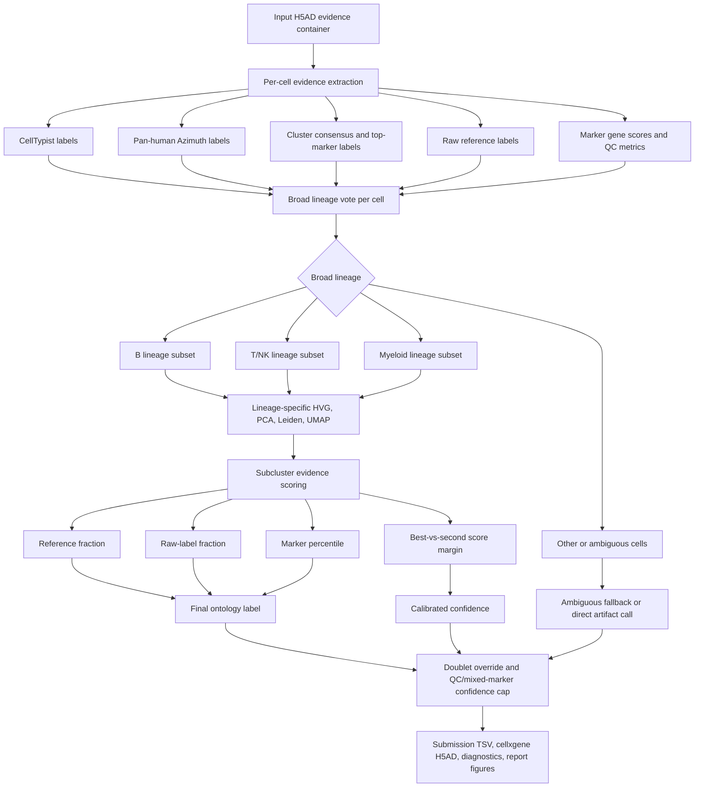
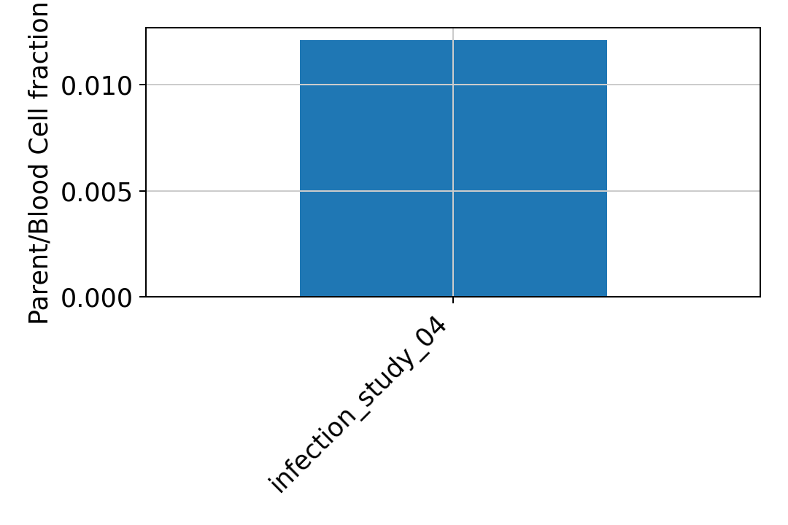

# HIPC beta final annotation v12 fully independent calibrated-resolution report

Updated: 2026-05-23 EDT

## Summary

`v12_recursive_screfmapping` は、前バージョンの submission label、parent lineage、subcluster、confidence を使わずに、broad lineage、lineage-specific subcluster、final label、confidence を作り直す独立 annotation pass です。入力 evidence は CellTypist、Pan-human Azimuth、cluster consensus、top-marker label、raw reference label、marker score、QC、doublet flag です。

## Main Logic

- Broad lineage は CellTypist、Pan-human Azimuth、cluster consensus、top marker lineage、raw reference label、marker score から独立に投票して決める。
- B、T/NK、myeloid lineage は別々に再クラスタリングする。親ラベルだけを取り出して救済する処理ではない。
- Final label は lineage subcluster ごとの marker/reference consensus から決める。
- 各 study について B、T/NK、myeloid の subcluster UMAP を出力する。
- Doublet は override label とし、低 QC または mixed-marker cell は confidence を cap する。

## Workflow

## Study Summary

| study | cells | v12 labels | parent/Blood fraction | B Cell | T Cell | Myeloid Cell | Blood Cell | artifact-like | Doublet | Effector B | median confidence | low confidence | invalid labels |
| --- | ---: | ---: | ---: | ---: | ---: | ---: | ---: | ---: | ---: | ---: | ---: | ---: | --- |
| infection_study_04 | 43,767 | 16 | 0.012 | 0 | 0 | 0 | 529 | 353 | 61 | 0 | 0.838 | 751 | none |

## Figures

### infection_study_04

#### infection_study_04 B_lineage subcluster UMAP

#### infection_study_04 T_NK_lineage subcluster UMAP

#### infection_study_04 Myeloid_lineage subcluster UMAP

## Files

- Submission TSVs: `outputs/single_dataset_checks/260523_infection_study_04_current/submissions/`
- cellxgene H5ADs: `outputs/single_dataset_checks/260523_infection_study_04_current/cellxgene/`
- Subcluster evidence: `outputs/single_dataset_checks/260523_infection_study_04_current/tables/v12_lineage_subcluster_evidence.tsv.gz`
- Diagnostics tables: `outputs/single_dataset_checks/260523_infection_study_04_current/tables/`
