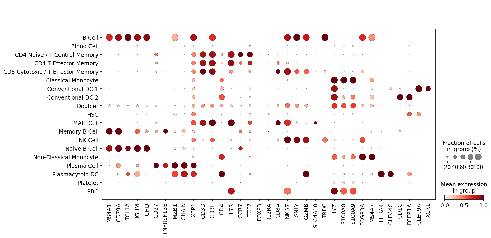

# HIPC v13 dataset review: `infection_study_01`

Updated: 2026-05-26 EDT

## Summary

この report は `infection_study_01` について、portal input から独立に作成した v13 annotation review です。reference mapping、marker score、lineage-specific subclustering、doublet/QC evidence を統合し、全細胞に official ontology label と confidence score を付与しました。

## Dataset Assessment

Full portal gene space は 33,538 genes で、critical marker 欠損はありません。B/T/myeloid の主要 lineage は subcluster と marker で安定しており、parent/Blood fraction は 0.30% と低いです。screfmap は B/CD4T の補助 evidence として利用されています。

## Gene Space and Marker Alerts

| cells | portal genes | raw source | count-like | critical marker missing |
| ---: | ---: | --- | ---: | --- |
| 54,924 | 33,538 | layers[counts] | 1.000 | none |

| marker set | present / expected | alert | missing critical markers |
| --- | ---: | --- | --- |
| none | - | - | - |

## Annotation Summary

| cells | labels | parent/Blood fraction | Blood Cell | Doublet | artifact-like | median confidence | low confidence | invalid labels |
| ---: | ---: | ---: | ---: | ---: | ---: | ---: | ---: | --- |
| 54,924 | 19 | 0.003 | 166 | 1,278 | 1,389 | 0.846 | 2,209 | none |

## Source Agreement

| mean source agreement | screfmap-covered cells | interpretation |
| ---: | ---: | --- |
| 0.692 | 12,523 | screfmap は broad lineage ではなく、B/CD4T lineage 内の補助 evidence として使っています。 |

## Figures

## Output Location

Large submission TSVs, annotated H5ADs, and diagnostics tables are stored on the Yale server working path:

`/vast/palmer/pi/hafler/yy693/HIPC-scRNAseq-Annotation/outputs/final_annotations/260526_v13_input_contract_repair/`
