# HIPC データセットアノテーションレポート: infection_study_01

更新日: 2026-05-26 EDT

このレポートは `hipc-annotation` Codex workflow によって生成したデータセット別レビュー文書です。固定 method は repository README に置き、このレポートでは実際の evidence、弱い箇所、レビュー優先度、UMAP / dotplot を確認します。

## 重要な制限

この 260526 report は v11 evidence container から生成した中間レビューです。4 dataset では upstream workflow が元の gene space を 8,000 genes に prefilter し、その後 HVG subset で約 4,000 genes の analysis X に落としています。そのため、この report の marker gene 欠損アラートは「元データに遺伝子が無い」という意味ではなく、「v11 analysis container に無い」という意味です。FOXP3/IL2RA/CTLA4 など、元の processed H5AD には存在するが analysis container から落ちている marker が確認されています。最終判断には、CellTypist、marker scoring、marker availability を original all-gene input から再計算する必要があります。

## データセット概要

| study | cells | original_processed_genes | pre_hvg_genes | analysis_X_genes | counts_layer_genes | labels | parent_or_blood_fraction | Blood Cell | Doublet | artifact_like | median_confidence | low_confidence | source_disagreement | invalid_labels |
| --- | --- | --- | --- | --- | --- | --- | --- | --- | --- | --- | --- | --- | --- | --- |
| infection_study_01 | 54,924 | 33,538 | 8,000 | 3,961 | 3,961 | 16 | 0.004 | 193 | 981 | 1,340 | 0.819 | 2,030 | 7,791 (0.142) | none |

## 実行概要

- 実行単位: one dataset in, one annotated dataset out。
- 実行経路: Codex skill `hipc-annotation` -> bundled helper `run_one.sh` -> annotation CLI -> validator -> report inspection。
- 検証: submission row count、H5AD observation count、official label validity、H5AD/submission agreement、confidence column、report image link を確認する。
- このレポートは workflow の再掲ではなく、このデータセットの marker 欠損、UMAP、label 構成、review concern を読むためのもの。

## データセット固有の解釈

- `infection_study_01`: 54,924 cells、original processed 33,538 genes、pre-HVG 8,000 genes、analysis X/var 3,961 genes、submitted label 16 種、parent/Blood residual fraction 0.004、median confidence 0.819。
  - 2,030 cells は low confidence。QC / confidence UMAP 上で局在を確認する。
  - 981 cells は `Doublet` として提出。mixed-lineage marker expression と scrublet support を確認する。
  - 193 cells は `Blood Cell` として残存。これは filter-out ではなく、曖昧な細胞を公式 parent label で残したもの。
  - Marker gene 欠損アラート: Treg, B_memory_ABC, Plasma_ASC。該当 marker set に依存する fine label は慎重に見る。

## データセット固有の評価

- 全体像: 54,924 cells / original processed 33,538 genes / pre-HVG 8,000 genes / analysis X/var 3,961 genes。parent/Blood residual は 193 cells (0.004) と低く、median confidence は 0.819。source disagreement は 7,791 cells (0.142) で、5 dataset の中では中等度です。
- 信頼しやすい領域: Classical Monocyte、NK Cell、Naive B Cell、Non-Classical Monocyte、Platelet は source agreement が比較的高く、UMAP 上でも主要 lineage として解釈しやすいです。
- 注意点: `Doublet` は 981 cells、artifact-like は 1,340 cells と少なくありません。これは filter-out ではなく提出 label として残しているため、mixed-lineage marker UMAP と scrublet evidence を確認する価値があります。
- Marker gene 欠損: Treg は FOXP3/IL2RA/CTLA4 が欠損し TIGIT のみで、Treg fine label を強く主張できない入力です。Memory B/ABC と Plasma/ASC も marker availability が半分以下なので、B-cell fine boundary は confidence-capped として扱います。
- ソース間不一致: CD4 T Effector Memory (0.327)、CD8 Cytotoxic / T Effector Memory (0.201)、Memory B Cell (0.225) が主な確認対象です。全体としては broad lineage は安定、fine T/B label は marker availability と source disagreement を併読して判断する dataset です。

## Marker Gene 欠損アラート

| study | marker_set | alert | present_fraction | missing_critical_markers | missing_genes |
| --- | --- | --- | --- | --- | --- |
| infection_study_01 | Treg | critical | 0.143 | FOXP3;IL2RA;CTLA4 | FOXP3;IL2RA;CTLA4;IKZF2;TNFRSF18;CCR8 |
| infection_study_01 | B_memory_ABC | warning | 0.500 | TNFRSF13B;FCRL5 | TNFRSF13B;FCRL5;AIM2;CD86 |
| infection_study_01 | Plasma_ASC | warning | 0.444 | MZB1 | MZB1;SDC1;IRF4;TNFRSF17;IGHG1 |

## ソース間不一致

| study | predicted_cell_type | cells | median_source_agreement | disagreement_cells | disagreement_fraction |
| --- | --- | --- | --- | --- | --- |
| infection_study_01 | Doublet | 981 | 0.000 | 981 | 1.000 |
| infection_study_01 | Blood Cell | 193 | 0.000 | 193 | 1.000 |
| infection_study_01 | CD4 T Effector Memory | 3,368 | 0.600 | 1,102 | 0.327 |
| infection_study_01 | Memory B Cell | 2,134 | 0.600 | 481 | 0.225 |
| infection_study_01 | CD8 Cytotoxic / T Effector Memory | 9,763 | 0.750 | 1,960 | 0.201 |
| infection_study_01 | Plasma Cell | 172 | 1.000 | 34 | 0.198 |
| infection_study_01 | CD4 Naive / T Central Memory | 2,364 | 0.800 | 402 | 0.170 |
| infection_study_01 | MAIT Cell | 249 | 0.500 | 42 | 0.169 |
| infection_study_01 | NK Cell | 9,810 | 1.000 | 1,405 | 0.143 |
| infection_study_01 | Non-Classical Monocyte | 2,046 | 1.000 | 241 | 0.118 |
| infection_study_01 | Conventional DC 2 | 455 | 0.750 | 44 | 0.097 |
| infection_study_01 | Naive B Cell | 4,210 | 0.800 | 317 | 0.075 |

## レビュー優先事項

| study | concern | cells |
| --- | --- | --- |
| infection_study_01 | High source disagreement for Blood Cell | 193 |
| infection_study_01 | High source disagreement for Doublet | 981 |
| infection_study_01 | warning marker availability for B_memory_ABC | 2,134 |
| infection_study_01 | warning marker availability for Plasma_ASC | 172 |

## ラベル構成

| study | predicted_cell_type | cells |
| --- | --- | --- |
| infection_study_01 | Classical Monocyte | 17,745 |
| infection_study_01 | NK Cell | 9,810 |
| infection_study_01 | CD8 Cytotoxic / T Effector Memory | 9,763 |
| infection_study_01 | Naive B Cell | 4,210 |
| infection_study_01 | CD4 T Effector Memory | 3,368 |
| infection_study_01 | CD4 Naive / T Central Memory | 2,364 |
| infection_study_01 | Memory B Cell | 2,134 |
| infection_study_01 | Non-Classical Monocyte | 2,046 |
| infection_study_01 | Platelet | 1,337 |
| infection_study_01 | Doublet | 981 |
| infection_study_01 | Conventional DC 2 | 455 |
| infection_study_01 | MAIT Cell | 249 |
| infection_study_01 | Blood Cell | 193 |
| infection_study_01 | Plasma Cell | 172 |
| infection_study_01 | Plasmacytoid DC | 94 |
| infection_study_01 | RBC | 3 |

## 図

### infection_study_01

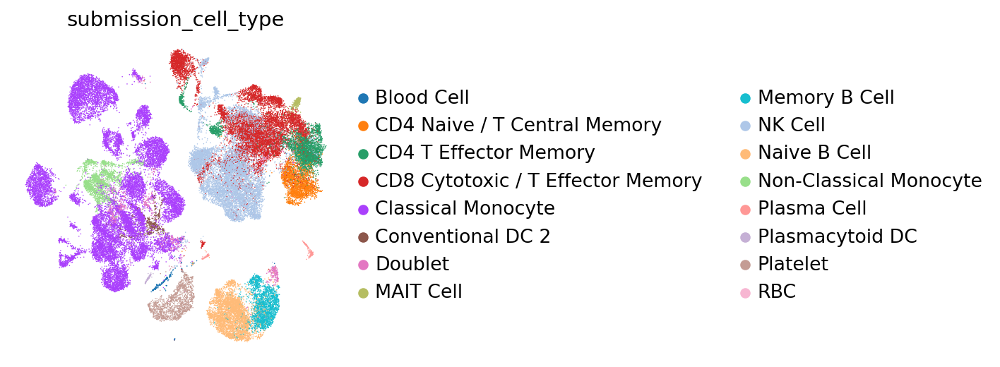

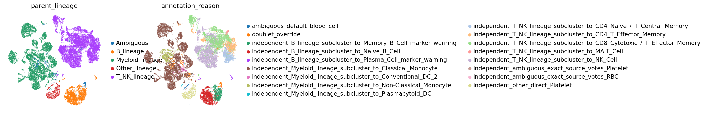

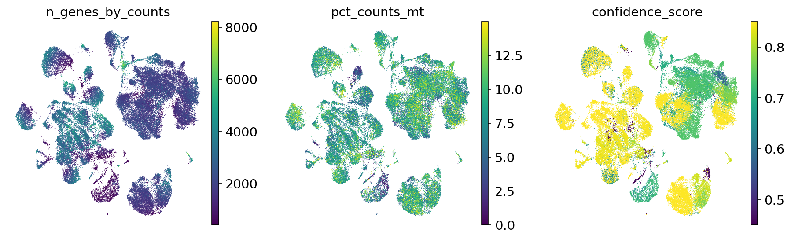

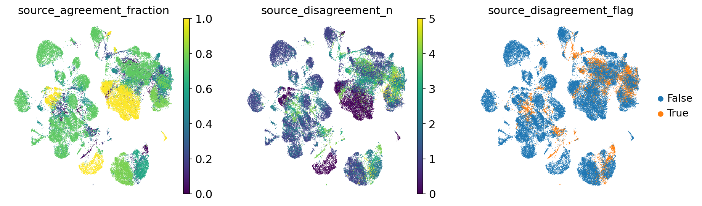

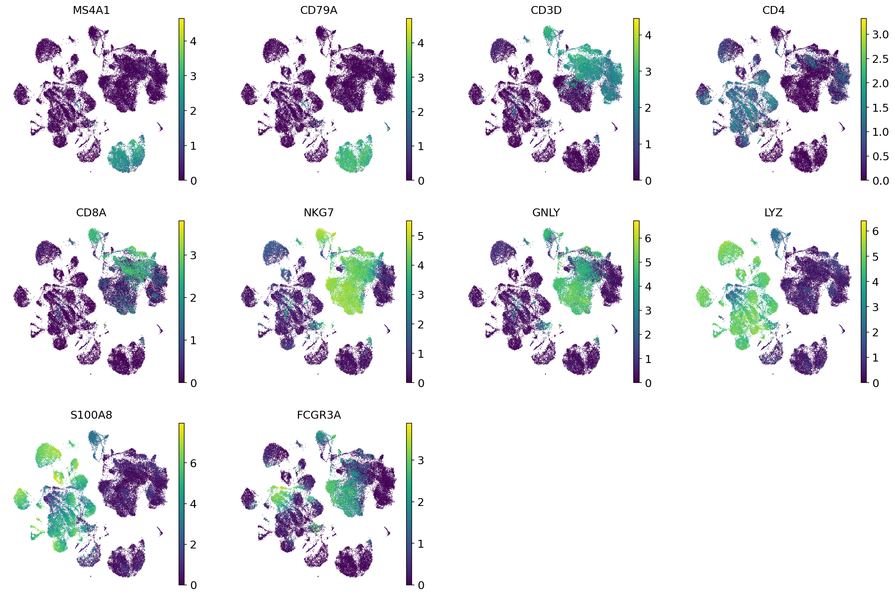

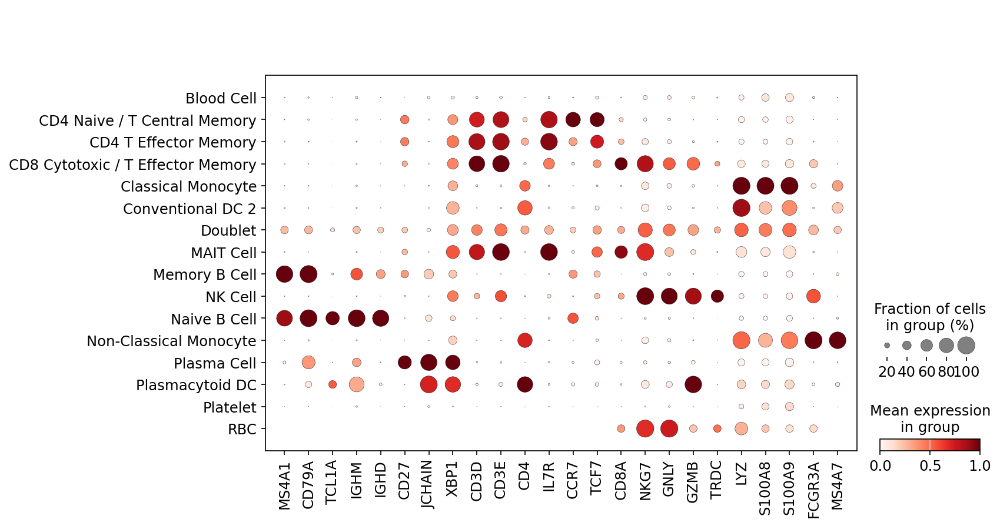

#### infection_study_01 B_lineage subcluster UMAP

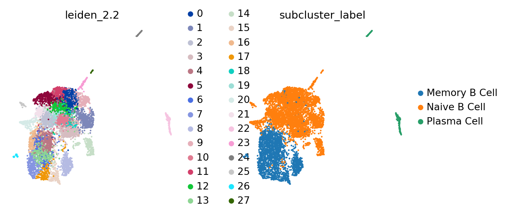

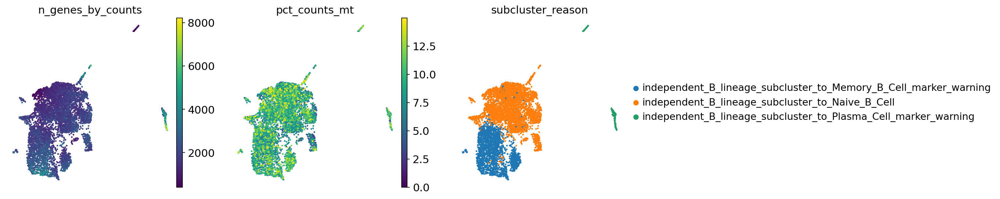

#### infection_study_01 T_NK_lineage subcluster UMAP

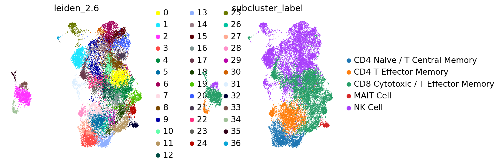

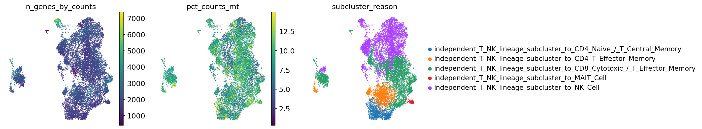

#### infection_study_01 Myeloid_lineage subcluster UMAP

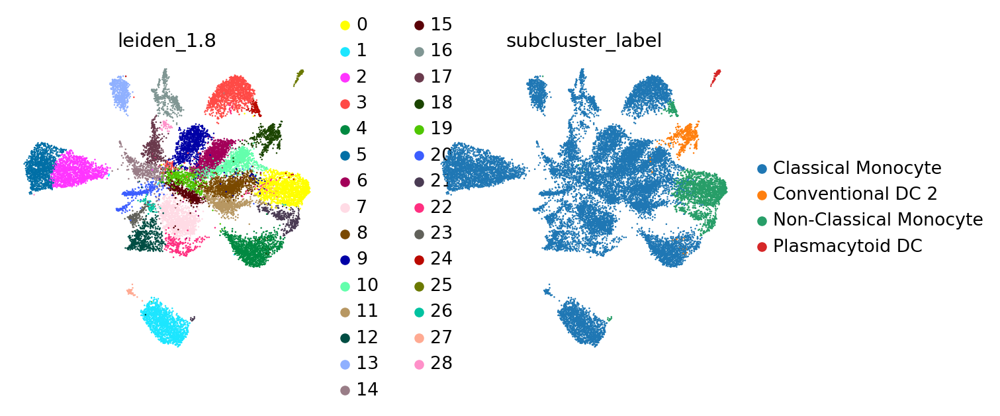

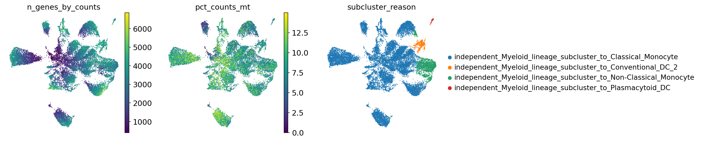

## 出力ファイル

- Submission TSVs: `outputs/single_dataset_checks/260526_infection_study_01_assessment_all/submissions/`
- cellxgene H5ADs: `outputs/single_dataset_checks/260526_infection_study_01_assessment_all/cellxgene/`
- Marker availability table: `outputs/single_dataset_checks/260526_infection_study_01_assessment_all/tables/marker_gene_availability.tsv`
- Marker availability alerts: `outputs/single_dataset_checks/260526_infection_study_01_assessment_all/tables/marker_gene_availability_alerts.tsv`
- Subcluster evidence: `outputs/single_dataset_checks/260526_infection_study_01_assessment_all/tables/lineage_subcluster_evidence.tsv.gz`
- Source disagreement summary: `outputs/single_dataset_checks/260526_infection_study_01_assessment_all/tables/source_disagreement_summary.tsv`
- Diagnostics tables: `outputs/single_dataset_checks/260526_infection_study_01_assessment_all/tables/`
