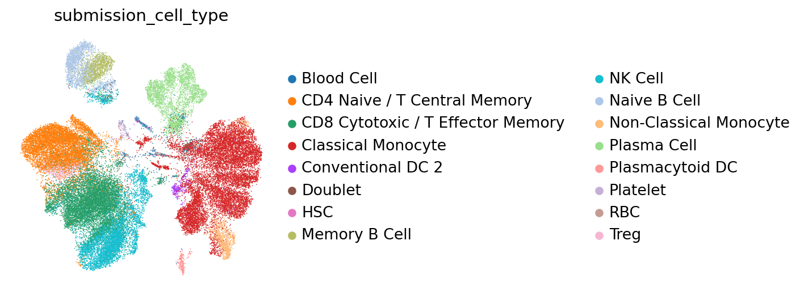
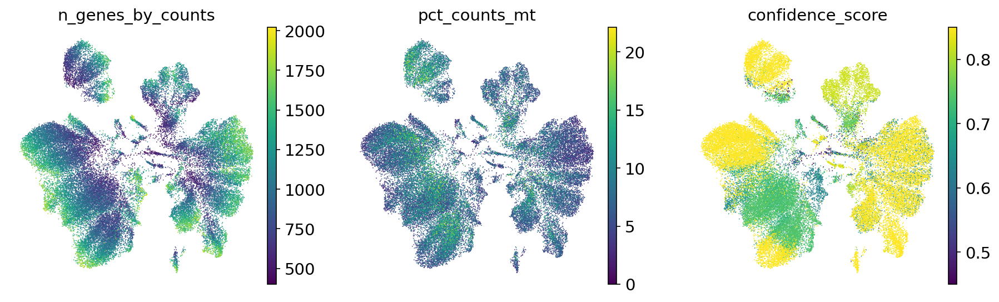
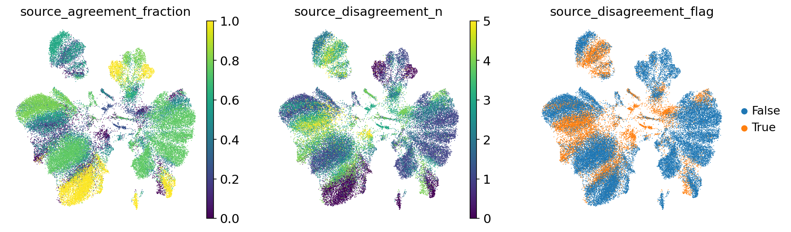
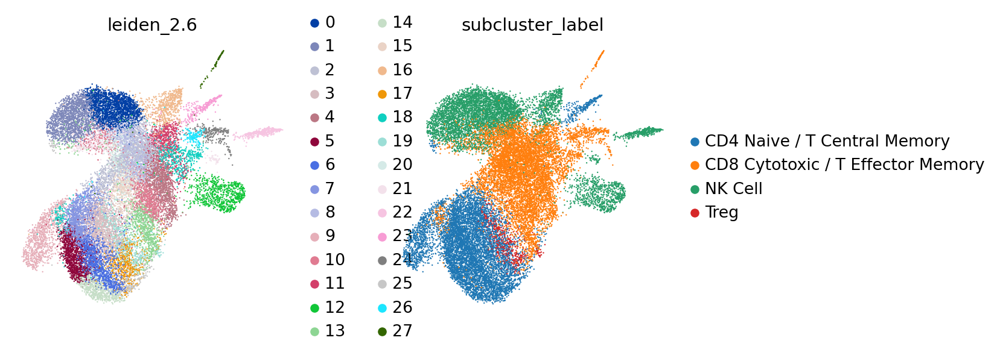
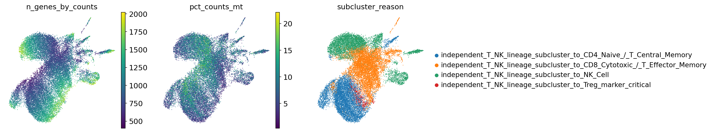

# HIPC データセットアノテーションレポート: infection_study_04

更新日: 2026-05-26 EDT

このレポートは `hipc-annotation` Codex workflow によって生成したデータセット別レビュー文書です。固定 method は repository README に置き、このレポートでは実際の evidence、弱い箇所、レビュー優先度、UMAP / dotplot を確認します。

## 重要な制限

この 260526 report は v11 evidence container から生成した中間レビューです。4 dataset では upstream workflow が元の gene space を 8,000 genes に prefilter し、その後 HVG subset で約 4,000 genes の analysis X に落としています。そのため、この report の marker gene 欠損アラートは「元データに遺伝子が無い」という意味ではなく、「v11 analysis container に無い」という意味です。FOXP3/IL2RA/CTLA4 など、元の processed H5AD には存在するが analysis container から落ちている marker が確認されています。最終判断には、CellTypist、marker scoring、marker availability を original all-gene input から再計算する必要があります。

## データセット概要

| study | cells | original_processed_genes | pre_hvg_genes | analysis_X_genes | counts_layer_genes | labels | parent_or_blood_fraction | Blood Cell | Doublet | artifact_like | median_confidence | low_confidence | source_disagreement | invalid_labels |
| --- | --- | --- | --- | --- | --- | --- | --- | --- | --- | --- | --- | --- | --- | --- |
| infection_study_04 | 43,767 | 26,361 | 8,000 | 3,933 | 3,933 | 16 | 0.012 | 529 | 61 | 353 | 0.838 | 751 | 11,680 (0.267) | none |

## 実行概要

- 実行単位: one dataset in, one annotated dataset out。
- 実行経路: Codex skill `hipc-annotation` -> bundled helper `run_one.sh` -> annotation CLI -> validator -> report inspection。
- 検証: submission row count、H5AD observation count、official label validity、H5AD/submission agreement、confidence column、report image link を確認する。
- このレポートは workflow の再掲ではなく、このデータセットの marker 欠損、UMAP、label 構成、review concern を読むためのもの。

## データセット固有の解釈

- `infection_study_04`: 43,767 cells、original processed 26,361 genes、pre-HVG 8,000 genes、analysis X/var 3,933 genes、submitted label 16 種、parent/Blood residual fraction 0.012、median confidence 0.838。
  - 751 cells は low confidence。QC / confidence UMAP 上で局在を確認する。
  - 61 cells は `Doublet` として提出。mixed-lineage marker expression と scrublet support を確認する。
  - 529 cells は `Blood Cell` として残存。これは filter-out ではなく、曖昧な細胞を公式 parent label で残したもの。
  - Marker gene 欠損アラート: Treg, Plasma_ASC。該当 marker set に依存する fine label は慎重に見る。

## データセット固有の評価

- 全体像: 43,767 cells / original processed 26,361 genes / pre-HVG 8,000 genes / analysis X/var 3,933 genes。parent/Blood residual は 529 cells (0.012) で大きくはない一方、source disagreement は 11,680 cells (0.267) と高めです。
- 信頼しやすい領域: Classical Monocyte、NK Cell、Plasma Cell、Non-Classical Monocyte、pDC、Platelet/RBC は比較的まとまっています。Plasma Cell は JCHAIN 欠損がありますが MZB1/XBP1/PRDM1/IRF4/IGHG1/IGHA1 が残り、完全に弱い label ではありません。
- 主要な弱点: Memory B Cell は disagreement 0.724、Naive B Cell は 0.392 で、B-cell 内部の naive/memory 境界が最大の review point です。UMAP と dotplot で CD27, ITGAX, TBX21, BANK1 などの残存 marker support を見る必要があります。
- T cell 側: CD4 Naive/Tcm と CD8 Cytotoxic/Tem は disagreement が 0.37/0.34。Treg は 554 cells ありますが FOXP3/IL2RA/CTLA4 欠損で disagreement 0.702 のため、Treg は provisional fine label として confidence cap をかけて読むべきです。
- 解釈: この dataset は broad lineage よりも fine B/T label の reference disagreement が問題です。局所ハードコードではなく、marker availability、subcluster coherence、source disagreement を使って confidence を抑える方針が妥当です。

## Marker Gene 欠損アラート

| study | marker_set | alert | present_fraction | missing_critical_markers | missing_genes |
| --- | --- | --- | --- | --- | --- |
| infection_study_04 | Treg | critical | 0.286 | FOXP3;IL2RA;CTLA4 | FOXP3;IL2RA;CTLA4;TNFRSF18;CCR8 |
| infection_study_04 | Plasma_ASC | warning | 0.667 | JCHAIN | JCHAIN;SDC1;TNFRSF17 |

## ソース間不一致

| study | predicted_cell_type | cells | median_source_agreement | disagreement_cells | disagreement_fraction |
| --- | --- | --- | --- | --- | --- |
| infection_study_04 | Blood Cell | 529 | 0.000 | 529 | 1.000 |
| infection_study_04 | Doublet | 61 | 0.000 | 61 | 1.000 |
| infection_study_04 | Memory B Cell | 1,136 | 0.400 | 823 | 0.724 |
| infection_study_04 | Treg | 554 | 0.400 | 389 | 0.702 |
| infection_study_04 | Naive B Cell | 2,070 | 0.600 | 811 | 0.392 |
| infection_study_04 | CD4 Naive / T Central Memory | 7,824 | 0.600 | 2,925 | 0.374 |
| infection_study_04 | CD8 Cytotoxic / T Effector Memory | 8,696 | 0.500 | 2,933 | 0.337 |
| infection_study_04 | Classical Monocyte | 11,755 | 0.750 | 1,979 | 0.168 |
| infection_study_04 | NK Cell | 6,007 | 1.000 | 852 | 0.142 |
| infection_study_04 | Conventional DC 2 | 306 | 0.750 | 34 | 0.111 |
| infection_study_04 | Plasma Cell | 3,145 | 0.800 | 288 | 0.092 |
| infection_study_04 | Non-Classical Monocyte | 1,102 | 1.000 | 48 | 0.044 |

## レビュー優先事項

| study | concern | cells |
| --- | --- | --- |
| infection_study_04 | High source disagreement for Blood Cell | 529 |
| infection_study_04 | High source disagreement for Doublet | 61 |
| infection_study_04 | High source disagreement for Memory B Cell | 823 |
| infection_study_04 | High source disagreement for Treg | 389 |
| infection_study_04 | High dataset-level source disagreement | 11,680 |
| infection_study_04 | critical marker availability for Treg | 554 |
| infection_study_04 | warning marker availability for Plasma_ASC | 3,145 |

## ラベル構成

| study | predicted_cell_type | cells |
| --- | --- | --- |
| infection_study_04 | Classical Monocyte | 11,755 |
| infection_study_04 | CD8 Cytotoxic / T Effector Memory | 8,696 |
| infection_study_04 | CD4 Naive / T Central Memory | 7,824 |
| infection_study_04 | NK Cell | 6,007 |
| infection_study_04 | Plasma Cell | 3,145 |
| infection_study_04 | Naive B Cell | 2,070 |
| infection_study_04 | Memory B Cell | 1,136 |
| infection_study_04 | Non-Classical Monocyte | 1,102 |
| infection_study_04 | Treg | 554 |
| infection_study_04 | Blood Cell | 529 |
| infection_study_04 | Conventional DC 2 | 306 |
| infection_study_04 | Plasmacytoid DC | 229 |
| infection_study_04 | Platelet | 148 |
| infection_study_04 | RBC | 132 |
| infection_study_04 | HSC | 73 |
| infection_study_04 | Doublet | 61 |

## 図

### infection_study_04

#### infection_study_04 B_lineage subcluster UMAP

#### infection_study_04 T_NK_lineage subcluster UMAP

#### infection_study_04 Myeloid_lineage subcluster UMAP

## 出力ファイル

- Submission TSVs: `outputs/single_dataset_checks/260526_infection_study_04_assessment_all/submissions/`
- cellxgene H5ADs: `outputs/single_dataset_checks/260526_infection_study_04_assessment_all/cellxgene/`
- Marker availability table: `outputs/single_dataset_checks/260526_infection_study_04_assessment_all/tables/marker_gene_availability.tsv`
- Marker availability alerts: `outputs/single_dataset_checks/260526_infection_study_04_assessment_all/tables/marker_gene_availability_alerts.tsv`
- Subcluster evidence: `outputs/single_dataset_checks/260526_infection_study_04_assessment_all/tables/lineage_subcluster_evidence.tsv.gz`
- Source disagreement summary: `outputs/single_dataset_checks/260526_infection_study_04_assessment_all/tables/source_disagreement_summary.tsv`
- Diagnostics tables: `outputs/single_dataset_checks/260526_infection_study_04_assessment_all/tables/`
