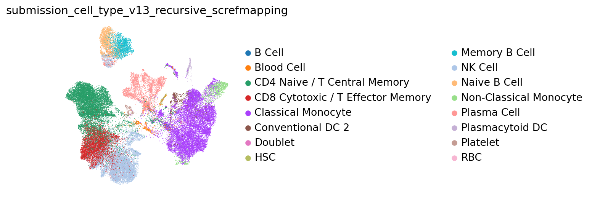
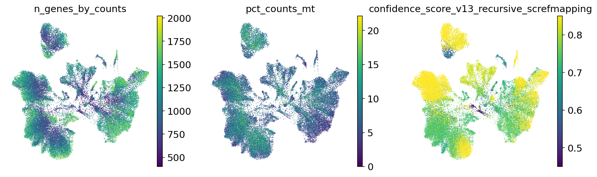
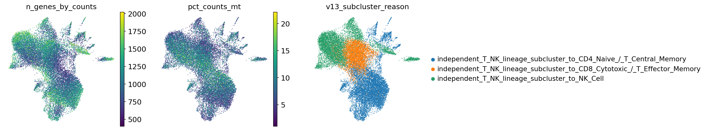
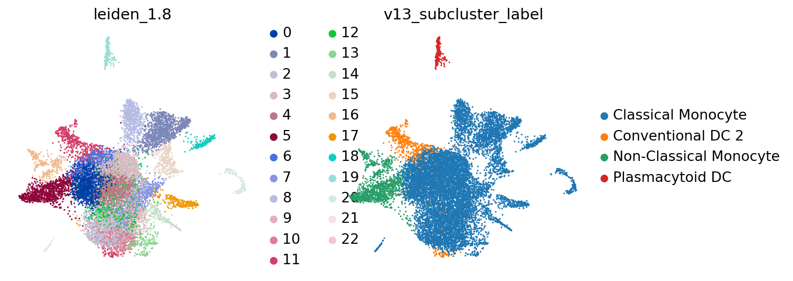

# HIPC v13 dataset review: `infection_study_04`

Updated: 2026-05-26 EDT

## Summary

この report は `infection_study_04` について、portal input から独立に作成した v13 annotation review です。reference mapping、marker score、lineage-specific subclustering、doublet/QC evidence を統合し、全細胞に official ontology label と confidence score を付与しました。

## Dataset Assessment

Full portal gene space は 26,361 genes で、Plasma/ASC marker の JCHAIN が欠損しています。Plasma Cell は marker warning 付きで扱われますが、parent/Blood fraction は 1.27% に抑えられています。screfmap は B/CD4T の曖昧さを一部補っています。

## Gene Space and Marker Alerts

| cells | portal genes | raw source | count-like | critical marker missing |
| ---: | ---: | --- | ---: | --- |
| 43,767 | 26,361 | layers[counts] | 1.000 | JCHAIN |

| marker set | present / expected | alert | missing critical markers |
| --- | ---: | --- | --- |
| Plasma_ASC | 8/9 | warning | JCHAIN |

## Annotation Summary

| cells | labels | parent/Blood fraction | Blood Cell | Doublet | artifact-like | median confidence | low confidence | invalid labels |
| ---: | ---: | ---: | ---: | ---: | ---: | ---: | ---: | --- |
| 43,767 | 16 | 0.013 | 518 | 132 | 365 | 0.740 | 1,011 | none |

## Source Agreement

| mean source agreement | screfmap-covered cells | interpretation |
| ---: | ---: | --- |
| 0.664 | 14,670 | screfmap は broad lineage ではなく、B/CD4T lineage 内の補助 evidence として使っています。 |

## Figures

## Output Location

Large submission TSVs, annotated H5ADs, and diagnostics tables are stored on the Yale server working path:

`/vast/palmer/pi/hafler/yy693/HIPC-scRNAseq-Annotation/outputs/final_annotations/260526_v13_input_contract_repair/`
