# vaccination_study_04 annotation review

Updated: 2026-05-27 EDT

## Dataset-specific assessment

vaccination_study_04 は 66,065 cells / 16,983 portal genes の dataset です。親ラベルまたは Blood Cell に残った割合は 0.7%、doublet は 647 cells、低 confidence は 1,111 cells でした。注意すべき marker gene 欠損は Treg(critical: FOXP3;IL2RA) です。 myeloid/DC enriched dataset として読むべきで、B/T 系の細分類評価には向きません。pDC は JCHAIN 単独ではなく、主要 cluster で CellTypist/Azimuth/Pan-human/cluster consensus と pDC marker score が揃って支持しています。ただし pDC と plasma/ASC は JCHAIN/MZB1 で部分的に重なるため、小さい mixed cluster は LILRA4/CLEC4C/IRF7/TCF4/IL3RA と plasma marker を並べて確認する必要があります。 subcluster evidence では Classical Monocyte: 33,801 cells; Non-Classical Monocyte: 15,645 cells; Conventional DC 2: 7,916 cells; Plasmacytoid DC: 5,689 cells; Conventional DC 1: 1,100 cells; NK Cell: 251 cells が主要な構造です。全細胞に近い coverage で最も broad lineage に沿った source は Cluster consensus (broad concordance 98.9%) で、相対的に不一致が目立つ source は Azimuth PBMC L3 (88.2%) です。 screfmap は適用範囲を B/CD4T に限定すると coverage 0.3%、broad concordance 90.0% でした。

## Methods

この report は、portal input の raw/count-like gene space、CellTypist、Azimuth PBMC、Pan-human Azimuth、screfmap、marker score、lineage-specific subclustering を dataset 単位で照合したものです。ここでの tool concordance は ground truth accuracy ではなく、最終 annotation に対する support/disagreement の診断指標です。

## Input and QC

| cells | portal_genes | raw_count_source | count_like_fraction | available_marker_umap_genes | missing_marker_umap_genes | parent_or_blood_fraction | median_confidence | low_confidence_n | doublet_n |
| --- | --- | --- | --- | --- | --- | --- | --- | --- | --- |
| 66,065 | 16,983 | layers[counts] | 1.000 | 40 | CD27;CD3D;CD8A;FOXP3;GZMK;IL2RA;MS4A1;SDC1;SLC4A10;TBX21;TNFRSF13B;TRDC;XCR1 | 0.007 | 0.846 | 1,111 | 647 |

### Marker gene availability alerts

| marker_set | n_genes_present | n_genes_expected | alert_level | missing_critical_markers |
| --- | --- | --- | --- | --- |
| Treg | 2 | 7 | critical | FOXP3;IL2RA |

### QC and annotation UMAPs

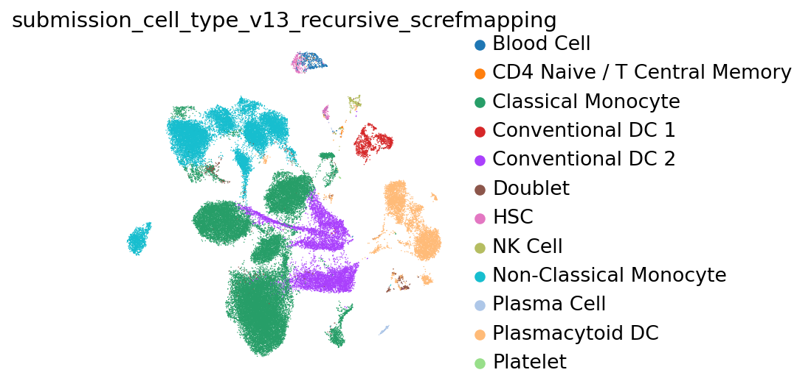

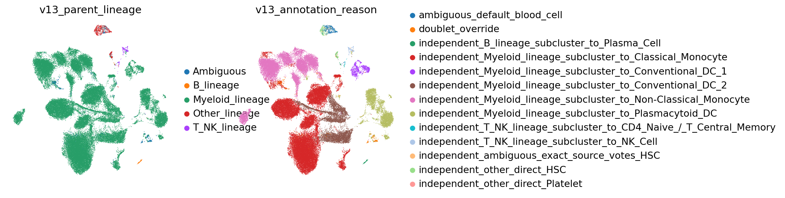

## Marker expression UMAPs

### lineage_core

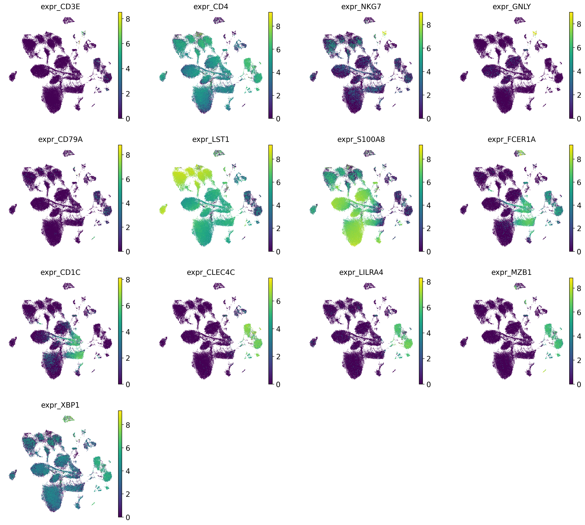

## Annotation source assessment

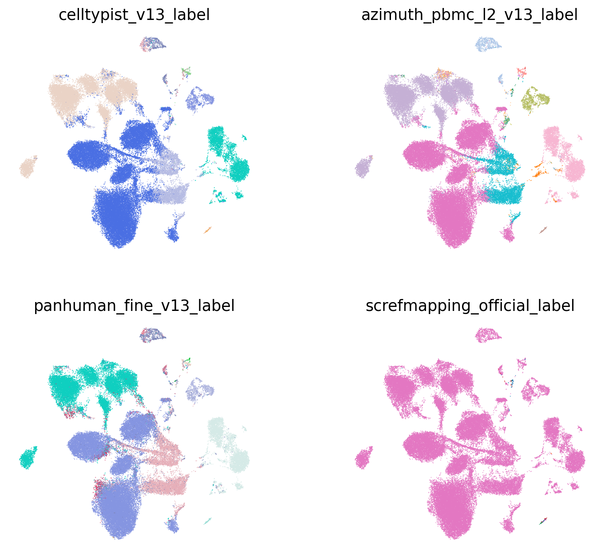

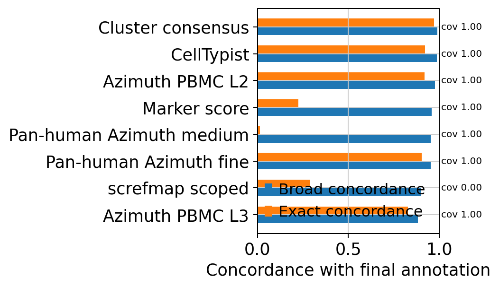

各 source は適用範囲が異なるため、coverage と concordance を分けて読んでください。`exact_final_concordance` は最終ラベルとの完全一致、`broad_final_concordance` は B/T-NK/Myeloid などの broad lineage 一致です。Marker score は marker set 由来の粗い方向付けなので、`Monocyte` vs `Classical Monocyte` や `B Cell` vs `Memory B Cell` のように exact は低くなり得ます。screfmap は B/CD4T scoped cells だけで評価しています。

| tool | covered_n | coverage_fraction | exact_final_concordance | broad_final_concordance | top_supported_labels | top_disagreements |
| --- | --- | --- | --- | --- | --- | --- |
| CellTypist | 66,065 | 1.000 | 0.922 | 0.988 | Classical Monocyte: 36,446; Non-Classical Monocyte: 15,905; Plasmacytoid DC: 5,652; Conventional DC 2: 5,617; Conventional DC 1: 1,065 | Conventional DC 2 vs Classical Monocyte: 2,642; Classical Monocyte vs Non-Classical Monocyte: 554; Non-Classical Monocyte vs Classical Monocyte: 416; Doublet vs Classical Monocyte: 290; Classical Monocyte vs Conventional DC 2: 219 |
| Azimuth PBMC L2 | 66,065 | 1.000 | 0.918 | 0.977 | Classical Monocyte: 35,275; Non-Classical Monocyte: 15,856; Conventional DC 2: 6,183; Plasmacytoid DC: 5,492; Conventional DC 1: 1,094 | Conventional DC 2 vs Classical Monocyte: 1,920; Classical Monocyte vs Non-Classical Monocyte: 676; Blood Cell vs HSC: 457; Non-Classical Monocyte vs Classical Monocyte: 324; Doublet vs Classical Monocyte: 251 |
| Azimuth PBMC L3 | 66,065 | 1.000 | 0.827 | 0.882 | Classical Monocyte: 35,314; Non-Classical Monocyte: 15,856; Blood Cell: 6,602; Plasmacytoid DC: 5,494; Conventional DC 1: 1,094 | Conventional DC 2 vs Blood Cell: 5,880; Conventional DC 2 vs Classical Monocyte: 1,951; Classical Monocyte vs Non-Classical Monocyte: 676; Blood Cell vs HSC: 457; Non-Classical Monocyte vs Classical Monocyte: 324 |
| Pan-human Azimuth fine | 66,065 | 1.000 | 0.903 | 0.952 | Classical Monocyte: 30,830; Non-Classical Monocyte: 16,318; Conventional DC 2: 7,543; Plasmacytoid DC: 5,611; Blood Cell: 3,223 | Classical Monocyte vs Blood Cell: 1,539; Classical Monocyte vs Intermediate Monocyte: 732; Classical Monocyte vs Non-Classical Monocyte: 704; Classical Monocyte vs Conventional DC 2: 633; Conventional DC 2 vs Blood Cell: 614 |
| Pan-human Azimuth medium | 66,065 | 1.000 | 0.012 | 0.953 | Monocyte: 48,088; DC: 14,159; Blood Cell: 2,935; HSC: 517; NK Cell: 157 | Classical Monocyte vs Monocyte: 31,610; Non-Classical Monocyte vs Monocyte: 15,538; Conventional DC 2 vs DC: 6,758; Plasmacytoid DC vs DC: 5,495; Classical Monocyte vs Blood Cell: 1,527 |
| Cluster consensus | 66,065 | 1.000 | 0.972 | 0.989 | Classical Monocyte: 34,428; Non-Classical Monocyte: 15,604; Conventional DC 2: 7,863; Plasmacytoid DC: 5,726; Conventional DC 1: 1,106 | Doublet vs Classical Monocyte: 355; HSC vs Blood Cell: 242; Non-Classical Monocyte vs Classical Monocyte: 231; Doublet vs Plasmacytoid DC: 204; Conventional DC 2 vs Classical Monocyte: 173 |
| Marker score | 66,065 | 1.000 | 0.226 | 0.960 | Monocyte: 43,244; Non-Classical Monocyte: 10,557; DC: 5,724; Plasmacytoid DC: 4,486; Plasma Cell: 1,004 | Classical Monocyte vs Monocyte: 33,362; Non-Classical Monocyte vs Monocyte: 5,205; Conventional DC 2 vs DC: 4,049; Conventional DC 2 vs Monocyte: 3,844; Conventional DC 1 vs DC: 944 |
| screfmap scoped | 170 | 0.003 | 0.288 | 0.900 | CD4 Naive / T Central Memory: 47; Memory B Cell: 46; Naive B Cell: 44; Plasma Cell: 24; CD4 T Effector Memory: 7 | Plasma Cell vs Memory B Cell: 46; Plasma Cell vs Naive B Cell: 38; NK Cell vs CD4 Naive / T Central Memory: 14; NK Cell vs CD4 T Effector Memory: 6; Blood Cell vs CD4 Naive / T Central Memory: 5 |

### Lineage-scoped source support

この表は、最終ラベルで定義した broad lineage ごとに、その範囲内で各 source が同じ lineage / fine label を支持しているかを見ます。fine label の正解率ではなく、どの source がどの lineage で役に立つか、または外しやすいかを見るための診断です。

| final_broad_lineage | tool | covered_n | exact_final_concordance | broad_final_concordance |
| --- | --- | --- | --- | --- |
| B | CellTypist | 118 | 0.754 | 0.881 |
| B | Azimuth PBMC L2 | 118 | 0.000 | 0.856 |
| B | Azimuth PBMC L3 | 118 | 0.754 | 0.822 |
| B | Pan-human Azimuth fine | 118 | 0.839 | 0.898 |
| B | Pan-human Azimuth medium | 118 | 0.000 | 0.873 |
| B | Cluster consensus | 118 | 0.822 | 0.822 |
| B | Marker score | 118 | 0.864 | 0.992 |
| B | screfmap scoped | 108 | 0.222 | 1.000 |
| T/NK | CellTypist | 277 | 0.708 | 0.917 |
| T/NK | Azimuth PBMC L2 | 277 | 0.812 | 0.899 |
| T/NK | Azimuth PBMC L3 | 277 | 0.087 | 0.123 |
| T/NK | Pan-human Azimuth fine | 277 | 0.599 | 0.697 |
| T/NK | Pan-human Azimuth medium | 277 | 0.556 | 0.715 |
| T/NK | Cluster consensus | 277 | 0.884 | 0.978 |
| T/NK | Marker score | 277 | 0.487 | 0.960 |
| T/NK | screfmap scoped | 45 | 0.556 | 1.000 |
| Myeloid/DC | CellTypist | 64,151 | 0.934 | 0.998 |
| Myeloid/DC | Azimuth PBMC L2 | 64,151 | 0.936 | 0.987 |
| Myeloid/DC | Azimuth PBMC L3 | 64,151 | 0.844 | 0.892 |
| Myeloid/DC | Pan-human Azimuth fine | 64,151 | 0.914 | 0.961 |

## Lineage-specific subclustering

### B_lineage

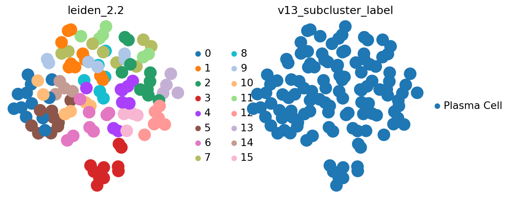

lineage 内に絞った marker expression UMAP です。fine label の判断は subcluster 文脈で行うため、この section に置いています。

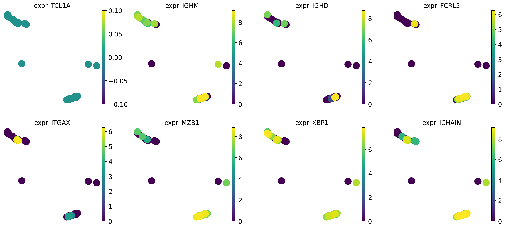

| cluster | n_cells | chosen_label | accepted | score_margin | calibrated_cluster_confidence | marker_availability_alert | top_celltypist | top_panhuman_fine | top_marker | top_screfmapping |
| --- | --- | --- | --- | --- | --- | --- | --- | --- | --- | --- |
| 0 | 12 | Plasma Cell | True | 2.748 | 0.771 | pass | Plasma Cell:9; Plasmacytoid DC:2; Blood Cell:1 | Plasma Cell:11; Blood Cell:1 | Plasma Cell:10; B Cell:2 | Memory B Cell:5; Naive B Cell:3; Plasma Cell:2; not_available:2 |
| 1 | 10 | Plasma Cell | True | 2.044 | 0.740 | pass | Plasma Cell:8; Blood Cell:2 | Plasma Cell:8; Blood Cell:1; Lymphoid Cell:1 | Plasma Cell:10 | Memory B Cell:7; not_available:2; Naive B Cell:1 |
| 2 | 10 | Plasma Cell | True | 2.412 | 0.740 | pass | Plasma Cell:10 | Plasma Cell:10 | Plasma Cell:10 | Naive B Cell:6; Memory B Cell:4 |
| 3 | 10 | Plasma Cell | True | 3.336 | 0.832 | pass | Plasmablast:7; Plasma Cell:3 | Plasma Cell:10 | Plasma Cell:10 | Plasma Cell:5; Memory B Cell:5 |
| 4 | 9 | Plasma Cell | True | 2.066 | 0.781 | pass | Plasma Cell:8; Blood Cell:1 | Plasma Cell:8; B Cell:1 | Plasma Cell:8; B Cell:1 | Naive B Cell:4; Memory B Cell:3; Plasma Cell:2 |
| 5 | 9 | Plasma Cell | True | 1.494 | 0.781 | pass | Plasma Cell:6; Blood Cell:1; B Cell:1; Naive B Cell:1 | Plasma Cell:6; Blood Cell:3 | Plasma Cell:6; B Cell:3 | Memory B Cell:4; Plasma Cell:2; Naive B Cell:2; not_available:1 |
| 6 | 8 | Plasma Cell | True | 0.481 | 0.664 | pass | Plasma Cell:4; Memory B Cell:2; Naive B Cell:2 | Plasma Cell:4; Memory B Cell:2; Naive B Cell:2 | Plasma Cell:4; B Cell:4 | Memory B Cell:4; Naive B Cell:4 |
| 7 | 8 | Plasma Cell | True | 1.985 | 0.740 | pass | Plasma Cell:8 | Plasma Cell:8 | Plasma Cell:8 | Naive B Cell:6; Memory B Cell:2 |
| 10 | 6 | Plasma Cell | True | 2.412 | 0.771 | pass | Plasma Cell:4; Blood Cell:2 | Plasma Cell:4; Blood Cell:2 | Plasma Cell:6 | Memory B Cell:3; not_available:2; Plasma Cell:1 |
| 11 | 6 | Plasma Cell | True | 3.013 | 0.850 | pass | Plasma Cell:6 | Plasma Cell:6 | Plasma Cell:6 | Plasma Cell:4; Naive B Cell:2 |

### T_NK_lineage

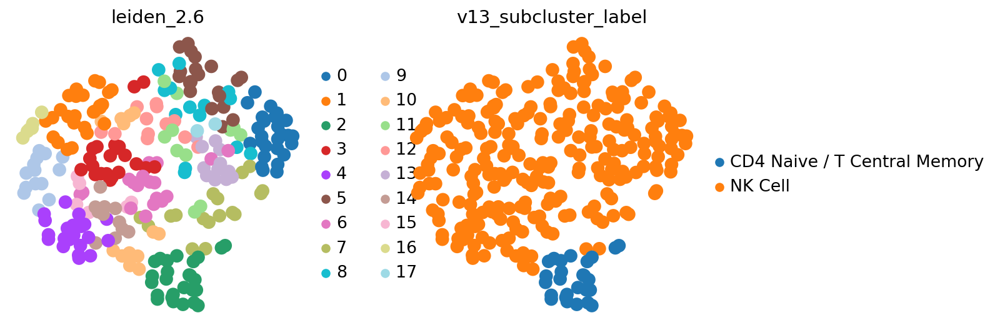

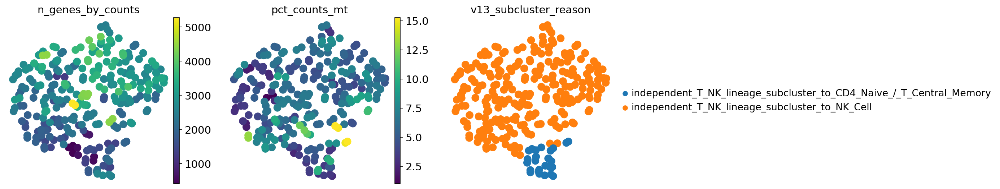

lineage 内に絞った marker expression UMAP です。fine label の判断は subcluster 文脈で行うため、この section に置いています。

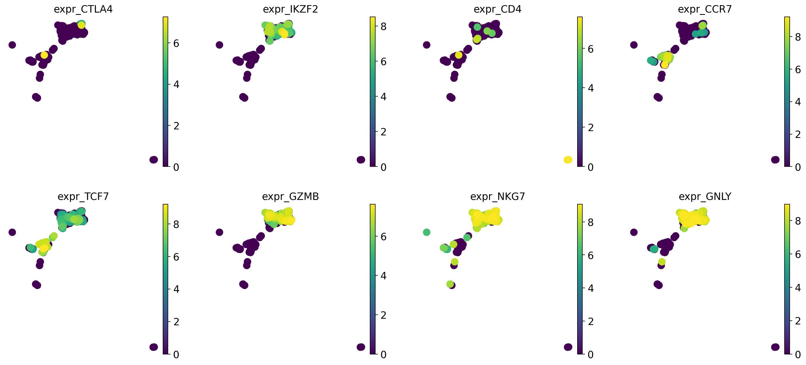

| cluster | n_cells | chosen_label | accepted | score_margin | calibrated_cluster_confidence | marker_availability_alert | top_celltypist | top_panhuman_fine | top_marker | top_screfmapping |
| --- | --- | --- | --- | --- | --- | --- | --- | --- | --- | --- |
| 0 | 26 | NK Cell | True | 1.100 | 0.850 | pass | CD8 Cytotoxic / T Effector Memory:15; NK Cell:11 | NK Cell:17; Blood Cell:5; Lymphoid Cell:2; CD8 Cytotoxic / T Effector Memory:2 | NK Cell:15; CD8 T Cell (ab):11 | not_available:26 |
| 1 | 26 | NK Cell | True | 2.329 | 0.740 | pass | NK Cell:19; Blood Cell:7 | NK Cell:16; Blood Cell:5; Lymphoid Cell:5 | CD8 T Cell (ab):11; NK Cell:9; B Cell:2; T Cell:2; CD4 T Cell (ab):2 | not_available:22; CD4 Naive / T Central Memory:2; CD4 T Effector Memory:2 |
| 2 | 26 | CD4 Naive / T Central Memory | True | 2.316 | 0.850 | pass | CD4 Naive / T Central Memory:17; CD8 Naive / T Central Memory:3; CD8 Cytotoxic / T Effector Memory:2; CD4 T Effector Memory:2; Classical Monocyte:1 | CD4 Naive / T Central Memory:12; Blood Cell:7; CD4 T Effector Memory:4; CD8 Cytotoxic / T Effector Memory:2; CD8 Naive / T Central Memory:1 | CD4 T Cell (ab):17; T Cell:9 | CD4 Naive / T Central Memory:25; not_available:1 |
| 3 | 21 | NK Cell | True | 2.408 | 0.740 | pass | NK Cell:15; Blood Cell:6 | NK Cell:13; Lymphoid Cell:6; Blood Cell:2 | CD8 T Cell (ab):9; NK Cell:8; CD4 T Cell (ab):3; T Cell:1 | not_available:17; CD4 T Effector Memory:2; CD4 Naive / T Central Memory:2 |
| 4 | 21 | NK Cell | True | 2.600 | 0.850 | pass | NK Cell:21 | NK Cell:19; Blood Cell:2 | NK Cell:18; CD8 T Cell (ab):3 | not_available:21 |
| 5 | 20 | NK Cell | True | 2.470 | 0.850 | pass | NK Cell:19; CD8 Cytotoxic / T Effector Memory:1 | NK Cell:18; Lymphoid Cell:2 | NK Cell:12; CD8 T Cell (ab):8 | not_available:20 |
| 6 | 18 | NK Cell | True | 2.311 | 0.850 | pass | NK Cell:16; CD8 Cytotoxic / T Effector Memory:2 | Lymphoid Cell:16; NK Cell:2 | NK Cell:11; CD8 T Cell (ab):7 | not_available:18 |
| 7 | 17 | NK Cell | True | 0.921 | 0.673 | pass | CD4 T Effector Memory:6; CD8 Cytotoxic / T Effector Memory:6; NK Cell:2; MAIT Cell:2; CD4 Naive / T Central Memory:1 | Blood Cell:6; CD8 Cytotoxic / T Effector Memory:6; MAIT Cell:2; CD4 T Effector Memory:2; NK Cell:1 | CD8 T Cell (ab):7; NK Cell:2; Monocyte:2; CD4 T Cell (ab):2; T Cell:2 | not_available:12; CD4 Naive / T Central Memory:5 |
| 8 | 14 | NK Cell | True | 2.227 | 0.850 | pass | NK Cell:13; CD8 Cytotoxic / T Effector Memory:1 | NK Cell:10; Blood Cell:3; Lymphoid Cell:1 | NK Cell:7; CD8 T Cell (ab):7 | not_available:14 |
| 9 | 14 | NK Cell | True | 2.600 | 0.850 | pass | NK Cell:14 | NK Cell:14 | NK Cell:13; CD8 T Cell (ab):1 | not_available:14 |

### Myeloid_lineage

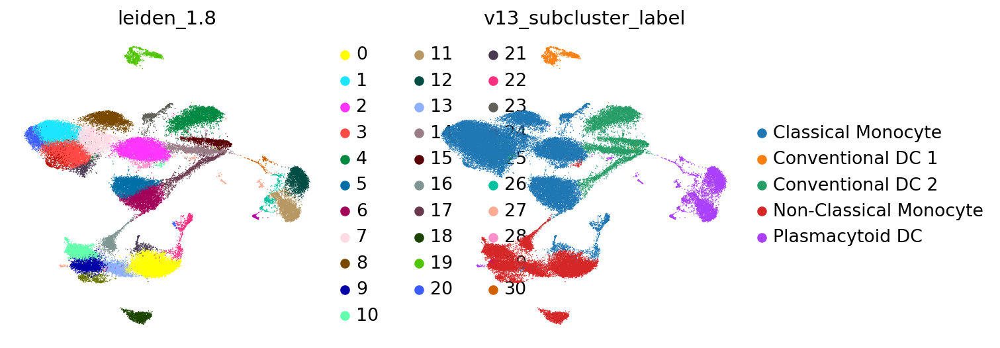

lineage 内に絞った marker expression UMAP です。fine label の判断は subcluster 文脈で行うため、この section に置いています。

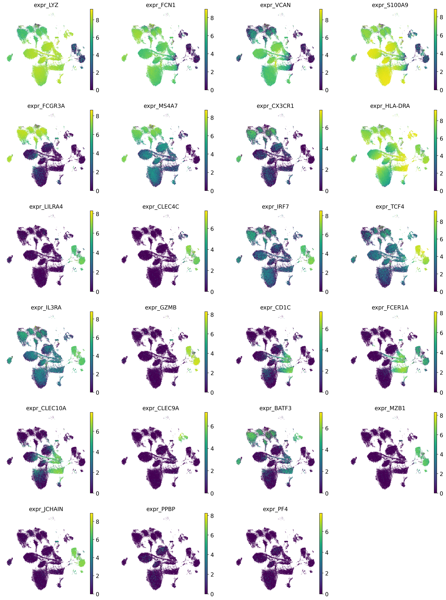

| cluster | n_cells | chosen_label | accepted | score_margin | calibrated_cluster_confidence | marker_availability_alert | top_celltypist | top_panhuman_fine | top_marker | top_screfmapping |
| --- | --- | --- | --- | --- | --- | --- | --- | --- | --- | --- |
| 0 | 5,886 | Non-Classical Monocyte | True | 2.210 | 0.850 | pass | Non-Classical Monocyte:5872; Classical Monocyte:13; NK Cell:1 | Non-Classical Monocyte:5833; Intermediate Monocyte:38; Blood Cell:14; Conventional DC 2:1 | Non-Classical Monocyte:3663; Monocyte:2221; B Cell:1; NK Cell:1 | not_available:5886 |
| 1 | 5,457 | Classical Monocyte | True | 3.050 | 0.850 | pass | Classical Monocyte:5457 | Classical Monocyte:5410; Blood Cell:47 | Monocyte:5457 | not_available:5457 |
| 2 | 5,421 | Classical Monocyte | True | 2.799 | 0.825 | pass | Classical Monocyte:5417; Non-Classical Monocyte:2; Conventional DC 2:2 | Classical Monocyte:4984; Blood Cell:330; Intermediate Monocyte:44; Conventional DC 2:36; Non-Classical Monocyte:27 | Monocyte:5402; DC:11; B Cell:7; CD4 T Cell (ab):1 | not_available:5421 |
| 3 | 5,343 | Classical Monocyte | True | 2.610 | 0.830 | pass | Classical Monocyte:5340; Non-Classical Monocyte:3 | Classical Monocyte:4970; Blood Cell:199; Conventional DC 2:96; Intermediate Monocyte:66; Non-Classical Monocyte:11 | Monocyte:5342; DC:1 | not_available:5343 |
| 4 | 3,818 | Conventional DC 2 | True | 2.319 | 0.850 | pass | Conventional DC 2:2787; Classical Monocyte:1017; Blood Cell:12; Plasmacytoid DC:2 | Conventional DC 2:3447; Blood Cell:250; Classical Monocyte:120; Conventional DC 1:1 | DC:2108; Monocyte:1710 | not_available:3818 |
| 5 | 3,677 | Classical Monocyte | True | 2.973 | 0.845 | pass | Classical Monocyte:3677 | Classical Monocyte:3648; Blood Cell:27; Non-Classical Monocyte:2 | Monocyte:3670; DC:4; B Cell:3 | not_available:3677 |
| 6 | 3,503 | Classical Monocyte | True | 2.511 | 0.808 | pass | Classical Monocyte:3466; Non-Classical Monocyte:36; Conventional DC 2:1 | Classical Monocyte:2940; Intermediate Monocyte:213; Blood Cell:205; Non-Classical Monocyte:123; Conventional DC 2:18 | Monocyte:3484; DC:12; B Cell:7 | not_available:3503 |
| 7 | 3,019 | Classical Monocyte | True | 2.891 | 0.829 | pass | Classical Monocyte:3019 | Classical Monocyte:2867; Blood Cell:110; Conventional DC 2:28; Non-Classical Monocyte:13; Intermediate Monocyte:1 | Monocyte:2987; DC:17; B Cell:13; Non-Classical Monocyte:1; Plasmacytoid DC:1 | not_available:3019 |
| 8 | 2,587 | Classical Monocyte | True | 2.815 | 0.816 | pass | Classical Monocyte:2585; Conventional DC 2:1; Non-Classical Monocyte:1 | Classical Monocyte:2396; Blood Cell:108; Conventional DC 2:50; Non-Classical Monocyte:16; Intermediate Monocyte:16 | Monocyte:2558; B Cell:13; DC:11; CD4 T Cell (ab):3; NK Cell:1 | not_available:2587 |
| 9 | 2,570 | Non-Classical Monocyte | True | 2.161 | 0.845 | pass | Non-Classical Monocyte:2496; Classical Monocyte:71; Blood Cell:2; CD8 Cytotoxic / T Effector Memory:1 | Non-Classical Monocyte:2538; Intermediate Monocyte:20; Blood Cell:11; Conventional DC 2:1 | Non-Classical Monocyte:1875; Monocyte:676; DC:9; B Cell:7; CD4 T Cell (ab):2 | not_available:2570 |

## Interpretation and caveats

この評価は ground truth label との accuracy ではなく、複数 annotation source と marker/subcluster evidence の整合性評価です。 marker gene が欠損している cell type では、reference mapping 単独の fine label は過信しない設計です。 Azimuth PBMC L3 の disagreement は、ontology 粒度の違い、gene availability、dataset enrichment の影響を含む可能性があります。 whole PBMC と仮定した解釈より、dataset-specific enrichment と QC structure を優先して読むべきです。

## Files

- Submission TSV: `submissions/vaccination_study_04_annotation.tsv`
- cellxgene H5AD: `cellxgene/vaccination_study_04.final_v13_recursive_screfmapping.cxg.h5ad`
- Report context JSON: `report_context.json`
- Tool support TSV: `tool_support_summary.tsv`
