# HIPC データセットアノテーションレポート: vaccination_study_04

更新日: 2026-05-26 EDT

このレポートは `hipc-annotation` Codex workflow によって生成したデータセット別レビュー文書です。固定 method は repository README に置き、このレポートでは実際の evidence、弱い箇所、レビュー優先度、UMAP / dotplot を確認します。

## データセット概要

| study | cells | X_genes | raw_genes | counts_layer_genes | labels | parent_or_blood_fraction | Blood Cell | Doublet | artifact_like | median_confidence | low_confidence | source_disagreement | invalid_labels |
| --- | --- | --- | --- | --- | --- | --- | --- | --- | --- | --- | --- | --- | --- |
| vaccination_study_04 | 66,065 | 3,971 | 8,000 | 3,971 | 11 | 0.008 | 531 | 1,249 | 111 | 0.845 | 1,782 | 4,236 (0.064) | none |

## 実行概要

- 実行単位: one dataset in, one annotated dataset out。
- 実行経路: Codex skill `hipc-annotation` -> bundled helper `run_one.sh` -> annotation CLI -> validator -> report inspection。
- 検証: submission row count、H5AD observation count、official label validity、H5AD/submission agreement、confidence column、report image link を確認する。
- このレポートは workflow の再掲ではなく、このデータセットの marker 欠損、UMAP、label 構成、review concern を読むためのもの。

## データセット固有の解釈

- `vaccination_study_04`: 66,065 cells、X/var 3,971 genes、raw 8,000 genes、submitted label 11 種、parent/Blood residual fraction 0.008、median confidence 0.845。
  - 1,782 cells は low confidence。QC / confidence UMAP 上で局在を確認する。
  - 1,249 cells は `Doublet` として提出。mixed-lineage marker expression と scrublet support を確認する。
  - 531 cells は `Blood Cell` として残存。これは filter-out ではなく、曖昧な細胞を公式 parent label で残したもの。
  - Marker gene 欠損アラート: CD4_naive_tcm, CD4_effector_memory, Treg, B_naive, B_memory_ABC, Plasma_ASC。該当 marker set に依存する fine label は慎重に見る。

## データセット固有の評価

- 全体像: 66,065 cells / X/var 3,971 genes / raw 8,000 genes。label 構成は monocyte/DC 系に強く偏り、Classical Monocyte 34,105 cells、Non-Classical Monocyte 15,314 cells、cDC2 7,694 cells、pDC 5,447 cells が主体です。whole PBMC というより myeloid/DC-enriched dataset として読むべきです。
- 信頼しやすい領域: Myeloid/DC 系の source disagreement は低く、Classical Monocyte 0.031、Non-Classical Monocyte 0.008、cDC1 0.003、pDC 0.019 です。myeloid/DC annotation は今回の pipeline でかなり安定しています。
- 注意点: T/B 系 marker の欠損が広く、CD4_naive_tcm、CD4_effector_memory、Treg、B_naive、B_memory_ABC、Plasma_ASC が alert 対象です。実際の T/B cell はごく少なく、B Cell 2 cells、Plasma Cell 93 cells、NK Cell 493 cells なので、これらの fine label は過度に解釈しない方がよいです。
- Doublet/parent residual: Doublet は 1,249 cells、Blood Cell は 531 cells。parent/Blood residual fraction は 0.008 で許容範囲ですが、myeloid-dominant 構成の中で ambiguous cells が残るため、review では UMAP 上の局在を確認します。
- 解釈: この dataset は annotation failure というより input composition が偏っています。提出 label は myeloid/DC を中心に信頼し、T/B fine label は marker 欠損と小細胞数のため補助的に扱います。

## Marker Gene 欠損アラート

| study | marker_set | alert | present_fraction | missing_critical_markers | missing_genes |
| --- | --- | --- | --- | --- | --- |
| vaccination_study_04 | CD4_naive_tcm | warning | 0.333 | none | CD3D;CD3E;IL7R;CCR7;TCF7;LEF1 |
| vaccination_study_04 | CD4_effector_memory | critical | 0.125 | GZMK;CCL5;PRF1;GZMB | GZMK;CCL5;GNLY;PRF1;GZMB;CXCR3;KLRB1 |
| vaccination_study_04 | Treg | critical | 0.000 | FOXP3;IL2RA;CTLA4 | FOXP3;IL2RA;CTLA4;IKZF2;TIGIT;TNFRSF18;CCR8 |
| vaccination_study_04 | B_naive | critical | 0.250 | none | MS4A1;CD79A;TCL1A;IGHD;IGHM;FCER2 |
| vaccination_study_04 | B_memory_ABC | warning | 0.375 | CD27;TNFRSF13B;FCRL5;TBX21 | CD27;TNFRSF13B;FCRL5;TBX21;AIM2 |
| vaccination_study_04 | Plasma_ASC | warning | 0.333 | MZB1;JCHAIN | MZB1;JCHAIN;SDC1;TNFRSF17;IGHG1;IGHA1 |

## ソース間不一致

| study | predicted_cell_type | cells | median_source_agreement | disagreement_cells | disagreement_fraction |
| --- | --- | --- | --- | --- | --- |
| vaccination_study_04 | Doublet | 1,249 | 0.000 | 1,249 | 1.000 |
| vaccination_study_04 | Blood Cell | 531 | 0.000 | 531 | 1.000 |
| vaccination_study_04 | B Cell | 2 | 0.400 | 2 | 1.000 |
| vaccination_study_04 | NK Cell | 493 | 0.400 | 264 | 0.535 |
| vaccination_study_04 | Conventional DC 2 | 7,694 | 0.750 | 913 | 0.119 |
| vaccination_study_04 | Classical Monocyte | 34,105 | 0.750 | 1,041 | 0.031 |
| vaccination_study_04 | Plasma Cell | 93 | 0.800 | 2 | 0.022 |
| vaccination_study_04 | Plasmacytoid DC | 5,447 | 1.000 | 103 | 0.019 |
| vaccination_study_04 | Non-Classical Monocyte | 15,314 | 1.000 | 128 | 0.008 |
| vaccination_study_04 | Conventional DC 1 | 1,026 | 0.750 | 3 | 0.003 |
| vaccination_study_04 | HSC | 111 | 0.500 | 0 | 0.000 |

## レビュー優先事項

| study | concern | cells |
| --- | --- | --- |
| vaccination_study_04 | High source disagreement for B Cell | 2 |
| vaccination_study_04 | High source disagreement for Blood Cell | 531 |
| vaccination_study_04 | High source disagreement for Doublet | 1,249 |
| vaccination_study_04 | High source disagreement for NK Cell | 264 |
| vaccination_study_04 | warning marker availability for Plasma_ASC | 93 |

## ラベル構成

| study | predicted_cell_type | cells |
| --- | --- | --- |
| vaccination_study_04 | Classical Monocyte | 34,105 |
| vaccination_study_04 | Non-Classical Monocyte | 15,314 |
| vaccination_study_04 | Conventional DC 2 | 7,694 |
| vaccination_study_04 | Plasmacytoid DC | 5,447 |
| vaccination_study_04 | Doublet | 1,249 |
| vaccination_study_04 | Conventional DC 1 | 1,026 |
| vaccination_study_04 | Blood Cell | 531 |
| vaccination_study_04 | NK Cell | 493 |
| vaccination_study_04 | HSC | 111 |
| vaccination_study_04 | Plasma Cell | 93 |
| vaccination_study_04 | B Cell | 2 |

## 図

### vaccination_study_04

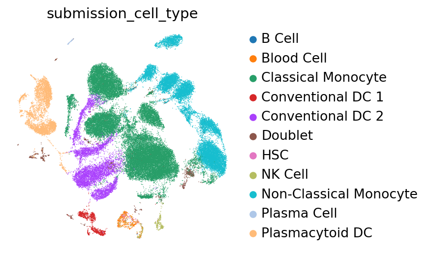

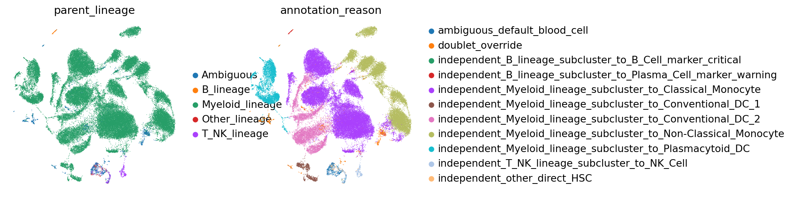

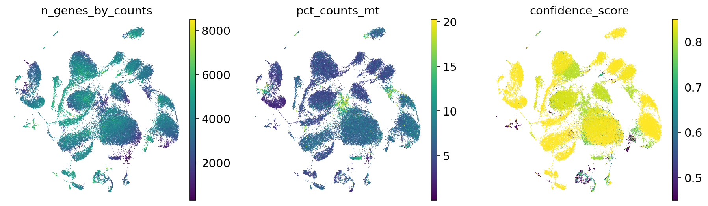

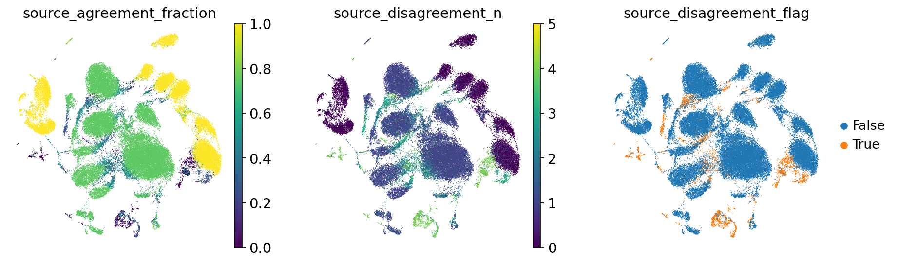

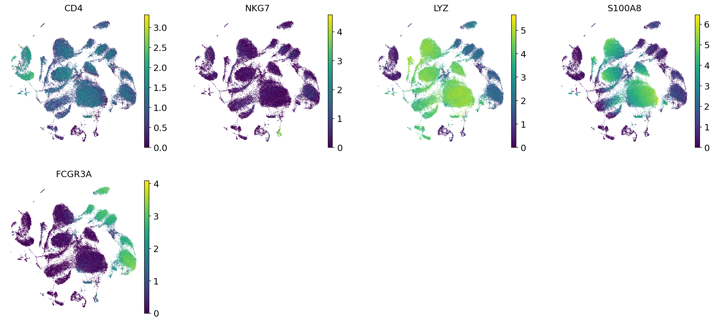

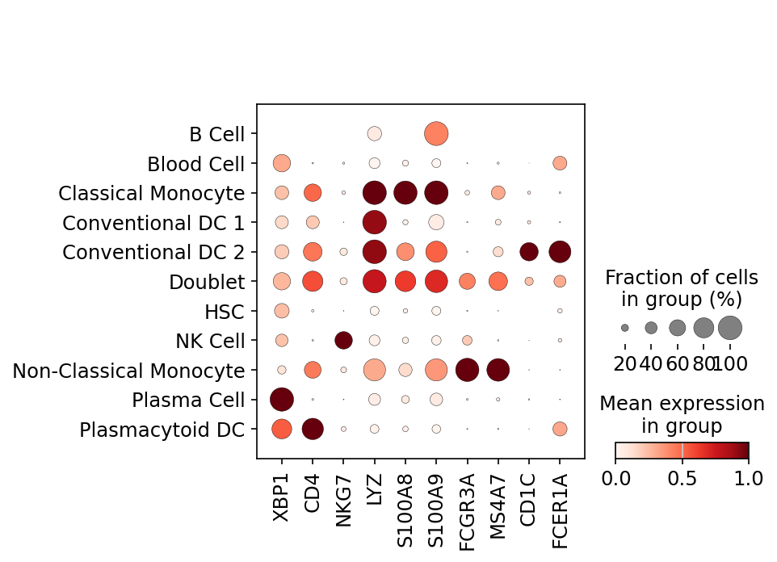

#### vaccination_study_04 B_lineage subcluster UMAP

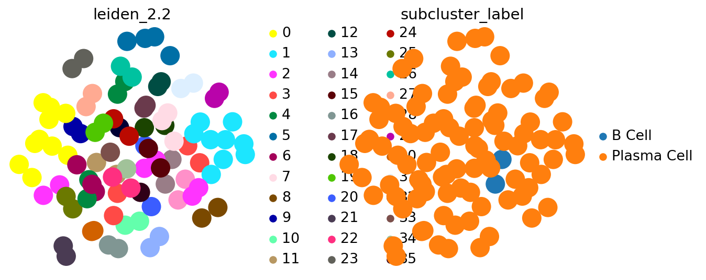

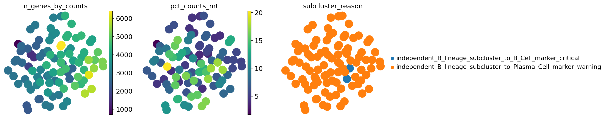

#### vaccination_study_04 T_NK_lineage subcluster UMAP

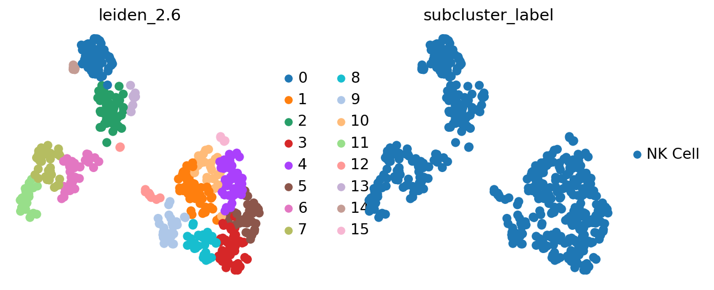

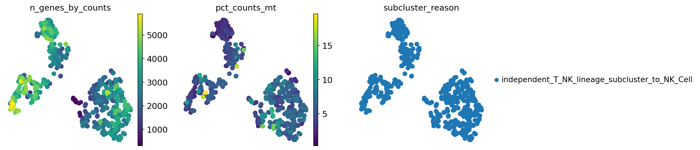

#### vaccination_study_04 Myeloid_lineage subcluster UMAP

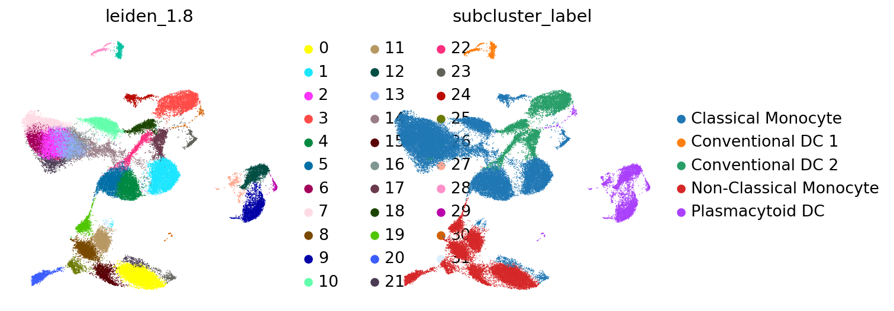

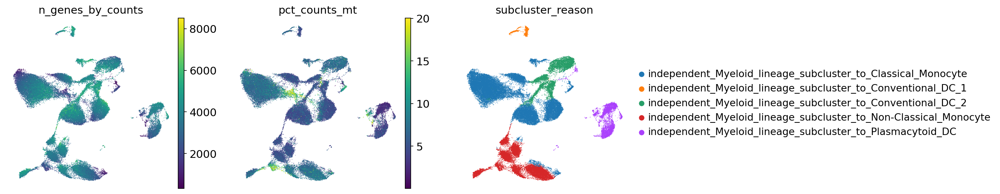

## 出力ファイル

- Submission TSVs: `outputs/single_dataset_checks/260526_vaccination_study_04_assessment_all/submissions/`
- cellxgene H5ADs: `outputs/single_dataset_checks/260526_vaccination_study_04_assessment_all/cellxgene/`
- Marker availability table: `outputs/single_dataset_checks/260526_vaccination_study_04_assessment_all/tables/marker_gene_availability.tsv`
- Marker availability alerts: `outputs/single_dataset_checks/260526_vaccination_study_04_assessment_all/tables/marker_gene_availability_alerts.tsv`
- Subcluster evidence: `outputs/single_dataset_checks/260526_vaccination_study_04_assessment_all/tables/lineage_subcluster_evidence.tsv.gz`
- Source disagreement summary: `outputs/single_dataset_checks/260526_vaccination_study_04_assessment_all/tables/source_disagreement_summary.tsv`
- Diagnostics tables: `outputs/single_dataset_checks/260526_vaccination_study_04_assessment_all/tables/`
