# HIPC データセットアノテーションレポート: vaccination_study_06

更新日: 2026-05-26 EDT

このレポートは `hipc-annotation` Codex workflow によって生成したデータセット別レビュー文書です。固定 method は repository README に置き、このレポートでは実際の evidence、弱い箇所、レビュー優先度、UMAP / dotplot を確認します。

## データセット概要

| study | cells | original_processed_genes | pre_hvg_genes | analysis_X_genes | counts_layer_genes | labels | parent_or_blood_fraction | Blood Cell | Doublet | artifact_like | median_confidence | low_confidence | source_disagreement | invalid_labels |
| --- | --- | --- | --- | --- | --- | --- | --- | --- | --- | --- | --- | --- | --- | --- |
| vaccination_study_06 | 57,419 | 11,878 | 11,878 | 11,878 | 11,878 | 11 | 0.003 | 121 | 2,162 | 0 | 0.767 | 2,582 | 22,047 (0.384) | none |

## 実行概要

- 実行単位: one dataset in, one annotated dataset out。
- 実行経路: Codex skill `hipc-annotation` -> bundled helper `run_one.sh` -> annotation CLI -> validator -> report inspection。
- 検証: submission row count、H5AD observation count、official label validity、H5AD/submission agreement、confidence column、report image link を確認する。
- このレポートは workflow の再掲ではなく、このデータセットの marker 欠損、UMAP、label 構成、review concern を読むためのもの。

## データセット固有の解釈

- `vaccination_study_06`: 57,419 cells、original processed 11,878 genes、pre-HVG 11,878 genes、analysis X/var 11,878 genes、submitted label 11 種、parent/Blood residual fraction 0.003、median confidence 0.767。
  - 2,582 cells は low confidence。QC / confidence UMAP 上で局在を確認する。
  - 2,162 cells は `Doublet` として提出。mixed-lineage marker expression と scrublet support を確認する。
  - 121 cells は `Blood Cell` として残存。これは filter-out ではなく、曖昧な細胞を公式 parent label で残したもの。
  - Marker gene 欠損アラート: Treg, Plasma_ASC。該当 marker set に依存する fine label は慎重に見る。

## データセット固有の評価

- 全体像: 57,419 cells / original processed 11,878 genes / pre-HVG 11,878 genes / analysis X/var 11,878 genes。gene coverage は最も高い一方、source disagreement は 22,047 cells (0.384) と最大で、median confidence も 0.767 と低めです。
- 構成: CD4 Naive/Tcm 30,218 cells、CD8 Cytotoxic/Tem 10,674 cells、NK Cell 9,440 cells、Memory B Cell 3,212 cells が主体です。myeloid 系は非常に少なく、monocyte/DC label は小数細胞のため強く解釈しません。
- 主な弱点: Memory B Cell の disagreement は 0.792 と高く、B-cell fine label は CellTypist/Pan-human/marker の不一致が強い領域です。CD4/CD8 T label も disagreement が約 0.39 で、T-cell 内部の naive/effector 境界を UMAP と marker expression で確認すべきです。
- Marker gene 欠損: Treg は FOXP3 欠損、Plasma_ASC は JCHAIN などが欠損です。gene coverage は多いものの、key marker の有無は label ごとに異なるため、単純な総遺伝子数だけでは信頼性を判断できません。
- 解釈: この dataset は broad T/NK/B lineage は見えますが、reference 間の fine label disagreement が大きいです。次の改善では T/B subcluster 内で marker margin と source agreement をより強く使い、低 margin の fine label を confidence-capped にするのが妥当です。

## Marker Gene 欠損アラート

| study | marker_set | alert | present_fraction | missing_critical_markers | missing_genes |
| --- | --- | --- | --- | --- | --- |
| vaccination_study_06 | Treg | warning | 0.714 | FOXP3 | FOXP3;CCR8 |
| vaccination_study_06 | Plasma_ASC | warning | 0.444 | JCHAIN | JCHAIN;SDC1;TNFRSF17;IGHG1;IGHA1 |

## ソース間不一致

| study | predicted_cell_type | cells | median_source_agreement | disagreement_cells | disagreement_fraction |
| --- | --- | --- | --- | --- | --- |
| vaccination_study_06 | Doublet | 2,162 | 0.000 | 2,162 | 1.000 |
| vaccination_study_06 | Blood Cell | 121 | 0.250 | 121 | 1.000 |
| vaccination_study_06 | Myeloid Cell | 26 | 0.000 | 26 | 1.000 |
| vaccination_study_06 | Intermediate Monocyte | 13 | 0.250 | 13 | 1.000 |
| vaccination_study_06 | Plasmacytoid DC | 10 | 0.250 | 10 | 1.000 |
| vaccination_study_06 | Classical Monocyte | 7 | 0.250 | 6 | 0.857 |
| vaccination_study_06 | Memory B Cell | 3,212 | 0.400 | 2,544 | 0.792 |
| vaccination_study_06 | CD8 Cytotoxic / T Effector Memory | 10,674 | 0.500 | 4,229 | 0.396 |
| vaccination_study_06 | CD4 Naive / T Central Memory | 30,218 | 0.600 | 11,913 | 0.394 |
| vaccination_study_06 | MAIT Cell | 1,536 | 0.500 | 559 | 0.364 |
| vaccination_study_06 | NK Cell | 9,440 | 1.000 | 464 | 0.049 |

## レビュー優先事項

| study | concern | cells |
| --- | --- | --- |
| vaccination_study_06 | High source disagreement for Blood Cell | 121 |
| vaccination_study_06 | High source disagreement for Classical Monocyte | 6 |
| vaccination_study_06 | High source disagreement for Doublet | 2,162 |
| vaccination_study_06 | High source disagreement for Intermediate Monocyte | 13 |
| vaccination_study_06 | High source disagreement for Memory B Cell | 2,544 |
| vaccination_study_06 | High source disagreement for Myeloid Cell | 26 |
| vaccination_study_06 | High source disagreement for Plasmacytoid DC | 10 |
| vaccination_study_06 | High dataset-level source disagreement | 22,047 |

## ラベル構成

| study | predicted_cell_type | cells |
| --- | --- | --- |
| vaccination_study_06 | CD4 Naive / T Central Memory | 30,218 |
| vaccination_study_06 | CD8 Cytotoxic / T Effector Memory | 10,674 |
| vaccination_study_06 | NK Cell | 9,440 |
| vaccination_study_06 | Memory B Cell | 3,212 |
| vaccination_study_06 | Doublet | 2,162 |
| vaccination_study_06 | MAIT Cell | 1,536 |
| vaccination_study_06 | Blood Cell | 121 |
| vaccination_study_06 | Myeloid Cell | 26 |
| vaccination_study_06 | Intermediate Monocyte | 13 |
| vaccination_study_06 | Plasmacytoid DC | 10 |
| vaccination_study_06 | Classical Monocyte | 7 |

## 図

### vaccination_study_06

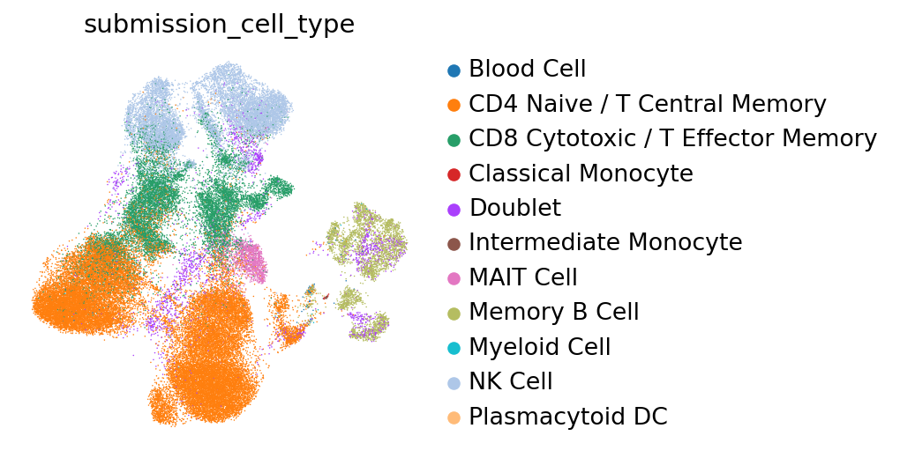

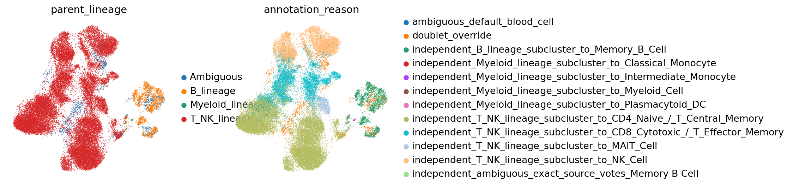

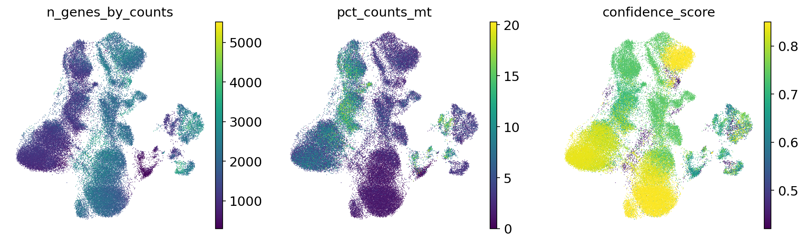

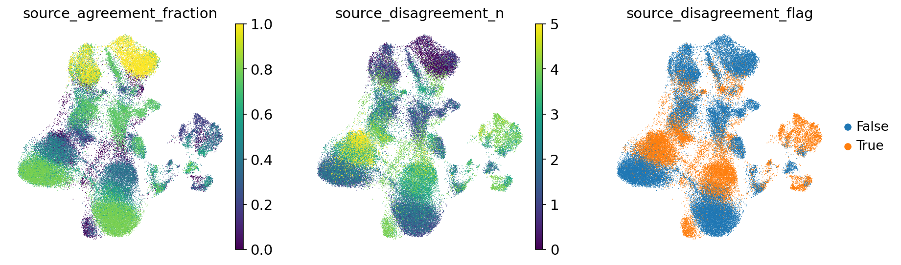

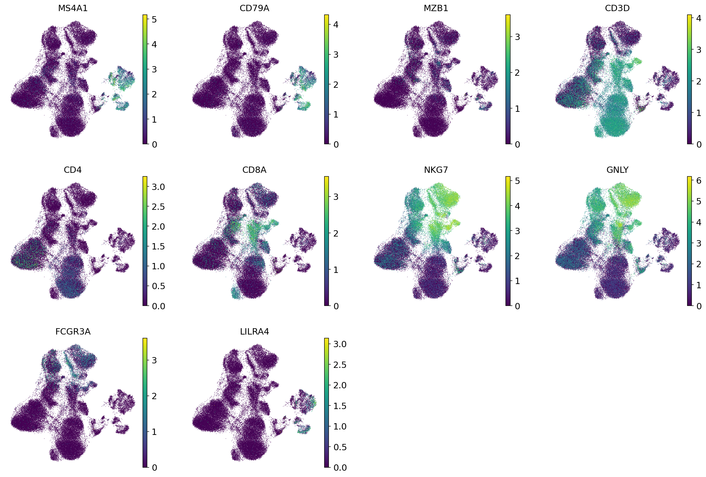

#### vaccination_study_06 B_lineage subcluster UMAP

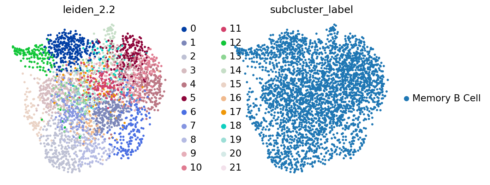

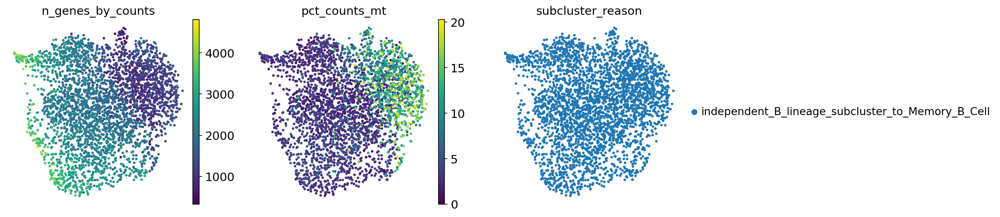

#### vaccination_study_06 T_NK_lineage subcluster UMAP

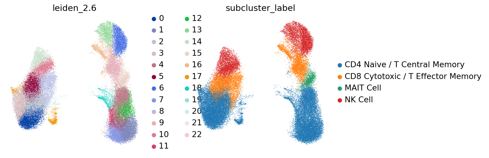

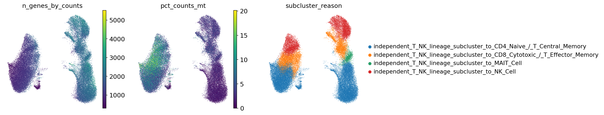

#### vaccination_study_06 Myeloid_lineage subcluster UMAP

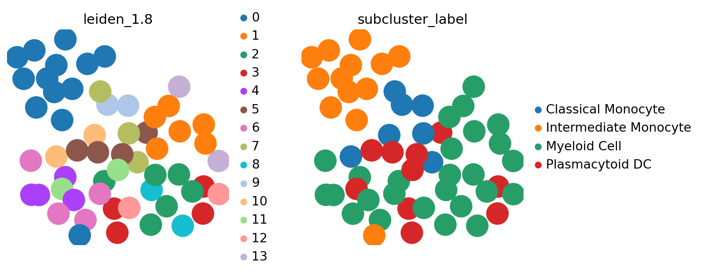

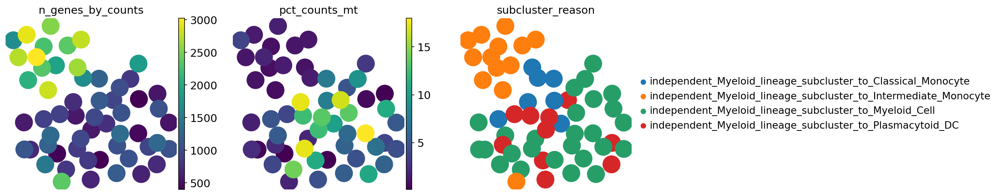

## 出力ファイル

- Submission TSVs: `outputs/single_dataset_checks/260526_vaccination_study_06_assessment_all/submissions/`
- cellxgene H5ADs: `outputs/single_dataset_checks/260526_vaccination_study_06_assessment_all/cellxgene/`
- Marker availability table: `outputs/single_dataset_checks/260526_vaccination_study_06_assessment_all/tables/marker_gene_availability.tsv`
- Marker availability alerts: `outputs/single_dataset_checks/260526_vaccination_study_06_assessment_all/tables/marker_gene_availability_alerts.tsv`
- Subcluster evidence: `outputs/single_dataset_checks/260526_vaccination_study_06_assessment_all/tables/lineage_subcluster_evidence.tsv.gz`
- Source disagreement summary: `outputs/single_dataset_checks/260526_vaccination_study_06_assessment_all/tables/source_disagreement_summary.tsv`
- Diagnostics tables: `outputs/single_dataset_checks/260526_vaccination_study_06_assessment_all/tables/`
