# HIPC Dataset Annotation Report: vaccination_study_09

Updated: 2026-05-26 EDT

This report was generated by the `hipc-annotation` Codex workflow. It is a dataset-specific review document: the fixed method lives in the repository README, while this report should expose the actual evidence, weak points, and review priorities for this dataset.

## Dataset Summary

| study | cells | X_genes | raw_genes | counts_layer_genes | labels | parent_or_blood_fraction | Blood Cell | Doublet | artifact_like | median_confidence | low_confidence | source_disagreement | invalid_labels |
| --- | --- | --- | --- | --- | --- | --- | --- | --- | --- | --- | --- | --- | --- |
| vaccination_study_09 | 139,960 | 3,985 | 8,000 | 3,985 | 17 | 0.001 | 120 | 323 | 104 | 0.838 | 443 | 29,879 (0.213) | none |

## Run Summary

- Execution unit: one dataset in, one annotated dataset out.
- Execution path: Codex skill `hipc-annotation` -> bundled helper `run_one.sh` -> annotation CLI -> validator -> report inspection.
- Validation checks: submission row count, H5AD observation count, official label validity, H5AD/submission agreement, confidence column, and report image links.
- This report is for dataset-specific marker availability, UMAPs, label composition, and review concerns rather than repeating the fixed workflow.

## Dataset-Specific Interpretation

- `vaccination_study_09`: 139,960 cells, 3,985 X/var genes, 8,000 raw genes, 17 submitted labels, parent/Blood residual fraction 0.001, median confidence 0.838.
  - 443 cells have low confidence and should be inspected on QC/confidence UMAPs.
  - 323 cells are submitted as `Doublet`; inspect mixed-lineage marker expression before final submission.
  - 120 cells remain `Blood Cell`; these are residual ambiguous cells rather than filtered cells.
  - Marker availability alerts are present for: Treg, B_memory_ABC, Plasma_ASC. Fine labels relying on these marker sets should be treated cautiously.

## Dataset-Specific Assessment

- Overall: 139,960 cells / 3,985 X/var genes / 8,000 raw genes. This is the largest dataset. Parent/Blood residual is very low at 120 cells (0.001), and median confidence is good at 0.838, although source disagreement remains non-trivial at 29,879 cells (0.213).
- More reliable regions: NK Cell, Plasma Cell, pDC, Platelet, and Non-Classical Monocyte have strong source agreement. Naive B Cell and Memory B Cell are also more stable than in vaccination_study_06.
- T-cell weakness: CD8 Naive/Tcm has disagreement 0.591 and Treg 0.564. Treg lacks FOXP3/IL2RA/CTLA4, so the 1,823 Treg calls should be treated as provisional confidence-capped fine labels.
- Marker availability: B_memory_ABC and Plasma_ASC have warnings, but B-cell source disagreement is moderate. The primary review focus is T-cell fine-state assignment rather than B-cell assignment.
- Interpretation: Broad lineage and most mature PBMC labels are stable at scale. Before submission, prioritize CD8 Naive/Tcm, Treg, and MAIT boundaries, and determine whether source-disagreement UMAP structure follows QC artifacts or biological continua.

## Marker Gene Availability

| study | marker_set | alert | present_fraction | missing_critical_markers | missing_genes |
| --- | --- | --- | --- | --- | --- |
| vaccination_study_09 | Treg | critical | 0.286 | FOXP3;IL2RA;CTLA4 | FOXP3;IL2RA;CTLA4;IKZF2;CCR8 |
| vaccination_study_09 | B_memory_ABC | warning | 0.500 | TNFRSF13B;ITGAX | TNFRSF13B;ITGAX;AIM2;CD86 |
| vaccination_study_09 | Plasma_ASC | warning | 0.333 | JCHAIN | JCHAIN;SDC1;IRF4;TNFRSF17;IGHG1;IGHA1 |

## Source Disagreement

| study | predicted_cell_type | cells | median_source_agreement | disagreement_cells | disagreement_fraction |
| --- | --- | --- | --- | --- | --- |
| vaccination_study_09 | Doublet | 323 | 0.000 | 323 | 1.000 |
| vaccination_study_09 | Blood Cell | 120 | 0.000 | 120 | 1.000 |
| vaccination_study_09 | CD8 Naive / T Central Memory | 10,260 | 0.400 | 6,064 | 0.591 |
| vaccination_study_09 | Treg | 1,823 | 0.400 | 1,029 | 0.564 |
| vaccination_study_09 | Conventional DC 2 | 1,970 | 0.750 | 715 | 0.363 |
| vaccination_study_09 | MAIT Cell | 5,716 | 0.500 | 1,843 | 0.322 |
| vaccination_study_09 | CD4 Naive / T Central Memory | 50,418 | 0.800 | 10,159 | 0.201 |
| vaccination_study_09 | CD8 Cytotoxic / T Effector Memory | 13,146 | 0.750 | 2,375 | 0.181 |
| vaccination_study_09 | Classical Monocyte | 26,842 | 0.750 | 4,474 | 0.167 |
| vaccination_study_09 | Naive B Cell | 12,156 | 0.800 | 1,955 | 0.161 |
| vaccination_study_09 | Memory B Cell | 3,374 | 0.600 | 496 | 0.147 |
| vaccination_study_09 | Non-Classical Monocyte | 3,473 | 1.000 | 175 | 0.050 |

## Review Priorities

| study | concern | cells |
| --- | --- | --- |
| vaccination_study_09 | High source disagreement for Blood Cell | 120 |
| vaccination_study_09 | High source disagreement for CD8 Naive / T Central Memory | 6,064 |
| vaccination_study_09 | High source disagreement for Doublet | 323 |
| vaccination_study_09 | High source disagreement for Treg | 1,029 |
| vaccination_study_09 | High dataset-level source disagreement | 29,879 |
| vaccination_study_09 | critical marker availability for Treg | 1,823 |
| vaccination_study_09 | warning marker availability for B_memory_ABC | 3,374 |
| vaccination_study_09 | warning marker availability for Plasma_ASC | 161 |

## Label Composition

| study | predicted_cell_type | cells |
| --- | --- | --- |
| vaccination_study_09 | CD4 Naive / T Central Memory | 50,418 |
| vaccination_study_09 | Classical Monocyte | 26,842 |
| vaccination_study_09 | CD8 Cytotoxic / T Effector Memory | 13,146 |
| vaccination_study_09 | Naive B Cell | 12,156 |
| vaccination_study_09 | CD8 Naive / T Central Memory | 10,260 |
| vaccination_study_09 | NK Cell | 9,268 |
| vaccination_study_09 | MAIT Cell | 5,716 |
| vaccination_study_09 | Non-Classical Monocyte | 3,473 |
| vaccination_study_09 | Memory B Cell | 3,374 |
| vaccination_study_09 | Conventional DC 2 | 1,970 |
| vaccination_study_09 | Treg | 1,823 |
| vaccination_study_09 | Plasmacytoid DC | 806 |
| vaccination_study_09 | Doublet | 323 |
| vaccination_study_09 | Plasma Cell | 161 |
| vaccination_study_09 | Blood Cell | 120 |
| vaccination_study_09 | Platelet | 90 |
| vaccination_study_09 | HSC | 14 |

## Figures

### vaccination_study_09

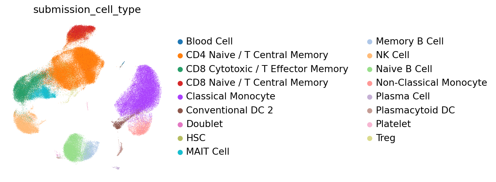

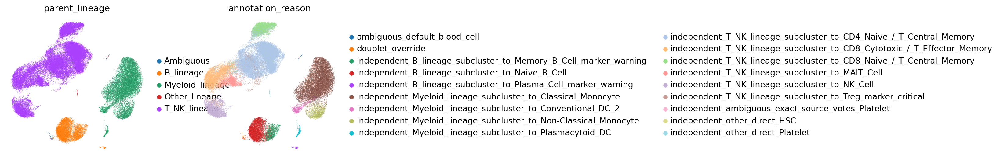

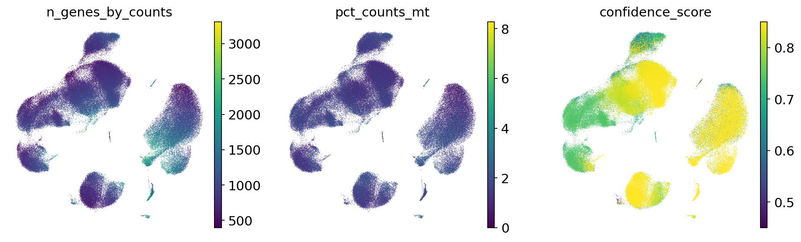

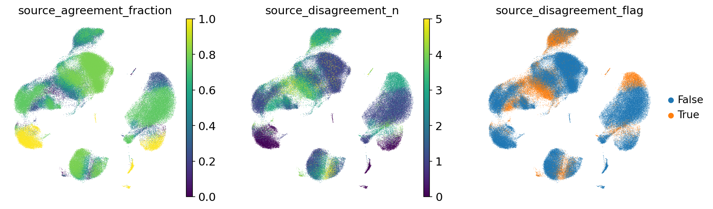

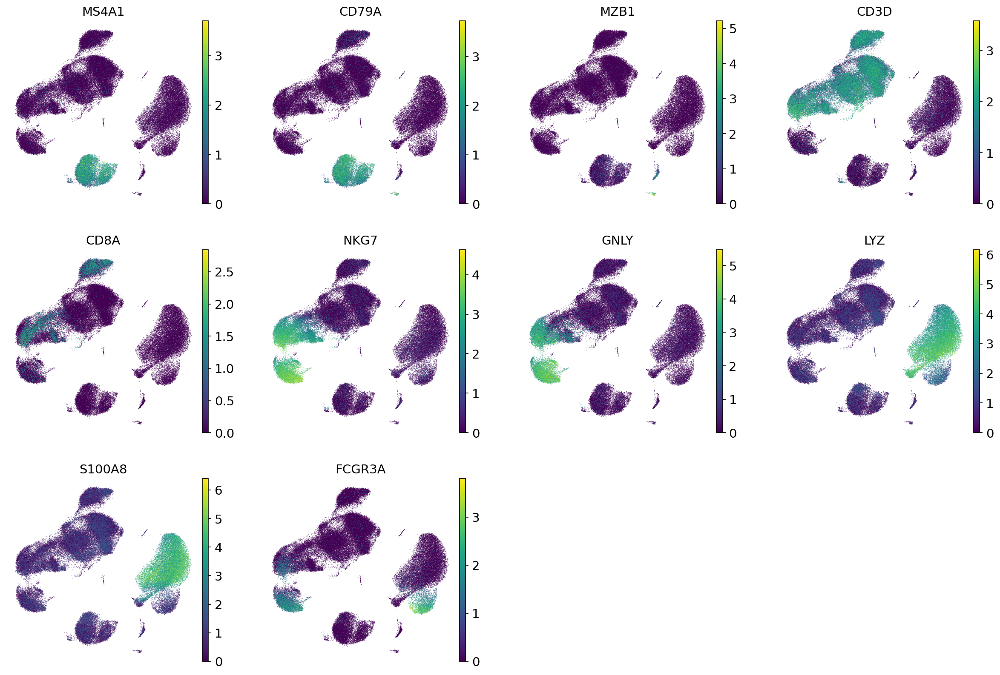

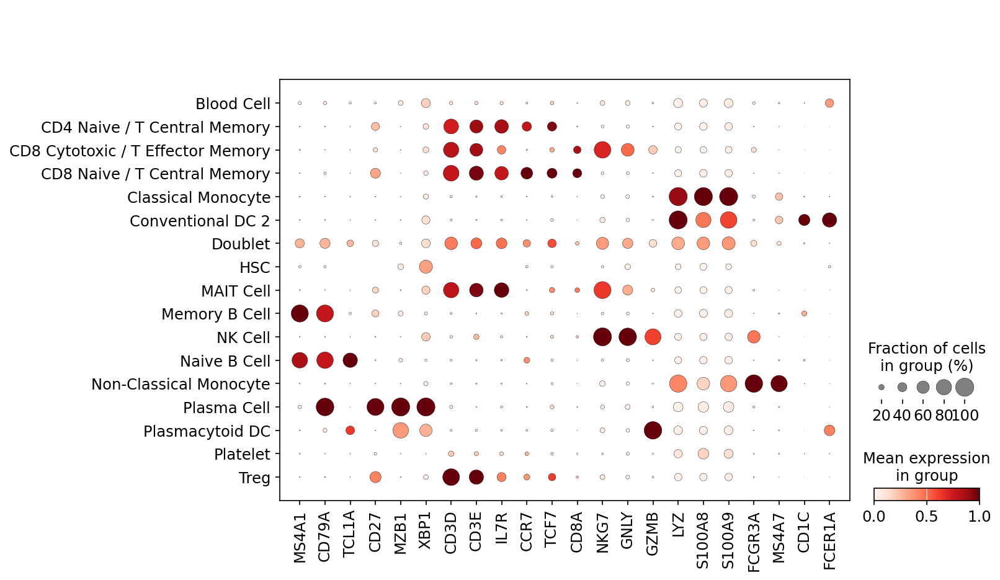

#### vaccination_study_09 B_lineage subcluster UMAP

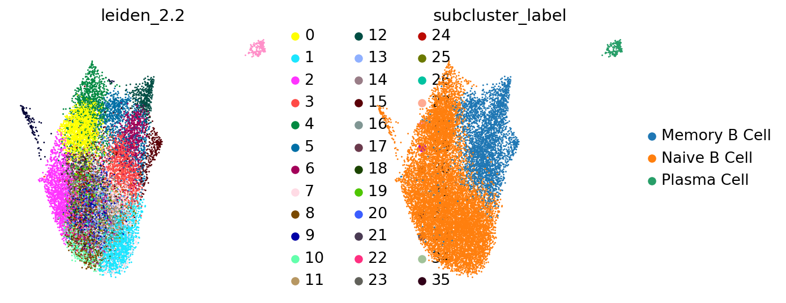

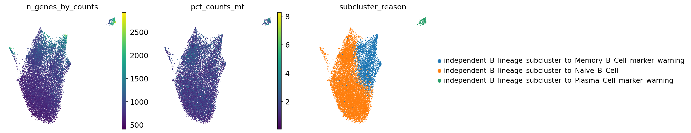

#### vaccination_study_09 T_NK_lineage subcluster UMAP

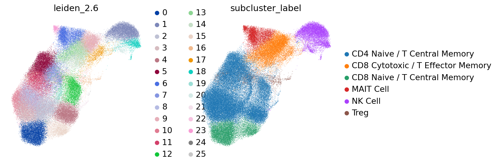

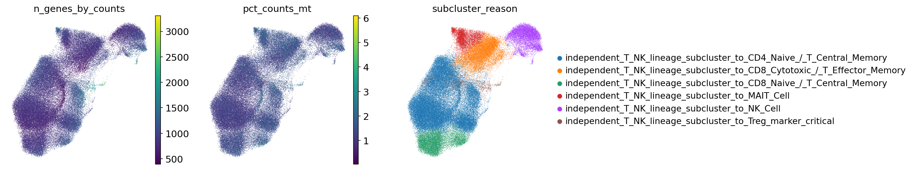

#### vaccination_study_09 Myeloid_lineage subcluster UMAP

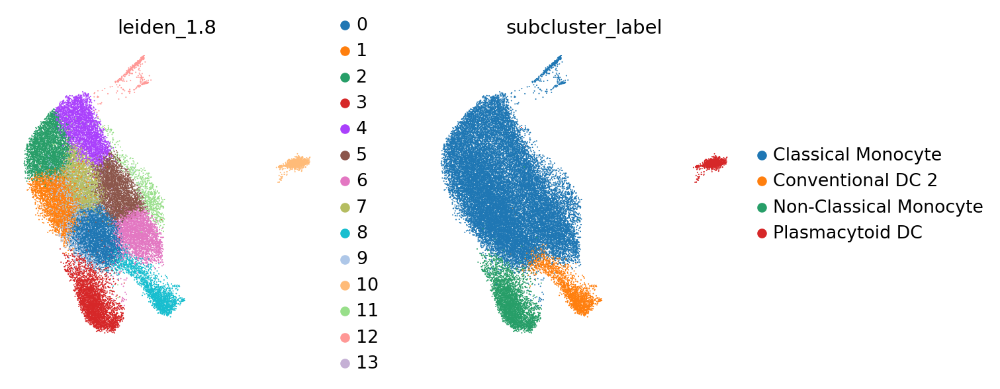

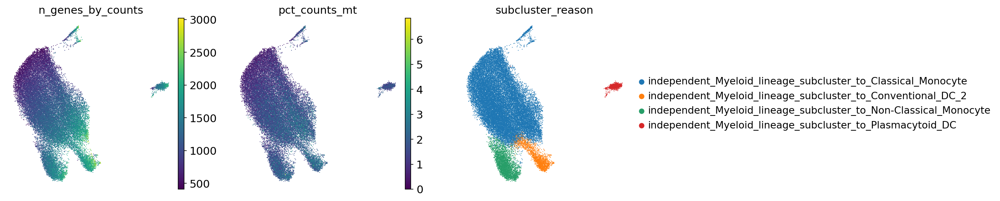

## Output Files

- Submission TSVs: `outputs/single_dataset_checks/260526_vaccination_study_09_assessment_all/submissions/`
- cellxgene H5ADs: `outputs/single_dataset_checks/260526_vaccination_study_09_assessment_all/cellxgene/`
- Marker availability table: `outputs/single_dataset_checks/260526_vaccination_study_09_assessment_all/tables/marker_gene_availability.tsv`
- Marker availability alerts: `outputs/single_dataset_checks/260526_vaccination_study_09_assessment_all/tables/marker_gene_availability_alerts.tsv`
- Subcluster evidence: `outputs/single_dataset_checks/260526_vaccination_study_09_assessment_all/tables/lineage_subcluster_evidence.tsv.gz`
- Source disagreement summary: `outputs/single_dataset_checks/260526_vaccination_study_09_assessment_all/tables/source_disagreement_summary.tsv`
- Diagnostics tables: `outputs/single_dataset_checks/260526_vaccination_study_09_assessment_all/tables/`
