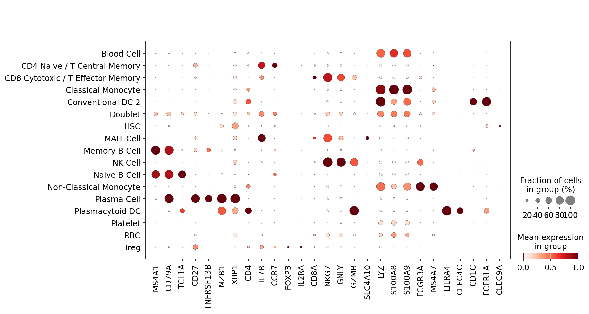

# HIPC v13 dataset review: `vaccination_study_09`

Updated: 2026-05-26 EDT

## Summary

This report is an independent v13 annotation review for `vaccination_study_09`. It integrates reference mapping, marker scores, lineage-specific subclustering, and doublet/QC evidence, then assigns every cell an official ontology label and confidence score.

## Dataset Assessment

This is the largest dataset at 139,960 cells and is T/B rich. T-cell markers are available, but IGHD/IGHM/JCHAIN loss makes B-naive and plasma/ASC subtype calls more cautious. screfmap materially contributes to B/CD4T fine annotation.

## Gene Space and Marker Alerts

| cells | portal genes | raw source | count-like | critical marker missing |
| ---: | ---: | --- | ---: | --- |
| 139,960 | 19,141 | layers[counts] | 1.000 | IGHD;IGHM;JCHAIN |

| marker set | present / expected | alert | missing critical markers |
| --- | ---: | --- | --- |
| Plasma_ASC | 6/9 | warning | JCHAIN |

## Annotation Summary

| cells | labels | parent/Blood fraction | Blood Cell | Doublet | artifact-like | median confidence | low confidence | invalid labels |
| ---: | ---: | ---: | ---: | ---: | ---: | ---: | ---: | --- |
| 139,960 | 17 | 0.005 | 695 | 579 | 144 | 0.822 | 1,286 | none |

## Source Agreement

| mean source agreement | screfmap-covered cells | interpretation |
| ---: | ---: | --- |
| 0.574 | 56,028 | screfmap is used as lineage-scoped auxiliary evidence inside B/CD4T lineages, not for broad-lineage assignment. |

## Figures

## Output Location

Large submission TSVs, annotated H5ADs, and diagnostics tables are stored on the Yale server working path:

`/vast/palmer/pi/hafler/yy693/HIPC-scRNAseq-Annotation/outputs/final_annotations/260526_v13_input_contract_repair/`
