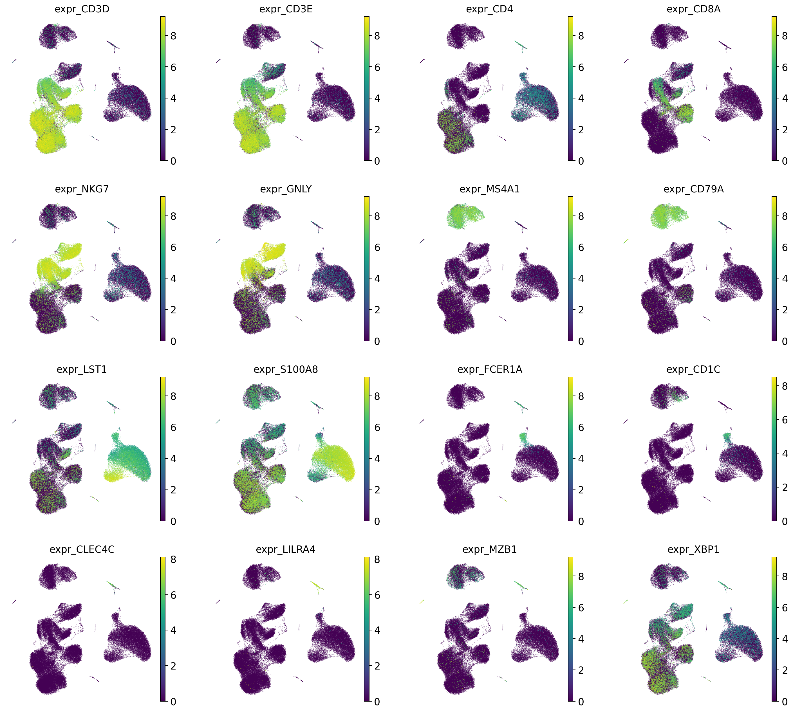
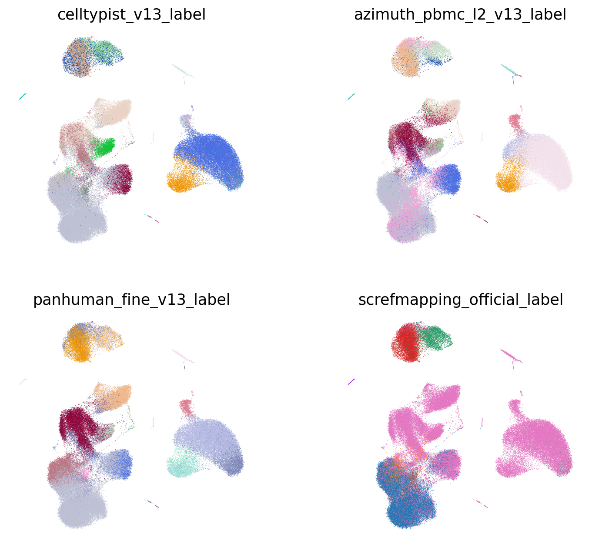
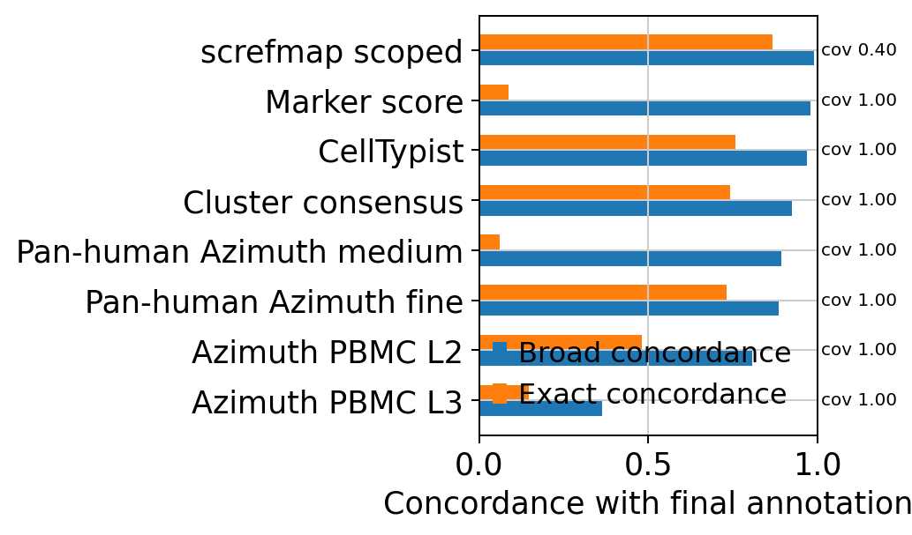
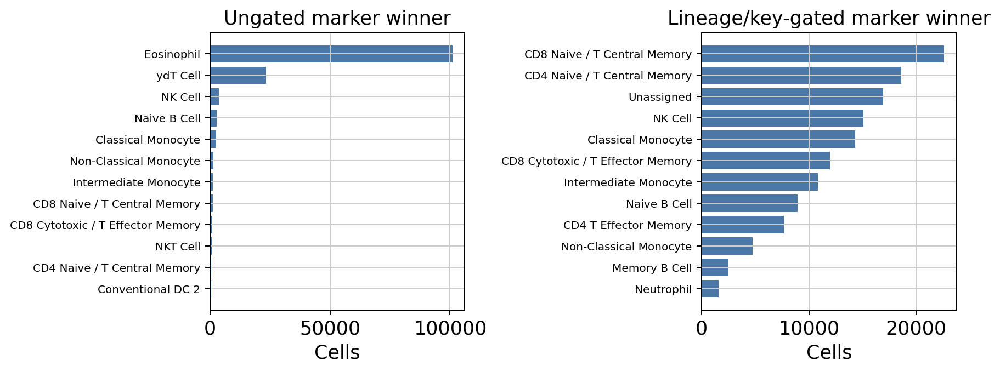
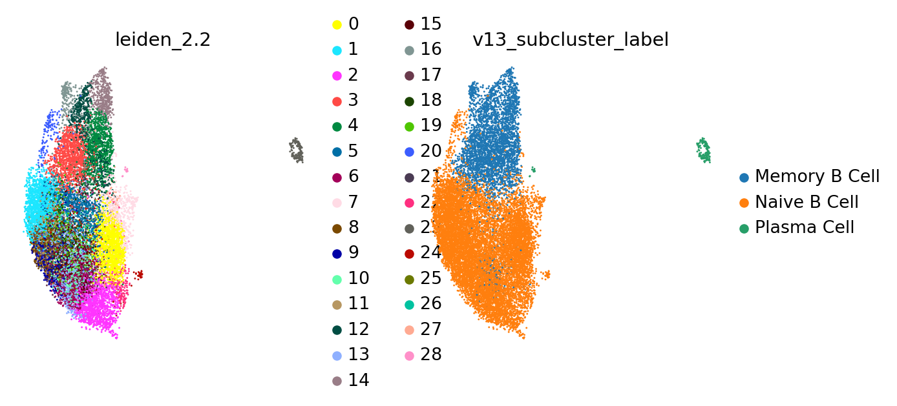
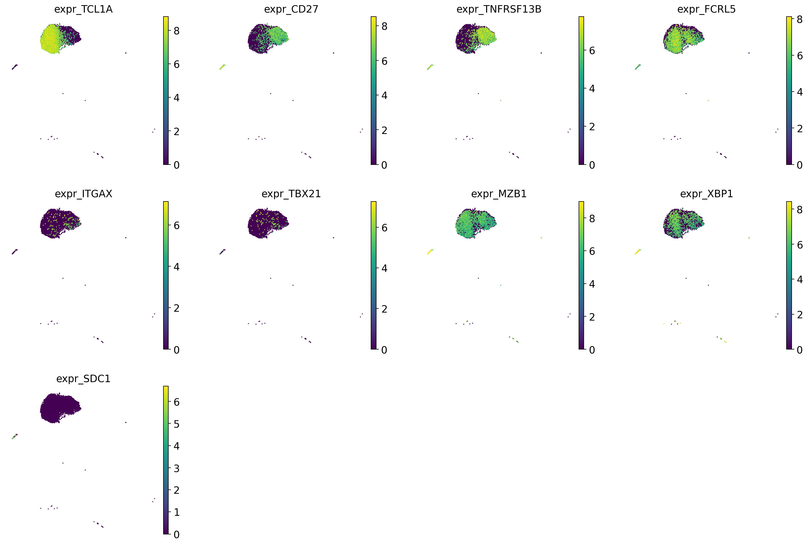
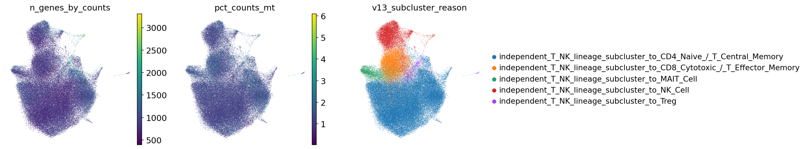
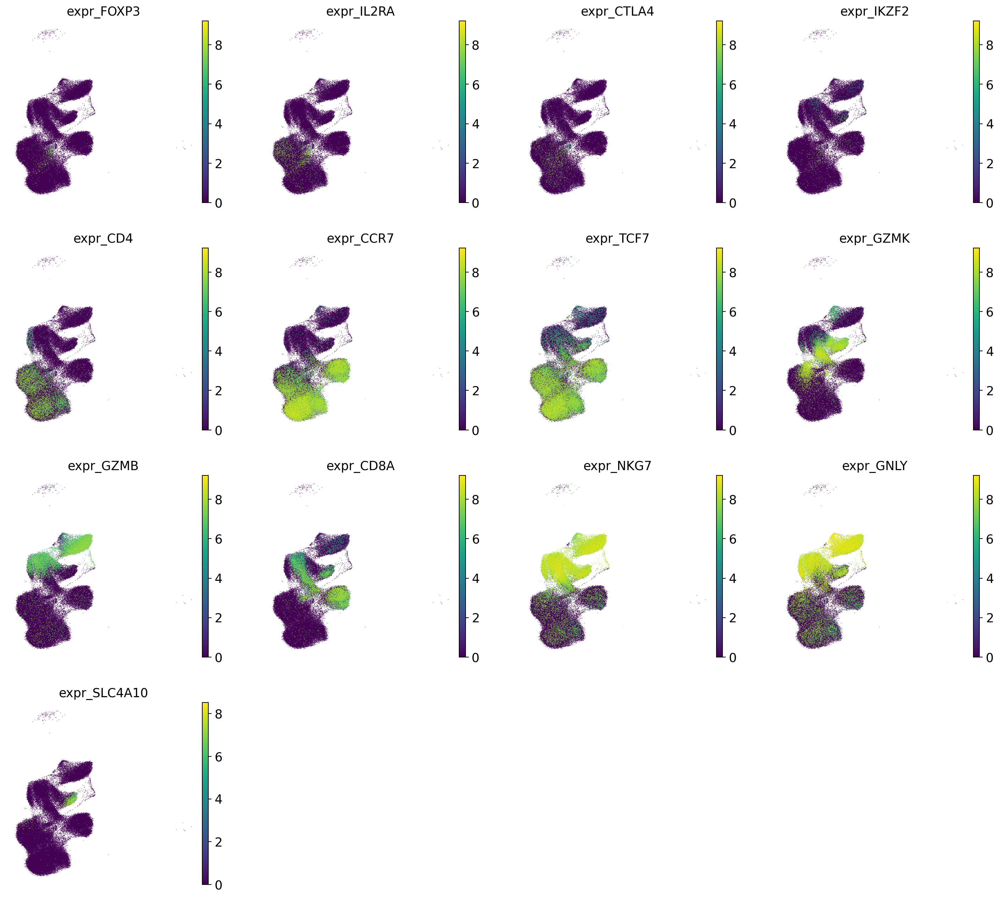
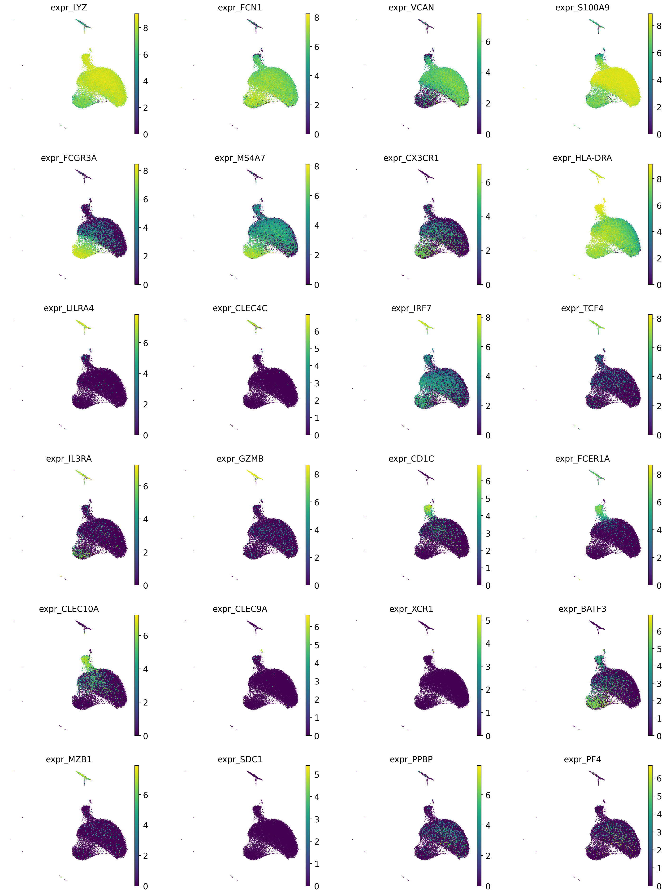

# vaccination_study_09 annotation review

Updated: 2026-05-28 EDT

## Dataset-specific assessment

vaccination_study_09 contains 139,960 cells and 19,141 portal genes. The residual parent/Blood Cell fraction is 0.5%, with 579 doublets and 1,286 low-confidence cells. Marker-gene availability alerts are Plasma_ASC(warning: JCHAIN). This is a large T/B dataset, and screfmap provides broad scoped support for B/CD4T cells. The dominant subcluster-supported labels are CD4 Naive / T Central Memory: 64,895 cells; Classical Monocyte: 25,752 cells; Naive B Cell: 11,614 cells; CD8 Cytotoxic / T Effector Memory: 10,513 cells; NK Cell: 10,322 cells; Non-Classical Monocyte: 4,365 cells. Among near-global sources, the strongest broad-lineage source is Marker score (broad concordance 97.8%), whereas Azimuth PBMC L3 shows the most disagreement (36.5%). Within the B/CD4T scope, screfmap covers 40.0% of cells and reaches 98.9% broad concordance. The v14 marker-registry audit tests marker evidence after broad-lineage, applicable-lineage, and key-marker gates, rather than allowing every marker set to compete in every cell. With a naive marker winner, rare/artifact labels such as Eosinophil (101,081 cells) and Platelet (166 cells) can dominate spuriously; after gating, they are reduced to Eosinophil 40 cells and Platelet 87 cells. This section is an evidence audit for acceptance thresholds and confidence caps, not a marker-only replacement of final labels. The highest post-gate unassigned fraction is in Other_lineage (29.2%).

## Methods

This report cross-checks the portal count-like gene space, CellTypist, Azimuth PBMC, Pan-human Azimuth, screfmap, marker scores, and lineage-specific subclustering for a single dataset. Tool concordance is a diagnostic measure of support/disagreement relative to the final annotation, not ground-truth accuracy.

## Input and QC

| cells | portal_genes | raw_count_source | count_like_fraction | available_marker_umap_genes | missing_marker_umap_genes | parent_or_blood_fraction | median_confidence | low_confidence_n | doublet_n |
| --- | --- | --- | --- | --- | --- | --- | --- | --- | --- |
| 139,960 | 19,141 | layers[counts] | 1.000 | 49 | IGHD;IGHM;JCHAIN;TRDC | 0.005 | 0.822 | 1,286 | 579 |

### Marker gene availability alerts

| marker_set | n_genes_present | n_genes_expected | alert_level | missing_critical_markers |
| --- | --- | --- | --- | --- |
| Plasma_ASC | 6 | 9 | warning | JCHAIN |

### QC and annotation UMAPs

## Marker expression UMAPs

### lineage_core

## Annotation source assessment

Because each source has a different scope, coverage and concordance should be interpreted separately. `exact_final_concordance` is exact final-label agreement, whereas `broad_final_concordance` is broad-lineage agreement. Marker score is a coarse marker-set direction, so exact agreement can be low for pairs such as `Monocyte` vs `Classical Monocyte` or `B Cell` vs `Memory B Cell`. screfmap is evaluated only within B/CD4T-scoped cells.

| tool | covered_n | coverage_fraction | exact_final_concordance | broad_final_concordance | top_supported_labels | top_disagreements |
| --- | --- | --- | --- | --- | --- | --- |
| CellTypist | 139,960 | 1.000 | 0.759 | 0.969 | CD4 Naive / T Central Memory: 53,998; Classical Monocyte: 23,807; NK Cell: 15,934; Naive B Cell: 6,921; CD8 Cytotoxic / T Effector Memory: 6,288 | CD4 Naive / T Central Memory vs CD8 Naive / T Central Memory: 5,738; CD8 Cytotoxic / T Effector Memory vs NK Cell: 5,025; Naive B Cell vs B Cell: 3,642; CD4 Naive / T Central Memory vs CD4 T Effector Memory: 1,928; CD4 Naive / T Central Memory vs CD8 Cytotoxic / T Effector Memory: 1,895 |
| Azimuth PBMC L2 | 139,960 | 1.000 | 0.480 | 0.808 | CD4 Naive / T Central Memory: 38,553; RBC: 25,752; Treg: 17,107; CD8 Naive / T Central Memory: 11,771; CD8 Cytotoxic / T Effector Memory: 10,091 | Classical Monocyte vs RBC: 22,781; CD4 Naive / T Central Memory vs Treg: 14,433; CD4 Naive / T Central Memory vs CD8 Naive / T Central Memory: 10,779; Naive B Cell vs Memory B Cell: 2,417; NK Cell vs CD8 Cytotoxic / T Effector Memory: 2,328 |
| Azimuth PBMC L3 | 139,960 | 1.000 | 0.148 | 0.365 | Blood Cell: 61,873; RBC: 26,415; Treg: 16,491; CD4 Naive / T Central Memory: 12,530; CD8 Naive / T Central Memory: 9,329 | CD4 Naive / T Central Memory vs Blood Cell: 28,282; Classical Monocyte vs RBC: 22,782; CD4 Naive / T Central Memory vs Treg: 13,965; Naive B Cell vs Blood Cell: 10,295; CD4 Naive / T Central Memory vs CD8 Naive / T Central Memory: 9,279 |
| Pan-human Azimuth fine | 139,960 | 1.000 | 0.731 | 0.886 | CD4 Naive / T Central Memory: 47,132; Classical Monocyte: 21,039; Blood Cell: 16,227; CD8 Cytotoxic / T Effector Memory: 13,298; Naive B Cell: 9,399 | CD4 Naive / T Central Memory vs CD4 T Effector Memory: 6,928; Classical Monocyte vs Blood Cell: 5,250; CD4 Naive / T Central Memory vs Blood Cell: 4,262; CD4 Naive / T Central Memory vs CD8 Naive / T Central Memory: 3,963; CD4 Naive / T Central Memory vs CD8 Cytotoxic / T Effector Memory: 2,601 |
| Pan-human Azimuth medium | 139,960 | 1.000 | 0.062 | 0.892 | T Cell: 76,051; Monocyte: 24,919; Blood Cell: 15,334; B Cell: 12,992; NK Cell: 8,184 | CD4 Naive / T Central Memory vs T Cell: 61,013; Classical Monocyte vs Monocyte: 20,417; Naive B Cell vs B Cell: 9,495; CD8 Cytotoxic / T Effector Memory vs T Cell: 9,371; Classical Monocyte vs Blood Cell: 5,246 |
| Cluster consensus | 139,960 | 1.000 | 0.742 | 0.926 | CD4 Naive / T Central Memory: 47,192; Classical Monocyte: 16,487; CD8 Cytotoxic / T Effector Memory: 14,680; CD8 Naive / T Central Memory: 11,659; Naive B Cell: 11,466 | CD4 Naive / T Central Memory vs CD8 Naive / T Central Memory: 11,594; Classical Monocyte vs Blood Cell: 9,597; CD4 Naive / T Central Memory vs CD8 Cytotoxic / T Effector Memory: 4,682; CD4 Naive / T Central Memory vs Treg: 1,301; CD4 Naive / T Central Memory vs MAIT Cell: 1,086 |
| Marker score | 139,960 | 1.000 | 0.087 | 0.978 | CD4 T Cell (ab): 39,681; Monocyte: 30,898; T Cell: 28,581; B Cell: 15,827; NK Cell: 14,482 | CD4 Naive / T Central Memory vs CD4 T Cell (ab): 36,378; Classical Monocyte vs Monocyte: 25,645; CD4 Naive / T Central Memory vs T Cell: 23,768; Naive B Cell vs B Cell: 11,581; Memory B Cell vs B Cell: 3,756 |
| screfmap scoped | 56,028 | 0.400 | 0.866 | 0.989 | CD4 Naive / T Central Memory: 35,246; Naive B Cell: 10,162; Memory B Cell: 4,845; CD4 T Effector Memory: 3,623; Treg: 1,967 | CD4 Naive / T Central Memory vs CD4 T Effector Memory: 3,099; CD4 Naive / T Central Memory vs Treg: 1,387; Naive B Cell vs Memory B Cell: 1,095; CD8 Cytotoxic / T Effector Memory vs CD4 T Effector Memory: 216; Treg vs CD4 Naive / T Central Memory: 215 |

### Lineage-scoped source support

This table stratifies cells by final broad lineage and asks whether each source supports the same broad lineage or exact fine label within that scope. It is a diagnostic for where each source helps or fails, not a ground-truth accuracy estimate.

| final_broad_lineage | tool | covered_n | exact_final_concordance | broad_final_concordance |
| --- | --- | --- | --- | --- |
| B | CellTypist | 15,543 | 0.596 | 0.978 |
| B | Azimuth PBMC L2 | 15,543 | 0.656 | 0.896 |
| B | Azimuth PBMC L3 | 15,543 | 0.010 | 0.010 |
| B | Pan-human Azimuth fine | 15,543 | 0.706 | 0.839 |
| B | Pan-human Azimuth medium | 15,543 | 0.000 | 0.832 |
| B | Cluster consensus | 15,543 | 0.932 | 0.998 |
| B | Marker score | 15,543 | 0.010 | 0.998 |
| B | screfmap scoped | 14,857 | 0.908 | 0.997 |
| T/NK | CellTypist | 90,663 | 0.749 | 0.986 |
| T/NK | Azimuth PBMC L2 | 90,663 | 0.544 | 0.990 |
| T/NK | Azimuth PBMC L3 | 90,663 | 0.157 | 0.472 |
| T/NK | Pan-human Azimuth fine | 90,663 | 0.714 | 0.918 |
| T/NK | Pan-human Azimuth medium | 90,663 | 0.087 | 0.928 |
| T/NK | Cluster consensus | 90,663 | 0.740 | 0.998 |
| T/NK | Marker score | 90,663 | 0.103 | 0.982 |
| T/NK | screfmap scoped | 40,619 | 0.863 | 1.000 |
| Myeloid/DC | CellTypist | 32,336 | 0.879 | 0.940 |
| Myeloid/DC | Azimuth PBMC L2 | 32,336 | 0.232 | 0.257 |
| Myeloid/DC | Azimuth PBMC L3 | 32,336 | 0.191 | 0.211 |
| Myeloid/DC | Pan-human Azimuth fine | 32,336 | 0.797 | 0.829 |

## v14 marker registry gate audit

The v14 marker-registry audit tests marker evidence after broad-lineage, applicable-lineage, and key-marker gates, rather than allowing every marker set to compete in every cell. With a naive marker winner, rare/artifact labels such as Eosinophil (101,081 cells) and Platelet (166 cells) can dominate spuriously; after gating, they are reduced to Eosinophil 40 cells and Platelet 87 cells. This section is an evidence audit for acceptance thresholds and confidence caps, not a marker-only replacement of final labels. The highest post-gate unassigned fraction is in Other_lineage (29.2%).

`Ungated` allows marker sets to compete across all cells, whereas `gated` restricts candidates by broad lineage and key-marker support. This section diagnoses the current final annotation and informs confidence caps or review alerts for the next annotation engine.

### Registry marker availability alerts

| label | broad_lineage | marker_role | n_present_markers | n_expected_markers | n_key_present | n_key_markers | availability_alert | missing_key_markers |
| --- | --- | --- | --- | --- | --- | --- | --- | --- |
| ydT Cell | T/NK | terminal | 6 | 10 | 0 | 3 | critical | TRDC;TRGC1;TRGC2 |
| Naive B Cell | B | terminal | 13 | 16 | 1 | 3 | warning | IGHD;IGHM |

### Gate effect on marker winners

| label | ungated_n | gated_n | delta_after_gate |
| --- | --- | --- | --- |
| Basophil | 0 | 0 | 0 |
| CD4 Naive / T Central Memory | 457 | 18,598 | 18,141 |
| CD4 T Effector Memory | 184 | 7,667 | 7,483 |
| CD8 Cytotoxic / T Effector Memory | 739 | 11,965 | 11,226 |
| CD8 Naive / T Central Memory | 1,040 | 22,625 | 21,585 |
| Classical Monocyte | 2,399 | 14,307 | 11,908 |
| Eosinophil | 101,081 | 40 | -101,041 |
| HSC | 3 | 36 | 33 |
| Intermediate Monocyte | 1,142 | 10,858 | 9,716 |
| Mast Cell | 0 | 4 | 4 |
| NK Cell | 3,521 | 15,106 | 11,585 |
| NKT Cell | 732 | 528 | -204 |
| Naive B Cell | 2,648 | 8,956 | 6,308 |
| Non-Classical Monocyte | 1,404 | 4,766 | 3,362 |
| Platelet | 166 | 87 | -79 |
| RBC | 65 | 59 | -6 |
| Unassigned | 0 | 16,939 | 16,939 |
| ydT Cell | 23,290 | 0 | -23,290 |

### Gated marker labels by audit lineage

| audit_lineage_gate | n_cells | unassigned_n | unassigned_fraction | top_gated_marker_labels |
| --- | --- | --- | --- | --- |
| Ambiguous | 1,187 | 6 | 0.005 | Classical Monocyte: 426; Intermediate Monocyte: 251; Neutrophil: 123; NK Cell: 85; Naive B Cell: 78 |
| B_lineage | 15,543 | 3,018 | 0.194 | Naive B Cell: 8,878; Unassigned: 3,018; Memory B Cell: 2,448; Plasmablast: 1,014; Plasma Cell: 185 |
| Myeloid_lineage | 32,336 | 22 | 0.001 | Classical Monocyte: 13,881; Intermediate Monocyte: 10,607; Non-Classical Monocyte: 4,738; Neutrophil: 1,476; Conventional DC 2: 954 |
| Other_lineage | 233 | 68 | 0.292 | Platelet: 85; Unassigned: 68; RBC: 48; HSC: 32 |
| T_NK_lineage | 90,661 | 13,825 | 0.152 | CD8 Naive / T Central Memory: 22,594; CD4 Naive / T Central Memory: 18,577; NK Cell: 15,021; Unassigned: 13,825; CD8 Cytotoxic / T Effector Memory: 11,939 |

### Marker support by final label

| final_label | n_cells | marker_exact_fraction | marker_exact_fraction_gated | unassigned_fraction_gated | top_marker_best_labels_gated |
| --- | --- | --- | --- | --- | --- |
| CD4 Naive / T Central Memory | 64,896 | 0.007 | 0.281 | 0.202 | CD8 Naive / T Central Memory:21863; CD4 Naive / T Central Memory:18236; Unassigned:13128; CD4 T Effector Memory:5555; CD8 Cytotoxic / T Effector Memory:4131 |
| Classical Monocyte | 25,752 | 0.071 | 0.536 | 0.000 | Classical Monocyte:13801; Intermediate Monocyte:9486; Neutrophil:1449; Non-Classical Monocyte:941; Conventional DC 2:39 |
| Naive B Cell | 11,614 | 0.215 | 0.741 | 0.160 | Naive B Cell:8602; Unassigned:1860; Memory B Cell:628; Plasmablast:400; Plasma Cell:124 |
| CD8 Cytotoxic / T Effector Memory | 10,513 | 0.050 | 0.513 | 0.012 | CD8 Cytotoxic / T Effector Memory:5388; NK Cell:3505; CD4 T Effector Memory:832; CD8 Naive / T Central Memory:384; NKT Cell:172 |
| NK Cell | 10,322 | 0.306 | 0.892 | 0.004 | NK Cell:9209; CD8 Cytotoxic / T Effector Memory:698; CD4 T Effector Memory:180; CD8 Naive / T Central Memory:94; NKT Cell:55 |
| Non-Classical Monocyte | 4,365 | 0.307 | 0.858 | 0.001 | Non-Classical Monocyte:3743; Intermediate Monocyte:545; Classical Monocyte:68; Neutrophil:4; Unassigned:3 |
| Memory B Cell | 3,758 | 0.005 | 0.484 | 0.308 | Memory B Cell:1818; Unassigned:1157; Plasmablast:460; Naive B Cell:276; Plasma Cell:47 |
| MAIT Cell | 3,724 | 0.012 | 0.102 | 0.019 | CD8 Cytotoxic / T Effector Memory:1581; CD4 T Effector Memory:906; NK Cell:487; MAIT Cell:378; NKT Cell:179 |
| Conventional DC 2 | 1,415 | 0.010 | 0.579 | 0.001 | Conventional DC 2:819; Intermediate Monocyte:509; Non-Classical Monocyte:49; Neutrophil:16; Classical Monocyte:12 |
| Treg | 1,208 | 0.007 | 0.054 | 0.373 | Unassigned:451; CD8 Naive / T Central Memory:179; CD4 T Effector Memory:175; CD4 Naive / T Central Memory:157; CD8 Cytotoxic / T Effector Memory:141 |
| Plasmacytoid DC | 804 | 0.053 | 0.765 | 0.020 | Plasmacytoid DC:615; Conventional DC 2:94; Intermediate Monocyte:67; Unassigned:16; Neutrophil:7 |
| Blood Cell | 695 | 0.000 | 0.000 | 0.065 | Classical Monocyte:295; Intermediate Monocyte:139; Neutrophil:105; RBC:50; Unassigned:45 |
| Doublet | 579 | 0.000 | 0.000 | 0.007 | Classical Monocyte:131; Intermediate Monocyte:110; NK Cell:75; Naive B Cell:75; Memory B Cell:29 |
| Plasma Cell | 171 | 0.000 | 0.082 | 0.006 | Plasmablast:154; Plasma Cell:14; Memory B Cell:2; Unassigned:1 |

## Lineage-specific subclustering

### B_lineage

Lineage-restricted marker expression UMAP. This is placed here because fine-label decisions are made within the lineage/subcluster context.

| cluster | n_cells | chosen_label | accepted | score_margin | calibrated_cluster_confidence | marker_availability_alert | top_celltypist | top_panhuman_fine | top_marker | top_screfmapping |
| --- | --- | --- | --- | --- | --- | --- | --- | --- | --- | --- |
| 0 | 1,689 | Naive B Cell | True | 3.662 | 0.850 | pass | Naive B Cell:1076; B Cell:546; Memory B Cell:54; Blood Cell:6; CD4 Naive / T Central Memory:5 | Naive B Cell:1395; Memory B Cell:203; Blood Cell:90; B Cell:1 | B Cell:1680; Monocyte:7; Plasma Cell:1; RBC:1 | Naive B Cell:1556; Memory B Cell:127; not_available:5; Plasma Cell:1 |
| 1 | 1,489 | Naive B Cell | True | 3.166 | 0.850 | pass | Naive B Cell:848; B Cell:436; Memory B Cell:153; Blood Cell:28; CD4 Naive / T Central Memory:19 | Naive B Cell:1086; Blood Cell:276; Memory B Cell:114; B Cell:12; Plasma Cell:1 | B Cell:1484; RBC:3; Monocyte:2 | Naive B Cell:1260; Memory B Cell:129; not_available:88; Treg:7; Plasma Cell:4 |
| 2 | 1,330 | Naive B Cell | True | 3.304 | 0.850 | pass | Naive B Cell:815; B Cell:350; Memory B Cell:120; CD4 Naive / T Central Memory:21; Plasma Cell:11 | Naive B Cell:861; Blood Cell:379; Memory B Cell:77; B Cell:9; Plasma Cell:4 | B Cell:1323; Monocyte:3; CD4 T Cell (ab):2; Plasma Cell:1; Plasmacytoid DC:1 | Naive B Cell:1087; not_available:122; Memory B Cell:112; Treg:7; Plasma Cell:1 |
| 3 | 1,205 | Memory B Cell | True | 3.030 | 0.834 | pass | Memory B Cell:844; B Cell:304; Naive B Cell:36; CD4 Naive / T Central Memory:11; Blood Cell:7 | Memory B Cell:776; Naive B Cell:223; Blood Cell:195; B Cell:7; Plasma Cell:4 | B Cell:1205 | Memory B Cell:1049; Naive B Cell:89; not_available:60; Treg:5; Plasma Cell:2 |
| 4 | 1,142 | Memory B Cell | True | 3.427 | 0.836 | pass | Memory B Cell:848; B Cell:267; Naive B Cell:16; CD4 Naive / T Central Memory:5; Blood Cell:4 | Memory B Cell:805; Naive B Cell:193; Blood Cell:136; B Cell:5; Plasma Cell:3 | B Cell:1141; RBC:1 | Memory B Cell:1099; not_available:26; Naive B Cell:15; Plasma Cell:1; Treg:1 |
| 5 | 918 | Naive B Cell | True | 3.771 | 0.850 | pass | B Cell:536; Naive B Cell:326; Blood Cell:22; CD4 Naive / T Central Memory:19; Memory B Cell:13 | Naive B Cell:691; Blood Cell:140; Memory B Cell:50; B Cell:36; Plasma Cell:1 | B Cell:918 | Naive B Cell:860; Memory B Cell:40; not_available:13; Plasma Cell:3; Treg:2 |
| 6 | 762 | Naive B Cell | True | 3.646 | 0.850 | pass | Naive B Cell:481; B Cell:222; Memory B Cell:41; CD4 Naive / T Central Memory:9; Blood Cell:7 | Naive B Cell:546; Blood Cell:177; Memory B Cell:33; B Cell:4; Plasma Cell:2 | B Cell:762 | Naive B Cell:677; not_available:50; Memory B Cell:34; Treg:1 |
| 7 | 725 | Naive B Cell | True | 3.122 | 0.850 | pass | Naive B Cell:445; B Cell:193; Memory B Cell:72; Blood Cell:7; CD4 Naive / T Central Memory:5 | Naive B Cell:539; Memory B Cell:119; Blood Cell:62; B Cell:5 | B Cell:724; Plasma Cell:1 | Naive B Cell:608; Memory B Cell:107; not_available:10 |
| 8 | 636 | Naive B Cell | True | 3.792 | 0.850 | pass | Naive B Cell:457; B Cell:146; Memory B Cell:21; CD4 Naive / T Central Memory:6; Blood Cell:4 | Naive B Cell:520; Blood Cell:92; Memory B Cell:24 | B Cell:636 | Naive B Cell:586; not_available:27; Memory B Cell:20; Treg:3 |
| 9 | 560 | Naive B Cell | True | 2.953 | 0.850 | pass | Naive B Cell:324; B Cell:154; Memory B Cell:63; CD4 Naive / T Central Memory:10; Blood Cell:5 | Naive B Cell:322; Blood Cell:192; Memory B Cell:45; B Cell:1 | B Cell:560 | Naive B Cell:425; not_available:82; Memory B Cell:52; Treg:1 |

### T_NK_lineage

Lineage-restricted marker expression UMAP. This is placed here because fine-label decisions are made within the lineage/subcluster context.

| cluster | n_cells | chosen_label | accepted | score_margin | calibrated_cluster_confidence | marker_availability_alert | top_celltypist | top_panhuman_fine | top_marker | top_screfmapping |
| --- | --- | --- | --- | --- | --- | --- | --- | --- | --- | --- |
| 0 | 7,576 | NK Cell | True | 2.219 | 0.850 | pass | NK Cell:7378; Blood Cell:73; CD4 Naive / T Central Memory:61; CD8 Cytotoxic / T Effector Memory:26; MAIT Cell:16 | NK Cell:6766; Blood Cell:496; CD8 Cytotoxic / T Effector Memory:307; Treg:2; MAIT Cell:2 | NK Cell:7499; T Cell:36; CD8 T Cell (ab):35; CD4 T Cell (ab):4; RBC:1 | not_available:7576 |
| 1 | 6,964 | CD4 Naive / T Central Memory | True | 2.327 | 0.833 | pass | CD4 Naive / T Central Memory:5723; CD8 Naive / T Central Memory:990; CD8 Cytotoxic / T Effector Memory:110; NK Cell:34; CD4 T Effector Memory:32 | CD4 Naive / T Central Memory:5700; CD8 Naive / T Central Memory:779; CD4 T Effector Memory:174; Blood Cell:172; CD8 Cytotoxic / T Effector Memory:121 | CD4 T Cell (ab):3482; T Cell:3094; Monocyte:181; CD8 T Cell (ab):168; NK Cell:20 | CD4 Naive / T Central Memory:3553; not_available:3203; CD4 T Effector Memory:144; Treg:64 |
| 2 | 6,672 | CD8 Cytotoxic / T Effector Memory | True | 0.637 | 0.723 | pass | NK Cell:4040; CD8 Cytotoxic / T Effector Memory:1932; CD4 Naive / T Central Memory:311; MAIT Cell:188; Blood Cell:126 | CD8 Cytotoxic / T Effector Memory:5819; Blood Cell:541; NK Cell:194; CD4 Naive / T Central Memory:38; MAIT Cell:33 | NK Cell:2978; CD8 T Cell (ab):1839; T Cell:1633; CD4 T Cell (ab):211; Monocyte:8 | not_available:6628; CD4 T Effector Memory:28; CD4 Naive / T Central Memory:15; Treg:1 |
| 3 | 6,631 | CD4 Naive / T Central Memory | True | 2.671 | 0.840 | pass | CD4 Naive / T Central Memory:6099; CD8 Naive / T Central Memory:323; CD8 Cytotoxic / T Effector Memory:97; NK Cell:53; MAIT Cell:24 | CD4 Naive / T Central Memory:5984; Blood Cell:342; CD8 Naive / T Central Memory:178; CD8 Cytotoxic / T Effector Memory:104; CD4 T Effector Memory:16 | CD4 T Cell (ab):3753; T Cell:2518; CD8 T Cell (ab):210; NK Cell:53; Monocyte:42 | CD4 Naive / T Central Memory:4639; not_available:1852; CD4 T Effector Memory:92; Treg:48 |
| 4 | 6,152 | CD4 Naive / T Central Memory | True | 1.411 | 0.822 | pass | CD4 Naive / T Central Memory:4570; CD4 T Effector Memory:910; MAIT Cell:221; CD8 Cytotoxic / T Effector Memory:110; Treg:105 | CD4 T Effector Memory:2999; CD4 Naive / T Central Memory:2515; Blood Cell:340; CD8 Cytotoxic / T Effector Memory:166; MAIT Cell:69 | CD4 T Cell (ab):4544; T Cell:1452; CD8 T Cell (ab):81; NK Cell:44; Monocyte:20 | CD4 Naive / T Central Memory:3550; not_available:1825; CD4 T Effector Memory:717; Treg:60 |
| 5 | 5,599 | CD4 Naive / T Central Memory | True | 2.068 | 0.818 | pass | CD4 Naive / T Central Memory:4896; NK Cell:161; CD8 Cytotoxic / T Effector Memory:160; CD8 Naive / T Central Memory:151; MAIT Cell:81 | CD4 Naive / T Central Memory:4100; Blood Cell:1073; CD8 Cytotoxic / T Effector Memory:213; CD4 T Effector Memory:98; CD8 Naive / T Central Memory:79 | CD4 T Cell (ab):3000; T Cell:1933; CD8 T Cell (ab):235; Monocyte:176; NK Cell:169 | CD4 Naive / T Central Memory:3093; not_available:2107; CD4 T Effector Memory:287; Treg:112 |
| 6 | 5,196 | CD4 Naive / T Central Memory | True | 1.065 | 0.806 | pass | CD4 Naive / T Central Memory:3322; CD8 Naive / T Central Memory:1707; CD8 Cytotoxic / T Effector Memory:82; Blood Cell:24; NK Cell:18 | CD4 Naive / T Central Memory:3607; CD8 Naive / T Central Memory:1172; Blood Cell:275; CD8 Cytotoxic / T Effector Memory:74; CD4 T Effector Memory:50 | CD4 T Cell (ab):2583; T Cell:2228; CD8 T Cell (ab):329; Monocyte:23; NK Cell:16 | not_available:3054; CD4 Naive / T Central Memory:2069; CD4 T Effector Memory:57; Treg:16 |
| 7 | 4,804 | CD4 Naive / T Central Memory | True | 2.614 | 0.842 | pass | CD4 Naive / T Central Memory:4401; CD8 Naive / T Central Memory:345; CD8 Cytotoxic / T Effector Memory:17; Blood Cell:15; NK Cell:9 | CD4 Naive / T Central Memory:4430; CD8 Naive / T Central Memory:220; Blood Cell:118; CD8 Cytotoxic / T Effector Memory:19; CD4 T Effector Memory:13 | CD4 T Cell (ab):2700; T Cell:1926; CD8 T Cell (ab):113; Monocyte:43; Plasma Cell:10 | CD4 Naive / T Central Memory:3196; not_available:1562; Treg:26; CD4 T Effector Memory:20 |
| 8 | 4,541 | CD4 Naive / T Central Memory | True | 0.783 | 0.792 | pass | CD4 Naive / T Central Memory:2891; CD8 Naive / T Central Memory:1525; CD8 Cytotoxic / T Effector Memory:55; NK Cell:23; Blood Cell:20 | CD4 Naive / T Central Memory:3066; CD8 Naive / T Central Memory:1064; Blood Cell:331; CD8 Cytotoxic / T Effector Memory:66; CD4 T Effector Memory:6 | CD4 T Cell (ab):2148; T Cell:1999; CD8 T Cell (ab):329; Monocyte:36; NK Cell:12 | not_available:2933; CD4 Naive / T Central Memory:1563; CD4 T Effector Memory:33; Treg:12 |
| 9 | 3,841 | CD8 Cytotoxic / T Effector Memory | True | 1.349 | 0.740 | pass | CD8 Cytotoxic / T Effector Memory:1789; NK Cell:985; CD4 Naive / T Central Memory:732; MAIT Cell:180; Blood Cell:41 | CD8 Cytotoxic / T Effector Memory:2636; Blood Cell:619; CD4 Naive / T Central Memory:355; CD4 T Effector Memory:97; MAIT Cell:44 | CD8 T Cell (ab):1351; T Cell:1127; NK Cell:685; CD4 T Cell (ab):641; Monocyte:17 | not_available:3450; CD4 T Effector Memory:188; CD4 Naive / T Central Memory:183; Treg:20 |

### Myeloid_lineage

Lineage-restricted marker expression UMAP. This is placed here because fine-label decisions are made within the lineage/subcluster context.

| cluster | n_cells | chosen_label | accepted | score_margin | calibrated_cluster_confidence | marker_availability_alert | top_celltypist | top_panhuman_fine | top_marker | top_screfmapping |
| --- | --- | --- | --- | --- | --- | --- | --- | --- | --- | --- |
| 0 | 2,850 | Classical Monocyte | True | 2.615 | 0.850 | pass | Classical Monocyte:2798; Non-Classical Monocyte:27; Blood Cell:22; CD4 Naive / T Central Memory:2; Plasma Cell:1 | Classical Monocyte:2703; Blood Cell:139; Non-Classical Monocyte:6; Conventional DC 2:2 | Monocyte:2837; RBC:13 | not_available:2850 |
| 1 | 2,800 | Classical Monocyte | True | 2.506 | 0.740 | pass | Classical Monocyte:2586; Blood Cell:156; Non-Classical Monocyte:36; Plasma Cell:16; Myeloid Cell:4 | Classical Monocyte:2352; Blood Cell:435; Non-Classical Monocyte:10; Conventional DC 2:3 | Monocyte:2797; Non-Classical Monocyte:3 | not_available:2793; Memory B Cell:7 |
| 2 | 2,547 | Non-Classical Monocyte | True | 1.801 | 0.850 | pass | Non-Classical Monocyte:2530; Blood Cell:9; Classical Monocyte:4; CD4 Naive / T Central Memory:2; Plasma Cell:1 | Non-Classical Monocyte:2489; Intermediate Monocyte:36; Blood Cell:18; Classical Monocyte:4 | Non-Classical Monocyte:1509; Monocyte:1036; DC:1; RBC:1 | not_available:2547 |
| 3 | 2,519 | Classical Monocyte | True | 2.672 | 0.850 | pass | Classical Monocyte:2474; Blood Cell:42; Myeloid Cell:2; Plasma Cell:1 | Classical Monocyte:2352; Blood Cell:167 | Monocyte:2519 | not_available:2519 |
| 4 | 2,508 | Classical Monocyte | True | 2.382 | 0.740 | pass | Classical Monocyte:2197; Blood Cell:211; Plasma Cell:52; CD4 Naive / T Central Memory:25; Non-Classical Monocyte:16 | Classical Monocyte:1316; Blood Cell:1183; Non-Classical Monocyte:8; Conventional DC 2:1 | Monocyte:2501; Non-Classical Monocyte:4; DC:2; B Cell:1 | not_available:2445; Memory B Cell:47; CD4 T Effector Memory:8; CD4 Naive / T Central Memory:6; Treg:2 |
| 5 | 2,380 | Classical Monocyte | True | 2.356 | 0.850 | pass | Classical Monocyte:2158; Non-Classical Monocyte:123; Myeloid Cell:44; Blood Cell:41; DC:8 | Classical Monocyte:2223; Blood Cell:123; Conventional DC 2:22; Non-Classical Monocyte:10; Intermediate Monocyte:2 | Monocyte:2377; DC:3 | not_available:2380 |
| 6 | 2,022 | Classical Monocyte | True | 1.938 | 0.740 | pass | Classical Monocyte:1417; Blood Cell:502; Plasma Cell:84; CD4 Naive / T Central Memory:11; Non-Classical Monocyte:6 | Blood Cell:1522; Classical Monocyte:499; Neutrophil:1 | Monocyte:2020; Non-Classical Monocyte:2 | not_available:1933; Memory B Cell:78; CD4 Naive / T Central Memory:5; Naive B Cell:4; CD4 T Effector Memory:2 |
| 7 | 2,014 | Classical Monocyte | True | 2.034 | 0.850 | pass | Classical Monocyte:1621; Non-Classical Monocyte:356; Myeloid Cell:16; Blood Cell:15; Conventional DC 2:5 | Classical Monocyte:1792; Blood Cell:115; Non-Classical Monocyte:103; Intermediate Monocyte:2; Conventional DC 2:2 | Monocyte:2010; Non-Classical Monocyte:2; RBC:1; DC:1 | not_available:2014 |
| 8 | 1,882 | Classical Monocyte | True | 2.432 | 0.740 | pass | Classical Monocyte:1700; Blood Cell:86; Non-Classical Monocyte:80; Myeloid Cell:10; Plasma Cell:5 | Classical Monocyte:1663; Blood Cell:208; Non-Classical Monocyte:11 | Monocyte:1881; Non-Classical Monocyte:1 | not_available:1879; Memory B Cell:3 |
| 9 | 1,592 | Classical Monocyte | True | 2.520 | 0.740 | pass | Classical Monocyte:1494; Blood Cell:50; Non-Classical Monocyte:32; Plasma Cell:11; CD4 Naive / T Central Memory:4 | Classical Monocyte:1352; Blood Cell:230; Non-Classical Monocyte:10 | Monocyte:1591; Non-Classical Monocyte:1 | not_available:1583; Memory B Cell:4; CD4 Naive / T Central Memory:3; Naive B Cell:2 |

## Interpretation and caveats

This is not a ground-truth accuracy estimate; it is a consistency review across annotation sources, marker evidence, and subcluster structure. Fine labels affected by marker-gene loss should not be trusted from reference mapping alone. Disagreement for Azimuth PBMC L3 may reflect ontology granularity, gene availability, or dataset enrichment.

## Files

- Submission TSV: `submissions/vaccination_study_09_annotation.tsv`
- cellxgene H5AD: `cellxgene/vaccination_study_09.final_v13_recursive_screfmapping.cxg.h5ad`
- Report context JSON: `report_context.json`
- Tool support TSV: `tool_support_summary.tsv`
