# HIPC beta final annotation v13 dataset review

Updated: 2026-05-26 EDT

## Summary

`v13_recursive_screfmapping` is an independent dataset review that builds annotation evidence from each dataset's portal input and integrates reference mapping, marker scores, lineage-specific subclustering, and doublet/QC evidence. HVGs are used only for PCA/UMAP/subclustering, while CellTypist, marker scores, and screfmap query matrices are generated from the portal input gene space.

## Methods Overview

- CellTypist: all portal genes -> normalize_total(1e4) -> log1p -> CellTypist. No HVG subset.
- Marker scores: all portal genes -> normalize_total(1e4) -> log1p. Marker availability alerts are based on portal input var names.
- Azimuth PBMC: `processed.rds` raw RNA counts, template barcode subset.
- Pan-human Azimuth: `processed.raw_compat.h5ad` all-gene count input, template barcode subset.
- screfmap: lineage-scoped cells, raw counts from all portal genes.

## Portal Gene Space Audit

| study | cells | portal genes | raw source | count-like | critical marker missing |
| --- | ---: | ---: | --- | ---: | --- |
| infection_study_01 | 54,924 | 33,538 | layers[counts] | 1.000 | none |
| infection_study_04 | 43,767 | 26,361 | layers[counts] | 1.000 | JCHAIN |
| vaccination_study_04 | 66,065 | 16,983 | layers[counts] | 1.000 | CD3D;CD8A;CD8B;PRF1;MS4A1;CD27;TNFRSF13B;TBX21;SDC1;FOXP3;IL2RA;XCR1 |
| vaccination_study_06 | 57,419 | 11,878 | layers[counts] | 1.000 | IGHD;TNFRSF13B;FCRL5;JCHAIN;SDC1;FOXP3;LYZ;S100A8;S100A9;MS4A7;CLEC4C;CD1C;FCER1A;CLEC9A;XCR1 |
| vaccination_study_09 | 139,960 | 19,141 | layers[counts] | 1.000 | IGHD;IGHM;JCHAIN |

## Marker Availability Alerts

| study | marker set | present / expected | alert | missing critical markers |
| --- | --- | ---: | --- | --- |
| infection_study_04 | Plasma_ASC | 8/9 | warning | JCHAIN |
| vaccination_study_04 | Treg | 2/7 | critical | FOXP3;IL2RA |
| vaccination_study_06 | Treg | 5/7 | warning | FOXP3 |
| vaccination_study_06 | Plasma_ASC | 4/9 | warning | JCHAIN |
| vaccination_study_09 | Plasma_ASC | 6/9 | warning | JCHAIN |

## Study Summary

| study | cells | v13 labels | parent/Blood fraction | B Cell | T Cell | Myeloid Cell | Blood Cell | artifact-like | Doublet | Effector B | median confidence | low confidence | invalid labels |
| --- | ---: | ---: | ---: | ---: | ---: | ---: | ---: | ---: | ---: | ---: | ---: | ---: | --- |
| infection_study_01 | 54,924 | 19 | 0.003 | 1 | 0 | 0 | 166 | 1,389 | 1,278 | 0 | 0.846 | 2,209 | none |
| infection_study_04 | 43,767 | 16 | 0.013 | 39 | 0 | 0 | 518 | 365 | 132 | 0 | 0.740 | 1,011 | none |
| vaccination_study_04 | 66,065 | 12 | 0.007 | 0 | 0 | 0 | 464 | 408 | 647 | 0 | 0.846 | 1,111 | none |
| vaccination_study_06 | 57,419 | 17 | 0.004 | 14 | 0 | 27 | 216 | 2 | 1,502 | 0 | 0.820 | 1,771 | none |
| vaccination_study_09 | 139,960 | 17 | 0.005 | 0 | 0 | 0 | 695 | 144 | 579 | 0 | 0.822 | 1,286 | none |

## Dataset-Specific Assessment

| study | assessment |
| --- | --- |
| infection_study_01 | The full portal gene space contains 33,538 genes with no critical marker loss. Major B/T/myeloid lineages are stable by subcluster and marker evidence, and the parent/Blood fraction is low at 0.30%. screfmap evidence is loaded for 12,525 cells and is used as auxiliary B/CD4T support. |
| infection_study_04 | The full portal gene space contains 26,361 genes, but JCHAIN is absent from the Plasma/ASC marker set. Plasma Cell calls are therefore treated with a marker warning, while the parent/Blood fraction remains limited to 1.27%. screfmap evidence is loaded for 14,670 cells and helps resolve part of the B/CD4T ambiguity. |
| vaccination_study_04 | This dataset appears myeloid/DC enriched, with only 170 B/CD4T cells entering screfmap. Treg fine labeling is not strongly trusted because FOXP3 and IL2RA are absent, triggering a critical marker alert. The dominant structure is Classical/Non-Classical Monocyte, cDC2, pDC, and cDC1 rather than whole-PBMC balance. |
| vaccination_study_06 | This is the smallest gene-space dataset at 11,878 portal genes and shows broad Treg/Plasma/B-memory/myeloid marker loss. screfmap covers 32,412 cells and is useful in B/CD4T lineages, but single-source rescue is suppressed under marker warnings. The doublet call count is highest here at 1,502 cells and should remain visible as a quality flag. |
| vaccination_study_09 | This is the largest dataset at 139,960 cells and is T/B rich. T-cell markers are available, but IGHD/IGHM/JCHAIN loss makes B-naive and plasma/ASC subtype calls more cautious. screfmap covers 56,028 cells and materially contributes to B/CD4T fine annotation. |

## Source Agreement

| study | mean source agreement | screfmap-covered cells | interpretation |
| --- | ---: | ---: | --- |
| infection_study_01 | 0.692 | 12,525 | Reference, marker, and subcluster evidence are reasonably concordant. |
| infection_study_04 | 0.664 | 14,670 | Good overall, but Plasma/ASC labels are limited by JCHAIN absence. |
| vaccination_study_04 | 0.724 | 170 | High agreement is driven by myeloid/DC structure; B/CD4T-specific evidence is sparse. |
| vaccination_study_06 | 0.605 | 32,412 | Lower agreement reflects reduced gene space and marker loss; confidence is intentionally more conservative. |
| vaccination_study_09 | 0.574 | 56,028 | Large T/B dataset with strong screfmap coverage, but B/plasma marker dropout lowers cross-source agreement. |

## Figures

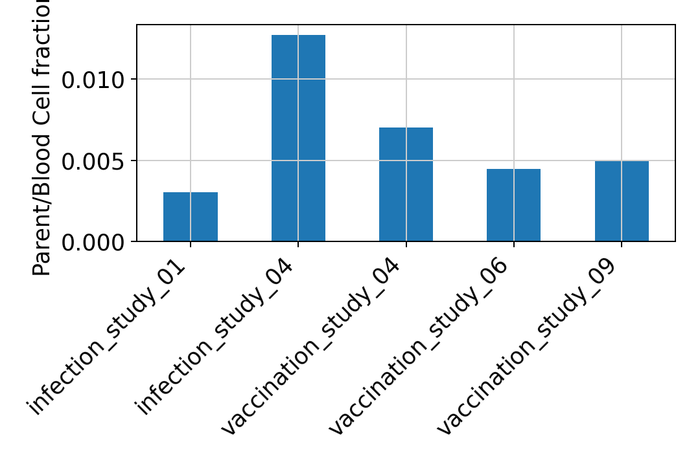

### infection_study_01

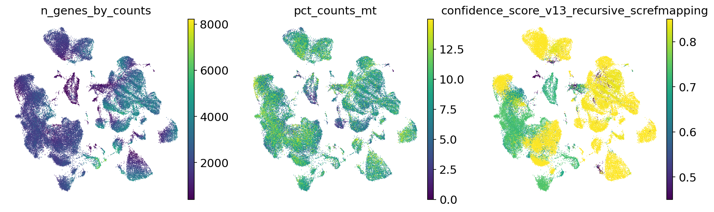

#### infection_study_01 B_lineage subcluster UMAP

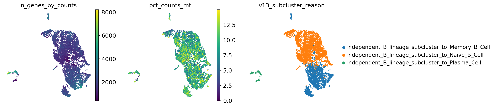

#### infection_study_01 T_NK_lineage subcluster UMAP

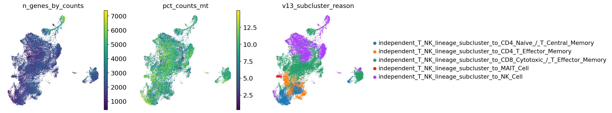

#### infection_study_01 Myeloid_lineage subcluster UMAP

### infection_study_04

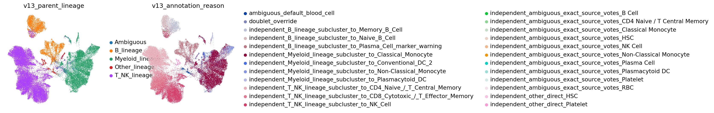

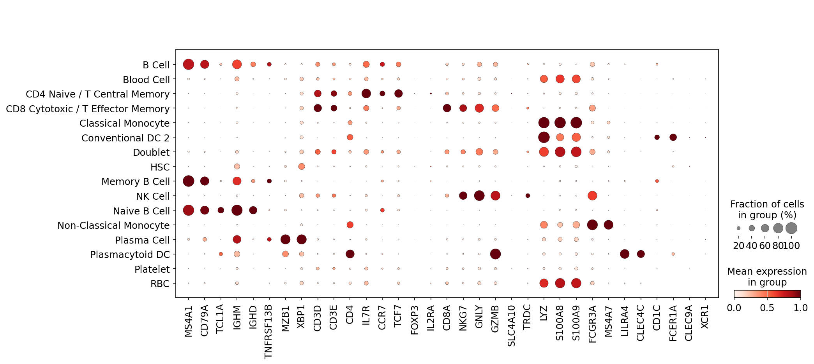

#### infection_study_04 B_lineage subcluster UMAP

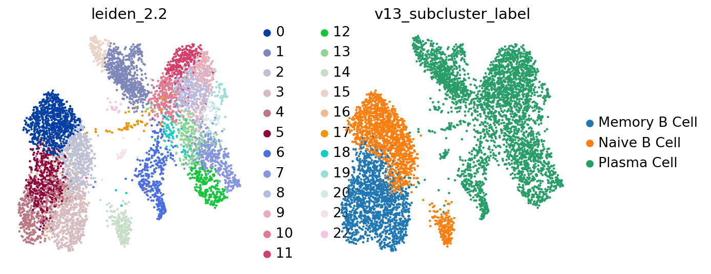

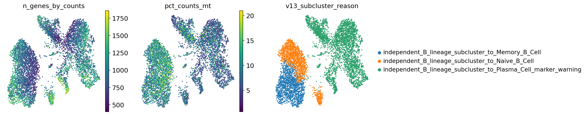

#### infection_study_04 T_NK_lineage subcluster UMAP

#### infection_study_04 Myeloid_lineage subcluster UMAP

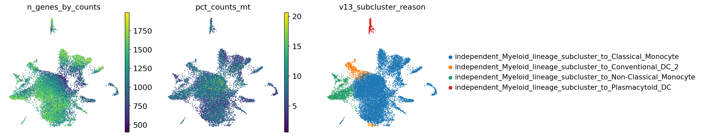

### vaccination_study_04

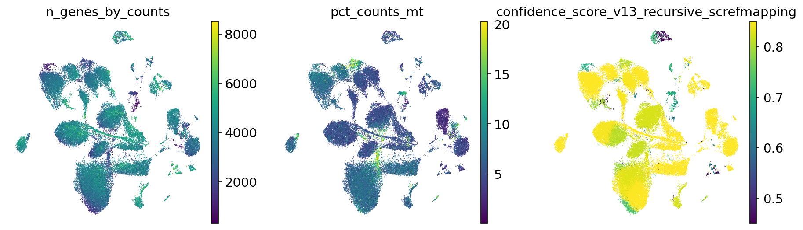

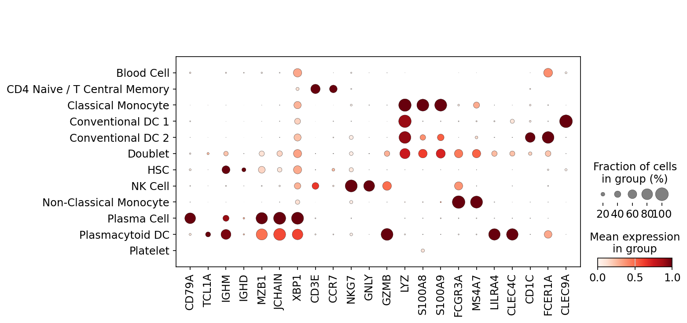

#### vaccination_study_04 B_lineage subcluster UMAP

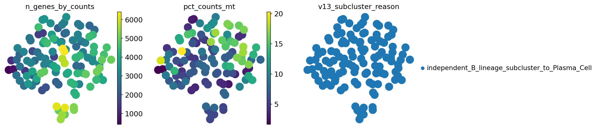

#### vaccination_study_04 T_NK_lineage subcluster UMAP

#### vaccination_study_04 Myeloid_lineage subcluster UMAP

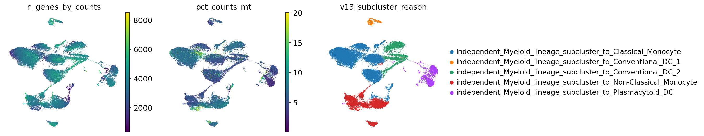

### vaccination_study_06

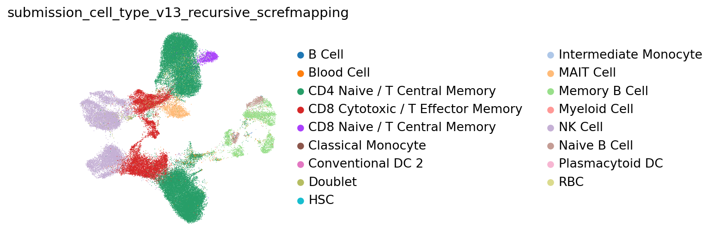

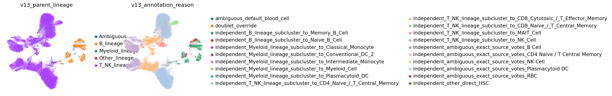

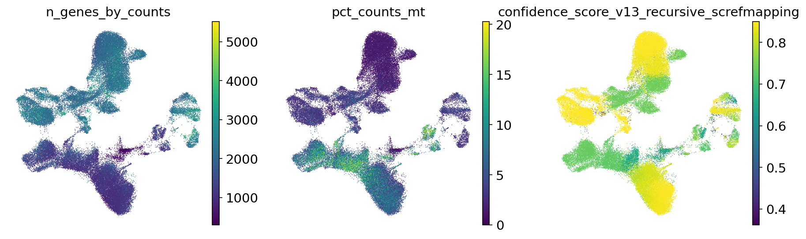

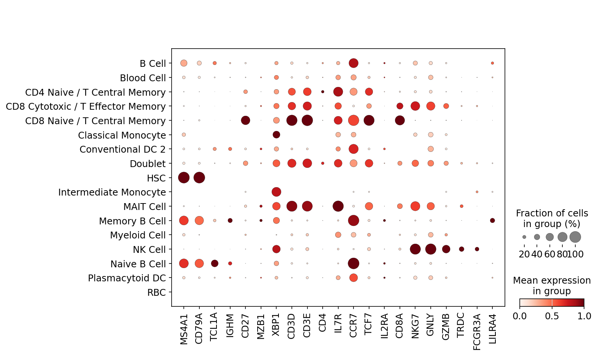

#### vaccination_study_06 B_lineage subcluster UMAP

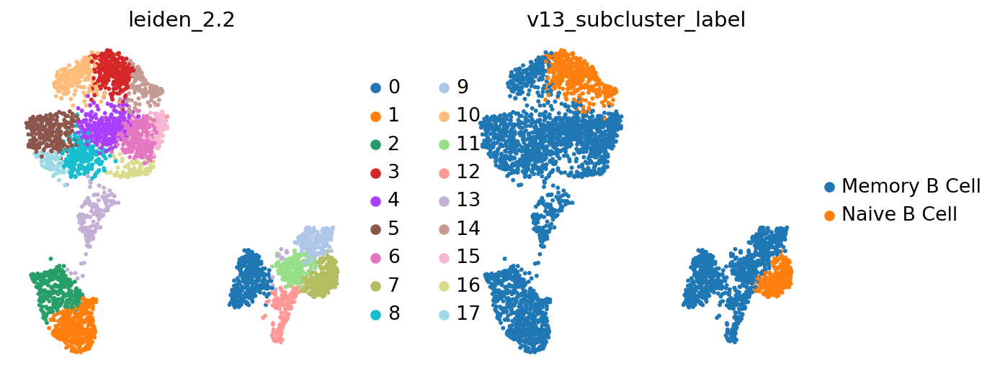

#### vaccination_study_06 T_NK_lineage subcluster UMAP

#### vaccination_study_06 Myeloid_lineage subcluster UMAP

### vaccination_study_09

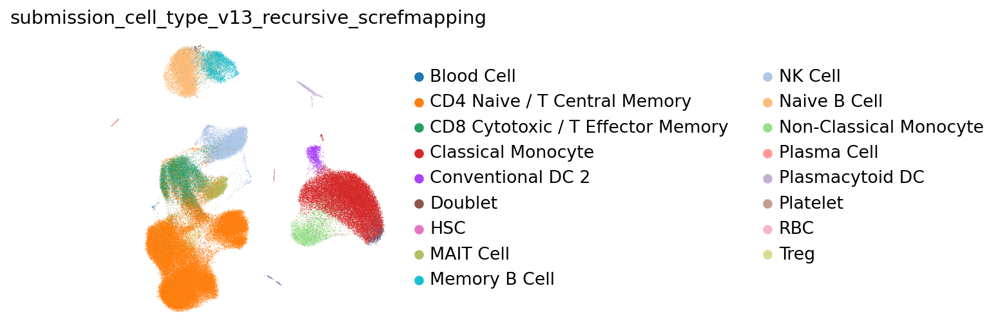

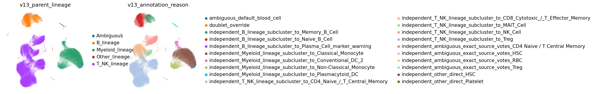

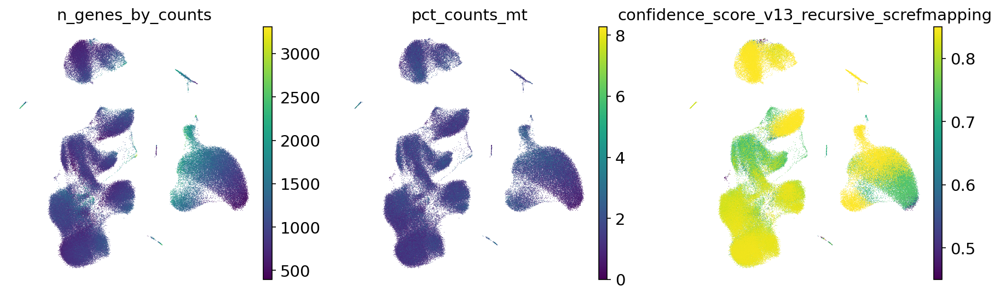

#### vaccination_study_09 B_lineage subcluster UMAP

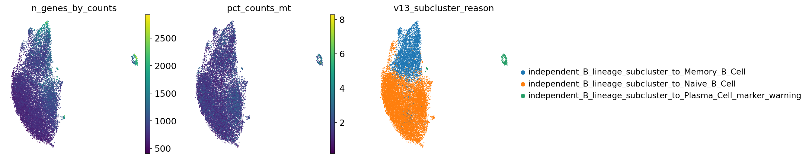

#### vaccination_study_09 T_NK_lineage subcluster UMAP

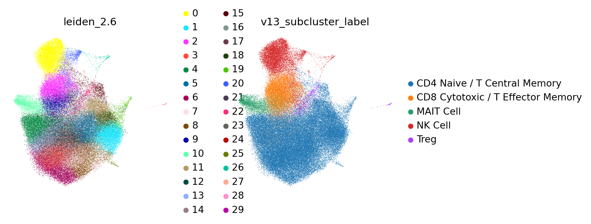

#### vaccination_study_09 Myeloid_lineage subcluster UMAP

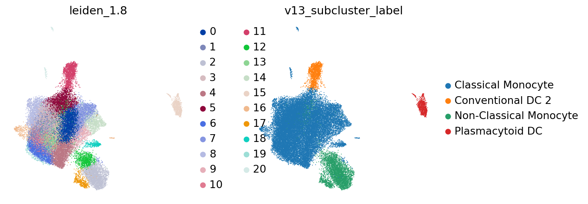

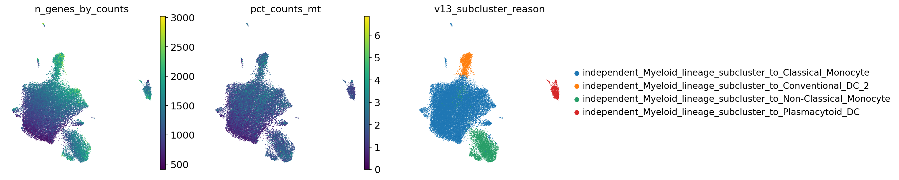

## Files

- Submission TSVs: `../submissions/`
- cellxgene H5ADs: `../cellxgene/`
- Subcluster evidence: `../tables/v13_lineage_subcluster_evidence.tsv.gz`
- Diagnostics tables: `../tables/`
