# infection_study_01 annotation review

Updated: 2026-06-02 EDT

## Dataset-specific assessment

infection_study_01 contains 54,924 cells and 33,538 portal genes. The residual parent/Blood Cell fraction is 0.3%, with 1,278 doublets and 1,864 low-confidence cells. No major marker-gene availability alert is apparent. The dataset can be interpreted as broadly PBMC-like. The dominant subcluster-supported labels are Classical Monocyte: 17,228 cells; CD8 Cytotoxic / T Effector Memory: 10,828 cells; NK Cell: 8,163 cells; Naive B Cell: 4,174 cells; CD4 Naive / T Central Memory: 4,134 cells; CD4 T Effector Memory: 2,303 cells. Among near-global sources, the strongest broad-lineage source is Azimuth PBMC L2 (broad concordance 97.2%), whereas Azimuth PBMC L3 shows the most disagreement (45.0%). Within the B/CD4T scope, screfmap covers 22.8% of cells and reaches 97.7% broad concordance. The v14 marker-registry audit tests marker evidence after broad-lineage, applicable-lineage, and key-marker gates, rather than allowing every marker set to compete in every cell. With a naive marker winner, rare/artifact labels such as Eosinophil (32,005 cells) and Platelet (2,375 cells) can dominate spuriously; after gating, they are reduced to Eosinophil 350 cells and Platelet 1,401 cells. This section is an evidence audit for acceptance thresholds and confidence caps, not a marker-only replacement of final labels. The highest post-gate unassigned fraction is in Other_lineage (3.7%).

## Methods

This report cross-checks the portal count-like gene space, CellTypist, Azimuth PBMC, Pan-human Azimuth, screfmap, marker scores, and lineage-specific subclustering for a single dataset. Tool concordance is a diagnostic measure of support/disagreement relative to the final annotation, not ground-truth accuracy.

## Input and QC

| cells | portal_genes | raw_count_source | count_like_fraction | available_marker_umap_genes | missing_marker_umap_genes | parent_or_blood_fraction | median_confidence | low_confidence_n | doublet_n |
| --- | --- | --- | --- | --- | --- | --- | --- | --- | --- |
| 54,924 | 33,538 | layers[counts] | 1.000 | 53 | none | 0.003 | 0.780 | 1,864 | 1,278 |

### QC and annotation UMAPs

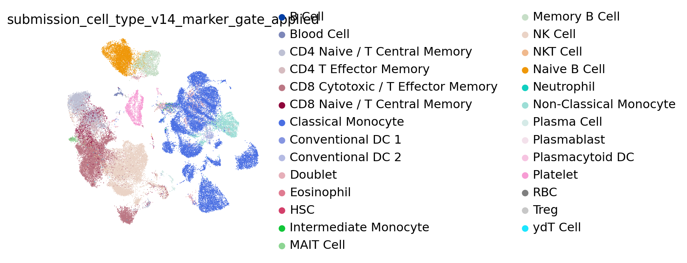

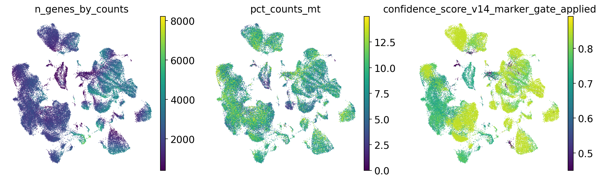

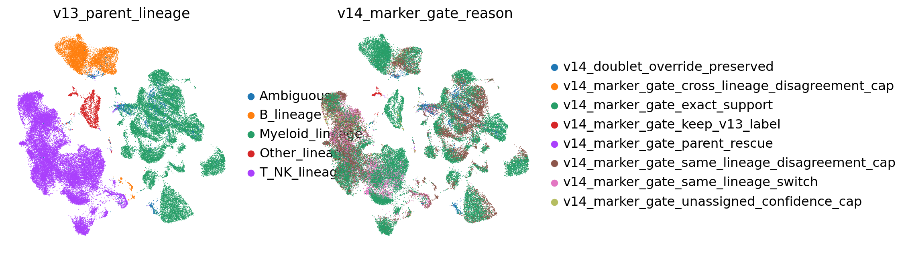

## Marker expression UMAPs

### lineage_core

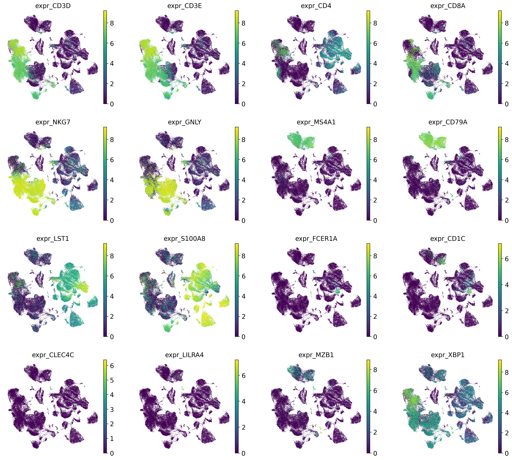

## Annotation source assessment

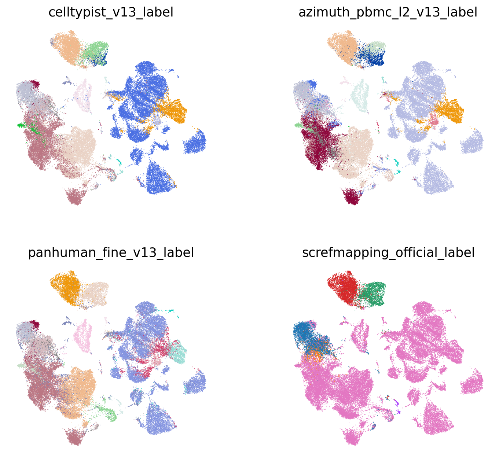

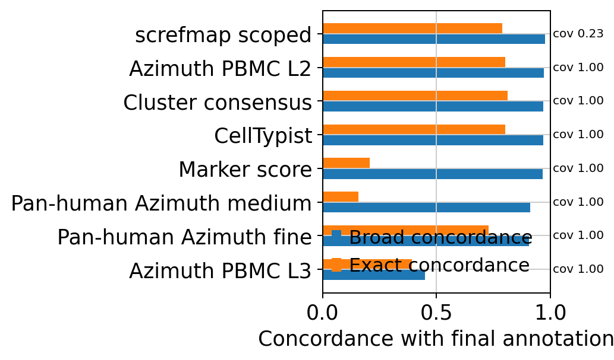

Because each source has a different scope, coverage and concordance should be interpreted separately. `exact_final_concordance` is exact final-label agreement, whereas `broad_final_concordance` is broad-lineage agreement. Marker score is a coarse marker-set direction, so exact agreement can be low for pairs such as `Monocyte` vs `Classical Monocyte` or `B Cell` vs `Memory B Cell`. screfmap is evaluated only within B/CD4T-scoped cells.

| tool | covered_n | coverage_fraction | exact_final_concordance | broad_final_concordance | top_supported_labels | top_disagreements |
| --- | --- | --- | --- | --- | --- | --- |
| CellTypist | 54,924 | 1.000 | 0.802 | 0.968 | Classical Monocyte: 17,334; CD8 Cytotoxic / T Effector Memory: 10,859; NK Cell: 8,294; Naive B Cell: 4,151; CD4 Naive / T Central Memory: 3,551 | NK Cell vs CD8 Cytotoxic / T Effector Memory: 1,846; CD4 Naive / T Central Memory vs CD4 T Effector Memory: 887; Doublet vs Classical Monocyte: 705; CD8 Naive / T Central Memory vs CD8 Cytotoxic / T Effector Memory: 637; Classical Monocyte vs Non-Classical Monocyte: 606 |
| Azimuth PBMC L2 | 54,924 | 1.000 | 0.801 | 0.972 | Classical Monocyte: 17,464; NK Cell: 8,590; CD8 Cytotoxic / T Effector Memory: 7,486; CD4 Naive / T Central Memory: 4,975; Naive B Cell: 4,042 | Memory B Cell vs B Cell: 1,136; CD8 Cytotoxic / T Effector Memory vs CD4 T Effector Memory: 959; CD4 T Effector Memory vs CD4 Naive / T Central Memory: 753; Doublet vs Classical Monocyte: 674; CD8 Cytotoxic / T Effector Memory vs ydT Cell: 581 |
| Azimuth PBMC L3 | 54,924 | 1.000 | 0.392 | 0.450 | Blood Cell: 29,371; Classical Monocyte: 17,469; Non-Classical Monocyte: 2,621; Platelet: 1,552; CD4 T Effector Memory: 1,046 | NK Cell vs Blood Cell: 8,847; CD8 Cytotoxic / T Effector Memory vs Blood Cell: 7,311; Naive B Cell vs Blood Cell: 4,165; CD4 Naive / T Central Memory vs Blood Cell: 3,175; Memory B Cell vs Blood Cell: 2,165 |
| Pan-human Azimuth fine | 54,924 | 1.000 | 0.728 | 0.907 | Classical Monocyte: 13,795; CD8 Cytotoxic / T Effector Memory: 9,701; NK Cell: 7,361; Blood Cell: 3,933; Naive B Cell: 3,693 | Classical Monocyte vs Blood Cell: 1,814; CD4 Naive / T Central Memory vs CD4 T Effector Memory: 1,578; NK Cell vs CD8 Cytotoxic / T Effector Memory: 1,236; Classical Monocyte vs Intermediate Monocyte: 1,013; Non-Classical Monocyte vs Intermediate Monocyte: 710 |
| Pan-human Azimuth medium | 54,924 | 1.000 | 0.156 | 0.910 | Monocyte: 17,204; T Cell: 16,536; NK Cell: 7,365; B Cell: 6,553; Blood Cell: 3,601 | Classical Monocyte vs Monocyte: 14,387; CD8 Cytotoxic / T Effector Memory vs T Cell: 7,963; Naive B Cell vs B Cell: 4,102; CD4 Naive / T Central Memory vs T Cell: 3,981; Memory B Cell vs B Cell: 2,149 |
| Cluster consensus | 54,924 | 1.000 | 0.813 | 0.969 | Classical Monocyte: 18,521; NK Cell: 9,776; CD8 Cytotoxic / T Effector Memory: 8,004; CD4 T Effector Memory: 4,181; Naive B Cell: 4,014 | Memory B Cell vs B Cell: 2,115; CD4 Naive / T Central Memory vs CD4 T Effector Memory: 1,576; Doublet vs Classical Monocyte: 948; CD8 Naive / T Central Memory vs CD4 T Effector Memory: 775; CD8 Cytotoxic / T Effector Memory vs MAIT Cell: 560 |
| Marker score | 54,924 | 1.000 | 0.208 | 0.966 | Monocyte: 19,593; NK Cell: 10,947; B Cell: 6,446; CD8 T Cell (ab): 6,284; CD4 T Cell (ab): 4,895 | Classical Monocyte vs Monocyte: 16,854; CD8 Cytotoxic / T Effector Memory vs CD8 T Cell (ab): 5,002; Naive B Cell vs B Cell: 4,103; CD4 Naive / T Central Memory vs CD4 T Cell (ab): 2,858; Memory B Cell vs B Cell: 2,157 |
| screfmap scoped | 12,525 | 0.228 | 0.788 | 0.977 | CD4 Naive / T Central Memory: 4,753; Naive B Cell: 4,145; Memory B Cell: 2,382; CD4 T Effector Memory: 847; Treg: 262 | CD4 T Effector Memory vs CD4 Naive / T Central Memory: 689; CD8 Naive / T Central Memory vs CD4 Naive / T Central Memory: 269; CD8 Cytotoxic / T Effector Memory vs CD4 Naive / T Central Memory: 237; Naive B Cell vs Memory B Cell: 208; CD4 Naive / T Central Memory vs CD4 T Effector Memory: 203 |

### Lineage-scoped source support

This table stratifies cells by final broad lineage and asks whether each source supports the same broad lineage or exact fine label within that scope. It is a diagnostic for where each source helps or fails, not a ground-truth accuracy estimate.

| final_broad_lineage | tool | covered_n | exact_final_concordance | broad_final_concordance |
| --- | --- | --- | --- | --- |
| B | CellTypist | 6,509 | 0.857 | 0.988 |
| B | Azimuth PBMC L2 | 6,509 | 0.742 | 0.991 |
| B | Azimuth PBMC L3 | 6,509 | 0.013 | 0.020 |
| B | Pan-human Azimuth fine | 6,509 | 0.896 | 0.984 |
| B | Pan-human Azimuth medium | 6,509 | 0.000 | 0.984 |
| B | Cluster consensus | 6,509 | 0.620 | 0.984 |
| B | Marker score | 6,509 | 0.025 | 0.988 |
| B | screfmap scoped | 6,502 | 0.940 | 0.998 |
| T/NK | CellTypist | 25,685 | 0.711 | 0.992 |
| T/NK | Azimuth PBMC L2 | 25,685 | 0.724 | 0.993 |
| T/NK | Azimuth PBMC L3 | 25,685 | 0.049 | 0.128 |
| T/NK | Pan-human Azimuth fine | 25,685 | 0.678 | 0.922 |
| T/NK | Pan-human Azimuth medium | 25,685 | 0.279 | 0.926 |
| T/NK | Cluster consensus | 25,685 | 0.781 | 0.990 |
| T/NK | Marker score | 25,685 | 0.352 | 0.983 |
| T/NK | screfmap scoped | 5,750 | 0.654 | 0.999 |
| Myeloid/DC | CellTypist | 19,898 | 0.945 | 0.996 |
| Myeloid/DC | Azimuth PBMC L2 | 19,898 | 0.963 | 0.997 |
| Myeloid/DC | Azimuth PBMC L3 | 19,898 | 0.943 | 0.974 |
| Myeloid/DC | Pan-human Azimuth fine | 19,898 | 0.764 | 0.898 |

## v14 marker registry gate audit

The v14 marker-registry audit tests marker evidence after broad-lineage, applicable-lineage, and key-marker gates, rather than allowing every marker set to compete in every cell. With a naive marker winner, rare/artifact labels such as Eosinophil (32,005 cells) and Platelet (2,375 cells) can dominate spuriously; after gating, they are reduced to Eosinophil 350 cells and Platelet 1,401 cells. This section is an evidence audit for acceptance thresholds and confidence caps, not a marker-only replacement of final labels. The highest post-gate unassigned fraction is in Other_lineage (3.7%).

`Ungated` allows marker sets to compete across all cells, whereas `gated` restricts candidates by broad lineage and key-marker support. This section diagnoses the current final annotation and informs confidence caps or review alerts for the next annotation engine.

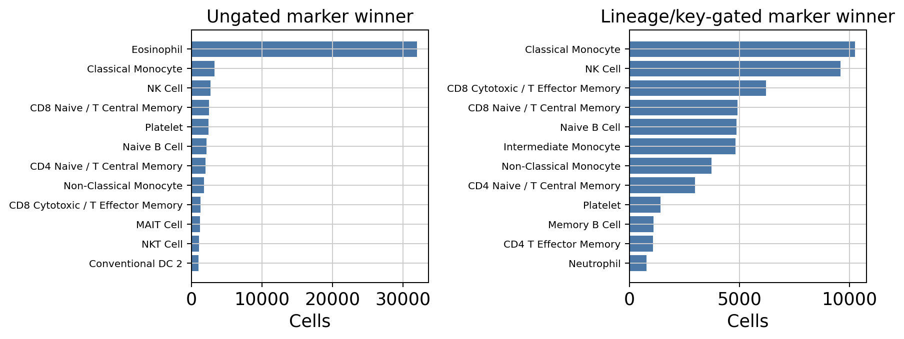

### Gate effect on marker winners

| label | ungated_n | gated_n | delta_after_gate |
| --- | --- | --- | --- |
| Basophil | 0 | 0 | 0 |
| CD4 Naive / T Central Memory | 2,005 | 2,976 | 971 |
| CD8 Cytotoxic / T Effector Memory | 1,285 | 6,203 | 4,918 |
| CD8 Naive / T Central Memory | 2,443 | 4,905 | 2,462 |
| Classical Monocyte | 3,262 | 10,248 | 6,986 |
| Eosinophil | 32,005 | 350 | -31,655 |
| HSC | 4 | 15 | 11 |
| Intermediate Monocyte | 404 | 4,824 | 4,420 |
| MAIT Cell | 1,163 | 101 | -1,062 |
| Mast Cell | 0 | 0 | 0 |
| Memory B Cell | 47 | 1,091 | 1,044 |
| NK Cell | 2,669 | 9,596 | 6,927 |
| Naive B Cell | 2,086 | 4,855 | 2,769 |
| Non-Classical Monocyte | 1,760 | 3,737 | 1,977 |
| Platelet | 2,375 | 1,401 | -974 |
| RBC | 416 | 230 | -186 |
| Unassigned | 0 | 746 | 746 |

### Gated marker labels by audit lineage

| audit_lineage_gate | n_cells | unassigned_n | unassigned_fraction | top_gated_marker_labels |
| --- | --- | --- | --- | --- |
| Ambiguous | 1,314 | 1 | 0.001 | Classical Monocyte: 212; NK Cell: 206; Intermediate Monocyte: 132; Naive B Cell: 118; Platelet: 111 |
| B_lineage | 6,508 | 86 | 0.013 | Naive B Cell: 4,737; Memory B Cell: 1,058; Plasmablast: 587; Unassigned: 86; Plasma Cell: 40 |
| Myeloid_lineage | 19,897 | 24 | 0.001 | Classical Monocyte: 10,036; Intermediate Monocyte: 4,692; Non-Classical Monocyte: 3,636; Neutrophil: 743; Conventional DC 2: 354 |
| Other_lineage | 1,521 | 57 | 0.037 | Platelet: 1,290; RBC: 162; Unassigned: 57; HSC: 12 |
| T_NK_lineage | 25,684 | 578 | 0.023 | NK Cell: 9,390; CD8 Cytotoxic / T Effector Memory: 6,114; CD8 Naive / T Central Memory: 4,851; CD4 Naive / T Central Memory: 2,907; CD4 T Effector Memory: 1,036 |

### Marker support by final label

| final_label | n_cells | marker_exact_fraction | marker_exact_fraction_gated | unassigned_fraction_gated | top_marker_best_labels_gated |
| --- | --- | --- | --- | --- | --- |
| Classical Monocyte | 17,228 | 0.180 | 0.582 | 0.001 | Classical Monocyte:10026; Intermediate Monocyte:4513; Non-Classical Monocyte:1524; Neutrophil:740; Eosinophil:338 |
| CD8 Cytotoxic / T Effector Memory | 10,828 | 0.102 | 0.487 | 0.010 | CD8 Cytotoxic / T Effector Memory:5268; NK Cell:2281; CD8 Naive / T Central Memory:1849; CD4 T Effector Memory:564; CD4 Naive / T Central Memory:253 |
| NK Cell | 8,164 | 0.255 | 0.867 | 0.009 | NK Cell:7076; CD8 Cytotoxic / T Effector Memory:558; CD8 Naive / T Central Memory:198; NKT Cell:96; Unassigned:76 |
| Naive B Cell | 4,174 | 0.470 | 0.964 | 0.005 | Naive B Cell:4024; Plasmablast:66; Memory B Cell:60; Unassigned:21; Plasma Cell:3 |
| CD4 Naive / T Central Memory | 4,134 | 0.348 | 0.471 | 0.053 | CD4 Naive / T Central Memory:1946; CD8 Naive / T Central Memory:1758; Unassigned:220; CD4 T Effector Memory:105; CD8 Cytotoxic / T Effector Memory:53 |
| CD4 T Effector Memory | 2,303 | 0.044 | 0.117 | 0.078 | CD8 Naive / T Central Memory:998; CD4 Naive / T Central Memory:640; CD4 T Effector Memory:269; Unassigned:179; CD8 Cytotoxic / T Effector Memory:142 |
| Memory B Cell | 2,166 | 0.016 | 0.460 | 0.030 | Memory B Cell:997; Naive B Cell:712; Plasmablast:375; Unassigned:65; Plasma Cell:17 |
| Non-Classical Monocyte | 2,124 | 0.699 | 0.984 | 0.000 | Non-Classical Monocyte:2089; Intermediate Monocyte:23; Classical Monocyte:9; Neutrophil:2; Eosinophil:1 |
| Platelet | 1,370 | 0.780 | 0.949 | 0.039 | Platelet:1300; Unassigned:53; RBC:15; Classical Monocyte:1; CD8 Naive / T Central Memory:1 |
| Doublet | 1,278 | 0.000 | 0.000 | 0.001 | Classical Monocyte:211; NK Cell:206; Intermediate Monocyte:131; Naive B Cell:116; Non-Classical Monocyte:101 |
| Conventional DC 2 | 429 | 0.072 | 0.641 | 0.000 | Conventional DC 2:275; Intermediate Monocyte:126; Non-Classical Monocyte:18; Plasmacytoid DC:8; Eosinophil:1 |
| MAIT Cell | 256 | 0.180 | 0.148 | 0.000 | CD8 Cytotoxic / T Effector Memory:93; CD4 T Effector Memory:49; CD8 Naive / T Central Memory:48; MAIT Cell:38; NKT Cell:21 |
| Plasma Cell | 168 | 0.006 | 0.119 | 0.000 | Plasmablast:146; Plasma Cell:20; Memory B Cell:1; Naive B Cell:1 |
| Blood Cell | 166 | 0.000 | 0.000 | 0.000 | RBC:150; Neutrophil:2; Plasmablast:2; Platelet:2; Conventional DC 2:2 |

## Lineage-specific subclustering

### B_lineage

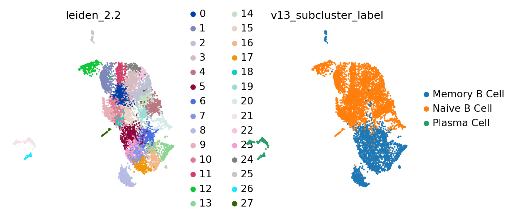

Lineage-restricted marker expression UMAP. This is placed here because fine-label decisions are made within the lineage/subcluster context.

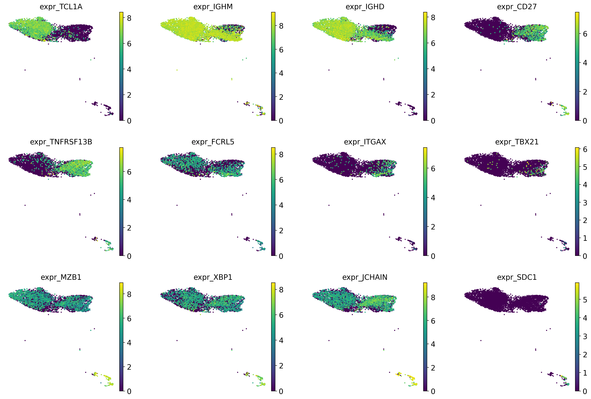

| cluster | n_cells | chosen_label | accepted | score_margin | calibrated_cluster_confidence | marker_availability_alert | top_celltypist | top_panhuman_fine | top_marker | top_screfmapping |
| --- | --- | --- | --- | --- | --- | --- | --- | --- | --- | --- |
| 0 | 475 | Naive B Cell | True | 4.230 | 0.850 | pass | Naive B Cell:473; Memory B Cell:2 | Naive B Cell:450; Memory B Cell:21; Blood Cell:4 | B Cell:475 | Naive B Cell:473; Plasma Cell:2 |
| 1 | 434 | Naive B Cell | True | 4.195 | 0.850 | pass | Naive B Cell:422; Blood Cell:10; B Cell:1; Memory B Cell:1 | Naive B Cell:427; Memory B Cell:5; Blood Cell:2 | B Cell:434 | Naive B Cell:431; Plasma Cell:2; Memory B Cell:1 |
| 2 | 402 | Naive B Cell | True | 4.192 | 0.850 | pass | Naive B Cell:394; Memory B Cell:8 | Naive B Cell:373; Memory B Cell:27; Blood Cell:2 | B Cell:402 | Naive B Cell:394; Memory B Cell:8 |
| 3 | 372 | Naive B Cell | True | 3.966 | 0.850 | pass | Naive B Cell:358; Memory B Cell:12; B Cell:2 | Naive B Cell:310; Memory B Cell:52; Blood Cell:10 | B Cell:372 | Naive B Cell:356; Memory B Cell:16 |
| 4 | 365 | Naive B Cell | True | 4.264 | 0.850 | pass | Naive B Cell:363; Memory B Cell:2 | Naive B Cell:323; Memory B Cell:35; Blood Cell:7 | B Cell:365 | Naive B Cell:364; Memory B Cell:1 |
| 5 | 360 | Memory B Cell | True | 2.762 | 0.818 | pass | Memory B Cell:315; Naive B Cell:41; B Cell:4 | Memory B Cell:342; Naive B Cell:15; Blood Cell:3 | B Cell:359; Plasma Cell:1 | Memory B Cell:322; Naive B Cell:37; Plasma Cell:1 |
| 6 | 351 | Memory B Cell | True | 3.403 | 0.828 | pass | Memory B Cell:334; Naive B Cell:13; B Cell:4 | Memory B Cell:350; Naive B Cell:1 | B Cell:350; Non-Classical Monocyte:1 | Memory B Cell:343; Naive B Cell:8 |
| 7 | 302 | Memory B Cell | True | 3.957 | 0.848 | pass | Memory B Cell:298; B Cell:3; Naive B Cell:1 | Memory B Cell:302 | B Cell:301; RBC:1 | Memory B Cell:302 |
| 8 | 296 | Memory B Cell | True | 3.229 | 0.850 | pass | Memory B Cell:173; B Cell:83; Naive B Cell:39; Blood Cell:1 | Memory B Cell:285; Naive B Cell:9; Blood Cell:2 | B Cell:296 | Memory B Cell:276; Naive B Cell:20 |
| 9 | 281 | Naive B Cell | True | 4.368 | 0.850 | pass | Naive B Cell:277; Blood Cell:2; Memory B Cell:2 | Naive B Cell:266; Memory B Cell:10; Blood Cell:5 | B Cell:281 | Naive B Cell:278; Memory B Cell:3 |

### T_NK_lineage

Lineage-restricted marker expression UMAP. This is placed here because fine-label decisions are made within the lineage/subcluster context.

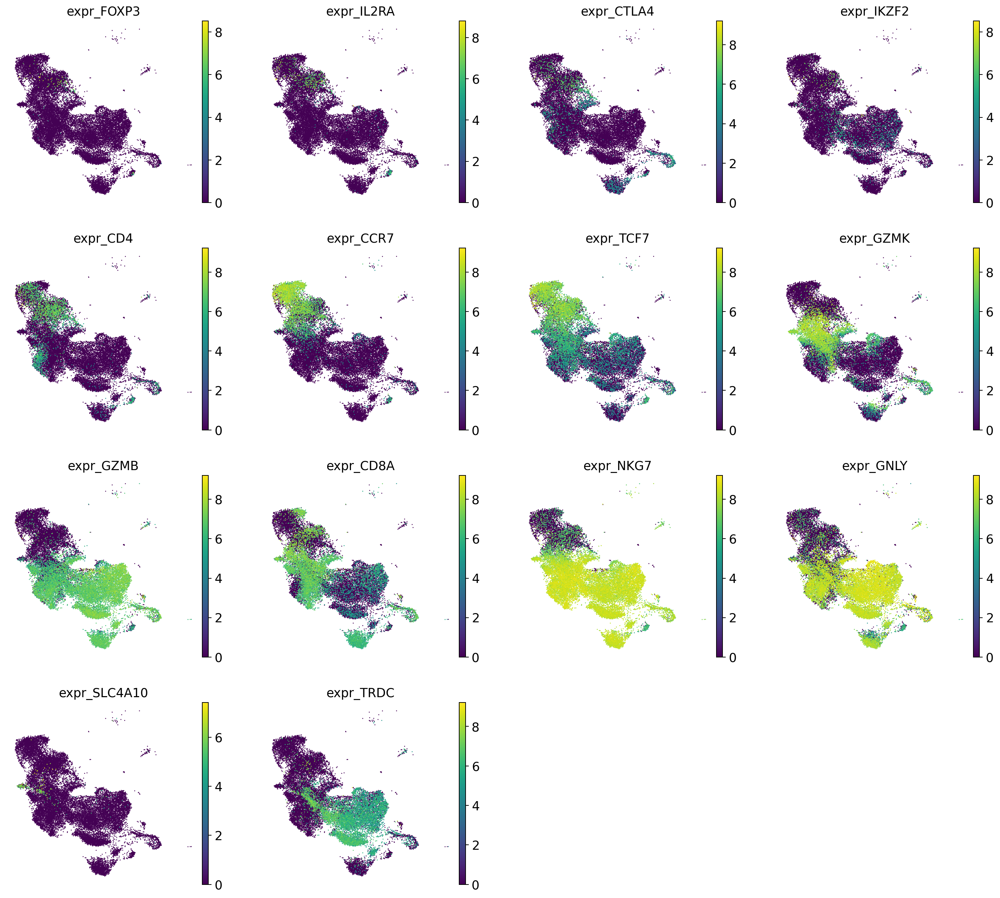

| cluster | n_cells | chosen_label | accepted | score_margin | calibrated_cluster_confidence | marker_availability_alert | top_celltypist | top_panhuman_fine | top_marker | top_screfmapping |
| --- | --- | --- | --- | --- | --- | --- | --- | --- | --- | --- |
| 0 | 1,634 | CD4 Naive / T Central Memory | True | 2.985 | 0.850 | pass | CD4 Naive / T Central Memory:1336; CD8 Naive / T Central Memory:268; Treg:15; CD8 Cytotoxic / T Effector Memory:10; CD4 T Effector Memory:3 | CD4 Naive / T Central Memory:1188; CD8 Naive / T Central Memory:321; CD4 T Effector Memory:59; Blood Cell:35; Treg:22 | CD4 T Cell (ab):1058; T Cell:514; CD8 T Cell (ab):50; Monocyte:5; RBC:4 | CD4 Naive / T Central Memory:1397; not_available:205; Treg:27; CD4 T Effector Memory:5 |
| 1 | 1,571 | NK Cell | True | 1.124 | 0.850 | pass | NK Cell:1087; CD8 Cytotoxic / T Effector Memory:480; ydT Cell:3; Blood Cell:1 | NK Cell:786; CD8 Cytotoxic / T Effector Memory:630; Blood Cell:152; Lymphoid Cell:2; ydT Cell:1 | NK Cell:1487; CD8 T Cell (ab):67; T Cell:17 | not_available:1571 |
| 2 | 1,342 | NK Cell | True | 1.553 | 0.850 | pass | NK Cell:828; CD8 Cytotoxic / T Effector Memory:510; ydT Cell:4 | NK Cell:1149; CD8 Cytotoxic / T Effector Memory:116; Blood Cell:76; Lymphoid Cell:1 | NK Cell:1332; CD8 T Cell (ab):8; RBC:1; T Cell:1 | not_available:1342 |
| 3 | 1,327 | CD4 Naive / T Central Memory | True | 0.028 | 0.680 | pass | CD4 T Effector Memory:826; CD4 Naive / T Central Memory:360; CD8 Cytotoxic / T Effector Memory:63; CD8 Naive / T Central Memory:29; NK Cell:19 | CD4 T Effector Memory:1181; Blood Cell:43; CD8 Cytotoxic / T Effector Memory:37; Treg:37; CD8 Naive / T Central Memory:15 | CD4 T Cell (ab):1065; T Cell:205; CD8 T Cell (ab):35; NK Cell:15; DC:3 | CD4 Naive / T Central Memory:943; not_available:229; CD4 T Effector Memory:146; Treg:9 |
| 4 | 1,327 | CD8 Cytotoxic / T Effector Memory | True | 2.272 | 0.740 | pass | CD8 Cytotoxic / T Effector Memory:1308; NK Cell:18; Treg:1 | CD8 Cytotoxic / T Effector Memory:1286; NK Cell:24; Blood Cell:12; Lymphoid Cell:3; Treg:1 | CD8 T Cell (ab):942; NK Cell:324; T Cell:45; Monocyte:9; CD4 T Cell (ab):6 | not_available:1326; CD4 T Effector Memory:1 |
| 5 | 1,175 | CD8 Cytotoxic / T Effector Memory | True | 2.141 | 0.737 | pass | CD8 Cytotoxic / T Effector Memory:1129; NK Cell:39; CD4 Naive / T Central Memory:5; ydT Cell:1; T Cell:1 | CD8 Cytotoxic / T Effector Memory:1159; Blood Cell:6; NK Cell:5; CD4 T Effector Memory:3; MAIT Cell:1 | CD8 T Cell (ab):627; NK Cell:300; T Cell:222; CD4 T Cell (ab):26 | not_available:1172; CD4 T Effector Memory:2; CD4 Naive / T Central Memory:1 |
| 6 | 1,000 | CD8 Cytotoxic / T Effector Memory | True | 1.817 | 0.722 | pass | CD8 Cytotoxic / T Effector Memory:854; NK Cell:96; ydT Cell:24; MAIT Cell:21; Memory B Cell:2 | CD8 Cytotoxic / T Effector Memory:876; Blood Cell:56; NK Cell:22; ydT Cell:20; MAIT Cell:19 | CD8 T Cell (ab):592; NK Cell:234; T Cell:139; CD4 T Cell (ab):35 | not_available:986; CD4 T Effector Memory:13; CD4 Naive / T Central Memory:1 |
| 7 | 999 | NK Cell | True | 2.646 | 0.850 | pass | NK Cell:997; CD8 Cytotoxic / T Effector Memory:2 | NK Cell:979; Blood Cell:15; CD8 Cytotoxic / T Effector Memory:4; Lymphoid Cell:1 | NK Cell:999 | not_available:999 |
| 8 | 901 | CD8 Cytotoxic / T Effector Memory | True | 1.405 | 0.725 | pass | CD8 Cytotoxic / T Effector Memory:661; NK Cell:178; ydT Cell:41; MAIT Cell:12; CD4 Naive / T Central Memory:5 | CD8 Cytotoxic / T Effector Memory:670; NK Cell:138; Blood Cell:55; MAIT Cell:32; ydT Cell:2 | CD8 T Cell (ab):407; NK Cell:356; T Cell:103; CD4 T Cell (ab):34; RBC:1 | not_available:889; CD4 T Effector Memory:12 |
| 9 | 880 | CD8 Cytotoxic / T Effector Memory | True | 0.204 | 0.658 | pass | CD8 Cytotoxic / T Effector Memory:512; NK Cell:350; ydT Cell:5; CD4 Naive / T Central Memory:5; CD4 T Effector Memory:4 | CD8 Cytotoxic / T Effector Memory:465; NK Cell:314; Blood Cell:93; CD4 T Effector Memory:4; MAIT Cell:2 | NK Cell:499; CD8 T Cell (ab):200; T Cell:144; CD4 T Cell (ab):33; Monocyte:3 | not_available:866; CD4 Naive / T Central Memory:8; CD4 T Effector Memory:6 |

### Myeloid_lineage

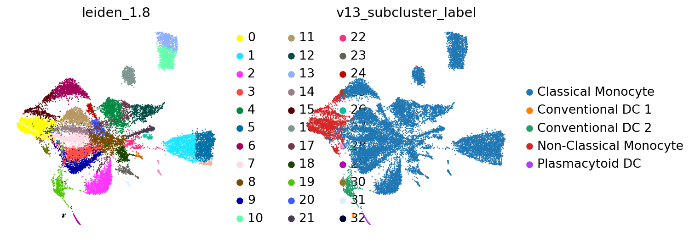

Lineage-restricted marker expression UMAP. This is placed here because fine-label decisions are made within the lineage/subcluster context.

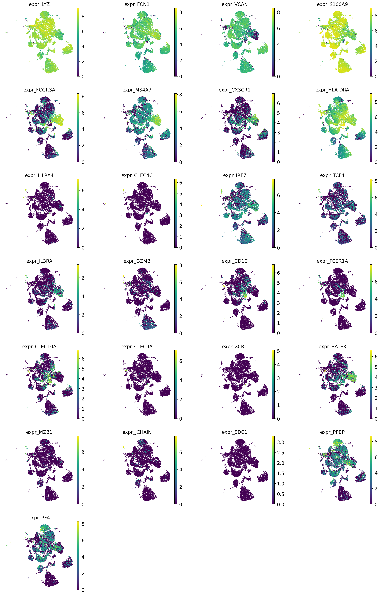

| cluster | n_cells | chosen_label | accepted | score_margin | calibrated_cluster_confidence | marker_availability_alert | top_celltypist | top_panhuman_fine | top_marker | top_screfmapping |
| --- | --- | --- | --- | --- | --- | --- | --- | --- | --- | --- |
| 0 | 1,455 | Non-Classical Monocyte | True | 1.846 | 0.850 | pass | Non-Classical Monocyte:1413; Classical Monocyte:41; Blood Cell:1 | Non-Classical Monocyte:1067; Intermediate Monocyte:327; Blood Cell:53; Classical Monocyte:5; Conventional DC 2:3 | Monocyte:885; Non-Classical Monocyte:569; RBC:1 | not_available:1455 |
| 1 | 1,411 | Classical Monocyte | True | 2.790 | 0.850 | pass | Classical Monocyte:1393; Non-Classical Monocyte:17; Blood Cell:1 | Classical Monocyte:1264; Blood Cell:103; Neutrophil:26; Intermediate Monocyte:12; Conventional DC 2:5 | Monocyte:1409; RBC:1; Non-Classical Monocyte:1 | not_available:1411 |
| 2 | 1,354 | Classical Monocyte | True | 2.247 | 0.848 | pass | Classical Monocyte:1293; Non-Classical Monocyte:61 | Classical Monocyte:979; Intermediate Monocyte:292; Blood Cell:61; Conventional DC 2:18; Non-Classical Monocyte:3 | Monocyte:1353; DC:1 | not_available:1354 |
| 3 | 1,295 | Classical Monocyte | True | 2.450 | 0.840 | pass | Classical Monocyte:1257; Non-Classical Monocyte:35; Blood Cell:2; Conventional DC 2:1 | Classical Monocyte:1084; Blood Cell:100; Conventional DC 2:56; Intermediate Monocyte:53; Non-Classical Monocyte:2 | Monocyte:1291; DC:3; Non-Classical Monocyte:1 | not_available:1295 |
| 4 | 1,199 | Classical Monocyte | True | 2.677 | 0.850 | pass | Classical Monocyte:1190; Non-Classical Monocyte:9 | Classical Monocyte:986; Blood Cell:162; Neutrophil:27; Intermediate Monocyte:12; Non-Classical Monocyte:7 | Monocyte:1196; Platelet:3 | not_available:1199 |
| 5 | 1,196 | Classical Monocyte | True | 2.766 | 0.850 | pass | Classical Monocyte:1194; Blood Cell:1; Non-Classical Monocyte:1 | Classical Monocyte:1168; Blood Cell:25; Intermediate Monocyte:1; Conventional DC 2:1; Neutrophil:1 | Monocyte:1196 | not_available:1196 |
| 6 | 1,187 | Classical Monocyte | True | 2.465 | 0.846 | pass | Classical Monocyte:1171; Non-Classical Monocyte:15; Conventional DC 2:1 | Classical Monocyte:960; Blood Cell:105; Intermediate Monocyte:59; Conventional DC 2:57; Plasmacytoid DC:6 | Monocyte:1185; DC:1; Non-Classical Monocyte:1 | not_available:1187 |
| 7 | 949 | Classical Monocyte | True | 2.283 | 0.836 | pass | Classical Monocyte:868; Non-Classical Monocyte:80; Conventional DC 2:1 | Classical Monocyte:597; Blood Cell:120; Conventional DC 2:113; Intermediate Monocyte:112; Plasmacytoid DC:5 | Monocyte:949 | not_available:949 |
| 8 | 919 | Classical Monocyte | True | 2.670 | 0.845 | pass | Classical Monocyte:915; Blood Cell:2; Non-Classical Monocyte:2 | Classical Monocyte:773; Blood Cell:124; Neutrophil:9; Conventional DC 2:8; Intermediate Monocyte:5 | Monocyte:915; RBC:2; Plasma Cell:1; Non-Classical Monocyte:1 | not_available:919 |
| 9 | 894 | Classical Monocyte | True | 2.358 | 0.836 | pass | Classical Monocyte:814; Non-Classical Monocyte:72; Blood Cell:6; Conventional DC 2:2 | Classical Monocyte:698; Blood Cell:87; Intermediate Monocyte:74; Conventional DC 2:29; Non-Classical Monocyte:6 | Monocyte:893; DC:1 | not_available:894 |

## Interpretation and caveats

This is not a ground-truth accuracy estimate; it is a consistency review across annotation sources, marker evidence, and subcluster structure. Disagreement for Azimuth PBMC L3 may reflect ontology granularity, gene availability, or dataset enrichment.

## Files

- Submission TSV: `submissions/infection_study_01_annotation.tsv`
- cellxgene H5AD: `cellxgene/infection_study_01.final_v14_marker_gate_applied.cxg.h5ad`
- Report context JSON: `report_context.json`
- Tool support TSV: `tool_support_summary.tsv`
