# infection_study_04 annotation review

Updated: 2026-06-02 EDT

## Dataset-specific assessment

infection_study_04 は 43,767 cells / 26,361 portal genes の dataset です。親ラベルまたは Blood Cell に残った割合は 1.1%、doublet は 132 cells、低 confidence は 868 cells でした。注意すべき marker gene 欠損は Plasma_ASC(warning: JCHAIN) です。 B lineage と plasma/ASC signal が見える一方で、JCHAIN 欠損のため ASC 判定は慎重に読む必要があります。 subcluster evidence では Classical Monocyte: 11,107 cells; CD4 Naive / T Central Memory: 10,392 cells; NK Cell: 7,599 cells; CD8 Cytotoxic / T Effector Memory: 5,277 cells; Plasma Cell: 3,256 cells; Naive B Cell: 1,541 cells が主要な構造です。全細胞に近い coverage で最も broad lineage に沿った source は Azimuth PBMC L2 (broad concordance 96.0%) で、相対的に不一致が目立つ source は Azimuth PBMC L3 (45.0%) です。 screfmap は適用範囲を B/CD4T に限定すると coverage 33.5%、broad concordance 96.4% でした。 v14 marker registry audit は、marker gene list をそのまま全細胞で競わせるのではなく、broad lineage、applicable lineage、key-marker support の順に制限した場合に marker evidence がどう変わるかを見る診断です。単純 winner では Eosinophil 32,796 cells、Platelet 289 cells のような rare/artifact label が出やすい一方、gate 後は Eosinophil 359 cells、Platelet 173 cells に抑制されます。これは final label を marker score だけで置き換えるためではなく、fine label を受け入れる条件と confidence cap を決めるための evidence audit です。 最も gate 後の未割当が多い lineage は Other_lineage (29.0%) です。

## Methods

この report は、portal input の raw/count-like gene space、CellTypist、Azimuth PBMC、Pan-human Azimuth、screfmap、marker score、lineage-specific subclustering を dataset 単位で照合したものです。ここでの tool concordance は ground truth accuracy ではなく、最終 annotation に対する support/disagreement の診断指標です。

## Input and QC

| cells | portal_genes | raw_count_source | count_like_fraction | available_marker_umap_genes | missing_marker_umap_genes | parent_or_blood_fraction | median_confidence | low_confidence_n | doublet_n |
| --- | --- | --- | --- | --- | --- | --- | --- | --- | --- |
| 43,767 | 26,361 | layers[counts] | 1.000 | 52 | JCHAIN | 0.011 | 0.774 | 868 | 132 |

### Marker gene availability alerts

| marker_set | n_genes_present | n_genes_expected | alert_level | missing_critical_markers |
| --- | --- | --- | --- | --- |
| Plasma_ASC | 8 | 9 | warning | JCHAIN |

### QC and annotation UMAPs

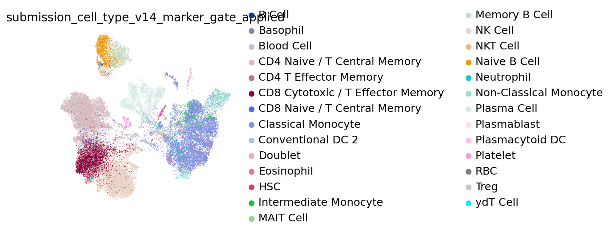

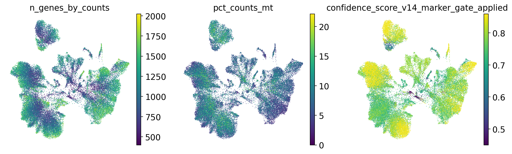

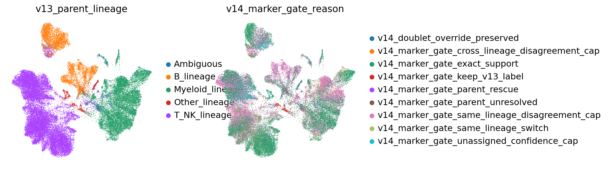

## Marker expression UMAPs

### lineage_core

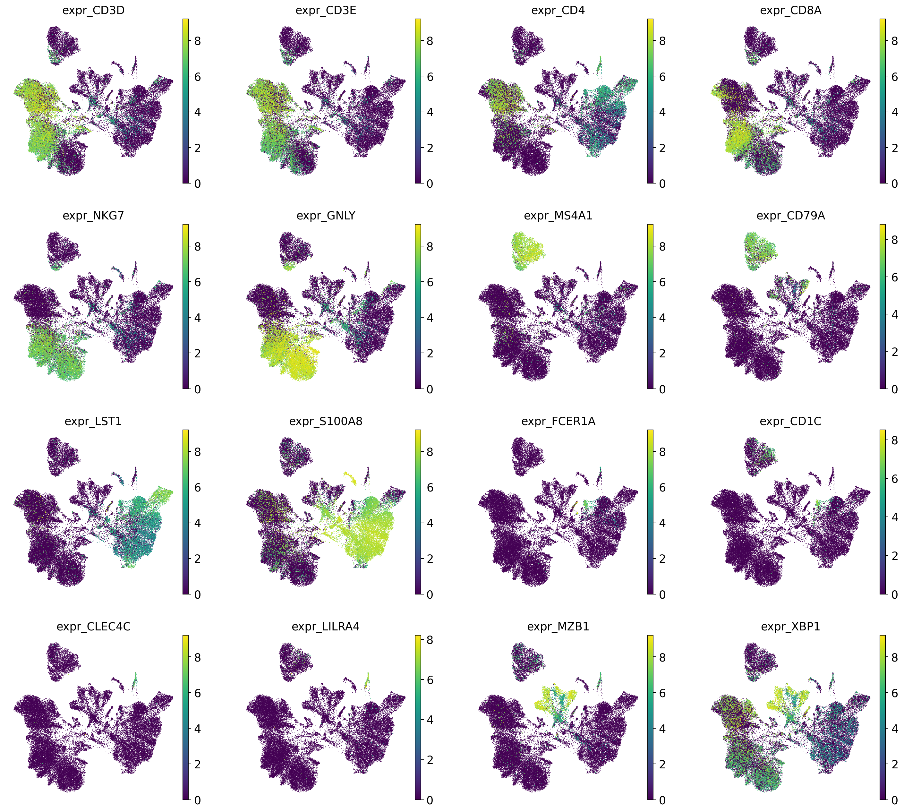

## Annotation source assessment

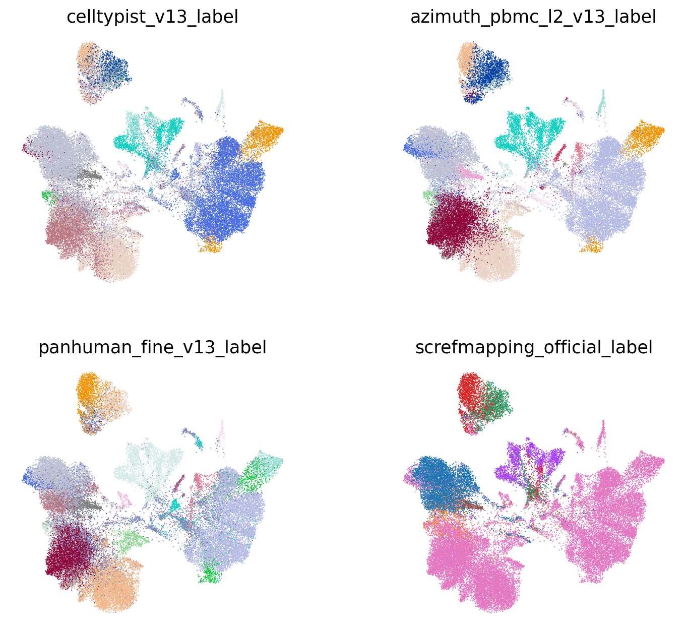

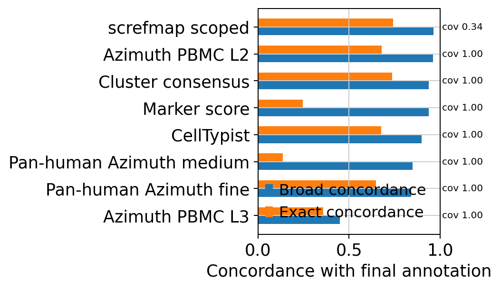

各 source は適用範囲が異なるため、coverage と concordance を分けて読んでください。`exact_final_concordance` は最終ラベルとの完全一致、`broad_final_concordance` は B/T-NK/Myeloid などの broad lineage 一致です。Marker score は marker set 由来の粗い方向付けなので、`Monocyte` vs `Classical Monocyte` や `B Cell` vs `Memory B Cell` のように exact は低くなり得ます。screfmap は B/CD4T scoped cells だけで評価しています。

| tool | covered_n | coverage_fraction | exact_final_concordance | broad_final_concordance | top_supported_labels | top_disagreements |
| --- | --- | --- | --- | --- | --- | --- |
| CellTypist | 43,767 | 1.000 | 0.675 | 0.898 | CD4 Naive / T Central Memory: 12,503; Classical Monocyte: 9,552; NK Cell: 6,118; CD8 Cytotoxic / T Effector Memory: 5,485; Plasma Cell: 1,967 | NK Cell vs CD8 Cytotoxic / T Effector Memory: 1,467; NK Cell vs CD4 Naive / T Central Memory: 1,087; CD8 Cytotoxic / T Effector Memory vs CD4 Naive / T Central Memory: 857; Classical Monocyte vs CD4 Naive / T Central Memory: 844; Plasma Cell vs Plasmablast: 699 |
| Azimuth PBMC L2 | 43,767 | 1.000 | 0.680 | 0.960 | Classical Monocyte: 10,831; CD4 Naive / T Central Memory: 8,045; CD8 Cytotoxic / T Effector Memory: 6,760; NK Cell: 6,131; Plasmablast: 2,647 | Plasma Cell vs Plasmablast: 2,627; NK Cell vs CD8 Cytotoxic / T Effector Memory: 1,445; Memory B Cell vs B Cell: 1,172; CD4 Naive / T Central Memory vs CD8 Naive / T Central Memory: 914; CD4 Naive / T Central Memory vs CD8 Cytotoxic / T Effector Memory: 855 |
| Azimuth PBMC L3 | 43,767 | 1.000 | 0.357 | 0.450 | Blood Cell: 22,860; Classical Monocyte: 10,878; CD4 Naive / T Central Memory: 2,031; Plasma Cell: 1,905; Non-Classical Monocyte: 1,428 | NK Cell vs Blood Cell: 6,967; CD4 Naive / T Central Memory vs Blood Cell: 6,748; CD8 Cytotoxic / T Effector Memory vs Blood Cell: 4,729; Naive B Cell vs Blood Cell: 1,577; Memory B Cell vs Blood Cell: 1,474 |
| Pan-human Azimuth fine | 43,767 | 1.000 | 0.647 | 0.841 | Classical Monocyte: 8,481; Blood Cell: 6,449; NK Cell: 5,824; CD8 Cytotoxic / T Effector Memory: 4,725; CD4 Naive / T Central Memory: 4,518 | CD4 Naive / T Central Memory vs Blood Cell: 1,644; CD4 Naive / T Central Memory vs CD4 T Effector Memory: 1,496; NK Cell vs Blood Cell: 1,250; Classical Monocyte vs Blood Cell: 1,182; CD8 Cytotoxic / T Effector Memory vs Blood Cell: 929 |
| Pan-human Azimuth medium | 43,767 | 1.000 | 0.135 | 0.849 | T Cell: 13,026; Monocyte: 10,425; B Cell: 6,116; NK Cell: 5,824; Blood Cell: 5,612 | Classical Monocyte vs Monocyte: 8,282; CD4 Naive / T Central Memory vs T Cell: 8,131; CD8 Cytotoxic / T Effector Memory vs T Cell: 3,630; Plasma Cell vs B Cell: 3,082; Naive B Cell vs B Cell: 1,456 |
| Cluster consensus | 43,767 | 1.000 | 0.737 | 0.937 | Classical Monocyte: 9,773; CD4 Naive / T Central Memory: 8,079; NK Cell: 7,327; CD8 Cytotoxic / T Effector Memory: 6,384; B Cell: 3,663 | Naive B Cell vs B Cell: 1,589; Memory B Cell vs B Cell: 1,475; NK Cell vs CD8 Cytotoxic / T Effector Memory: 1,001; CD4 Naive / T Central Memory vs CD8 Cytotoxic / T Effector Memory: 956; Classical Monocyte vs Blood Cell: 804 |
| Marker score | 43,767 | 1.000 | 0.246 | 0.936 | Monocyte: 12,635; NK Cell: 8,772; T Cell: 5,929; CD4 T Cell (ab): 5,917; B Cell: 3,736 | Classical Monocyte vs Monocyte: 9,853; CD4 Naive / T Central Memory vs CD4 T Cell (ab): 5,263; CD4 Naive / T Central Memory vs T Cell: 3,267; CD8 Cytotoxic / T Effector Memory vs T Cell: 1,864; Naive B Cell vs B Cell: 1,578 |
| screfmap scoped | 14,670 | 0.335 | 0.743 | 0.964 | CD4 Naive / T Central Memory: 6,784; Naive B Cell: 2,408; Plasma Cell: 2,037; Memory B Cell: 1,892; CD4 T Effector Memory: 1,037 | CD4 Naive / T Central Memory vs CD4 T Effector Memory: 641; Plasma Cell vs Memory B Cell: 590; Plasma Cell vs Naive B Cell: 512; CD4 Naive / T Central Memory vs Treg: 429; Memory B Cell vs Naive B Cell: 398 |

### Lineage-scoped source support

この表は、最終ラベルで定義した broad lineage ごとに、その範囲内で各 source が同じ lineage / fine label を支持しているかを見ます。fine label の正解率ではなく、どの source がどの lineage で役に立つか、または外しやすいかを見るための診断です。

| final_broad_lineage | tool | covered_n | exact_final_concordance | broad_final_concordance |
| --- | --- | --- | --- | --- |
| B | CellTypist | 6,322 | 0.471 | 0.754 |
| B | Azimuth PBMC L2 | 6,322 | 0.206 | 0.940 |
| B | Azimuth PBMC L3 | 6,322 | 0.299 | 0.417 |
| B | Pan-human Azimuth fine | 6,322 | 0.825 | 0.944 |
| B | Pan-human Azimuth medium | 6,322 | 0.003 | 0.942 |
| B | Cluster consensus | 6,322 | 0.472 | 0.991 |
| B | Marker score | 6,322 | 0.365 | 0.894 |
| B | screfmap scoped | 6,249 | 0.725 | 0.993 |
| T/NK | CellTypist | 23,292 | 0.698 | 0.983 |
| T/NK | Azimuth PBMC L2 | 23,292 | 0.737 | 0.991 |
| T/NK | Azimuth PBMC L3 | 23,292 | 0.111 | 0.180 |
| T/NK | Pan-human Azimuth fine | 23,292 | 0.569 | 0.797 |
| T/NK | Pan-human Azimuth medium | 23,292 | 0.232 | 0.809 |
| T/NK | Cluster consensus | 23,292 | 0.790 | 0.955 |
| T/NK | Marker score | 23,292 | 0.296 | 0.945 |
| T/NK | screfmap scoped | 7,979 | 0.798 | 0.995 |
| Myeloid/DC | CellTypist | 12,991 | 0.774 | 0.870 |
| Myeloid/DC | Azimuth PBMC L2 | 12,991 | 0.842 | 0.950 |
| Myeloid/DC | Azimuth PBMC L3 | 12,991 | 0.825 | 0.930 |
| Myeloid/DC | Pan-human Azimuth fine | 12,991 | 0.703 | 0.879 |

## v14 marker registry gate audit

v14 marker registry audit は、marker gene list をそのまま全細胞で競わせるのではなく、broad lineage、applicable lineage、key-marker support の順に制限した場合に marker evidence がどう変わるかを見る診断です。単純 winner では Eosinophil 32,796 cells、Platelet 289 cells のような rare/artifact label が出やすい一方、gate 後は Eosinophil 359 cells、Platelet 173 cells に抑制されます。これは final label を marker score だけで置き換えるためではなく、fine label を受け入れる条件と confidence cap を決めるための evidence audit です。 最も gate 後の未割当が多い lineage は Other_lineage (29.0%) です。

`Ungated` は marker set を全細胞で競わせた結果、`gated` は broad lineage と key-marker support で候補を制限した結果です。この section は現在の最終 annotation の妥当性を診断し、次の annotation engine でどの label に confidence cap / review alert を入れるべきかを決めるためのものです。

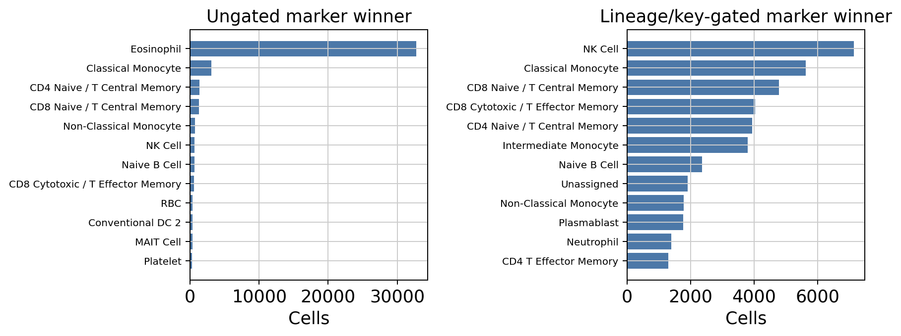

### Gate effect on marker winners

| label | ungated_n | gated_n | delta_after_gate |
| --- | --- | --- | --- |
| Basophil | 0 | 10 | 10 |
| CD4 Naive / T Central Memory | 1,351 | 3,945 | 2,594 |
| CD8 Cytotoxic / T Effector Memory | 571 | 4,039 | 3,468 |
| CD8 Naive / T Central Memory | 1,316 | 4,779 | 3,463 |
| Classical Monocyte | 3,058 | 5,621 | 2,563 |
| Conventional DC 2 | 370 | 283 | -87 |
| Eosinophil | 32,796 | 359 | -32,437 |
| HSC | 1 | 32 | 31 |
| Intermediate Monocyte | 254 | 3,801 | 3,547 |
| Mast Cell | 0 | 0 | 0 |
| NK Cell | 668 | 7,138 | 6,470 |
| Naive B Cell | 631 | 2,352 | 1,721 |
| Non-Classical Monocyte | 721 | 1,772 | 1,051 |
| Plasmablast | 85 | 1,765 | 1,680 |
| Platelet | 289 | 173 | -116 |
| RBC | 385 | 293 | -92 |
| Unassigned | 0 | 1,907 | 1,907 |

### Gated marker labels by audit lineage

| audit_lineage_gate | n_cells | unassigned_n | unassigned_fraction | top_gated_marker_labels |
| --- | --- | --- | --- | --- |
| Ambiguous | 479 | 4 | 0.008 | Classical Monocyte: 139; RBC: 51; Intermediate Monocyte: 47; Neutrophil: 42; NK Cell: 34 |
| B_lineage | 6,278 | 298 | 0.047 | Naive B Cell: 2,326; Plasmablast: 1,749; Plasma Cell: 1,163; Memory B Cell: 742; Unassigned: 298 |
| Myeloid_lineage | 13,132 | 25 | 0.002 | Classical Monocyte: 5,482; Intermediate Monocyte: 3,754; Non-Classical Monocyte: 1,754; Neutrophil: 1,341; Eosinophil: 351 |
| Other_lineage | 610 | 177 | 0.290 | RBC: 242; Unassigned: 177; Platelet: 161; HSC: 30 |
| T_NK_lineage | 23,268 | 1,403 | 0.060 | NK Cell: 7,104; CD8 Naive / T Central Memory: 4,755; CD8 Cytotoxic / T Effector Memory: 4,028; CD4 Naive / T Central Memory: 3,933; Unassigned: 1,403 |

### Marker support by final label

| final_label | n_cells | marker_exact_fraction | marker_exact_fraction_gated | unassigned_fraction_gated | top_marker_best_labels_gated |
| --- | --- | --- | --- | --- | --- |
| Classical Monocyte | 11,112 | 0.253 | 0.487 | 0.001 | Classical Monocyte:5407; Intermediate Monocyte:3312; Neutrophil:1279; Non-Classical Monocyte:686; Eosinophil:336 |
| CD4 Naive / T Central Memory | 10,409 | 0.126 | 0.357 | 0.109 | CD4 Naive / T Central Memory:3718; CD8 Naive / T Central Memory:3631; Unassigned:1138; CD8 Cytotoxic / T Effector Memory:620; CD4 T Effector Memory:538 |
| NK Cell | 7,604 | 0.080 | 0.724 | 0.026 | NK Cell:5504; CD8 Cytotoxic / T Effector Memory:996; CD8 Naive / T Central Memory:301; CD4 T Effector Memory:289; Unassigned:197 |
| CD8 Cytotoxic / T Effector Memory | 5,277 | 0.072 | 0.457 | 0.013 | CD8 Cytotoxic / T Effector Memory:2413; NK Cell:1157; CD8 Naive / T Central Memory:824; CD4 T Effector Memory:463; ydT Cell:213 |
| Plasma Cell | 3,261 | 0.009 | 0.348 | 0.010 | Plasmablast:1707; Plasma Cell:1134; Naive B Cell:299; Memory B Cell:86; Unassigned:31 |
| Naive B Cell | 1,541 | 0.306 | 0.886 | 0.035 | Naive B Cell:1366; Memory B Cell:103; Unassigned:54; Plasmablast:10; Plasma Cell:8 |
| Memory B Cell | 1,481 | 0.007 | 0.373 | 0.144 | Naive B Cell:661; Memory B Cell:553; Unassigned:213; Plasmablast:33; Plasma Cell:21 |
| Non-Classical Monocyte | 1,243 | 0.444 | 0.833 | 0.000 | Non-Classical Monocyte:1035; Intermediate Monocyte:121; Classical Monocyte:37; Neutrophil:31; Eosinophil:10 |
| Conventional DC 2 | 556 | 0.070 | 0.338 | 0.000 | Intermediate Monocyte:267; Conventional DC 2:188; Classical Monocyte:40; Neutrophil:30; Non-Classical Monocyte:26 |
| Blood Cell | 518 | 0.000 | 0.000 | 0.114 | RBC:254; Classical Monocyte:78; Unassigned:59; Neutrophil:24; Intermediate Monocyte:15 |
| Plasmacytoid DC | 229 | 0.262 | 0.611 | 0.066 | Plasmacytoid DC:140; Intermediate Monocyte:55; Unassigned:15; Non-Classical Monocyte:8; Conventional DC 2:6 |
| Platelet | 193 | 0.777 | 0.855 | 0.135 | Platelet:165; Unassigned:26; NK Cell:1; CD8 Naive / T Central Memory:1 |
| HSC | 137 | 0.007 | 0.182 | 0.701 | Unassigned:96; HSC:25; Intermediate Monocyte:8; Conventional DC 2:2; CD8 Naive / T Central Memory:2 |
| Doublet | 132 | 0.000 | 0.000 | 0.000 | Classical Monocyte:56; NK Cell:16; Neutrophil:10; Intermediate Monocyte:10; Non-Classical Monocyte:8 |

## Lineage-specific subclustering

### B_lineage

lineage 内に絞った marker expression UMAP です。fine label の判断は subcluster 文脈で行うため、この section に置いています。

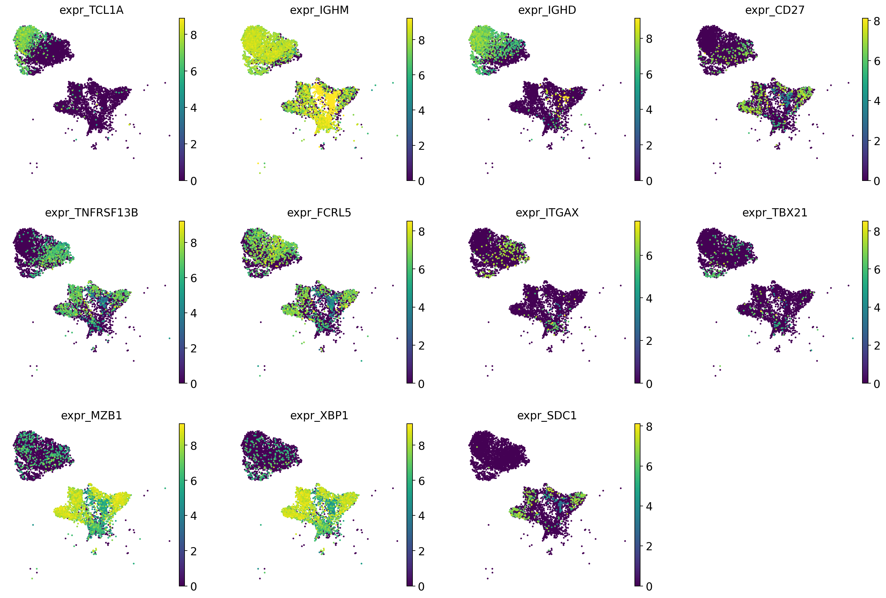

| cluster | n_cells | chosen_label | accepted | score_margin | calibrated_cluster_confidence | marker_availability_alert | top_celltypist | top_panhuman_fine | top_marker | top_screfmapping |
| --- | --- | --- | --- | --- | --- | --- | --- | --- | --- | --- |
| 0 | 805 | Naive B Cell | True | 4.256 | 0.850 | pass | Naive B Cell:636; B Cell:65; Blood Cell:36; CD4 Naive / T Central Memory:33; Treg:14 | Naive B Cell:757; Memory B Cell:23; Blood Cell:22; B Cell:3 | B Cell:804; Monocyte:1 | Naive B Cell:799; Memory B Cell:6 |
| 1 | 576 | Plasma Cell | True | 2.289 | 0.761 | warning | Plasma Cell:295; CD4 Naive / T Central Memory:96; Plasmablast:55; Blood Cell:54; Classical Monocyte:25 | Plasma Cell:546; Blood Cell:23; Memory B Cell:5; Naive B Cell:2 | Monocyte:441; Plasma Cell:120; B Cell:7; Non-Classical Monocyte:3; NK Cell:2 | Memory B Cell:284; Naive B Cell:172; Plasma Cell:67; not_available:35; CD4 T Effector Memory:10 |
| 2 | 538 | Naive B Cell | True | 2.705 | 0.850 | pass | Naive B Cell:194; CD4 Naive / T Central Memory:139; Blood Cell:75; B Cell:63; Memory B Cell:22 | Naive B Cell:332; Memory B Cell:115; Blood Cell:76; B Cell:9; Plasma Cell:6 | B Cell:531; Plasma Cell:3; DC:2; Monocyte:2 | Naive B Cell:471; Memory B Cell:59; Treg:2; Plasma Cell:2; CD4 Naive / T Central Memory:2 |
| 3 | 527 | Memory B Cell | True | 2.306 | 0.850 | pass | B Cell:352; CD4 Naive / T Central Memory:45; Blood Cell:41; Memory B Cell:33; Naive B Cell:20 | Memory B Cell:391; Naive B Cell:96; Blood Cell:32; Plasma Cell:6; B Cell:2 | B Cell:525; Plasma Cell:2 | Memory B Cell:427; Naive B Cell:98; Plasma Cell:2 |
| 4 | 437 | Memory B Cell | True | 3.205 | 0.839 | pass | B Cell:150; Memory B Cell:100; CD4 Naive / T Central Memory:82; Blood Cell:45; NK Cell:27 | Memory B Cell:358; Naive B Cell:44; Blood Cell:28; B Cell:5; Plasma Cell:2 | B Cell:436; NK Cell:1 | Memory B Cell:364; Naive B Cell:71; not_available:1; Treg:1 |
| 5 | 418 | Memory B Cell | True | 0.846 | 0.829 | pass | B Cell:143; Memory B Cell:77; Naive B Cell:58; CD4 Naive / T Central Memory:52; Blood Cell:41 | Memory B Cell:270; Naive B Cell:136; Blood Cell:9; Plasma Cell:2; B Cell:1 | B Cell:418 | Memory B Cell:236; Naive B Cell:182 |
| 6 | 352 | Plasma Cell | True | 0.115 | 0.624 | warning | Plasma Cell:112; NK Cell:71; Naive B Cell:34; CD8 Cytotoxic / T Effector Memory:31; B Cell:31 | Plasma Cell:142; Naive B Cell:83; Blood Cell:68; Memory B Cell:56; NK Cell:2 | B Cell:198; Plasma Cell:123; NK Cell:20; Monocyte:6; T Cell:2 | Naive B Cell:121; Memory B Cell:110; Plasma Cell:106; not_available:15 |
| 7 | 348 | Plasma Cell | True | 3.711 | 0.820 | warning | Plasmablast:238; Plasma Cell:81; CD4 Naive / T Central Memory:18; T Cell:4; B Cell:3 | Plasma Cell:342; Blood Cell:5; Lymphoid Cell:1 | Plasma Cell:340; B Cell:6; Monocyte:2 | Plasma Cell:301; Memory B Cell:26; Naive B Cell:19; not_available:1; CD4 Naive / T Central Memory:1 |
| 8 | 285 | Plasma Cell | True | 3.827 | 0.820 | warning | Plasma Cell:263; Plasmablast:9; CD4 Naive / T Central Memory:6; Blood Cell:3; B Cell:1 | Plasma Cell:283; Memory B Cell:1; Blood Cell:1 | Plasma Cell:251; B Cell:29; T Cell:2; Monocyte:1; Plasmacytoid DC:1 | Plasma Cell:260; Memory B Cell:14; Naive B Cell:11 |
| 9 | 284 | Plasma Cell | True | 3.750 | 0.820 | warning | Plasma Cell:275; Plasmablast:8; CD4 Naive / T Central Memory:1 | Plasma Cell:283; Blood Cell:1 | Plasma Cell:284 | Plasma Cell:263; Naive B Cell:16; Memory B Cell:5 |

### T_NK_lineage

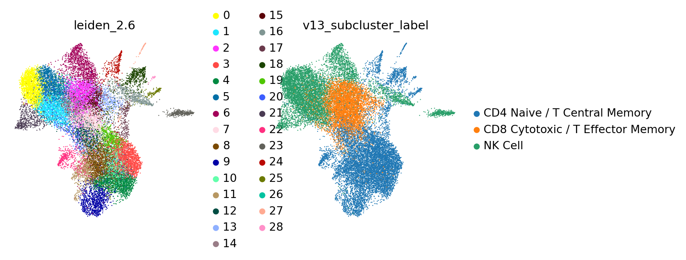

lineage 内に絞った marker expression UMAP です。fine label の判断は subcluster 文脈で行うため、この section に置いています。

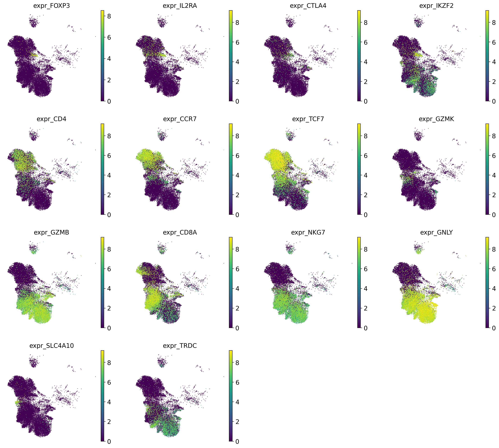

| cluster | n_cells | chosen_label | accepted | score_margin | calibrated_cluster_confidence | marker_availability_alert | top_celltypist | top_panhuman_fine | top_marker | top_screfmapping |
| --- | --- | --- | --- | --- | --- | --- | --- | --- | --- | --- |
| 0 | 1,798 | NK Cell | True | 2.510 | 0.850 | pass | NK Cell:1685; CD8 Cytotoxic / T Effector Memory:53; CD4 Naive / T Central Memory:47; Blood Cell:6; B Cell:3 | NK Cell:1700; Blood Cell:85; Lymphoid Cell:10; CD8 Cytotoxic / T Effector Memory:3 | NK Cell:1775; Non-Classical Monocyte:12; T Cell:6; Plasmacytoid DC:2; CD8 T Cell (ab):2 | not_available:1798 |
| 1 | 1,553 | NK Cell | True | 1.676 | 0.740 | pass | NK Cell:971; CD4 Naive / T Central Memory:288; CD8 Cytotoxic / T Effector Memory:256; Blood Cell:17; Treg:16 | NK Cell:1119; Blood Cell:280; CD8 Cytotoxic / T Effector Memory:124; ydT Cell:15; MAIT Cell:4 | NK Cell:1422; T Cell:76; Non-Classical Monocyte:23; CD8 T Cell (ab):13; CD4 T Cell (ab):10 | not_available:1539; CD4 T Effector Memory:13; CD4 Naive / T Central Memory:1 |
| 2 | 1,498 | CD8 Cytotoxic / T Effector Memory | True | 1.809 | 0.740 | pass | CD8 Cytotoxic / T Effector Memory:1236; NK Cell:129; CD4 Naive / T Central Memory:88; Treg:18; Blood Cell:16 | CD8 Cytotoxic / T Effector Memory:1169; Blood Cell:169; NK Cell:112; ydT Cell:17; MAIT Cell:15 | T Cell:599; NK Cell:430; CD8 T Cell (ab):388; CD4 T Cell (ab):63; Non-Classical Monocyte:15 | not_available:1484; CD4 T Effector Memory:12; CD4 Naive / T Central Memory:2 |
| 3 | 1,491 | CD4 Naive / T Central Memory | True | 2.687 | 0.850 | pass | CD4 Naive / T Central Memory:1369; CD8 Naive / T Central Memory:93; Treg:10; CD8 Cytotoxic / T Effector Memory:10; NK Cell:5 | CD4 Naive / T Central Memory:1058; CD8 Naive / T Central Memory:237; Blood Cell:108; Treg:30; CD8 Cytotoxic / T Effector Memory:28 | CD4 T Cell (ab):873; T Cell:545; CD8 T Cell (ab):56; NK Cell:10; Monocyte:2 | CD4 Naive / T Central Memory:1075; not_available:386; Treg:16; CD4 T Effector Memory:14 |
| 4 | 1,427 | CD4 Naive / T Central Memory | True | 3.341 | 0.850 | pass | CD4 Naive / T Central Memory:1359; Treg:32; CD8 Naive / T Central Memory:14; CD4 T Effector Memory:10; CD8 Cytotoxic / T Effector Memory:8 | CD4 Naive / T Central Memory:969; CD4 T Effector Memory:268; Blood Cell:64; Treg:59; CD8 Naive / T Central Memory:47 | CD4 T Cell (ab):971; T Cell:429; CD8 T Cell (ab):11; NK Cell:5; Monocyte:3 | CD4 Naive / T Central Memory:1238; not_available:143; CD4 T Effector Memory:26; Treg:20 |
| 5 | 1,304 | NK Cell | True | 1.538 | 0.740 | pass | NK Cell:802; CD8 Cytotoxic / T Effector Memory:420; CD4 Naive / T Central Memory:62; Treg:10; Blood Cell:6 | NK Cell:1105; Blood Cell:100; CD8 Cytotoxic / T Effector Memory:86; ydT Cell:7; Lymphoid Cell:3 | NK Cell:1238; T Cell:44; CD8 T Cell (ab):13; Non-Classical Monocyte:6; CD4 T Cell (ab):3 | not_available:1303; CD4 T Effector Memory:1 |
| 6 | 1,231 | NK Cell | True | 0.413 | 0.684 | pass | NK Cell:521; CD8 Cytotoxic / T Effector Memory:451; CD4 Naive / T Central Memory:221; Treg:18; Blood Cell:11 | NK Cell:504; CD8 Cytotoxic / T Effector Memory:346; Blood Cell:327; ydT Cell:29; Lymphoid Cell:10 | NK Cell:865; T Cell:217; CD8 T Cell (ab):71; CD4 T Cell (ab):39; Non-Classical Monocyte:30 | not_available:1219; CD4 T Effector Memory:7; CD4 Naive / T Central Memory:5 |
| 7 | 1,212 | CD8 Cytotoxic / T Effector Memory | True | 1.431 | 0.730 | pass | CD8 Cytotoxic / T Effector Memory:599; CD4 Naive / T Central Memory:387; NK Cell:158; Blood Cell:35; Treg:11 | CD8 Cytotoxic / T Effector Memory:729; Blood Cell:304; NK Cell:87; CD4 Naive / T Central Memory:21; Treg:18 | T Cell:453; NK Cell:363; CD8 T Cell (ab):235; CD4 T Cell (ab):124; Non-Classical Monocyte:28 | not_available:1126; CD4 T Effector Memory:69; CD4 Naive / T Central Memory:17 |
| 8 | 1,200 | CD4 Naive / T Central Memory | True | 2.169 | 0.850 | pass | CD4 Naive / T Central Memory:1076; Treg:65; CD4 T Effector Memory:24; CD8 Cytotoxic / T Effector Memory:21; NK Cell:5 | CD4 T Effector Memory:523; CD4 Naive / T Central Memory:369; Blood Cell:137; Treg:103; CD8 Cytotoxic / T Effector Memory:39 | CD4 T Cell (ab):833; T Cell:339; NK Cell:15; CD8 T Cell (ab):8; Monocyte:3 | CD4 Naive / T Central Memory:908; not_available:140; CD4 T Effector Memory:109; Treg:43 |
| 9 | 1,035 | CD4 Naive / T Central Memory | True | 3.200 | 0.850 | pass | CD4 Naive / T Central Memory:917; Treg:79; CD4 T Effector Memory:13; CD8 Cytotoxic / T Effector Memory:8; CD8 Naive / T Central Memory:7 | CD4 Naive / T Central Memory:512; CD4 T Effector Memory:204; Blood Cell:179; Treg:99; CD8 Naive / T Central Memory:22 | CD4 T Cell (ab):629; T Cell:347; Monocyte:13; CD8 T Cell (ab):13; NK Cell:13 | CD4 Naive / T Central Memory:871; not_available:112; Treg:32; CD4 T Effector Memory:20 |

### Myeloid_lineage

lineage 内に絞った marker expression UMAP です。fine label の判断は subcluster 文脈で行うため、この section に置いています。

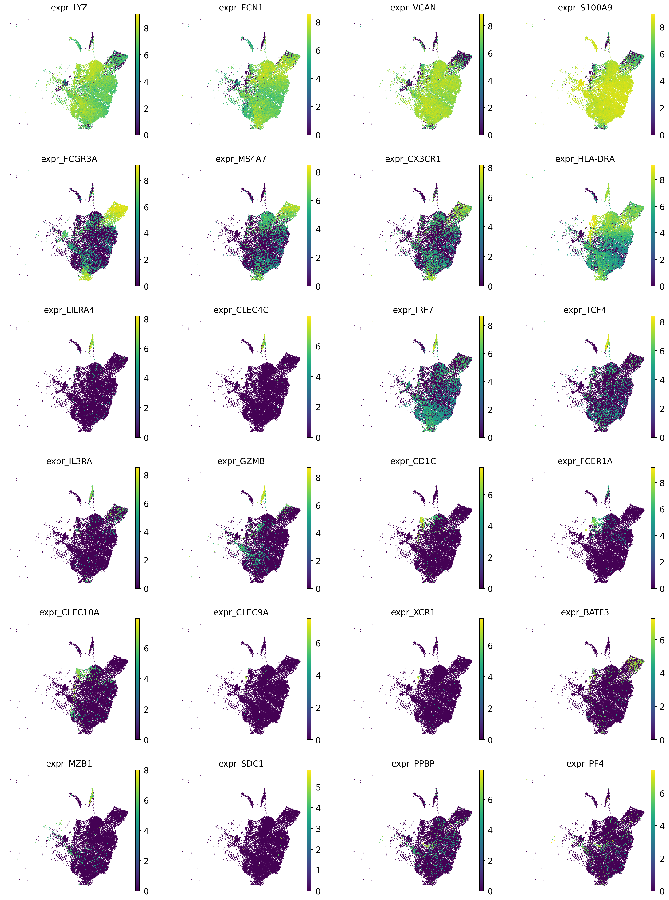

| cluster | n_cells | chosen_label | accepted | score_margin | calibrated_cluster_confidence | marker_availability_alert | top_celltypist | top_panhuman_fine | top_marker | top_screfmapping |
| --- | --- | --- | --- | --- | --- | --- | --- | --- | --- | --- |
| 0 | 1,198 | Classical Monocyte | True | 2.316 | 0.847 | pass | Classical Monocyte:1080; Non-Classical Monocyte:60; CD4 Naive / T Central Memory:45; Myeloid Cell:7; Blood Cell:3 | Classical Monocyte:1008; Blood Cell:83; Intermediate Monocyte:70; Non-Classical Monocyte:17; Conventional DC 2:15 | Monocyte:1169; Non-Classical Monocyte:25; DC:4 | not_available:1198 |
| 1 | 1,131 | Classical Monocyte | True | 1.747 | 0.734 | pass | Classical Monocyte:687; CD4 Naive / T Central Memory:165; Non-Classical Monocyte:114; CD8 Cytotoxic / T Effector Memory:50; NK Cell:37 | Classical Monocyte:533; Blood Cell:315; Intermediate Monocyte:115; Non-Classical Monocyte:91; Neutrophil:42 | Monocyte:975; Non-Classical Monocyte:113; DC:19; NK Cell:18; RBC:3 | not_available:1127; CD4 T Effector Memory:4 |
| 2 | 1,055 | Classical Monocyte | True | 2.402 | 0.740 | pass | Classical Monocyte:951; Non-Classical Monocyte:64; CD4 Naive / T Central Memory:37; Myeloid Cell:2; NK Cell:1 | Classical Monocyte:916; Intermediate Monocyte:107; Blood Cell:23; Neutrophil:4; Conventional DC 2:3 | Monocyte:1022; Non-Classical Monocyte:31; RBC:2 | not_available:1054; CD4 T Effector Memory:1 |
| 3 | 1,047 | Classical Monocyte | True | 2.367 | 0.740 | pass | Classical Monocyte:882; CD4 Naive / T Central Memory:124; Non-Classical Monocyte:30; Blood Cell:7; Plasma Cell:1 | Classical Monocyte:827; Blood Cell:141; Intermediate Monocyte:47; Neutrophil:15; Non-Classical Monocyte:11 | Monocyte:1016; Non-Classical Monocyte:28; DC:2; RBC:1 | not_available:1040; CD4 Naive / T Central Memory:5; CD4 T Effector Memory:2 |
| 4 | 1,039 | Classical Monocyte | True | 2.635 | 0.740 | pass | Classical Monocyte:999; CD4 Naive / T Central Memory:26; Non-Classical Monocyte:10; Myeloid Cell:2; Blood Cell:1 | Classical Monocyte:983; Blood Cell:32; Neutrophil:12; Intermediate Monocyte:8; Non-Classical Monocyte:2 | Monocyte:1036; Non-Classical Monocyte:3 | not_available:1038; CD4 T Effector Memory:1 |
| 5 | 943 | Non-Classical Monocyte | True | 1.630 | 0.850 | pass | Non-Classical Monocyte:845; Classical Monocyte:55; CD4 Naive / T Central Memory:33; Myeloid Cell:4; Blood Cell:3 | Non-Classical Monocyte:645; Intermediate Monocyte:219; Classical Monocyte:44; Blood Cell:32; Conventional DC 2:2 | Non-Classical Monocyte:784; Monocyte:155; DC:2; RBC:1; NK Cell:1 | not_available:943 |
| 6 | 712 | Classical Monocyte | True | 2.288 | 0.850 | pass | Classical Monocyte:603; Non-Classical Monocyte:61; CD4 Naive / T Central Memory:39; Blood Cell:2; Myeloid Cell:2 | Classical Monocyte:607; Intermediate Monocyte:55; Blood Cell:32; Non-Classical Monocyte:10; Neutrophil:3 | Monocyte:689; Non-Classical Monocyte:22; DC:1 | not_available:712 |
| 7 | 689 | Classical Monocyte | True | 2.525 | 0.740 | pass | Classical Monocyte:628; CD4 Naive / T Central Memory:28; Non-Classical Monocyte:15; Conventional DC 2:6; Blood Cell:4 | Classical Monocyte:597; Blood Cell:44; Intermediate Monocyte:29; Neutrophil:11; Conventional DC 2:6 | Monocyte:676; Non-Classical Monocyte:9; DC:4 | not_available:686; CD4 Naive / T Central Memory:3 |
| 8 | 663 | Classical Monocyte | True | 1.847 | 0.735 | pass | Classical Monocyte:368; CD4 Naive / T Central Memory:177; Non-Classical Monocyte:76; Blood Cell:12; Treg:9 | Classical Monocyte:395; Blood Cell:113; Intermediate Monocyte:70; Non-Classical Monocyte:40; Neutrophil:30 | Monocyte:575; Non-Classical Monocyte:73; DC:11; RBC:2; T Cell:1 | not_available:659; CD4 T Effector Memory:2; CD4 Naive / T Central Memory:2 |
| 9 | 627 | Classical Monocyte | True | 2.714 | 0.850 | pass | Classical Monocyte:617; CD4 Naive / T Central Memory:7; Non-Classical Monocyte:3 | Classical Monocyte:581; Neutrophil:23; Blood Cell:19; Intermediate Monocyte:3; Non-Classical Monocyte:1 | Monocyte:625; Non-Classical Monocyte:2 | not_available:627 |

## Interpretation and caveats

この評価は ground truth label との accuracy ではなく、複数 annotation source と marker/subcluster evidence の整合性評価です。 marker gene が欠損している cell type では、reference mapping 単独の fine label は過信しない設計です。 Azimuth PBMC L3 の disagreement は、ontology 粒度の違い、gene availability、dataset enrichment の影響を含む可能性があります。

## Files

- Submission TSV: `submissions/infection_study_04_annotation.tsv`
- cellxgene H5AD: `cellxgene/infection_study_04.final_v14_marker_gate_applied.cxg.h5ad`
- Report context JSON: `report_context.json`
- Tool support TSV: `tool_support_summary.tsv`
