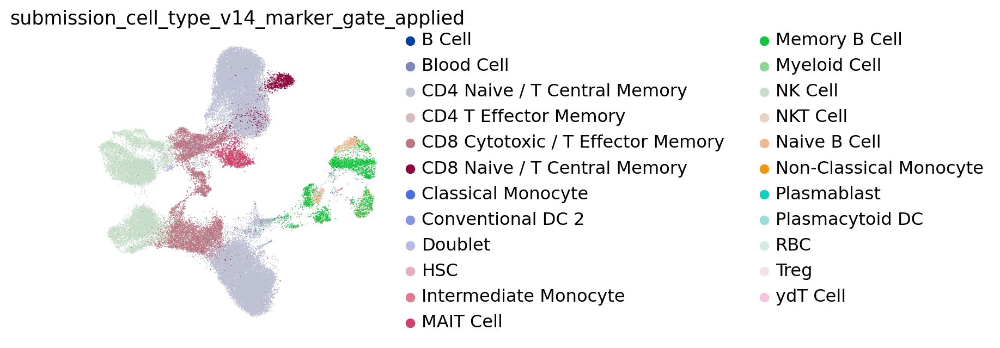
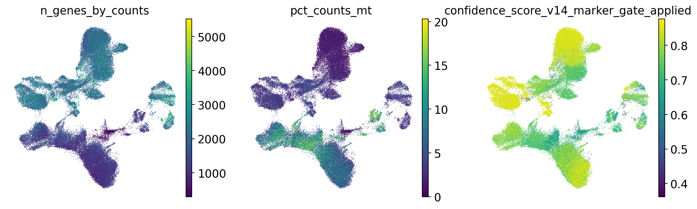
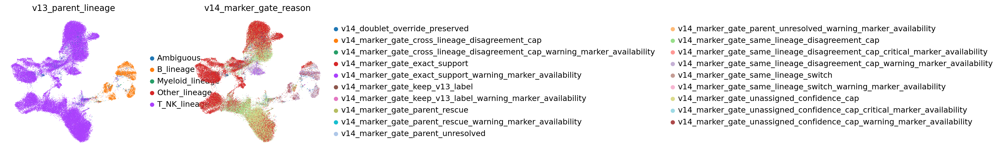
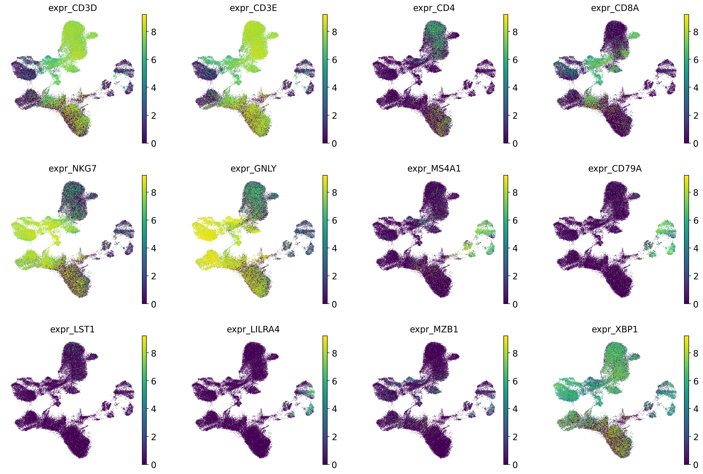
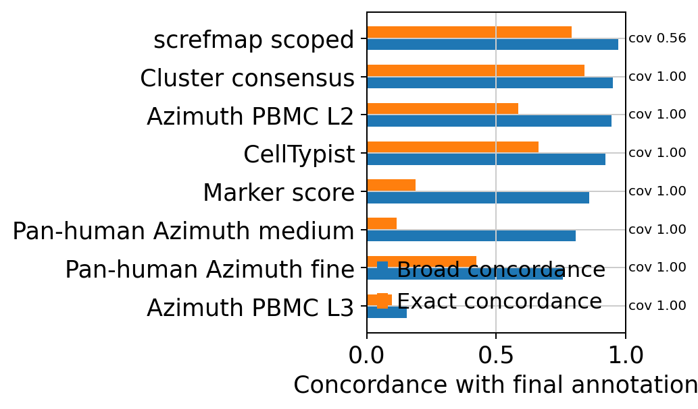
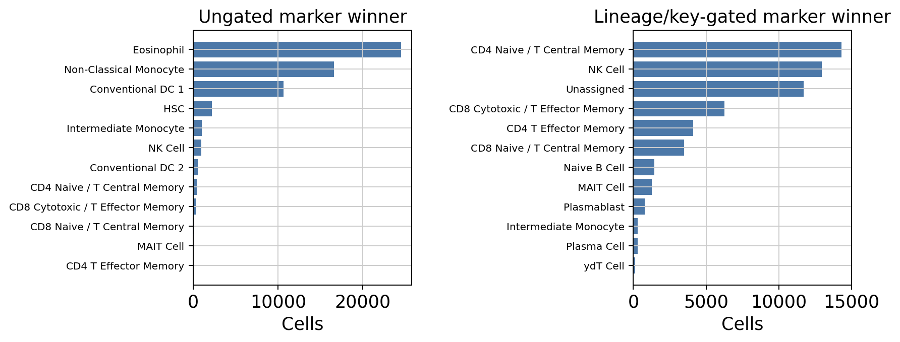
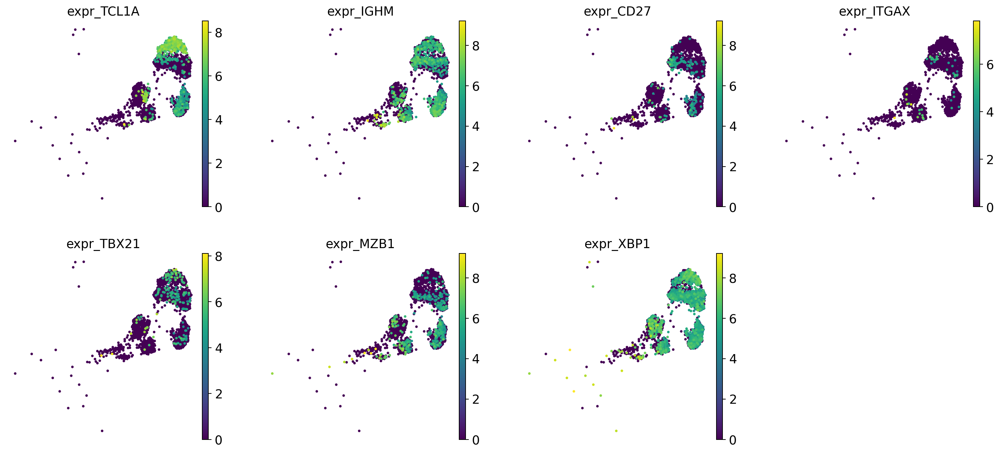
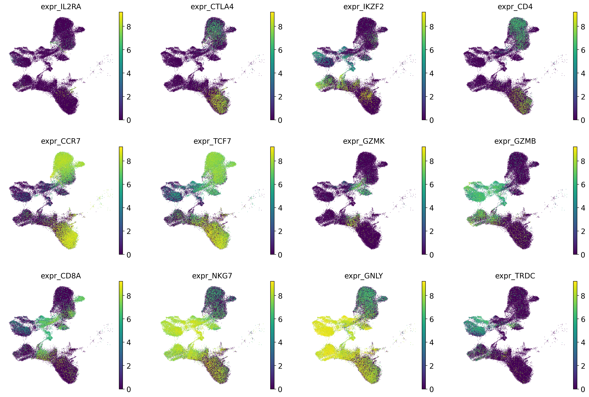
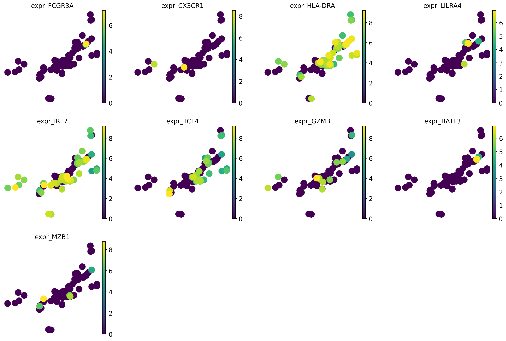

# vaccination_study_06 annotation review

Updated: 2026-06-02 EDT

## Dataset-specific assessment

vaccination_study_06 は 57,419 cells / 11,878 portal genes の dataset です。親ラベルまたは Blood Cell に残った割合は 0.4%、doublet は 1,502 cells、低 confidence は 1,729 cells でした。注意すべき marker gene 欠損は Treg(warning: FOXP3); Plasma_ASC(warning: JCHAIN) です。 T/NK 優位で、gene space が小さいため fine label は marker availability と一緒に読む必要があります。 subcluster evidence では CD4 Naive / T Central Memory: 29,888 cells; NK Cell: 10,386 cells; CD8 Cytotoxic / T Effector Memory: 9,282 cells; Memory B Cell: 3,050 cells; MAIT Cell: 1,458 cells; CD8 Naive / T Central Memory: 873 cells が主要な構造です。全細胞に近い coverage で最も broad lineage に沿った source は Cluster consensus (broad concordance 94.9%) で、相対的に不一致が目立つ source は Azimuth PBMC L3 (15.3%) です。 screfmap は適用範囲を B/CD4T に限定すると coverage 56.4%、broad concordance 97.3% でした。 v14 marker registry audit は、marker gene list をそのまま全細胞で競わせるのではなく、broad lineage、applicable lineage、key-marker support の順に制限した場合に marker evidence がどう変わるかを見る診断です。単純 winner では Eosinophil 24,512 cells、Platelet 0 cells のような rare/artifact label が出やすい一方、gate 後は Eosinophil 0 cells、Platelet 0 cells に抑制されます。これは final label を marker score だけで置き換えるためではなく、fine label を受け入れる条件と confidence cap を決めるための evidence audit です。 最も gate 後の未割当が多い lineage は Other_lineage (100.0%) です。

## Methods

この report は、portal input の raw/count-like gene space、CellTypist、Azimuth PBMC、Pan-human Azimuth、screfmap、marker score、lineage-specific subclustering を dataset 単位で照合したものです。ここでの tool concordance は ground truth accuracy ではなく、最終 annotation に対する support/disagreement の診断指標です。

## Input and QC

| cells | portal_genes | raw_count_source | count_like_fraction | available_marker_umap_genes | missing_marker_umap_genes | parent_or_blood_fraction | median_confidence | low_confidence_n | doublet_n |
| --- | --- | --- | --- | --- | --- | --- | --- | --- | --- |
| 57,419 | 11,878 | layers[counts] | 1.000 | 31 | CD1C;CLEC10A;CLEC4C;CLEC9A;FCER1A;FCN1;FCRL5;FOXP3;IGHD;IL3RA;JCHAIN;LYZ;MS4A7;PF4;PPBP;S100A8;S100A9;SDC1;SLC4A10;TNFRSF13B;VCAN;XCR1 | 0.004 | 0.780 | 1,729 | 1,502 |

### Marker gene availability alerts

| marker_set | n_genes_present | n_genes_expected | alert_level | missing_critical_markers |
| --- | --- | --- | --- | --- |
| Treg | 5 | 7 | warning | FOXP3 |
| Plasma_ASC | 4 | 9 | warning | JCHAIN |

### QC and annotation UMAPs

## Marker expression UMAPs

### lineage_core

## Annotation source assessment

各 source は適用範囲が異なるため、coverage と concordance を分けて読んでください。`exact_final_concordance` は最終ラベルとの完全一致、`broad_final_concordance` は B/T-NK/Myeloid などの broad lineage 一致です。Marker score は marker set 由来の粗い方向付けなので、`Monocyte` vs `Classical Monocyte` や `B Cell` vs `Memory B Cell` のように exact は低くなり得ます。screfmap は B/CD4T scoped cells だけで評価しています。

| tool | covered_n | coverage_fraction | exact_final_concordance | broad_final_concordance | top_supported_labels | top_disagreements |
| --- | --- | --- | --- | --- | --- | --- |
| CellTypist | 57,419 | 1.000 | 0.664 | 0.922 | CD4 Naive / T Central Memory: 22,002; CD8 Cytotoxic / T Effector Memory: 9,707; NK Cell: 8,926; CD4 T Effector Memory: 6,259; Blood Cell: 2,153 | CD4 Naive / T Central Memory vs CD4 T Effector Memory: 5,483; NK Cell vs CD8 Cytotoxic / T Effector Memory: 1,971; Memory B Cell vs B Cell: 1,394; CD4 Naive / T Central Memory vs Blood Cell: 1,025; CD4 Naive / T Central Memory vs CD8 Cytotoxic / T Effector Memory: 739 |
| Azimuth PBMC L2 | 57,419 | 1.000 | 0.586 | 0.944 | CD4 Naive / T Central Memory: 20,411; T Cell: 11,447; NK Cell: 9,324; CD8 Cytotoxic / T Effector Memory: 8,211; B Cell: 2,368 | CD4 Naive / T Central Memory vs T Cell: 10,348; NK Cell vs CD8 Cytotoxic / T Effector Memory: 2,006; Memory B Cell vs B Cell: 1,702; CD8 Cytotoxic / T Effector Memory vs T Cell: 854; CD8 Cytotoxic / T Effector Memory vs CD4 Naive / T Central Memory: 826 |
| Azimuth PBMC L3 | 57,419 | 1.000 | 0.098 | 0.153 | Blood Cell: 48,850; CD4 Naive / T Central Memory: 4,203; MAIT Cell: 1,596; RBC: 749; CD8 Naive / T Central Memory: 656 | CD4 Naive / T Central Memory vs Blood Cell: 24,248; NK Cell vs Blood Cell: 10,954; CD8 Cytotoxic / T Effector Memory vs Blood Cell: 7,636; Memory B Cell vs Blood Cell: 2,470; Doublet vs Blood Cell: 1,329 |
| Pan-human Azimuth fine | 57,419 | 1.000 | 0.424 | 0.756 | Blood Cell: 13,263; CD4 Naive / T Central Memory: 10,554; NK Cell: 6,730; CD4 T Cell (ab): 6,257; CD8 Cytotoxic / T Effector Memory: 5,409 | CD4 Naive / T Central Memory vs Blood Cell: 5,666; CD4 Naive / T Central Memory vs CD4 T Cell (ab): 5,210; CD4 Naive / T Central Memory vs Treg: 4,202; CD4 Naive / T Central Memory vs CD4 T Effector Memory: 3,881; NK Cell vs Blood Cell: 3,790 |
| Pan-human Azimuth medium | 57,419 | 1.000 | 0.115 | 0.807 | T Cell: 36,741; Blood Cell: 10,254; NK Cell: 6,731; B Cell: 3,670; Monocyte: 14 | CD4 Naive / T Central Memory vs T Cell: 24,823; CD8 Cytotoxic / T Effector Memory vs T Cell: 6,510; CD4 Naive / T Central Memory vs Blood Cell: 4,539; Memory B Cell vs B Cell: 2,630; NK Cell vs Blood Cell: 2,509 |
| Cluster consensus | 57,419 | 1.000 | 0.840 | 0.949 | CD4 Naive / T Central Memory: 29,353; NK Cell: 10,608; CD8 Cytotoxic / T Effector Memory: 9,819; B Cell: 3,826; Blood Cell: 1,548 | Memory B Cell vs B Cell: 2,598; NK Cell vs CD8 Cytotoxic / T Effector Memory: 1,107; CD4 Naive / T Central Memory vs Blood Cell: 938; Naive B Cell vs B Cell: 870; Doublet vs CD4 Naive / T Central Memory: 505 |
| Marker score | 57,419 | 1.000 | 0.189 | 0.859 | CD4 T Cell (ab): 21,811; NK Cell: 14,769; T Cell: 8,430; CD8 T Cell (ab): 4,210; DC: 2,628 | CD4 Naive / T Central Memory vs CD4 T Cell (ab): 18,729; CD4 Naive / T Central Memory vs T Cell: 6,132; CD8 Cytotoxic / T Effector Memory vs CD8 T Cell (ab): 2,947; CD8 Cytotoxic / T Effector Memory vs NK Cell: 2,657; Memory B Cell vs DC: 1,594 |
| screfmap scoped | 32,412 | 0.564 | 0.792 | 0.973 | CD4 Naive / T Central Memory: 24,886; CD4 T Effector Memory: 2,831; Naive B Cell: 2,121; Memory B Cell: 1,413; Treg: 900 | CD4 Naive / T Central Memory vs CD4 T Effector Memory: 1,547; Memory B Cell vs Naive B Cell: 1,249; CD8 Cytotoxic / T Effector Memory vs CD4 T Effector Memory: 980; CD4 Naive / T Central Memory vs Treg: 811; CD8 Naive / T Central Memory vs CD4 Naive / T Central Memory: 575 |

### Lineage-scoped source support

この表は、最終ラベルで定義した broad lineage ごとに、その範囲内で各 source が同じ lineage / fine label を支持しているかを見ます。fine label の正解率ではなく、どの source がどの lineage で役に立つか、または外しやすいかを見るための診断です。

| final_broad_lineage | tool | covered_n | exact_final_concordance | broad_final_concordance |
| --- | --- | --- | --- | --- |
| B | CellTypist | 3,667 | 0.344 | 0.938 |
| B | Azimuth PBMC L2 | 3,667 | 0.053 | 0.756 |
| B | Azimuth PBMC L3 | 3,667 | 0.000 | 0.058 |
| B | Pan-human Azimuth fine | 3,667 | 0.709 | 0.960 |
| B | Pan-human Azimuth medium | 3,667 | 0.003 | 0.955 |
| B | Cluster consensus | 3,667 | 0.004 | 0.955 |
| B | Marker score | 3,667 | 0.001 | 0.366 |
| B | screfmap scoped | 3,592 | 0.560 | 0.998 |
| T/NK | CellTypist | 51,898 | 0.710 | 0.952 |
| T/NK | Azimuth PBMC L2 | 51,898 | 0.644 | 0.987 |
| T/NK | Azimuth PBMC L3 | 51,898 | 0.106 | 0.134 |
| T/NK | Pan-human Azimuth fine | 51,898 | 0.416 | 0.759 |
| T/NK | Pan-human Azimuth medium | 51,898 | 0.125 | 0.816 |
| T/NK | Cluster consensus | 51,898 | 0.927 | 0.978 |
| T/NK | Marker score | 51,898 | 0.209 | 0.921 |
| T/NK | screfmap scoped | 27,970 | 0.846 | 0.999 |
| Myeloid/DC | CellTypist | 177 | 0.034 | 0.068 |
| Myeloid/DC | Azimuth PBMC L2 | 177 | 0.243 | 0.452 |
| Myeloid/DC | Azimuth PBMC L3 | 177 | 0.232 | 0.384 |
| Myeloid/DC | Pan-human Azimuth fine | 177 | 0.062 | 0.073 |

## v14 marker registry gate audit

v14 marker registry audit は、marker gene list をそのまま全細胞で競わせるのではなく、broad lineage、applicable lineage、key-marker support の順に制限した場合に marker evidence がどう変わるかを見る診断です。単純 winner では Eosinophil 24,512 cells、Platelet 0 cells のような rare/artifact label が出やすい一方、gate 後は Eosinophil 0 cells、Platelet 0 cells に抑制されます。これは final label を marker score だけで置き換えるためではなく、fine label を受け入れる条件と confidence cap を決めるための evidence audit です。 最も gate 後の未割当が多い lineage は Other_lineage (100.0%) です。

`Ungated` は marker set を全細胞で競わせた結果、`gated` は broad lineage と key-marker support で候補を制限した結果です。この section は現在の最終 annotation の妥当性を診断し、次の annotation engine でどの label に confidence cap / review alert を入れるべきかを決めるためのものです。

### Registry marker availability alerts

| label | broad_lineage | marker_role | n_present_markers | n_expected_markers | n_key_present | n_key_markers | availability_alert | missing_key_markers |
| --- | --- | --- | --- | --- | --- | --- | --- | --- |
| Platelet | Artifact/Other | artifact | 3 | 12 | 0 | 2 | critical | PPBP;PF4 |
| RBC | Artifact/Other | artifact | 3 | 11 | 0 | 3 | critical | HBB;HBA1;HBA2 |
| HSC | Artifact/Other | rare_parent | 5 | 12 | 1 | 2 | warning | CD34 |
| Leukocyte | Leukocyte | parent | 1 | 3 | 1 | 1 | warning |  |
| Lymphoid Cell | Lymphoid | parent | 5 | 9 | 0 | 0 | warning |  |
| MAIT Cell | T/NK | terminal | 11 | 12 | 1 | 2 | warning | SLC4A10 |
| Memory B Cell | B | terminal | 12 | 16 | 1 | 3 | warning | TNFRSF13B;FCRL5 |
| Myeloid Cell | Myeloid/DC | parent | 7 | 9 | 1 | 2 | warning | LYZ |
| Monocyte | Myeloid/DC | parent | 4 | 12 | 1 | 2 | warning | LYZ |
| Classical Monocyte | Myeloid/DC | terminal | 5 | 13 | 0 | 3 | critical | FCN1;VCAN;S100A8 |
| Non-Classical Monocyte | Myeloid/DC | terminal | 7 | 12 | 2 | 3 | warning | MS4A7 |
| Intermediate Monocyte | Myeloid/DC | terminal | 5 | 11 | 1 | 3 | warning | FCN1;MS4A7 |
| Granulocyte | Myeloid/DC | parent | 2 | 7 | 0 | 2 | critical | S100A8;S100A9 |
| Neutrophil | Myeloid/DC | terminal | 6 | 11 | 0 | 3 | critical | S100A8;S100A9;FCGR3B |
| Eosinophil | Myeloid/DC | terminal | 3 | 9 | 0 | 3 | critical | CLC;RNASE2;RNASE3 |
| Basophil | Myeloid/DC | terminal | 3 | 11 | 0 | 3 | critical | MS4A2;CPA3;HDC |
| Mast Cell | Myeloid/DC | terminal | 3 | 9 | 0 | 3 | critical | TPSAB1;TPSB2;CPA3 |
| DC | Myeloid/DC | parent | 5 | 11 | 2 | 2 | warning |  |
| Plasmacytoid DC | Myeloid/DC | terminal | 10 | 16 | 2 | 4 | warning | CLEC4C;IL3RA |
| Conventional DC 1 | Myeloid/DC | terminal | 5 | 11 | 1 | 3 | warning | CLEC9A;XCR1 |

### Gate effect on marker winners

| label | ungated_n | gated_n | delta_after_gate |
| --- | --- | --- | --- |
| Basophil | 0 | 0 | 0 |
| CD4 Naive / T Central Memory | 395 | 14,300 | 13,905 |
| CD4 T Effector Memory | 53 | 4,101 | 4,048 |
| CD8 Cytotoxic / T Effector Memory | 327 | 6,250 | 5,923 |
| CD8 Naive / T Central Memory | 101 | 3,476 | 3,375 |
| Conventional DC 1 | 10,615 | 12 | -10,603 |
| Conventional DC 2 | 530 | 0 | -530 |
| Eosinophil | 24,512 | 0 | -24,512 |
| HSC | 2,169 | 27 | -2,142 |
| Intermediate Monocyte | 1,032 | 304 | -728 |
| MAIT Cell | 56 | 1,256 | 1,200 |
| Mast Cell | 0 | 0 | 0 |
| NK Cell | 916 | 12,958 | 12,042 |
| Naive B Cell | 33 | 1,443 | 1,410 |
| Non-Classical Monocyte | 16,568 | 72 | -16,496 |
| Plasmablast | 4 | 785 | 781 |
| Platelet | 0 | 0 | 0 |
| RBC | 0 | 0 | 0 |

### Gated marker labels by audit lineage

| audit_lineage_gate | n_cells | unassigned_n | unassigned_fraction | top_gated_marker_labels |
| --- | --- | --- | --- | --- |
| Ambiguous | 1,740 | 93 | 0.053 | CD4 Naive / T Central Memory: 353; NK Cell: 296; Intermediate Monocyte: 231; CD8 Cytotoxic / T Effector Memory: 226; CD8 Naive / T Central Memory: 119 |
| B_lineage | 3,653 | 1,191 | 0.326 | Naive B Cell: 1,416; Unassigned: 1,191; Plasmablast: 732; Plasma Cell: 226; Memory B Cell: 88 |
| Myeloid_lineage | 137 | 61 | 0.445 | Intermediate Monocyte: 73; Unassigned: 61; Non-Classical Monocyte: 3 |
| Other_lineage | 2 | 2 | 1.000 | Unassigned: 2 |
| T_NK_lineage | 51,887 | 10,361 | 0.200 | CD4 Naive / T Central Memory: 13,947; NK Cell: 12,662; Unassigned: 10,361; CD8 Cytotoxic / T Effector Memory: 6,024; CD4 T Effector Memory: 3,999 |

### Marker support by final label

| final_label | n_cells | marker_exact_fraction | marker_exact_fraction_gated | unassigned_fraction_gated | top_marker_best_labels_gated |
| --- | --- | --- | --- | --- | --- |
| CD4 Naive / T Central Memory | 29,890 | 0.013 | 0.460 | 0.315 | CD4 Naive / T Central Memory:13738; Unassigned:9422; CD4 T Effector Memory:2311; CD8 Naive / T Central Memory:2201; NK Cell:838 |
| NK Cell | 10,391 | 0.083 | 0.929 | 0.010 | NK Cell:9654; CD8 Cytotoxic / T Effector Memory:448; CD4 T Effector Memory:123; Unassigned:102; NKT Cell:22 |
| CD8 Cytotoxic / T Effector Memory | 9,282 | 0.031 | 0.471 | 0.086 | CD8 Cytotoxic / T Effector Memory:4372; NK Cell:2030; CD4 T Effector Memory:1361; Unassigned:797; CD8 Naive / T Central Memory:309 |
| Memory B Cell | 3,050 | 0.000 | 0.028 | 0.337 | Naive B Cell:1053; Unassigned:1027; Plasmablast:685; Plasma Cell:199; Memory B Cell:86 |
| Doublet | 1,502 | 0.000 | 0.000 | 0.035 | CD4 Naive / T Central Memory:325; NK Cell:284; CD8 Cytotoxic / T Effector Memory:220; Intermediate Monocyte:150; CD8 Naive / T Central Memory:118 |
| MAIT Cell | 1,458 | 0.025 | 0.266 | 0.021 | CD8 Cytotoxic / T Effector Memory:566; MAIT Cell:388; CD4 T Effector Memory:201; NK Cell:143; NKT Cell:53 |
| CD8 Naive / T Central Memory | 873 | 0.089 | 0.938 | 0.014 | CD8 Naive / T Central Memory:819; CD4 Naive / T Central Memory:35; Unassigned:12; CD4 T Effector Memory:3; ydT Cell:2 |
| Naive B Cell | 603 | 0.012 | 0.602 | 0.272 | Naive B Cell:363; Unassigned:164; Plasmablast:47; Plasma Cell:27; Memory B Cell:2 |
| Blood Cell | 216 | 0.000 | 0.000 | 0.171 | Intermediate Monocyte:70; Unassigned:37; CD4 Naive / T Central Memory:27; CD4 T Effector Memory:24; Plasmablast:20 |
| Plasmacytoid DC | 74 | 0.000 | 0.000 | 0.486 | Intermediate Monocyte:36; Unassigned:36; Non-Classical Monocyte:1; Plasmablast:1 |
| Myeloid Cell | 27 | 0.000 | 0.000 | 0.519 | Unassigned:14; Intermediate Monocyte:13 |
| Intermediate Monocyte | 18 | 0.000 | 0.722 | 0.167 | Intermediate Monocyte:13; Unassigned:3; Non-Classical Monocyte:2 |
| B Cell | 14 | 0.000 | 0.000 | 0.071 | Intermediate Monocyte:11; CD4 Naive / T Central Memory:1; Unassigned:1; NK Cell:1 |
| Conventional DC 2 | 10 | 0.100 | 0.000 | 0.100 | Intermediate Monocyte:9; Unassigned:1 |

## Lineage-specific subclustering

### B_lineage

lineage 内に絞った marker expression UMAP です。fine label の判断は subcluster 文脈で行うため、この section に置いています。

| cluster | n_cells | chosen_label | accepted | score_margin | calibrated_cluster_confidence | marker_availability_alert | top_celltypist | top_panhuman_fine | top_marker | top_screfmapping |
| --- | --- | --- | --- | --- | --- | --- | --- | --- | --- | --- |
| 0 | 339 | Memory B Cell | True | 1.211 | 0.717 | pass | Memory B Cell:158; Naive B Cell:99; B Cell:41; Plasma Cell:13; CD8 Cytotoxic / T Effector Memory:12 | Memory B Cell:328; Blood Cell:6; Plasma Cell:2; CD4 T Cell (ab):1; B Cell:1 | DC:240; B Cell:59; Monocyte:22; Plasmacytoid DC:13; Plasma Cell:4 | Naive B Cell:202; Memory B Cell:78; Plasma Cell:56; not_available:2; CD4 Naive / T Central Memory:1 |
| 1 | 327 | Memory B Cell | True | 1.134 | 0.789 | pass | Memory B Cell:167; Naive B Cell:108; B Cell:42; CD8 Cytotoxic / T Effector Memory:4; Blood Cell:3 | Memory B Cell:327 | DC:216; B Cell:95; Plasma Cell:12; Plasmacytoid DC:3; Monocyte:1 | Naive B Cell:213; Memory B Cell:108; Plasma Cell:4; not_available:2 |
| 2 | 268 | Memory B Cell | True | 1.016 | 0.719 | pass | B Cell:97; Naive B Cell:85; Memory B Cell:66; Blood Cell:9; Plasma Cell:7 | Memory B Cell:268 | DC:220; B Cell:47; Plasma Cell:1 | Plasma Cell:103; Naive B Cell:94; Memory B Cell:64; not_available:7 |
| 3 | 263 | Naive B Cell | True | 0.580 | 0.785 | pass | B Cell:133; Naive B Cell:102; Blood Cell:24; Memory B Cell:3; CD8 Cytotoxic / T Effector Memory:1 | Memory B Cell:260; Blood Cell:3 | B Cell:115; Monocyte:104; DC:42; Plasma Cell:1; Plasmacytoid DC:1 | Naive B Cell:261; Plasma Cell:1; Memory B Cell:1 |
| 4 | 257 | Memory B Cell | True | 2.971 | 0.827 | pass | B Cell:176; Memory B Cell:66; Blood Cell:10; Naive B Cell:5 | Memory B Cell:257 | DC:177; B Cell:69; Monocyte:10; Plasmacytoid DC:1 | Memory B Cell:148; Naive B Cell:100; not_available:5; Plasma Cell:4 |
| 5 | 244 | Memory B Cell | True | 2.643 | 0.770 | pass | B Cell:226; Blood Cell:17; Memory B Cell:1 | Memory B Cell:244 | DC:226; B Cell:13; Monocyte:3; Plasma Cell:2 | Memory B Cell:127; Naive B Cell:85; Plasma Cell:19; not_available:13 |
| 6 | 243 | Memory B Cell | True | 3.604 | 0.846 | pass | Memory B Cell:195; B Cell:46; Naive B Cell:2 | Memory B Cell:243 | B Cell:189; DC:50; Monocyte:2; Plasma Cell:1; Plasmacytoid DC:1 | Memory B Cell:191; Naive B Cell:51; Plasma Cell:1 |
| 7 | 226 | Naive B Cell | True | 0.079 | 0.647 | pass | Naive B Cell:99; B Cell:93; Blood Cell:9; CD4 Naive / T Central Memory:6; Memory B Cell:5 | Memory B Cell:198; Blood Cell:18; B Cell:7; Naive B Cell:2; Plasma Cell:1 | Monocyte:97; B Cell:79; DC:27; Plasmacytoid DC:13; NK Cell:5 | Naive B Cell:217; not_available:5; Memory B Cell:4 |
| 8 | 209 | Memory B Cell | True | 3.204 | 0.830 | pass | B Cell:198; Memory B Cell:11 | Memory B Cell:208; Blood Cell:1 | DC:136; B Cell:71; Plasma Cell:1; Monocyte:1 | Memory B Cell:135; Naive B Cell:66; Plasma Cell:8 |
| 9 | 194 | Memory B Cell | True | 1.982 | 0.737 | pass | B Cell:164; Memory B Cell:10; Naive B Cell:7; Blood Cell:5; CD8 Cytotoxic / T Effector Memory:3 | Memory B Cell:177; Blood Cell:10; Plasma Cell:5; B Cell:2 | DC:127; B Cell:34; Monocyte:24; Plasma Cell:6; CD4 T Cell (ab):1 | Naive B Cell:109; Memory B Cell:66; Plasma Cell:15; not_available:4 |

### T_NK_lineage

lineage 内に絞った marker expression UMAP です。fine label の判断は subcluster 文脈で行うため、この section に置いています。

| cluster | n_cells | chosen_label | accepted | score_margin | calibrated_cluster_confidence | marker_availability_alert | top_celltypist | top_panhuman_fine | top_marker | top_screfmapping |
| --- | --- | --- | --- | --- | --- | --- | --- | --- | --- | --- |
| 0 | 3,594 | NK Cell | True | 2.354 | 0.850 | pass | NK Cell:3187; CD8 Cytotoxic / T Effector Memory:319; Blood Cell:65; CD4 T Effector Memory:11; CD4 Naive / T Central Memory:3 | NK Cell:2776; Blood Cell:757; CD8 Cytotoxic / T Effector Memory:46; CD8 T Cell (ab):6; CD4 T Cell (ab):3 | NK Cell:3583; T Cell:6; CD8 T Cell (ab):4; Monocyte:1 | not_available:3594 |
| 1 | 3,197 | CD4 Naive / T Central Memory | True | 0.322 | 0.742 | pass | CD4 T Effector Memory:2699; CD8 Cytotoxic / T Effector Memory:163; CD4 Naive / T Central Memory:123; Blood Cell:110; Treg:59 | CD4 T Cell (ab):1698; CD4 T Effector Memory:873; Treg:326; Blood Cell:259; CD8 Cytotoxic / T Effector Memory:24 | CD4 T Cell (ab):2314; T Cell:663; CD8 T Cell (ab):198; NK Cell:14; Plasma Cell:4 | CD4 Naive / T Central Memory:2065; not_available:562; CD4 T Effector Memory:495; Treg:75 |
| 2 | 3,126 | CD4 Naive / T Central Memory | True | 3.496 | 0.822 | pass | CD4 Naive / T Central Memory:2939; Blood Cell:37; CD4 T Effector Memory:34; CD8 Cytotoxic / T Effector Memory:32; CD8 Naive / T Central Memory:28 | CD4 Naive / T Central Memory:1608; Blood Cell:847; Treg:289; CD4 T Cell (ab):222; CD4 T Effector Memory:119 | CD4 T Cell (ab):1689; T Cell:492; Plasmacytoid DC:213; Monocyte:191; NK Cell:166 | CD4 Naive / T Central Memory:2503; not_available:543; CD4 T Effector Memory:49; Treg:31 |
| 3 | 2,918 | CD8 Cytotoxic / T Effector Memory | True | 2.071 | 0.740 | pass | CD8 Cytotoxic / T Effector Memory:2726; CD4 T Effector Memory:56; ydT Cell:49; NK Cell:29; Blood Cell:27 | CD8 Cytotoxic / T Effector Memory:2067; Blood Cell:539; CD8 T Cell (ab):89; CD4 T Cell (ab):69; ydT Cell:64 | CD8 T Cell (ab):1544; NK Cell:823; T Cell:433; CD4 T Cell (ab):117; Plasma Cell:1 | not_available:2827; CD4 T Effector Memory:83; CD4 Naive / T Central Memory:8 |
| 4 | 2,874 | CD4 Naive / T Central Memory | True | 1.618 | 0.800 | pass | CD4 Naive / T Central Memory:1507; CD4 T Effector Memory:553; CD8 Cytotoxic / T Effector Memory:245; Blood Cell:235; Treg:142 | Blood Cell:724; CD4 T Effector Memory:711; Treg:644; CD4 T Cell (ab):510; CD4 Naive / T Central Memory:246 | CD4 T Cell (ab):1790; T Cell:259; Monocyte:223; Plasmacytoid DC:140; Plasma Cell:132 | CD4 Naive / T Central Memory:1670; CD4 T Effector Memory:595; not_available:453; Treg:155; Plasma Cell:1 |
| 5 | 2,831 | CD8 Cytotoxic / T Effector Memory | True | 1.314 | 0.727 | pass | CD8 Cytotoxic / T Effector Memory:2151; NK Cell:244; CD4 Naive / T Central Memory:137; Blood Cell:115; ydT Cell:85 | CD8 Cytotoxic / T Effector Memory:1325; Blood Cell:1090; NK Cell:106; ydT Cell:90; CD8 T Cell (ab):46 | NK Cell:1595; CD8 T Cell (ab):505; CD4 T Cell (ab):255; T Cell:249; Monocyte:95 | not_available:2615; CD4 T Effector Memory:204; CD4 Naive / T Central Memory:11; Treg:1 |
| 6 | 2,822 | CD4 Naive / T Central Memory | True | 3.811 | 0.850 | pass | CD4 Naive / T Central Memory:2746; CD4 T Effector Memory:50; Treg:11; CD8 Naive / T Central Memory:7; Blood Cell:4 | CD4 Naive / T Central Memory:1735; Blood Cell:699; Treg:203; CD4 T Effector Memory:102; CD4 T Cell (ab):82 | CD4 T Cell (ab):1923; T Cell:892; NK Cell:3; Monocyte:2; Plasmacytoid DC:1 | CD4 Naive / T Central Memory:2768; not_available:30; Treg:20; CD4 T Effector Memory:4 |
| 7 | 2,797 | CD4 Naive / T Central Memory | True | 1.984 | 0.835 | pass | CD4 Naive / T Central Memory:1298; CD4 T Effector Memory:1214; Treg:170; Blood Cell:61; CD8 Cytotoxic / T Effector Memory:34 | CD4 T Cell (ab):885; CD4 T Effector Memory:784; Treg:596; CD4 Naive / T Central Memory:287; Blood Cell:244 | CD4 T Cell (ab):2046; T Cell:742; CD8 T Cell (ab):4; Monocyte:2; Plasmacytoid DC:1 | CD4 Naive / T Central Memory:2497; Treg:171; CD4 T Effector Memory:67; not_available:62 |
| 8 | 2,750 | NK Cell | True | 1.793 | 0.734 | pass | NK Cell:2142; CD8 Cytotoxic / T Effector Memory:286; Blood Cell:121; Plasma Cell:72; CD4 Naive / T Central Memory:58 | Blood Cell:1511; NK Cell:1050; CD8 Cytotoxic / T Effector Memory:105; CD8 T Cell (ab):26; ydT Cell:20 | NK Cell:2581; Plasmacytoid DC:48; DC:29; Monocyte:28; Plasma Cell:24 | not_available:2725; CD4 T Effector Memory:22; CD4 Naive / T Central Memory:3 |
| 9 | 2,733 | CD4 Naive / T Central Memory | True | 3.776 | 0.850 | pass | CD4 Naive / T Central Memory:2670; CD4 T Effector Memory:26; CD8 Naive / T Central Memory:22; Blood Cell:6; Treg:4 | CD4 Naive / T Central Memory:2040; Blood Cell:307; Treg:174; CD4 T Effector Memory:106; CD4 T Cell (ab):89 | CD4 T Cell (ab):1900; T Cell:826; CD8 T Cell (ab):3; Monocyte:2; Plasmacytoid DC:1 | CD4 Naive / T Central Memory:2678; not_available:45; Treg:6; CD4 T Effector Memory:4 |

### Myeloid_lineage

lineage 内に絞った marker expression UMAP です。fine label の判断は subcluster 文脈で行うため、この section に置いています。

| cluster | n_cells | chosen_label | accepted | score_margin | calibrated_cluster_confidence | marker_availability_alert | top_celltypist | top_panhuman_fine | top_marker | top_screfmapping |
| --- | --- | --- | --- | --- | --- | --- | --- | --- | --- | --- |
| 0 | 18 | Plasmacytoid DC | True | 0.888 | 0.663 | pass | CD4 Naive / T Central Memory:6; Memory B Cell:6; Blood Cell:1; CD8 Cytotoxic / T Effector Memory:1; Naive B Cell:1 | Blood Cell:15; B Cell:1; T Cell:1; Memory B Cell:1 | DC:7; Plasmacytoid DC:6; Monocyte:5 | not_available:7; CD4 Naive / T Central Memory:6; Treg:2; CD4 T Effector Memory:1; Naive B Cell:1 |
| 1 | 18 | Intermediate Monocyte | True | 0.610 | 0.824 | pass | Blood Cell:17; Plasma Cell:1 | Intermediate Monocyte:11; Blood Cell:6; Classical Monocyte:1 | DC:10; Monocyte:7; Plasmacytoid DC:1 | not_available:18 |
| 2 | 18 | Plasmacytoid DC | True | 0.952 | 0.697 | pass | Blood Cell:6; B Cell:6; CD4 Naive / T Central Memory:2; NK Cell:2; Naive B Cell:1 | Blood Cell:12; Memory B Cell:5; Plasma Cell:1 | Monocyte:13; DC:3; Plasmacytoid DC:1; CD8 T Cell (ab):1 | not_available:14; Naive B Cell:4 |
| 3 | 15 | Plasmacytoid DC | True | 2.442 | 0.699 | pass | B Cell:5; NK Cell:3; CD4 Naive / T Central Memory:2; Naive B Cell:2; CD8 Cytotoxic / T Effector Memory:1 | Blood Cell:13; Platelet:1; Plasma Cell:1 | Monocyte:12; DC:1; Plasmacytoid DC:1; Plasma Cell:1 | not_available:14; Naive B Cell:1 |
| 4 | 15 | Myeloid Cell | False | 0.007 | 0.362 | pass | Blood Cell:7; CD4 Naive / T Central Memory:5; Plasma Cell:1; B Cell:1; T Cell:1 | Blood Cell:15 | Monocyte:9; Plasmacytoid DC:3; DC:3 | not_available:9; CD4 T Effector Memory:2; Treg:2; CD4 Naive / T Central Memory:2 |
| 5 | 12 | Myeloid Cell | False | 0.450 | 0.476 | pass | CD4 Naive / T Central Memory:4; Memory B Cell:2; Myeloid Cell:2; Blood Cell:1; Plasma Cell:1 | Blood Cell:11; Platelet:1 | Monocyte:6; DC:5; Plasmacytoid DC:1 | not_available:5; CD4 Naive / T Central Memory:3; Naive B Cell:2; Treg:1; Memory B Cell:1 |
| 6 | 10 | Conventional DC 2 | True | 0.365 | 0.565 | pass | Blood Cell:4; Conventional DC 2:3; CD4 Naive / T Central Memory:1; Memory B Cell:1; Classical Monocyte:1 | Blood Cell:6; Memory B Cell:3; CD4 T Cell (ab):1 | DC:8; Monocyte:2 | not_available:7; CD4 Naive / T Central Memory:2; Memory B Cell:1 |
| 7 | 10 | Plasmacytoid DC | True | 1.403 | 0.666 | pass | Blood Cell:3; Memory B Cell:3; CD4 Naive / T Central Memory:1; Plasma Cell:1; B Cell:1 | Blood Cell:9; CD4 T Cell (ab):1 | Monocyte:5; Plasmacytoid DC:3; DC:2 | not_available:6; Memory B Cell:3; CD4 Naive / T Central Memory:1 |
| 8 | 9 | Classical Monocyte | True | 0.119 | 0.484 | pass | Blood Cell:6; CD4 Naive / T Central Memory:2; CD8 Cytotoxic / T Effector Memory:1 | Blood Cell:8; Intermediate Monocyte:1 | Monocyte:5; DC:3; Plasma Cell:1 | not_available:7; CD4 Naive / T Central Memory:2 |
| 9 | 7 | Plasmacytoid DC | True | 0.439 | 0.546 | pass | CD4 Naive / T Central Memory:3; Blood Cell:2; Memory B Cell:1; NK Cell:1 | Blood Cell:6; Memory B Cell:1 | Monocyte:5; DC:1; Plasmacytoid DC:1 | not_available:4; Naive B Cell:1; CD4 T Effector Memory:1; CD4 Naive / T Central Memory:1 |

## Interpretation and caveats

この評価は ground truth label との accuracy ではなく、複数 annotation source と marker/subcluster evidence の整合性評価です。 marker gene が欠損している cell type では、reference mapping 単独の fine label は過信しない設計です。 Azimuth PBMC L3 の disagreement は、ontology 粒度の違い、gene availability、dataset enrichment の影響を含む可能性があります。 whole PBMC と仮定した解釈より、dataset-specific enrichment と QC structure を優先して読むべきです。

## Files

- Submission TSV: `submissions/vaccination_study_06_annotation.tsv`
- cellxgene H5AD: `cellxgene/vaccination_study_06.final_v14_marker_gate_applied.cxg.h5ad`
- Report context JSON: `report_context.json`
- Tool support TSV: `tool_support_summary.tsv`
