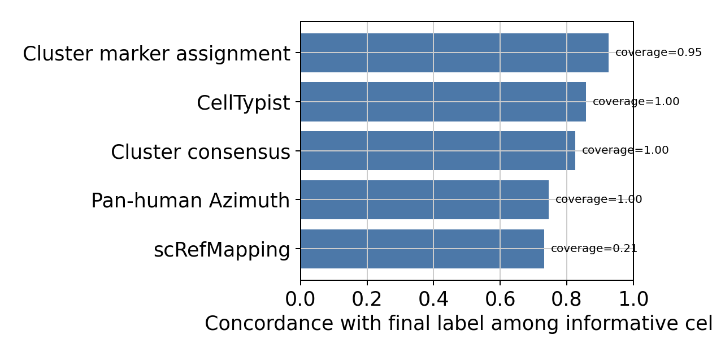

# HIPC Dataset Annotation Report: infection_study_01

Updated: 2026-06-05 EDT

This report was generated by the `hipc-annotation` Codex workflow. It is a dataset-specific review document: the fixed method lives in the repository README, while this report should expose the actual evidence, weak points, and review priorities for this dataset.

## Dataset Summary

| study | cells | analysis_X_genes | pre_hvg_genes | counts_layer_genes | labels | parent_or_blood_fraction | Blood Cell | Doublet | artifact_like | median_confidence | low_confidence | source_disagreement | invalid_labels |
| --- | --- | --- | --- | --- | --- | --- | --- | --- | --- | --- | --- | --- | --- |
| infection_study_01 | 54,924 | 3,961 | 8,000 | 3,961 | 16 | 0.003 | 178 | 981 | 1,313 | 0.777 | 2,527 | 7,522 (0.137) | none |

## Run Summary

- Execution unit: one dataset in, one annotated dataset out.
- Execution path: Codex skill `hipc-annotation` -> bundled helper `run_one.sh` -> annotation CLI -> validator -> report inspection.
- Validation checks: submission row count, H5AD observation count, official label validity, H5AD/submission agreement, confidence column, and report image links.
- This report is for dataset-specific marker availability, UMAPs, label composition, and review concerns rather than repeating the fixed workflow.

## Dataset-Specific Interpretation

- `infection_study_01`: 54,924 cells, 3,961 analysis X/var genes, 8,000 pre-HVG slot genes, 16 submitted labels, parent/Blood residual fraction 0.003, median confidence 0.777.
  - 2,527 cells have low confidence and should be inspected on QC/confidence UMAPs.
  - 981 cells are submitted as `Doublet`; inspect mixed-lineage marker expression before final submission.
  - 178 cells remain `Blood Cell`; these are residual ambiguous cells rather than filtered cells.
  - Marker availability alerts are present for: Treg, B_memory_ABC, Plasma_ASC. Fine labels relying on these marker sets should be treated cautiously.

## Dataset-Specific Assessment

- Overall: 54,924 cells / 3,961 analysis X/var genes / 8,000 pre-HVG slot genes. Parent/Blood residual fraction is 0.003; low-confidence cells are 2,527; source-disagreement flags affect 7,522 cells (0.137).
- Review priority: check whether low-confidence regions co-localize with QC artifacts or source-disagreement regions on UMAP.
- Review priority: inspect whether residual `Blood Cell` cells form isolated clusters or dispersed ambiguous zones across lineages.
- Marker availability: Treg, B_memory_ABC, Plasma_ASC are confidence-capped; validate affected labels on marker-expression UMAPs and dotplots.

## Marker Gene Availability

| study | marker_set | alert | present_fraction | missing_critical_markers | missing_genes |
| --- | --- | --- | --- | --- | --- |
| infection_study_01 | Treg | critical | 0.143 | FOXP3;IL2RA;CTLA4 | FOXP3;IL2RA;CTLA4;IKZF2;TNFRSF18;CCR8 |
| infection_study_01 | B_memory_ABC | warning | 0.500 | TNFRSF13B;FCRL5 | TNFRSF13B;FCRL5;AIM2;CD86 |
| infection_study_01 | Plasma_ASC | warning | 0.444 | MZB1 | MZB1;SDC1;IRF4;TNFRSF17;IGHG1 |

## Source Disagreement

| study | predicted_cell_type | cells | median_source_agreement | disagreement_cells | disagreement_fraction |
| --- | --- | --- | --- | --- | --- |
| infection_study_01 | Doublet | 981 | 0.000 | 981 | 1.000 |
| infection_study_01 | Blood Cell | 178 | 0.000 | 178 | 1.000 |
| infection_study_01 | Plasmablast | 44 | 0.250 | 44 | 1.000 |
| infection_study_01 | MAIT Cell | 284 | 0.667 | 78 | 0.275 |
| infection_study_01 | CD4 T Effector Memory | 4,387 | 0.667 | 1,143 | 0.261 |
| infection_study_01 | CD8 Cytotoxic / T Effector Memory | 10,509 | 1.000 | 2,561 | 0.244 |
| infection_study_01 | NK Cell | 8,060 | 1.000 | 1,021 | 0.127 |
| infection_study_01 | CD4 Naive / T Central Memory | 2,341 | 1.000 | 285 | 0.122 |
| infection_study_01 | Conventional DC 2 | 469 | 1.000 | 54 | 0.115 |
| infection_study_01 | Non-Classical Monocyte | 1,979 | 1.000 | 186 | 0.094 |
| infection_study_01 | Naive B Cell | 4,269 | 1.000 | 278 | 0.065 |
| infection_study_01 | Plasmacytoid DC | 93 | 0.667 | 6 | 0.065 |

## Annotation Source Effectiveness

This is not accuracy against external ground truth. It is an audit statistic showing how often each annotation source is informative and concordant with the final label. `coverage` is the fraction of cells with a non-`not_available` source label, `final_concordance` is concordance among informative cells, and `unique_support` counts cells where only that source agrees with the final label.

| study | source | informative_cells | coverage | final_concordance | high_conf_concordance | unique_support | discordant |
| --- | --- | --- | --- | --- | --- | --- | --- |
| infection_study_01 | CellTypist | 54,924 | 1.000 | 0.857 | 0.945 | 20 | 7,858 |
| infection_study_01 | Cluster consensus | 54,924 | 1.000 | 0.825 | 0.901 | 190 | 9,586 |
| infection_study_01 | Pan-human Azimuth | 54,924 | 1.000 | 0.746 | 0.793 | 72 | 13,962 |
| infection_study_01 | Cluster marker assignment | 52,452 | 0.955 | 0.925 | 0.964 | 3,120 | 3,918 |
| infection_study_01 | scRefMapping | 11,783 | 0.215 | 0.732 | 0.952 | 16 | 3,158 |

## Review Priorities

| study | concern | cells |
| --- | --- | --- |
| infection_study_01 | High source disagreement for Blood Cell | 178 |
| infection_study_01 | High source disagreement for Doublet | 981 |
| infection_study_01 | High source disagreement for Plasmablast | 44 |
| infection_study_01 | warning marker availability for B_memory_ABC | 2,100 |
| infection_study_01 | warning marker availability for Plasma_ASC | 172 |

## Label Composition

| study | predicted_cell_type | cells |
| --- | --- | --- |
| infection_study_01 | Classical Monocyte | 17,789 |
| infection_study_01 | CD8 Cytotoxic / T Effector Memory | 10,509 |
| infection_study_01 | NK Cell | 8,060 |
| infection_study_01 | CD4 T Effector Memory | 4,387 |
| infection_study_01 | Naive B Cell | 4,269 |
| infection_study_01 | CD4 Naive / T Central Memory | 2,341 |
| infection_study_01 | Memory B Cell | 2,100 |
| infection_study_01 | Non-Classical Monocyte | 1,979 |
| infection_study_01 | Platelet | 1,313 |
| infection_study_01 | Doublet | 981 |
| infection_study_01 | Conventional DC 2 | 469 |
| infection_study_01 | MAIT Cell | 284 |
| infection_study_01 | Blood Cell | 178 |
| infection_study_01 | Plasma Cell | 128 |
| infection_study_01 | Plasmacytoid DC | 93 |
| infection_study_01 | Plasmablast | 44 |

## Inline Figures

### infection_study_01

#### infection_study_01 B_lineage true subcluster UMAP

Tables: `tables/infection_study_01_B_lineage_true_subcluster_umap.tsv.gz`, `tables/infection_study_01_B_lineage_subcluster_candidate_scores.tsv`.

#### infection_study_01 T_NK_lineage true subcluster UMAP

Tables: `tables/infection_study_01_T_NK_lineage_true_subcluster_umap.tsv.gz`, `tables/infection_study_01_T_NK_lineage_subcluster_candidate_scores.tsv`.

#### infection_study_01 Myeloid_lineage true subcluster UMAP

Tables: `tables/infection_study_01_Myeloid_lineage_true_subcluster_umap.tsv.gz`, `tables/infection_study_01_Myeloid_lineage_subcluster_candidate_scores.tsv`.

## Subcluster Marker Score Review

The lineage-specific panels above are generated from true local subcluster analyses: each lineage subset is reclustered after HVG selection, PCA, neighbors, Leiden, and UMAP recomputation. Marker-based fine-label review should use these local UMAPs, CellTypist/Azimuth/Pan-human/cluster-level marker-gene assignment overlays, cluster marker gate score UMAPs, marker-expression UMAPs, and dotplots rather than only the global UMAP. Sparse marker labels such as Treg are adjudicated from local-cluster key-marker support, including FOXP3/IL2RA/CTLA4, together with reference support instead of a cell-wise marker winner.

## Marker Assignment Feedback

Marker-gene assignment is a cluster-level self-check rather than a forced final-label override. `raw_marker_winner` is the marker-score-only winner, while `marker_assignment` is the marker-based assignment after conservative policy and source-supported tie-break adjudication. This table highlights clusters where marker assignment disagrees with the final/reference-driven label, marker specificity is weak, or scRefMap is missing in a lineage where it is expected. `marker_score` is the final cluster-level marker gate after subtracting negative/confound-marker penalties from the raw marker base score.

| study | lineage | cluster | cells | chosen_label | marker_assignment | raw_marker_winner | assignment_reason | marker_score | base_score | penalty | flags |
| --- | --- | --- | --- | --- | --- | --- | --- | --- | --- | --- | --- |
| infection_study_01 | T_NK_lineage | 0 | 1,549 | CD8 Cytotoxic / T Effector Memory | CD8 Cytotoxic / T Effector Memory | NKT Cell | conservative_policy_blocks_raw_marker_winner | 0.565 | 1.000 | 0.435 | screfmapping_missing_for_scope |
| infection_study_01 | T_NK_lineage | 1 | 1,517 | NK Cell | NK Cell | NKT Cell | conservative_policy_blocks_raw_marker_winner | 0.868 | 1.000 | 0.132 | screfmapping_missing_for_scope |
| infection_study_01 | T_NK_lineage | 3 | 1,263 | NK Cell | NK Cell | NKT Cell | conservative_policy_blocks_raw_marker_winner | 0.911 | 1.000 | 0.089 | screfmapping_missing_for_scope |
| infection_study_01 | T_NK_lineage | 4 | 1,255 | CD8 Cytotoxic / T Effector Memory | CD8 Cytotoxic / T Effector Memory | NKT Cell | conservative_policy_blocks_raw_marker_winner | 0.667 | 1.000 | 0.333 | screfmapping_missing_for_scope |
| infection_study_01 | T_NK_lineage | 5 | 1,212 | NK Cell | NK Cell | NKT Cell | conservative_policy_blocks_raw_marker_winner | 0.838 | 0.997 | 0.159 | screfmapping_missing_for_scope |
| infection_study_01 | T_NK_lineage | 6 | 1,203 | CD4 T Effector Memory | CD4 Naive / T Central Memory | CD4 Naive / T Central Memory | raw_marker_winner | 0.829 | 1.000 | 0.171 | marker_final_disagreement |
| infection_study_01 | T_NK_lineage | 7 | 1,101 | CD8 Cytotoxic / T Effector Memory | CD8 Cytotoxic / T Effector Memory | NKT Cell | conservative_policy_blocks_raw_marker_winner | 0.719 | 1.000 | 0.281 | screfmapping_missing_for_scope |
| infection_study_01 | T_NK_lineage | 9 | 990 | CD8 Cytotoxic / T Effector Memory | CD8 Cytotoxic / T Effector Memory | NKT Cell | conservative_policy_blocks_raw_marker_winner | 0.800 | 1.000 | 0.200 | screfmapping_missing_for_scope |
| infection_study_01 | T_NK_lineage | 11 | 911 | CD4 T Effector Memory | CD4 Naive / T Central Memory | CD4 Naive / T Central Memory | raw_marker_winner | 0.746 | 0.964 | 0.218 | marker_final_disagreement |
| infection_study_01 | T_NK_lineage | 12 | 796 | NK Cell | NK Cell | NKT Cell | conservative_policy_blocks_raw_marker_winner | 0.876 | 1.000 | 0.124 | screfmapping_missing_for_scope |
| infection_study_01 | T_NK_lineage | 13 | 784 | CD8 Cytotoxic / T Effector Memory | CD8 Cytotoxic / T Effector Memory | NKT Cell | conservative_policy_blocks_raw_marker_winner | 0.745 | 1.000 | 0.255 | screfmapping_missing_for_scope |
| infection_study_01 | T_NK_lineage | 14 | 748 | CD8 Cytotoxic / T Effector Memory | CD8 Cytotoxic / T Effector Memory | NKT Cell | conservative_policy_blocks_raw_marker_winner | 0.753 | 1.000 | 0.247 | screfmapping_missing_for_scope |
| infection_study_01 | T_NK_lineage | 15 | 746 | NK Cell | NK Cell | NKT Cell | conservative_policy_blocks_raw_marker_winner | 0.854 | 0.999 | 0.145 | screfmapping_missing_for_scope |
| infection_study_01 | T_NK_lineage | 16 | 735 | CD8 Cytotoxic / T Effector Memory | CD8 Cytotoxic / T Effector Memory | NKT Cell | conservative_policy_blocks_raw_marker_winner | 0.752 | 1.000 | 0.248 | screfmapping_missing_for_scope |
| infection_study_01 | T_NK_lineage | 17 | 722 | NK Cell | NK Cell | NKT Cell | conservative_policy_blocks_raw_marker_winner | 0.840 | 0.964 | 0.124 | screfmapping_missing_for_scope |
| infection_study_01 | T_NK_lineage | 18 | 692 | NK Cell | NK Cell | NKT Cell | conservative_policy_blocks_raw_marker_winner | 0.856 | 1.000 | 0.144 | screfmapping_missing_for_scope |
| infection_study_01 | T_NK_lineage | 19 | 677 | CD8 Cytotoxic / T Effector Memory | CD8 Cytotoxic / T Effector Memory | NKT Cell | conservative_policy_blocks_raw_marker_winner | 0.645 | 1.000 | 0.355 | screfmapping_missing_for_scope |
| infection_study_01 | T_NK_lineage | 21 | 585 | CD8 Cytotoxic / T Effector Memory | CD8 Cytotoxic / T Effector Memory | NKT Cell | conservative_policy_blocks_raw_marker_winner | 0.561 | 1.000 | 0.439 | screfmapping_missing_for_scope |
| infection_study_01 | T_NK_lineage | 22 | 575 | CD8 Cytotoxic / T Effector Memory | CD8 Cytotoxic / T Effector Memory | NKT Cell | conservative_policy_blocks_raw_marker_winner | 0.554 | 1.000 | 0.446 | screfmapping_missing_for_scope |
| infection_study_01 | T_NK_lineage | 23 | 541 | CD8 Cytotoxic / T Effector Memory | CD8 Cytotoxic / T Effector Memory | NKT Cell | conservative_policy_blocks_raw_marker_winner | 0.763 | 1.000 | 0.237 | screfmapping_missing_for_scope |

## LLM Review Queue

This table is the subcluster-level review queue for Codex/LLM. The LLM should use this evidence to decide whether the final label is reasonable, whether the subcluster suggests an ontology gap, or whether a general registry/conservative-policy update should be tested. The LLM must not directly mutate per-cell labels; accepted changes should update registry/config rules and then rerun the deterministic pipeline.

| study | lineage | cluster | cells | priority | reasons | suggested_action | final_label | marker_assignment | raw_marker_winner | score_margin |
| --- | --- | --- | --- | --- | --- | --- | --- | --- | --- | --- |
| infection_study_01 | T_NK_lineage | 0 | 1,549 | medium | raw_marker_winner_changed_by_policy;ambiguous_or_missing_label_candidate;screfmapping_not_available | evaluate_ontology_gap_or_conservative_policy | CD8 Cytotoxic / T Effector Memory | CD8 Cytotoxic / T Effector Memory | NKT Cell | 1.949 |
| infection_study_01 | T_NK_lineage | 1 | 1,517 | medium | raw_marker_winner_changed_by_policy;ambiguous_or_missing_label_candidate;screfmapping_not_available | evaluate_ontology_gap_or_conservative_policy | NK Cell | NK Cell | NKT Cell | 2.208 |
| infection_study_01 | T_NK_lineage | 3 | 1,263 | medium | raw_marker_winner_changed_by_policy;ambiguous_or_missing_label_candidate;screfmapping_not_available | evaluate_ontology_gap_or_conservative_policy | NK Cell | NK Cell | NKT Cell | 2.062 |
| infection_study_01 | T_NK_lineage | 4 | 1,255 | medium | raw_marker_winner_changed_by_policy;ambiguous_or_missing_label_candidate;screfmapping_not_available | evaluate_ontology_gap_or_conservative_policy | CD8 Cytotoxic / T Effector Memory | CD8 Cytotoxic / T Effector Memory | NKT Cell | 2.181 |
| infection_study_01 | T_NK_lineage | 5 | 1,212 | medium | raw_marker_winner_changed_by_policy;ambiguous_or_missing_label_candidate;screfmapping_not_available | evaluate_ontology_gap_or_conservative_policy | NK Cell | NK Cell | NKT Cell | 2.500 |
| infection_study_01 | T_NK_lineage | 7 | 1,101 | medium | raw_marker_winner_changed_by_policy;ambiguous_or_missing_label_candidate;screfmapping_not_available | evaluate_ontology_gap_or_conservative_policy | CD8 Cytotoxic / T Effector Memory | CD8 Cytotoxic / T Effector Memory | NKT Cell | 1.508 |
| infection_study_01 | T_NK_lineage | 33 | 90 | medium | raw_marker_winner_changed_by_policy;ambiguous_or_missing_label_candidate;screfmapping_not_available;low_total_score_or_margin | evaluate_ontology_gap_or_conservative_policy | CD8 Cytotoxic / T Effector Memory | CD8 Cytotoxic / T Effector Memory | NKT Cell | 0.063 |
| infection_study_01 | T_NK_lineage | 9 | 990 | medium | raw_marker_winner_changed_by_policy;ambiguous_or_missing_label_candidate;screfmapping_not_available | evaluate_ontology_gap_or_conservative_policy | CD8 Cytotoxic / T Effector Memory | CD8 Cytotoxic / T Effector Memory | NKT Cell | 0.141 |
| infection_study_01 | T_NK_lineage | 12 | 796 | medium | raw_marker_winner_changed_by_policy;ambiguous_or_missing_label_candidate;screfmapping_not_available | evaluate_ontology_gap_or_conservative_policy | NK Cell | NK Cell | NKT Cell | 2.312 |
| infection_study_01 | T_NK_lineage | 13 | 784 | medium | raw_marker_winner_changed_by_policy;ambiguous_or_missing_label_candidate;screfmapping_not_available | evaluate_ontology_gap_or_conservative_policy | CD8 Cytotoxic / T Effector Memory | CD8 Cytotoxic / T Effector Memory | NKT Cell | 0.392 |
| infection_study_01 | T_NK_lineage | 14 | 748 | medium | raw_marker_winner_changed_by_policy;ambiguous_or_missing_label_candidate;screfmapping_not_available | evaluate_ontology_gap_or_conservative_policy | CD8 Cytotoxic / T Effector Memory | CD8 Cytotoxic / T Effector Memory | NKT Cell | 1.238 |
| infection_study_01 | T_NK_lineage | 15 | 746 | medium | raw_marker_winner_changed_by_policy;ambiguous_or_missing_label_candidate;screfmapping_not_available | evaluate_ontology_gap_or_conservative_policy | NK Cell | NK Cell | NKT Cell | 2.519 |
| infection_study_01 | T_NK_lineage | 16 | 735 | medium | raw_marker_winner_changed_by_policy;ambiguous_or_missing_label_candidate;screfmapping_not_available | evaluate_ontology_gap_or_conservative_policy | CD8 Cytotoxic / T Effector Memory | CD8 Cytotoxic / T Effector Memory | NKT Cell | 2.038 |
| infection_study_01 | T_NK_lineage | 17 | 722 | medium | raw_marker_winner_changed_by_policy;ambiguous_or_missing_label_candidate;screfmapping_not_available | evaluate_ontology_gap_or_conservative_policy | NK Cell | NK Cell | NKT Cell | 0.173 |
| infection_study_01 | T_NK_lineage | 18 | 692 | medium | raw_marker_winner_changed_by_policy;ambiguous_or_missing_label_candidate;screfmapping_not_available | evaluate_ontology_gap_or_conservative_policy | NK Cell | NK Cell | NKT Cell | 2.413 |
| infection_study_01 | T_NK_lineage | 19 | 677 | medium | raw_marker_winner_changed_by_policy;ambiguous_or_missing_label_candidate;screfmapping_not_available | evaluate_ontology_gap_or_conservative_policy | CD8 Cytotoxic / T Effector Memory | CD8 Cytotoxic / T Effector Memory | NKT Cell | 2.307 |
| infection_study_01 | T_NK_lineage | 21 | 585 | medium | raw_marker_winner_changed_by_policy;ambiguous_or_missing_label_candidate;screfmapping_not_available | evaluate_ontology_gap_or_conservative_policy | CD8 Cytotoxic / T Effector Memory | CD8 Cytotoxic / T Effector Memory | NKT Cell | 2.543 |
| infection_study_01 | T_NK_lineage | 22 | 575 | medium | raw_marker_winner_changed_by_policy;ambiguous_or_missing_label_candidate;screfmapping_not_available | evaluate_ontology_gap_or_conservative_policy | CD8 Cytotoxic / T Effector Memory | CD8 Cytotoxic / T Effector Memory | NKT Cell | 2.491 |
| infection_study_01 | T_NK_lineage | 23 | 541 | medium | raw_marker_winner_changed_by_policy;ambiguous_or_missing_label_candidate;screfmapping_not_available | evaluate_ontology_gap_or_conservative_policy | CD8 Cytotoxic / T Effector Memory | CD8 Cytotoxic / T Effector Memory | NKT Cell | 2.355 |
| infection_study_01 | T_NK_lineage | 25 | 441 | medium | raw_marker_winner_changed_by_policy;ambiguous_or_missing_label_candidate;screfmapping_not_available | evaluate_ontology_gap_or_conservative_policy | NK Cell | NK Cell | NKT Cell | 0.524 |

## Cluster Consensus Evidence

| study | lineage | cluster | cells | chosen_label | accepted | score_margin | cluster_marker_assignment | treg_key_any | treg_key_bonus | marker_set | marker_alert |
| --- | --- | --- | --- | --- | --- | --- | --- | --- | --- | --- | --- |
| infection_study_01 | B_lineage | 0 | 504 | Memory B Cell | True | 4.223 | Memory B Cell | nan | nan | registry__memory_b_cell | pass |
| infection_study_01 | B_lineage | 1 | 473 | Naive B Cell | True | 4.191 | Naive B Cell | nan | nan | registry__naive_b_cell | pass |
| infection_study_01 | B_lineage | 2 | 467 | Naive B Cell | True | 4.431 | Naive B Cell | nan | nan | registry__naive_b_cell | pass |
| infection_study_01 | B_lineage | 3 | 460 | Memory B Cell | True | 2.943 | Naive B Cell | nan | nan | registry__memory_b_cell | pass |
| infection_study_01 | B_lineage | 4 | 416 | Naive B Cell | True | 4.582 | Naive B Cell | nan | nan | registry__naive_b_cell | pass |
| infection_study_01 | B_lineage | 5 | 376 | Naive B Cell | True | 3.732 | Naive B Cell | nan | nan | registry__naive_b_cell | pass |
| infection_study_01 | B_lineage | 6 | 369 | Naive B Cell | True | 4.196 | Naive B Cell | nan | nan | registry__naive_b_cell | pass |
| infection_study_01 | B_lineage | 7 | 346 | Naive B Cell | True | 4.258 | Naive B Cell | nan | nan | registry__naive_b_cell | pass |
| infection_study_01 | B_lineage | 8 | 327 | Memory B Cell | True | 2.872 | Naive B Cell | nan | nan | registry__memory_b_cell | pass |
| infection_study_01 | B_lineage | 9 | 326 | Naive B Cell | True | 4.241 | Naive B Cell | nan | nan | registry__naive_b_cell | pass |
| infection_study_01 | B_lineage | 10 | 321 | Memory B Cell | True | 3.339 | Memory B Cell | nan | nan | registry__memory_b_cell | pass |
| infection_study_01 | B_lineage | 11 | 288 | Memory B Cell | True | 3.718 | Memory B Cell | nan | nan | registry__memory_b_cell | pass |
| infection_study_01 | B_lineage | 12 | 280 | Naive B Cell | True | 4.006 | Naive B Cell | nan | nan | registry__naive_b_cell | pass |
| infection_study_01 | B_lineage | 13 | 241 | Naive B Cell | True | 2.294 | Naive B Cell | nan | nan | registry__naive_b_cell | pass |
| infection_study_01 | B_lineage | 14 | 217 | Naive B Cell | True | 4.361 | Naive B Cell | nan | nan | registry__naive_b_cell | pass |
| infection_study_01 | B_lineage | 15 | 216 | Naive B Cell | True | 4.369 | Naive B Cell | nan | nan | registry__naive_b_cell | pass |
| infection_study_01 | B_lineage | 16 | 200 | Memory B Cell | True | 2.771 | Naive B Cell | nan | nan | registry__memory_b_cell | pass |
| infection_study_01 | B_lineage | 17 | 167 | Naive B Cell | True | 4.314 | Naive B Cell | nan | nan | registry__naive_b_cell | pass |
| infection_study_01 | B_lineage | 18 | 151 | Naive B Cell | True | 2.082 | Naive B Cell | nan | nan | registry__naive_b_cell | pass |
| infection_study_01 | B_lineage | 19 | 138 | Naive B Cell | True | 3.781 | Naive B Cell | nan | nan | registry__naive_b_cell | pass |
| infection_study_01 | B_lineage | 20 | 128 | Plasma Cell | True | 3.512 | Plasma Cell | nan | nan | registry__plasma_cell | pass |
| infection_study_01 | B_lineage | 21 | 44 | Plasmablast | True | 0.437 | Plasmablast | nan | nan | registry__plasmablast | pass |
| infection_study_01 | B_lineage | 22 | 42 | Naive B Cell | True | 2.572 | Naive B Cell | nan | nan | registry__naive_b_cell | pass |
| infection_study_01 | B_lineage | 23 | 23 | Naive B Cell | True | 2.547 | Naive B Cell | nan | nan | registry__naive_b_cell | pass |
| infection_study_01 | B_lineage | 24 | 21 | Naive B Cell | True | 2.148 | Naive B Cell | nan | nan | registry__naive_b_cell | pass |
| infection_study_01 | Myeloid_lineage | 0 | 1,613 | Non-Classical Monocyte | True | 1.692 | Non-Classical Monocyte | nan | nan | registry__non_classical_monocyte | pass |
| infection_study_01 | Myeloid_lineage | 1 | 1,595 | Classical Monocyte | True | 2.463 | Classical Monocyte | nan | nan | registry__classical_monocyte | pass |
| infection_study_01 | Myeloid_lineage | 2 | 1,496 | Classical Monocyte | True | 2.520 | Classical Monocyte | nan | nan | registry__classical_monocyte | pass |
| infection_study_01 | Myeloid_lineage | 3 | 1,447 | Classical Monocyte | True | 1.947 | Classical Monocyte | nan | nan | registry__classical_monocyte | pass |
| infection_study_01 | Myeloid_lineage | 4 | 1,327 | Classical Monocyte | True | 2.144 | Classical Monocyte | nan | nan | registry__classical_monocyte | pass |

## Output Files

- Submission TSVs: `/vast/palmer/pi/hafler/yy693/HIPC-scRNAseq-Annotation/outputs/submission_final_v22/infection_study_01/submissions/`
- cellxgene H5ADs: `/vast/palmer/pi/hafler/yy693/HIPC-scRNAseq-Annotation/outputs/submission_final_v22/infection_study_01/cellxgene/`
- Marker availability table: `/vast/palmer/pi/hafler/yy693/HIPC-scRNAseq-Annotation/outputs/submission_final_v22/infection_study_01/tables/marker_gene_availability.tsv`
- Marker availability alerts: `/vast/palmer/pi/hafler/yy693/HIPC-scRNAseq-Annotation/outputs/submission_final_v22/infection_study_01/tables/marker_gene_availability_alerts.tsv`
- Subcluster evidence: `/vast/palmer/pi/hafler/yy693/HIPC-scRNAseq-Annotation/outputs/submission_final_v22/infection_study_01/tables/lineage_subcluster_evidence.tsv.gz`
- Source disagreement summary: `/vast/palmer/pi/hafler/yy693/HIPC-scRNAseq-Annotation/outputs/submission_final_v22/infection_study_01/tables/source_disagreement_summary.tsv`
- Source effectiveness summary: `/vast/palmer/pi/hafler/yy693/HIPC-scRNAseq-Annotation/outputs/submission_final_v22/infection_study_01/tables/source_effectiveness_summary.tsv`
- Diagnostics tables: `/vast/palmer/pi/hafler/yy693/HIPC-scRNAseq-Annotation/outputs/submission_final_v22/infection_study_01/tables/`

