# infection_study_01 Annotation Report

Updated: 2026-06-03 EDT

## Dataset-Specific Assessment

主要な PBMC 構造は見えていますが、T lineage cluster では意図的に conservative な call が残っています。generic T Cell residual は、無理に細分化するより marker/source review を前提に扱うべきです。

## Key Metrics

| Metric                         | Value        |
|:-------------------------------|:-------------|
| Cells                          | 54,924       |
| Genes in H5AD var              | 33,538       |
| Submitted labels               | 22           |
| Parent or Blood fallback cells | 4,827 (8.8%) |
| Doublet calls                  | 1,278        |
| Median confidence              | 0.92         |
| CD4 T Effector Memory calls    | 1,159        |
| Generic T Cell calls           | 3,672        |
| Generic B Cell calls           | 29           |

## Review Priorities

- final label は source-label UMAP と合わせて確認する。完全一致は必須ではありませんが、UMAP 上でまとまった source disagreement は解釈が必要です。
- pDC、plasma/plasmablast、Treg、effector-memory T state など狭い label は marker-expression panel を見て判断します。
- `Doublet` は filter out ではなく submitted label として扱います。
- parent または Blood fallback label は conservative uncertainty を表すため、terminal label に無理に押し込まず UMAP 上で確認します。

## Inline Figures

### Final submitted labels

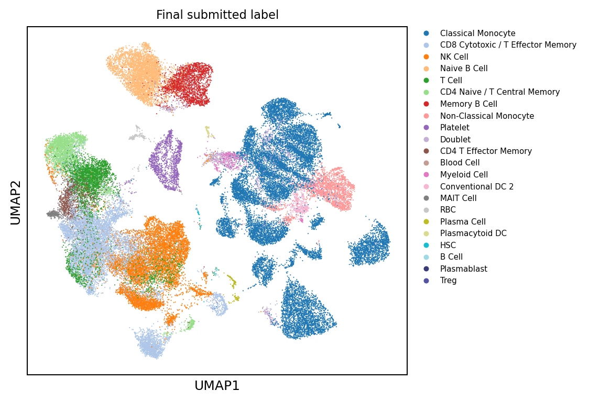

### QC and confidence

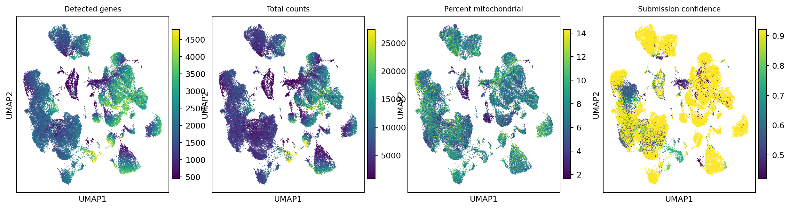

### Annotation source labels

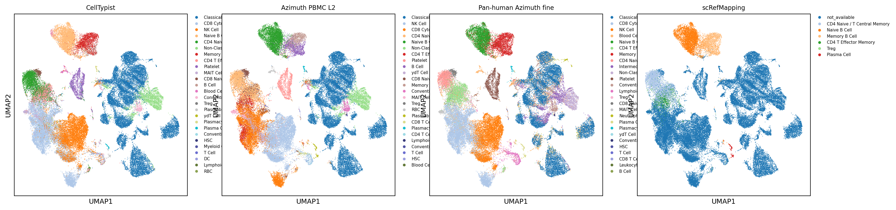

### Lineage, reason, and doublet overlays

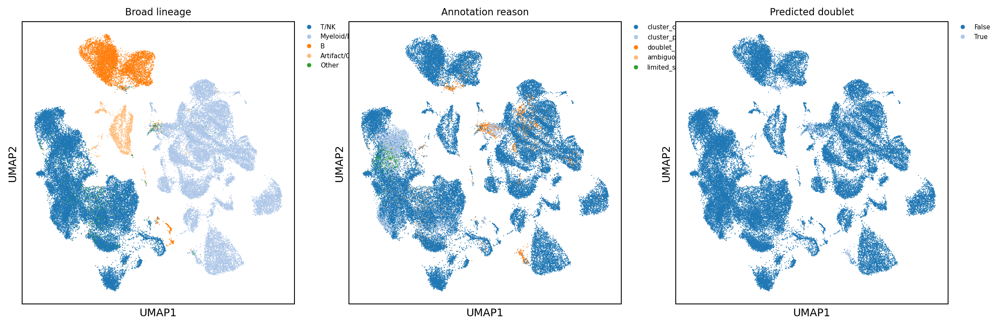

### Lineage core marker expression

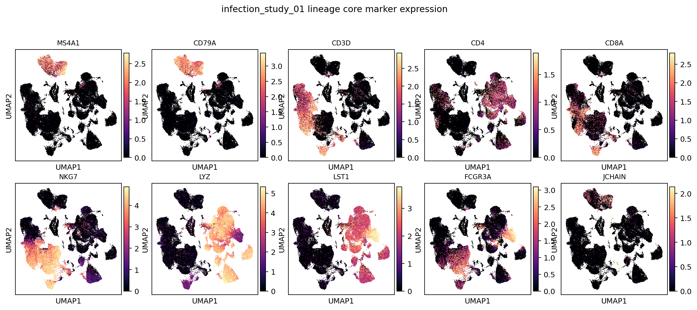

### B-lineage subcluster labels

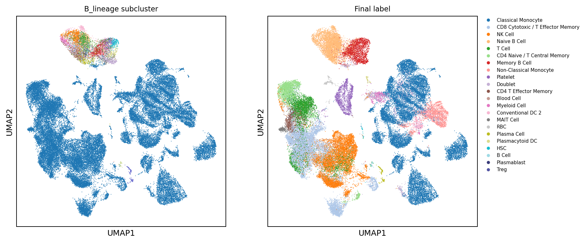

### B-lineage marker expression

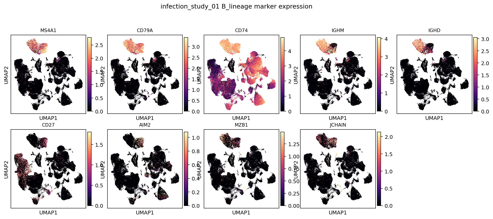

### T/NK-lineage subcluster labels

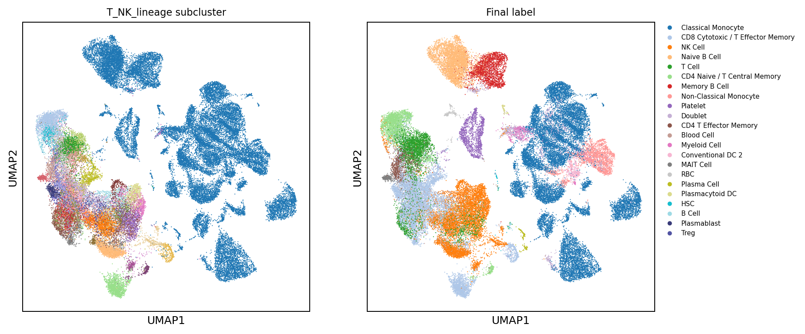

### T/NK-lineage marker expression

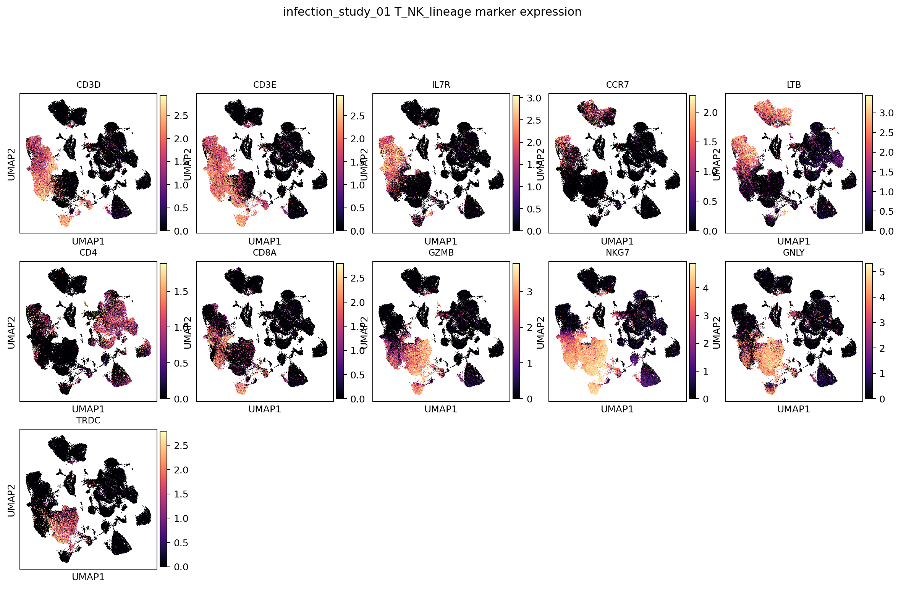

### Myeloid/DC-lineage subcluster labels

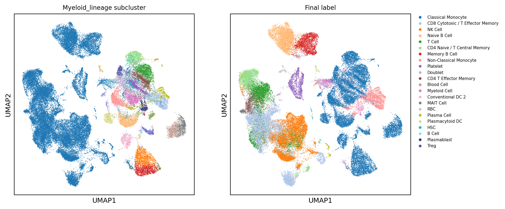

### Myeloid/DC-lineage marker expression

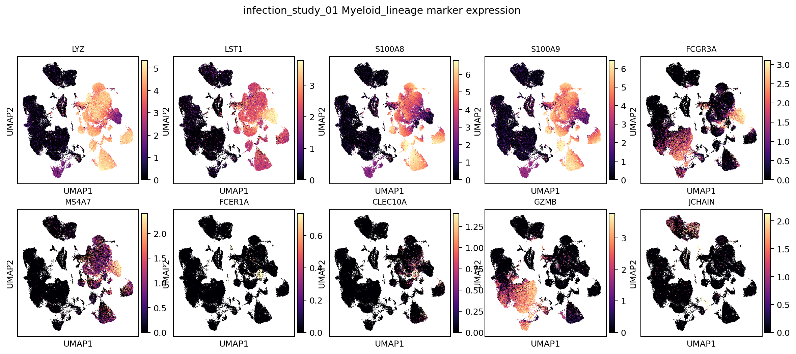

## Label Composition

| predicted_cell_type               |   n_cells | fraction   |
|:----------------------------------|----------:|:-----------|
| Classical Monocyte                |     16771 | 30.5%      |
| CD8 Cytotoxic / T Effector Memory |      9299 | 16.9%      |
| NK Cell                           |      7851 | 14.3%      |
| Naive B Cell                      |      4157 | 7.6%       |
| T Cell                            |      3672 | 6.7%       |
| CD4 Naive / T Central Memory      |      2779 | 5.1%       |
| Memory B Cell                     |      2165 | 3.9%       |
| Non-Classical Monocyte            |      2122 | 3.9%       |
| Platelet                          |      1391 | 2.5%       |
| Doublet                           |      1278 | 2.3%       |
| CD4 T Effector Memory             |      1159 | 2.1%       |
| Blood Cell                        |       679 | 1.2%       |
| Myeloid Cell                      |       447 | 0.8%       |
| Conventional DC 2                 |       423 | 0.8%       |
| MAIT Cell                         |       253 | 0.5%       |

## Cluster Consensus Evidence

| broad_lineage   | cluster           |   n_cells | chosen_label                      | accepted   | best_candidate_before_parent_fallback   |   score_margin |   marker_pct |   source_fraction | cluster_reason                          |
|:----------------|:------------------|----------:|:----------------------------------|:-----------|:----------------------------------------|---------------:|-------------:|------------------:|:----------------------------------------|
| T/NK            | T_NK_lineage:0    |      1627 | CD4 Naive / T Central Memory      | True       | CD4 Naive / T Central Memory            |           1.09 |         0.96 |              0.63 | cluster_consensus_marker_source_support |
| T/NK            | T_NK_lineage:1    |      1482 | NK Cell                           | True       | NK Cell                                 |           0.67 |         0.89 |              0.48 | cluster_consensus_marker_source_support |
| Myeloid/DC      | Myeloid_lineage:0 |      1455 | Non-Classical Monocyte            | True       | Non-Classical Monocyte                  |           2.09 |         0.98 |              0.66 | cluster_consensus_marker_source_support |
| Myeloid/DC      | Myeloid_lineage:1 |      1411 | Classical Monocyte                | True       | Classical Monocyte                      |           1.15 |         0.88 |              0.7  | cluster_consensus_marker_source_support |
| Myeloid/DC      | Myeloid_lineage:2 |      1354 | Classical Monocyte                | True       | Classical Monocyte                      |           1.12 |         0.82 |              0.66 | cluster_consensus_marker_source_support |
| Artifact/Other  | leiden:16         |      1335 | Platelet                          | True       | Platelet                                |           2.96 |         0.99 |              0.84 | cluster_consensus_marker_source_support |
| T/NK            | T_NK_lineage:4    |      1323 | CD8 Cytotoxic / T Effector Memory | True       | CD8 Cytotoxic / T Effector Memory       |           1.79 |         0.94 |              0.55 | cluster_consensus_marker_source_support |
| T/NK            | T_NK_lineage:3    |      1317 | T Cell                            | False      | CD4 T Effector Memory                   |           0.23 |         0.93 |              0.38 | cluster_parent_insufficient_consensus   |
| Myeloid/DC      | Myeloid_lineage:3 |      1295 | Classical Monocyte                | True       | Classical Monocyte                      |           0.91 |         0.75 |              0.68 | cluster_consensus_marker_source_support |
| T/NK            | T_NK_lineage:2    |      1290 | NK Cell                           | True       | NK Cell                                 |           1.21 |         0.94 |              0.62 | cluster_consensus_marker_source_support |
| Myeloid/DC      | Myeloid_lineage:4 |      1199 | Classical Monocyte                | True       | Classical Monocyte                      |           1.47 |         0.9  |              0.68 | cluster_consensus_marker_source_support |
| Myeloid/DC      | Myeloid_lineage:5 |      1196 | Classical Monocyte                | True       | Classical Monocyte                      |           1.29 |         0.86 |              0.71 | cluster_consensus_marker_source_support |
| Myeloid/DC      | Myeloid_lineage:6 |      1187 | Classical Monocyte                | True       | Classical Monocyte                      |           1.22 |         0.8  |              0.68 | cluster_consensus_marker_source_support |
| T/NK            | T_NK_lineage:5    |      1175 | CD8 Cytotoxic / T Effector Memory | True       | CD8 Cytotoxic / T Effector Memory       |           1.31 |         0.92 |              0.51 | cluster_consensus_marker_source_support |
| T/NK            | T_NK_lineage:7    |       987 | NK Cell                           | True       | NK Cell                                 |           1.58 |         0.95 |              0.71 | cluster_consensus_marker_source_support |
| T/NK            | T_NK_lineage:6    |       973 | CD8 Cytotoxic / T Effector Memory | True       | CD8 Cytotoxic / T Effector Memory       |           1.07 |         0.85 |              0.46 | cluster_consensus_marker_source_support |
| Myeloid/DC      | Myeloid_lineage:7 |       949 | Classical Monocyte                | True       | Classical Monocyte                      |           0.64 |         0.65 |              0.63 | cluster_consensus_marker_source_support |
| Myeloid/DC      | Myeloid_lineage:8 |       918 | Classical Monocyte                | True       | Classical Monocyte                      |           1.38 |         0.87 |              0.69 | cluster_consensus_marker_source_support |
| Myeloid/DC      | Myeloid_lineage:9 |       894 | Classical Monocyte                | True       | Classical Monocyte                      |           0.94 |         0.72 |              0.66 | cluster_consensus_marker_source_support |
| T/NK            | T_NK_lineage:8    |       868 | CD8 Cytotoxic / T Effector Memory | True       | CD8 Cytotoxic / T Effector Memory       |           0.93 |         0.86 |              0.42 | cluster_consensus_marker_source_support |

## Output Files

- Label counts: `tables/label_counts.tsv`
- Cluster decisions: `tables/cluster_consensus_decisions.tsv`
- Local H5AD: `/vast/palmer/pi/hafler/yy693/HIPC-scRNAseq-Annotation/outputs/final_annotations/current_cluster_consensus/cellxgene/infection_study_01.final_annotation.cluster_consensus.cxg.h5ad`
- Local submission TSV: `/vast/palmer/pi/hafler/yy693/HIPC-scRNAseq-Annotation/outputs/final_annotations/current_cluster_consensus/submissions/infection_study_01_annotation.tsv`
