# infection_study_04 Annotation Report

Updated: 2026-06-03 EDT

## Dataset-Specific Assessment

B と T compartment に中程度の曖昧さが残ります。source UMAP と lineage marker panel を見て、本当に曖昧なのか、単に conservative fallback なのかを分けて確認する必要があります。

## Key Metrics

| Metric                         | Value        |
|:-------------------------------|:-------------|
| Cells                          | 43,767       |
| Genes in H5AD var              | 26,361       |
| Submitted labels               | 23           |
| Parent or Blood fallback cells | 3,516 (8.0%) |
| Doublet calls                  | 132          |
| Median confidence              | 0.92         |
| CD4 T Effector Memory calls    | 53           |
| Generic T Cell calls           | 458          |
| Generic B Cell calls           | 450          |

## Review Priorities

- final label は source-label UMAP と合わせて確認する。完全一致は必須ではありませんが、UMAP 上でまとまった source disagreement は解釈が必要です。
- pDC、plasma/plasmablast、Treg、effector-memory T state など狭い label は marker-expression panel を見て判断します。
- `Doublet` は filter out ではなく submitted label として扱います。
- parent または Blood fallback label は conservative uncertainty を表すため、terminal label に無理に押し込まず UMAP 上で確認します。

## Inline Figures

### Final submitted labels

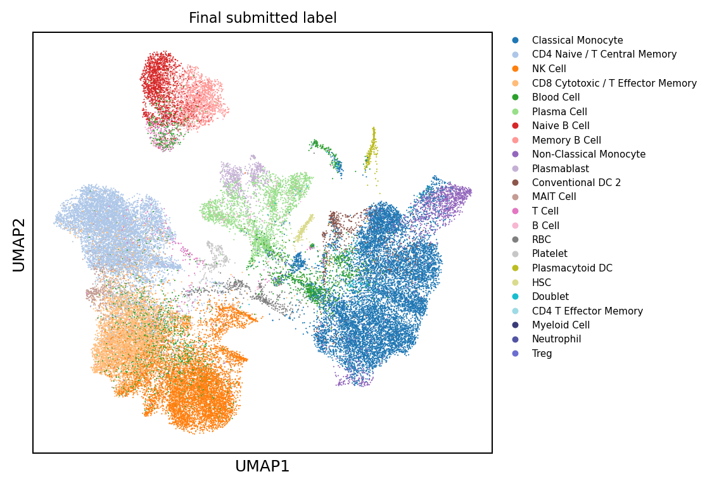

### QC and confidence

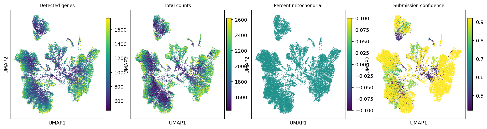

### Annotation source labels

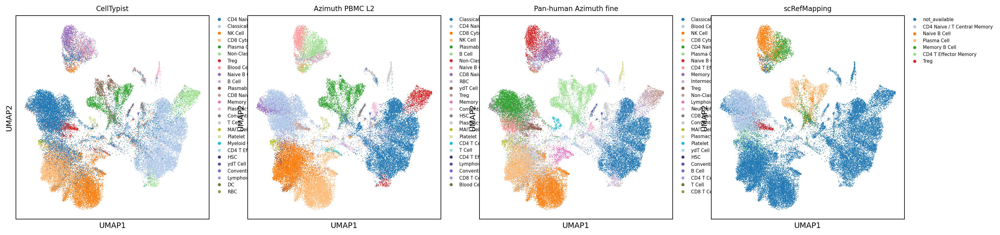

### Lineage, reason, and doublet overlays

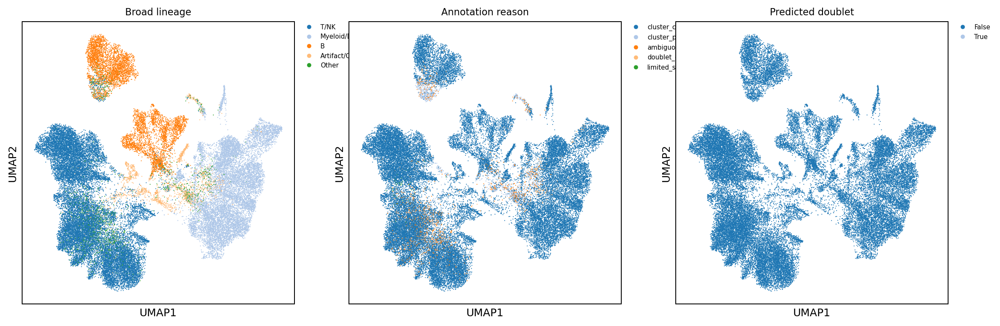

### Lineage core marker expression

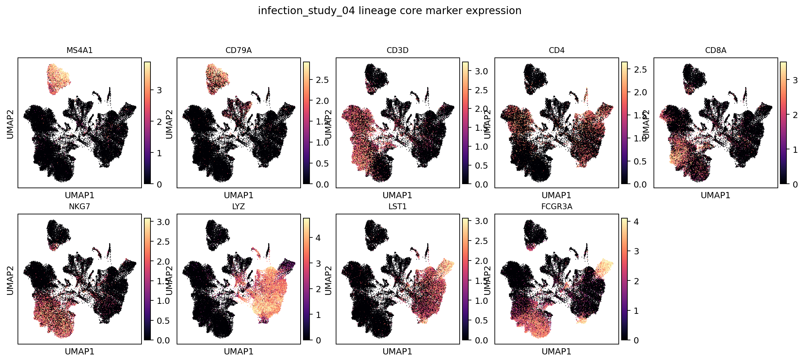

### B-lineage subcluster labels

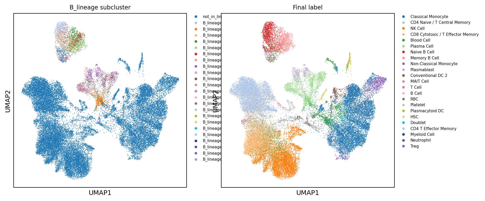

### B-lineage marker expression

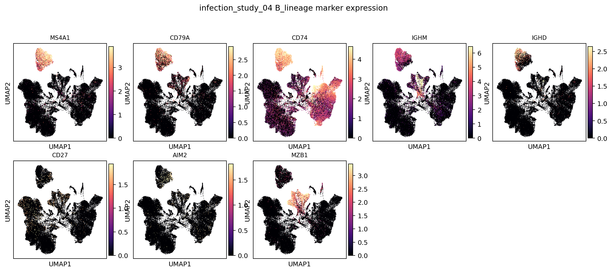

### T/NK-lineage subcluster labels

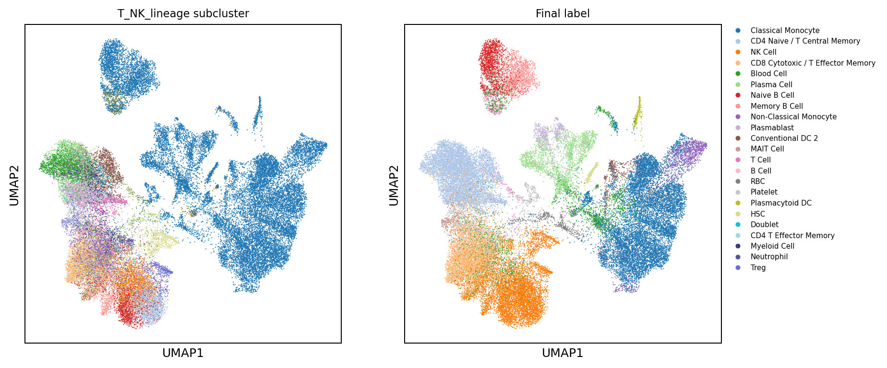

### T/NK-lineage marker expression

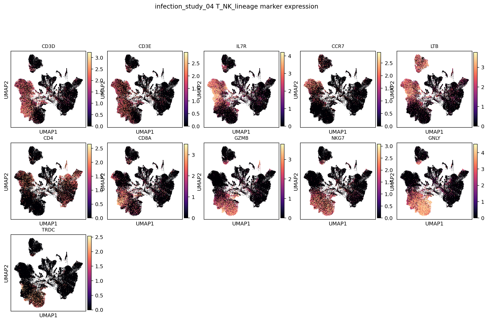

### Myeloid/DC-lineage subcluster labels

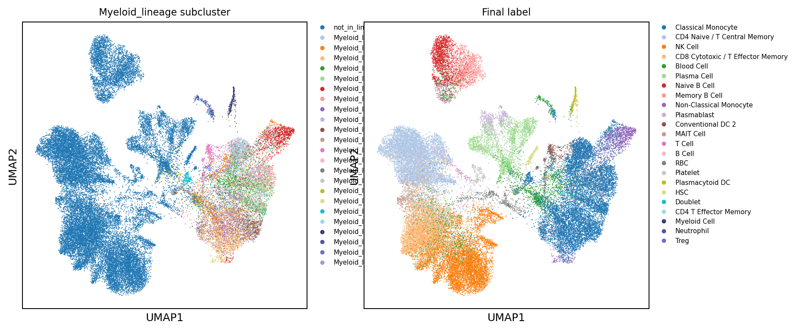

### Myeloid/DC-lineage marker expression

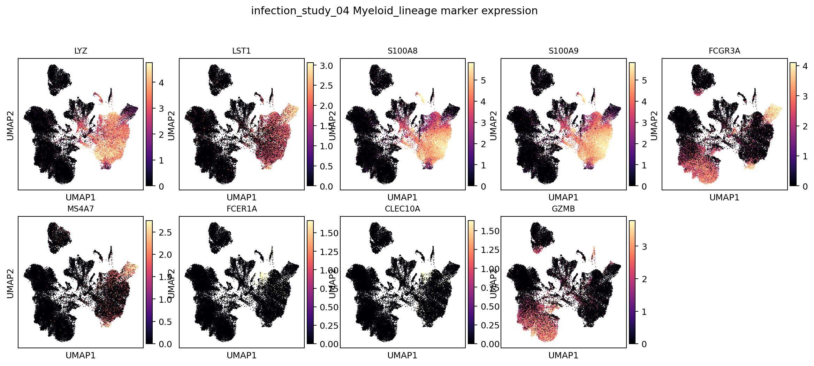

## Label Composition

| predicted_cell_type               |   n_cells | fraction   |
|:----------------------------------|----------:|:-----------|
| Classical Monocyte                |     10292 | 23.5%      |
| CD4 Naive / T Central Memory      |      7960 | 18.2%      |
| NK Cell                           |      6813 | 15.6%      |
| CD8 Cytotoxic / T Effector Memory |      5780 | 13.2%      |
| Blood Cell                        |      2597 | 5.9%       |
| Plasma Cell                       |      2323 | 5.3%       |
| Naive B Cell                      |      1540 | 3.5%       |
| Memory B Cell                     |      1366 | 3.1%       |
| Non-Classical Monocyte            |      1240 | 2.8%       |
| Plasmablast                       |       571 | 1.3%       |
| Conventional DC 2                 |       547 | 1.2%       |
| MAIT Cell                         |       481 | 1.1%       |
| T Cell                            |       458 | 1.0%       |
| B Cell                            |       450 | 1.0%       |
| RBC                               |       422 | 1.0%       |

## Cluster Consensus Evidence

| broad_lineage   | cluster           |   n_cells | chosen_label                      | accepted   | best_candidate_before_parent_fallback   |   score_margin |   marker_pct |   source_fraction | cluster_reason                          |
|:----------------|:------------------|----------:|:----------------------------------|:-----------|:----------------------------------------|---------------:|-------------:|------------------:|:----------------------------------------|
| T/NK            | T_NK_lineage:0    |      1748 | NK Cell                           | True       | NK Cell                                 |           1.65 |         0.94 |              0.69 | cluster_consensus_marker_source_support |
| T/NK            | T_NK_lineage:3    |      1482 | CD4 Naive / T Central Memory      | True       | CD4 Naive / T Central Memory            |           0.83 |         0.89 |              0.63 | cluster_consensus_marker_source_support |
| T/NK            | T_NK_lineage:2    |      1423 | CD8 Cytotoxic / T Effector Memory | True       | CD8 Cytotoxic / T Effector Memory       |           1.59 |         0.9  |              0.49 | cluster_consensus_marker_source_support |
| T/NK            | T_NK_lineage:4    |      1418 | CD4 Naive / T Central Memory      | True       | CD4 Naive / T Central Memory            |           1.36 |         0.94 |              0.66 | cluster_consensus_marker_source_support |
| T/NK            | T_NK_lineage:1    |      1388 | NK Cell                           | True       | NK Cell                                 |           1.2  |         0.91 |              0.56 | cluster_consensus_marker_source_support |
| T/NK            | T_NK_lineage:5    |      1262 | NK Cell                           | True       | NK Cell                                 |           1.35 |         0.94 |              0.59 | cluster_consensus_marker_source_support |
| Myeloid/DC      | Myeloid_lineage:0 |      1194 | Classical Monocyte                | True       | Classical Monocyte                      |           1.1  |         0.78 |              0.66 | cluster_consensus_marker_source_support |
| T/NK            | T_NK_lineage:8    |      1186 | CD4 Naive / T Central Memory      | True       | CD4 Naive / T Central Memory            |           1    |         0.9  |              0.55 | cluster_consensus_marker_source_support |
| T/NK            | T_NK_lineage:6    |      1111 | NK Cell                           | True       | NK Cell                                 |           0.31 |         0.85 |              0.35 | cluster_consensus_marker_source_support |
| T/NK            | T_NK_lineage:7    |      1089 | CD8 Cytotoxic / T Effector Memory | True       | CD8 Cytotoxic / T Effector Memory       |           1.17 |         0.88 |              0.4  | cluster_consensus_marker_source_support |
| Myeloid/DC      | Myeloid_lineage:2 |      1050 | Classical Monocyte                | True       | Classical Monocyte                      |           1.5  |         0.88 |              0.66 | cluster_consensus_marker_source_support |
| Myeloid/DC      | Myeloid_lineage:4 |      1030 | Classical Monocyte                | True       | Classical Monocyte                      |           1.54 |         0.89 |              0.69 | cluster_consensus_marker_source_support |
| T/NK            | T_NK_lineage:9    |      1013 | CD4 Naive / T Central Memory      | True       | CD4 Naive / T Central Memory            |           1.19 |         0.9  |              0.6  | cluster_consensus_marker_source_support |
| Myeloid/DC      | Myeloid_lineage:3 |       958 | Classical Monocyte                | True       | Classical Monocyte                      |           1.34 |         0.84 |              0.63 | cluster_consensus_marker_source_support |
| Myeloid/DC      | Myeloid_lineage:5 |       941 | Non-Classical Monocyte            | True       | Non-Classical Monocyte                  |           2.02 |         0.99 |              0.61 | cluster_consensus_marker_source_support |
| Myeloid/DC      | Myeloid_lineage:1 |       940 | Classical Monocyte                | True       | Classical Monocyte                      |           1.27 |         0.82 |              0.51 | cluster_consensus_marker_source_support |
| T/NK            | T_NK_lineage:10   |       845 | CD4 Naive / T Central Memory      | True       | CD4 Naive / T Central Memory            |           1.21 |         0.9  |              0.67 | cluster_consensus_marker_source_support |
| B               | B_lineage:0       |       802 | Naive B Cell                      | True       | Naive B Cell                            |           2.03 |         0.99 |              0.51 | cluster_consensus_marker_source_support |
| T/NK            | T_NK_lineage:11   |       755 | CD4 Naive / T Central Memory      | True       | CD4 Naive / T Central Memory            |           0.2  |         0.85 |              0.33 | cluster_consensus_marker_source_support |
| Myeloid/DC      | Myeloid_lineage:6 |       705 | Classical Monocyte                | True       | Classical Monocyte                      |           1.12 |         0.79 |              0.65 | cluster_consensus_marker_source_support |

## Output Files

- Label counts: `tables/label_counts.tsv`
- Cluster decisions: `tables/cluster_consensus_decisions.tsv`
- Local H5AD: `/vast/palmer/pi/hafler/yy693/HIPC-scRNAseq-Annotation/outputs/final_annotations/current_cluster_consensus/cellxgene/infection_study_04.final_annotation.cluster_consensus.cxg.h5ad`
- Local submission TSV: `/vast/palmer/pi/hafler/yy693/HIPC-scRNAseq-Annotation/outputs/final_annotations/current_cluster_consensus/submissions/infection_study_04_annotation.tsv`
