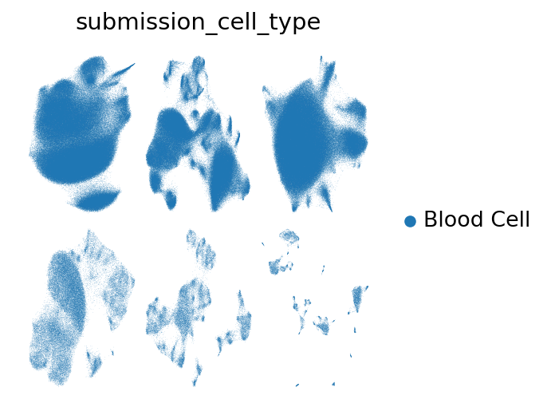
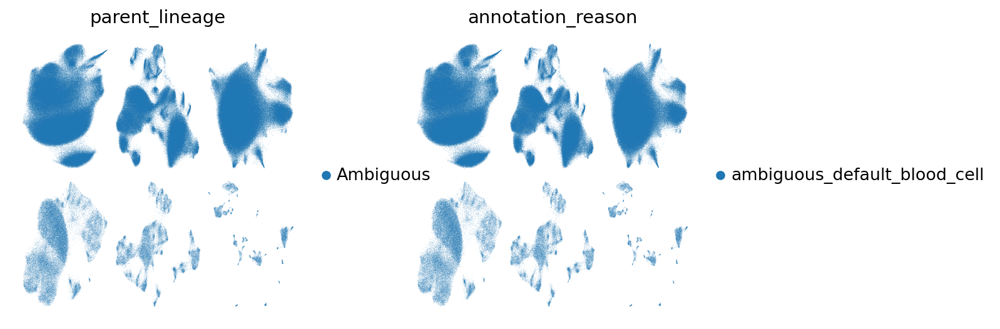
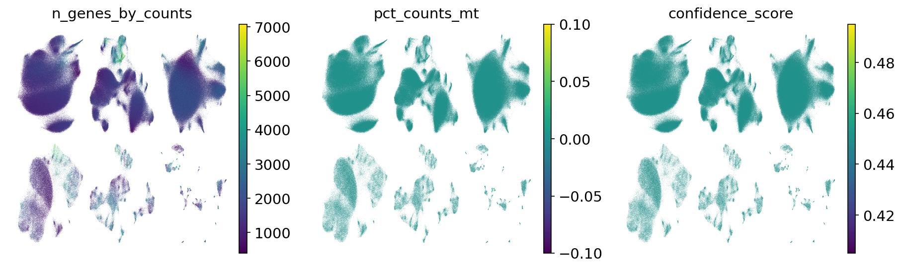
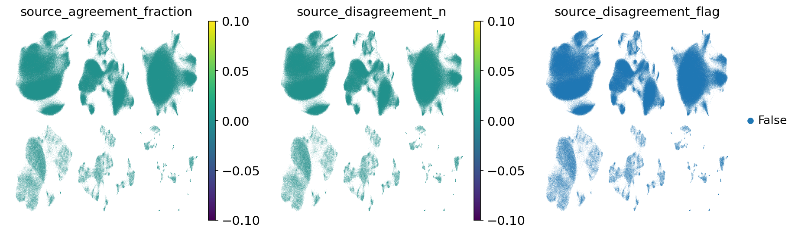
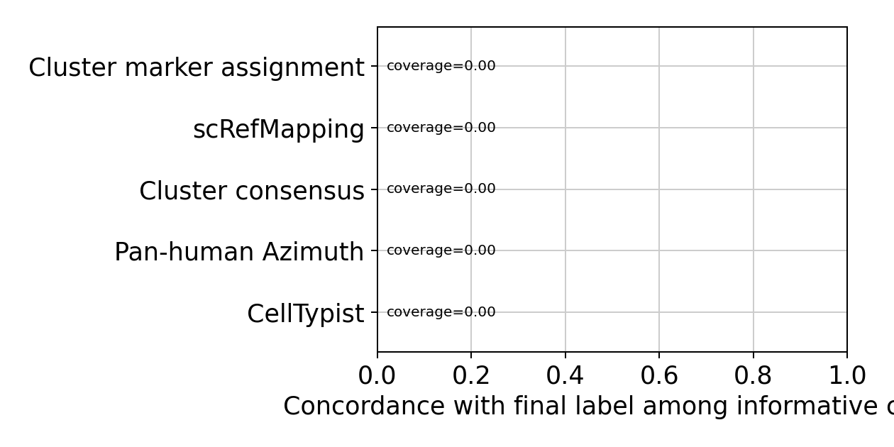
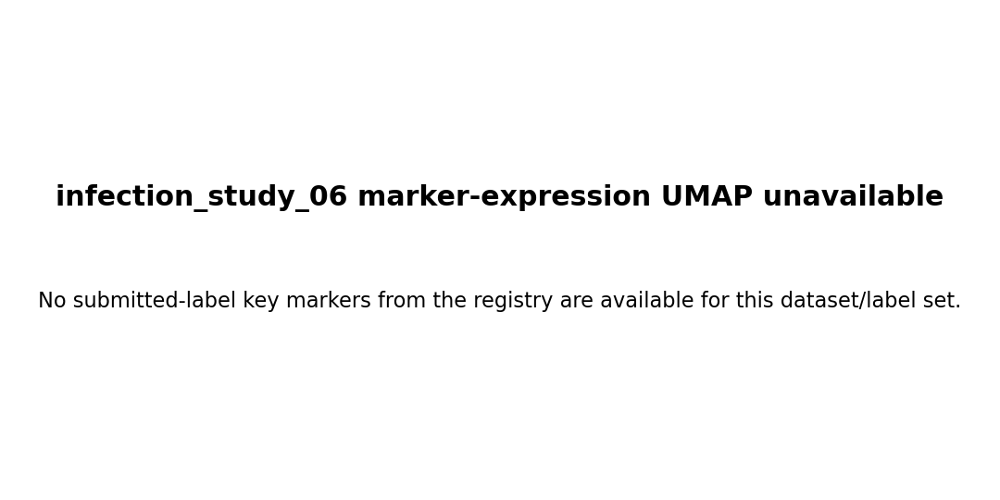
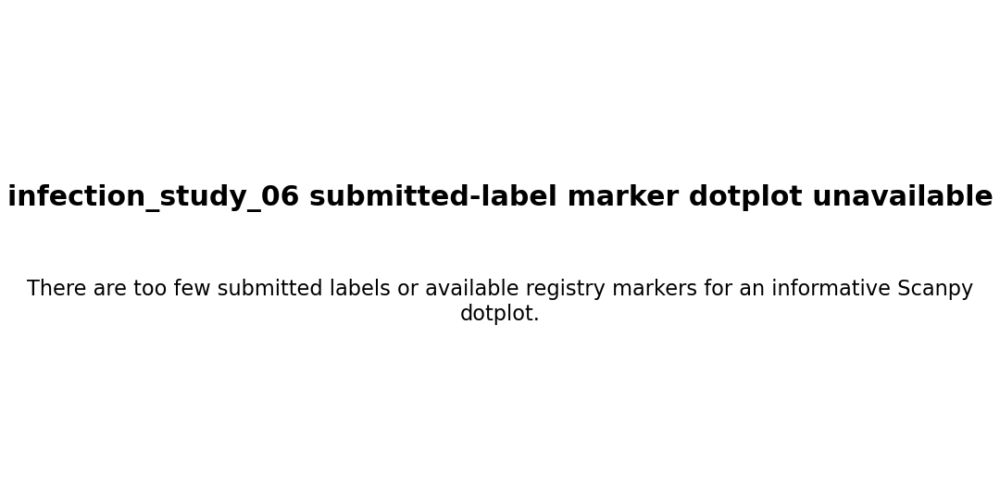

# HIPC Dataset Annotation Report: infection_study_06

Updated: 2026-06-05 EDT

This report was generated by the `hipc-annotation` Codex workflow. It is a dataset-specific review document: the fixed method lives in the repository README, while this report should expose the actual evidence, weak points, and review priorities for this dataset.

## Dataset Summary

| study | cells | analysis_X_genes | pre_hvg_genes | counts_layer_genes | labels | parent_or_blood_fraction | Blood Cell | Doublet | artifact_like | median_confidence | low_confidence | source_disagreement | invalid_labels |
| --- | --- | --- | --- | --- | --- | --- | --- | --- | --- | --- | --- | --- | --- |
| infection_study_06 | 827,389 | 37,298 | 37,298 | 37,298 | 1 | 1.000 | 827,389 | 0 | 0 | 0.450 | 827,389 | 0 (0.000) | none |

## Run Summary

- Execution unit: one dataset in, one annotated dataset out.
- Execution path: Codex skill `hipc-annotation` -> bundled helper `run_one.sh` -> annotation CLI -> validator -> report inspection.
- Validation checks: submission row count, H5AD observation count, official label validity, H5AD/submission agreement, confidence column, and report image links.
- This report is for dataset-specific marker availability, UMAPs, label composition, and review concerns rather than repeating the fixed workflow.

## Dataset-Specific Interpretation

- `infection_study_06`: 827,389 cells, 37,298 analysis X/var genes, 37,298 pre-HVG slot genes, 1 submitted labels, parent/Blood residual fraction 1.000, median confidence 0.450.
  - 827,389 cells have low confidence and should be inspected on QC/confidence UMAPs.
  - 827,389 cells remain `Blood Cell`; these are residual ambiguous cells rather than filtered cells.
  - Marker availability alerts are present for: CD4_naive_tcm, CD4_effector_memory, Treg, gdT, NKT, B_naive, B_memory_ABC, Plasma_ASC. Fine labels relying on these marker sets should be treated cautiously.

## Dataset-Specific Assessment

- Overall: 827,389 cells / 37,298 analysis X/var genes / 37,298 pre-HVG slot genes. Parent/Blood residual fraction is 1.000; low-confidence cells are 827,389; source-disagreement flags affect 0 cells (0.000).
- Review priority: check whether low-confidence regions co-localize with QC artifacts or source-disagreement regions on UMAP.
- Review priority: inspect whether residual `Blood Cell` cells form isolated clusters or dispersed ambiguous zones across lineages.
- Marker availability: CD4_naive_tcm, CD4_effector_memory, Treg, gdT, NKT, B_naive, B_memory_ABC, Plasma_ASC are confidence-capped; validate affected labels on marker-expression UMAPs and dotplots.

## Marker Gene Availability

| study | marker_set | alert | present_fraction | missing_critical_markers | missing_genes |
| --- | --- | --- | --- | --- | --- |
| infection_study_06 | CD4_naive_tcm | critical | 0.000 | none | CD3D;CD3E;CD4;IL7R;CCR7;SELL;TCF7;LEF1;LTB |
| infection_study_06 | CD4_effector_memory | critical | 0.000 | GZMK;CCL5;NKG7;PRF1;GZMB | GZMK;CCL5;NKG7;GNLY;PRF1;GZMB;CXCR3;KLRB1 |
| infection_study_06 | Treg | critical | 0.000 | FOXP3;IL2RA;CTLA4 | FOXP3;IL2RA;CTLA4;IKZF2;TIGIT;TNFRSF18;CCR8 |
| infection_study_06 | gdT | critical | 0.000 | TRDC;TRGC1;TRGC2 | CD3D;CD3E;TRDC;TRGC1;TRGC2;TRDV2 |
| infection_study_06 | NKT | critical | 0.000 | CD3D;NKG7;ZBTB16 | CD3D;CD3E;TRAC;NKG7;GNLY;KLRD1;ZBTB16 |
| infection_study_06 | B_naive | critical | 0.000 | none | MS4A1;CD79A;CD79B;TCL1A;IGHD;IGHM;FCER2;IL4R |
| infection_study_06 | B_memory_ABC | critical | 0.000 | CD27;TNFRSF13B;FCRL5;ITGAX;TBX21 | CD27;TNFRSF13B;FCRL5;ITGAX;TBX21;AIM2;BANK1;CD86 |
| infection_study_06 | Plasma_ASC | critical | 0.000 | MZB1;JCHAIN;XBP1;PRDM1 | MZB1;XBP1;JCHAIN;SDC1;PRDM1;IRF4;TNFRSF17;IGHG1;IGHA1 |

## Source Disagreement

| study | predicted_cell_type | cells | median_source_agreement | disagreement_cells | disagreement_fraction |
| --- | --- | --- | --- | --- | --- |
| infection_study_06 | Blood Cell | 827,389 | 0.000 | 0 | 0.000 |

## Annotation Source Effectiveness

This is not accuracy against external ground truth. It is an audit statistic showing how often each annotation source is informative and concordant with the final label. `coverage` is the fraction of cells with a non-`not_available` source label, `final_concordance` is concordance among informative cells, and `unique_support` counts cells where only that source agrees with the final label.

| study | source | informative_cells | coverage | final_concordance | high_conf_concordance | unique_support | discordant |
| --- | --- | --- | --- | --- | --- | --- | --- |
| infection_study_06 | CellTypist | 0 | 0.000 | 0.000 | 0.000 | 0 | 0 |
| infection_study_06 | Pan-human Azimuth | 0 | 0.000 | 0.000 | 0.000 | 0 | 0 |
| infection_study_06 | Cluster consensus | 0 | 0.000 | 0.000 | 0.000 | 0 | 0 |
| infection_study_06 | scRefMapping | 0 | 0.000 | 0.000 | 0.000 | 0 | 0 |
| infection_study_06 | Cluster marker assignment | 0 | 0.000 | 0.000 | 0.000 | 0 | 0 |

## Review Priorities

| study | concern | cells |
| --- | --- | --- |
| infection_study_06 | Large Blood Cell/ambiguous residual remains | 827,389 |
| infection_study_06 | Many low-confidence cells; QC or mixed-marker effects likely remain | 827,389 |

## Label Composition

| study | predicted_cell_type | cells |
| --- | --- | --- |
| infection_study_06 | Blood Cell | 827,389 |

## Inline Figures

### infection_study_06

#### infection_study_06 B_lineage true subcluster UMAP

Skipped: fewer than 50 cells assigned to this broad lineage (`n_cells=0`).

Tables: `tables/infection_study_06_B_lineage_true_subcluster_umap.tsv.gz`, `tables/infection_study_06_B_lineage_subcluster_candidate_scores.tsv`.

#### infection_study_06 T_NK_lineage true subcluster UMAP

Skipped: fewer than 50 cells assigned to this broad lineage (`n_cells=0`).

Tables: `tables/infection_study_06_T_NK_lineage_true_subcluster_umap.tsv.gz`, `tables/infection_study_06_T_NK_lineage_subcluster_candidate_scores.tsv`.

#### infection_study_06 Myeloid_lineage true subcluster UMAP

Skipped: fewer than 50 cells assigned to this broad lineage (`n_cells=0`).

Tables: `tables/infection_study_06_Myeloid_lineage_true_subcluster_umap.tsv.gz`, `tables/infection_study_06_Myeloid_lineage_subcluster_candidate_scores.tsv`.

## Subcluster Marker Score Review

The lineage-specific panels above are generated from true local subcluster analyses: each lineage subset is reclustered after HVG selection, PCA, neighbors, Leiden, and UMAP recomputation. Marker-based fine-label review should use these local UMAPs, CellTypist/Azimuth/Pan-human/cluster-level marker-gene assignment overlays, cluster marker gate score UMAPs, marker-expression UMAPs, and dotplots rather than only the global UMAP. Sparse marker labels such as Treg are adjudicated from local-cluster key-marker support, including FOXP3/IL2RA/CTLA4, together with reference support instead of a cell-wise marker winner.

## Marker Assignment Feedback

Marker-gene assignment is a cluster-level self-check rather than a forced final-label override. `raw_marker_winner` is the marker-score-only winner, while `marker_assignment` is the marker-based assignment after conservative policy and source-supported tie-break adjudication. This table highlights clusters where marker assignment disagrees with the final/reference-driven label, marker specificity is weak, or scRefMap is missing in a lineage where it is expected. `marker_score` is the final cluster-level marker gate after subtracting negative/confound-marker penalties from the raw marker base score.

None.

## LLM Review Queue

This table is the subcluster-level review queue for Codex/LLM. The LLM should use this evidence to decide whether the final label is reasonable, whether the subcluster suggests an ontology gap, or whether a general registry/conservative-policy update should be tested. The LLM must not directly mutate per-cell labels; accepted changes should update registry/config rules and then rerun the deterministic pipeline.

None.

## Cluster Consensus Evidence

None.

## Output Files

- Submission TSVs: `/vast/palmer/pi/hafler/yy693/HIPC-scRNAseq-Annotation/outputs/submission_final_v22/infection_study_06/submissions/`
- cellxgene H5ADs: `/vast/palmer/pi/hafler/yy693/HIPC-scRNAseq-Annotation/outputs/submission_final_v22/infection_study_06/cellxgene/`
- Marker availability table: `/vast/palmer/pi/hafler/yy693/HIPC-scRNAseq-Annotation/outputs/submission_final_v22/infection_study_06/tables/marker_gene_availability.tsv`
- Marker availability alerts: `/vast/palmer/pi/hafler/yy693/HIPC-scRNAseq-Annotation/outputs/submission_final_v22/infection_study_06/tables/marker_gene_availability_alerts.tsv`
- Subcluster evidence: `/vast/palmer/pi/hafler/yy693/HIPC-scRNAseq-Annotation/outputs/submission_final_v22/infection_study_06/tables/lineage_subcluster_evidence.tsv.gz`
- Source disagreement summary: `/vast/palmer/pi/hafler/yy693/HIPC-scRNAseq-Annotation/outputs/submission_final_v22/infection_study_06/tables/source_disagreement_summary.tsv`
- Source effectiveness summary: `/vast/palmer/pi/hafler/yy693/HIPC-scRNAseq-Annotation/outputs/submission_final_v22/infection_study_06/tables/source_effectiveness_summary.tsv`
- Diagnostics tables: `/vast/palmer/pi/hafler/yy693/HIPC-scRNAseq-Annotation/outputs/submission_final_v22/infection_study_06/tables/`

