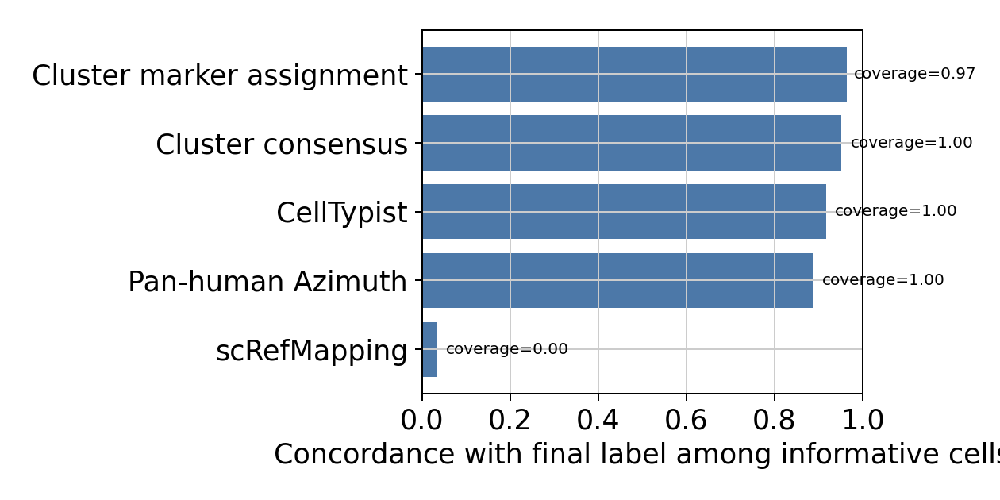

# HIPC Dataset Annotation Report: vaccination_study_04

Updated: 2026-06-12 EDT

## Current Submission Summary

| Field | Value |
| --- | --- |
| Candidate package | v24 pragmatic package |
| Selected source | `outputs/submission_final_v22/vaccination_study_04/submissions/vaccination_study_04_annotation.tsv` |
| Cells | 66,065 |
| Number of labels | 14 |
| Parent/Blood residual | 571 cells (0.0086) |
| Median confidence | 0.8063 |
| Top labels | Classical Monocyte: 33,958; Non-Classical Monocyte: 15,469; Conventional DC 2: 7,621; Plasmacytoid DC: 5,375; Doublet: 1,249; Conventional DC 1: 1,026; NK Cell: 609; Blood Cell: 474 |
| Current assessment | Good candidate submission. Treat this as a myeloid/DC-enriched dataset and prioritize pDC, cDC, and doublet marker evidence review. |

This report was generated by the `hipc-annotation` Codex workflow. It is a dataset-specific review document: the fixed method lives in the repository README, while this report should expose the actual evidence, weak points, and review priorities for this dataset.

## Dataset Summary

| study | cells | analysis_X_genes | pre_hvg_genes | counts_layer_genes | labels | parent_or_blood_fraction | Blood Cell | Doublet | artifact_like | median_confidence | low_confidence | source_disagreement | invalid_labels |
| --- | --- | --- | --- | --- | --- | --- | --- | --- | --- | --- | --- | --- | --- |
| vaccination_study_04 | 66,065 | 3,971 | 8,000 | 3,971 | 14 | 0.009 | 474 | 1,249 | 84 | 0.806 | 1,820 | 4,109 (0.062) | none |

## Run Summary

- Execution unit: one dataset in, one annotated dataset out.
- Execution path: Codex skill `hipc-annotation` -> bundled helper `run_one.sh` -> annotation CLI -> validator -> report inspection.
- Validation checks: submission row count, H5AD observation count, official label validity, H5AD/submission agreement, confidence column, and report image links.
- This report is for dataset-specific marker availability, UMAPs, label composition, and review concerns rather than repeating the fixed workflow.

## Dataset-Specific Interpretation

- `vaccination_study_04`: 66,065 cells, 3,971 analysis X/var genes, 8,000 pre-HVG slot genes, 14 submitted labels, parent/Blood residual fraction 0.009, median confidence 0.806.
  - 1,820 cells have low confidence and should be inspected on QC/confidence UMAPs.
  - 1,249 cells are submitted as `Doublet`; inspect mixed-lineage marker expression before final submission.
  - 474 cells remain `Blood Cell`; these are residual ambiguous cells rather than filtered cells.
  - Marker availability alerts are present for: CD4_naive_tcm, CD4_effector_memory, Treg, gdT, NKT, B_naive, B_memory_ABC, Plasma_ASC. Fine labels relying on these marker sets should be treated cautiously.

## Dataset-Specific Assessment

- Overall: 66,065 cells / 3,971 analysis X/var genes / 8,000 pre-HVG slot genes. Parent/Blood residual fraction is 0.009; low-confidence cells are 1,820; source-disagreement flags affect 4,109 cells (0.062).
- Review priority: check whether low-confidence regions co-localize with QC artifacts or source-disagreement regions on UMAP.
- Review priority: inspect whether residual `Blood Cell` cells form isolated clusters or dispersed ambiguous zones across lineages.
- Marker availability: CD4_naive_tcm, CD4_effector_memory, Treg, gdT, NKT, B_naive, B_memory_ABC, Plasma_ASC are confidence-capped; validate affected labels on marker-expression UMAPs and dotplots.

## Marker Gene Availability

| study | marker_set | alert | present_fraction | missing_critical_markers | missing_genes |
| --- | --- | --- | --- | --- | --- |
| vaccination_study_04 | CD4_naive_tcm | warning | 0.333 | none | CD3D;CD3E;IL7R;CCR7;TCF7;LEF1 |
| vaccination_study_04 | CD4_effector_memory | critical | 0.125 | GZMK;CCL5;PRF1;GZMB | GZMK;CCL5;GNLY;PRF1;GZMB;CXCR3;KLRB1 |
| vaccination_study_04 | Treg | critical | 0.000 | FOXP3;IL2RA;CTLA4 | FOXP3;IL2RA;CTLA4;IKZF2;TIGIT;TNFRSF18;CCR8 |
| vaccination_study_04 | gdT | critical | 0.000 | TRDC;TRGC1;TRGC2 | CD3D;CD3E;TRDC;TRGC1;TRGC2;TRDV2 |
| vaccination_study_04 | NKT | critical | 0.286 | CD3D | CD3D;CD3E;TRAC;GNLY;KLRD1 |
| vaccination_study_04 | B_naive | critical | 0.250 | none | MS4A1;CD79A;TCL1A;IGHD;IGHM;FCER2 |
| vaccination_study_04 | B_memory_ABC | warning | 0.375 | CD27;TNFRSF13B;FCRL5;TBX21 | CD27;TNFRSF13B;FCRL5;TBX21;AIM2 |
| vaccination_study_04 | Plasma_ASC | warning | 0.333 | MZB1;JCHAIN | MZB1;JCHAIN;SDC1;TNFRSF17;IGHG1;IGHA1 |

## Source Disagreement

| study | predicted_cell_type | cells | median_source_agreement | disagreement_cells | disagreement_fraction |
| --- | --- | --- | --- | --- | --- |
| vaccination_study_04 | Doublet | 1,249 | 0.000 | 1,249 | 1.000 |
| vaccination_study_04 | Blood Cell | 474 | 0.000 | 474 | 1.000 |
| vaccination_study_04 | T Cell | 74 | 0.000 | 74 | 1.000 |
| vaccination_study_04 | B Cell | 23 | 0.000 | 23 | 1.000 |
| vaccination_study_04 | Memory B Cell | 2 | 0.333 | 2 | 1.000 |
| vaccination_study_04 | Naive B Cell | 4 | 0.292 | 3 | 0.750 |
| vaccination_study_04 | NK Cell | 609 | 0.333 | 341 | 0.560 |
| vaccination_study_04 | Conventional DC 2 | 7,621 | 1.000 | 839 | 0.110 |
| vaccination_study_04 | Plasma Cell | 97 | 0.750 | 8 | 0.082 |
| vaccination_study_04 | Classical Monocyte | 33,958 | 1.000 | 842 | 0.025 |
| vaccination_study_04 | Plasmacytoid DC | 5,375 | 1.000 | 115 | 0.021 |
| vaccination_study_04 | Non-Classical Monocyte | 15,469 | 1.000 | 136 | 0.009 |

## Annotation Source Effectiveness

This is not accuracy against external ground truth. It is an audit statistic showing how often each annotation source is informative and concordant with the final label. `coverage` is the fraction of cells with a non-`not_available` source label, `final_concordance` is concordance among informative cells, and `unique_support` counts cells where only that source agrees with the final label.

| study | source | informative_cells | coverage | final_concordance | high_conf_concordance | unique_support | discordant |
| --- | --- | --- | --- | --- | --- | --- | --- |
| vaccination_study_04 | Cluster consensus | 66,065 | 1.000 | 0.952 | 0.988 | 249 | 3,148 |
| vaccination_study_04 | CellTypist | 66,065 | 1.000 | 0.917 | 0.962 | 0 | 5,465 |
| vaccination_study_04 | Pan-human Azimuth | 66,065 | 1.000 | 0.889 | 0.925 | 54 | 7,335 |
| vaccination_study_04 | Cluster marker assignment | 64,128 | 0.971 | 0.964 | 0.982 | 318 | 2,287 |
| vaccination_study_04 | scRefMapping | 285 | 0.004 | 0.035 | 0.444 | 0 | 275 |

## Review Priorities

| study | concern | cells |
| --- | --- | --- |
| vaccination_study_04 | High source disagreement for B Cell | 23 |
| vaccination_study_04 | High source disagreement for Blood Cell | 474 |
| vaccination_study_04 | High source disagreement for Doublet | 1,249 |
| vaccination_study_04 | High source disagreement for Memory B Cell | 2 |
| vaccination_study_04 | High source disagreement for NK Cell | 341 |
| vaccination_study_04 | High source disagreement for Naive B Cell | 3 |
| vaccination_study_04 | High source disagreement for T Cell | 74 |
| vaccination_study_04 | critical marker availability for B_naive | 4 |
| vaccination_study_04 | warning marker availability for B_memory_ABC | 2 |
| vaccination_study_04 | warning marker availability for Plasma_ASC | 97 |

## Label Composition

| study | predicted_cell_type | cells |
| --- | --- | --- |
| vaccination_study_04 | Classical Monocyte | 33,958 |
| vaccination_study_04 | Non-Classical Monocyte | 15,469 |
| vaccination_study_04 | Conventional DC 2 | 7,621 |
| vaccination_study_04 | Plasmacytoid DC | 5,375 |
| vaccination_study_04 | Doublet | 1,249 |
| vaccination_study_04 | Conventional DC 1 | 1,026 |
| vaccination_study_04 | NK Cell | 609 |
| vaccination_study_04 | Blood Cell | 474 |
| vaccination_study_04 | Plasma Cell | 97 |
| vaccination_study_04 | HSC | 84 |
| vaccination_study_04 | T Cell | 74 |
| vaccination_study_04 | B Cell | 23 |
| vaccination_study_04 | Naive B Cell | 4 |
| vaccination_study_04 | Memory B Cell | 2 |

## Inline Figures

### vaccination_study_04

#### vaccination_study_04 B_lineage true subcluster UMAP

Tables: `tables/vaccination_study_04_B_lineage_true_subcluster_umap.tsv.gz`, `tables/vaccination_study_04_B_lineage_subcluster_candidate_scores.tsv`.

#### vaccination_study_04 T_NK_lineage true subcluster UMAP

Tables: `tables/vaccination_study_04_T_NK_lineage_true_subcluster_umap.tsv.gz`, `tables/vaccination_study_04_T_NK_lineage_subcluster_candidate_scores.tsv`.

#### vaccination_study_04 Myeloid_lineage true subcluster UMAP

Tables: `tables/vaccination_study_04_Myeloid_lineage_true_subcluster_umap.tsv.gz`, `tables/vaccination_study_04_Myeloid_lineage_subcluster_candidate_scores.tsv`.

## Subcluster Marker Score Review

The lineage-specific panels above are generated from true local subcluster analyses: each lineage subset is reclustered after HVG selection, PCA, neighbors, Leiden, and UMAP recomputation. Marker-based fine-label review should use these local UMAPs, CellTypist/Azimuth/Pan-human/cluster-level marker-gene assignment overlays, cluster marker gate score UMAPs, marker-expression UMAPs, and dotplots rather than only the global UMAP. Sparse marker labels such as Treg are adjudicated from local-cluster key-marker support, including FOXP3/IL2RA/CTLA4, together with reference support instead of a cell-wise marker winner.

## Marker Assignment Feedback

Marker-gene assignment is a cluster-level self-check rather than a forced final-label override. `raw_marker_winner` is the marker-score-only winner, while `marker_assignment` is the marker-based assignment after conservative policy and source-supported tie-break adjudication. This table highlights clusters where marker assignment disagrees with the final/reference-driven label, marker specificity is weak, or scRefMap is missing in a lineage where it is expected. `marker_score` is the final cluster-level marker gate after subtracting negative/confound-marker penalties from the raw marker base score.

| study | lineage | cluster | cells | chosen_label | marker_assignment | raw_marker_winner | assignment_reason | marker_score | base_score | penalty | flags |
| --- | --- | --- | --- | --- | --- | --- | --- | --- | --- | --- | --- |
| vaccination_study_04 | Myeloid_lineage | 20 | 1,162 | Conventional DC 2 | Neutrophil | Neutrophil | raw_marker_winner | 0.774 | 1.000 | 0.226 | marker_final_disagreement |
| vaccination_study_04 | Myeloid_lineage | 26 | 585 | Conventional DC 1 | Intermediate Monocyte | Intermediate Monocyte | raw_marker_winner | 0.958 | 1.000 | 0.042 | marker_final_disagreement |
| vaccination_study_04 | Myeloid_lineage | 27 | 441 | Conventional DC 1 | Intermediate Monocyte | Intermediate Monocyte | raw_marker_winner | 0.958 | 1.000 | 0.042 | marker_final_disagreement |
| vaccination_study_04 | T_NK_lineage | 0 | 82 | NK Cell | NK Cell | NK Cell | raw_marker_winner | 1.000 | 1.000 | 0.000 | screfmapping_missing_for_scope |
| vaccination_study_04 | T_NK_lineage | 3 | 56 | NK Cell | NK Cell | NKT Cell | conservative_policy_blocks_raw_marker_winner | 1.000 | 1.000 | 0.000 | screfmapping_missing_for_scope |
| vaccination_study_04 | T_NK_lineage | 6 | 47 | T Cell | CD8 Cytotoxic / T Effector Memory | CD8 Cytotoxic / T Effector Memory | raw_marker_winner | 0.550 | 1.000 | 0.450 | marker_final_disagreement;screfmapping_missing_for_scope |
| vaccination_study_04 | T_NK_lineage | 8 | 44 | NK Cell | NK Cell | NKT Cell | conservative_policy_blocks_raw_marker_winner | 0.986 | 1.000 | 0.014 | screfmapping_missing_for_scope |
| vaccination_study_04 | T_NK_lineage | 10 | 35 | NK Cell | NK Cell | NKT Cell | conservative_policy_blocks_raw_marker_winner | 0.974 | 0.974 | 0.000 | screfmapping_missing_for_scope |
| vaccination_study_04 | T_NK_lineage | 11 | 27 | T Cell | CD8 Cytotoxic / T Effector Memory | CD8 Cytotoxic / T Effector Memory | raw_marker_winner | 0.917 | 1.000 | 0.083 | marker_final_disagreement;screfmapping_missing_for_scope |
| vaccination_study_04 | T_NK_lineage | 13 | 22 | NK Cell | NK Cell | NK Cell | raw_marker_winner | 1.000 | 1.000 | 0.000 | screfmapping_missing_for_scope |
| vaccination_study_04 | B_lineage | 0 | 15 | B Cell | Plasmablast | Plasmablast | raw_marker_winner | 0.930 | 1.000 | 0.070 | marker_final_disagreement;screfmapping_missing_for_scope |
| vaccination_study_04 | T_NK_lineage | 15 | 8 | NK Cell | NK Cell | NK Cell | raw_marker_winner | 1.000 | 1.000 | 0.000 | screfmapping_missing_for_scope |
| vaccination_study_04 | B_lineage | 10 | 6 | B Cell | Plasmablast | Plasmablast | raw_marker_winner | 0.850 | 1.000 | 0.150 | marker_final_disagreement;screfmapping_missing_for_scope |
| vaccination_study_04 | B_lineage | 15 | 2 | B Cell | Naive B Cell | Naive B Cell | raw_marker_winner | 0.567 | 0.567 | 0.000 | marker_final_disagreement;screfmapping_missing_for_scope |
| vaccination_study_04 | B_lineage | 12 | 2 | Plasma Cell | Naive B Cell | Naive B Cell | raw_marker_winner | 0.783 | 0.783 | 0.000 | marker_final_disagreement |
| vaccination_study_04 | B_lineage | 14 | 2 | Memory B Cell | Memory B Cell | Naive B Cell | source_supported_marker_tiebreak | 0.783 | 0.783 | 0.000 | screfmapping_missing_for_scope |

## LLM Review Queue

This table is the subcluster-level review queue for Codex/LLM. The LLM should use this evidence to decide whether the final label is reasonable, whether the subcluster suggests an ontology gap, or whether a general registry/conservative-policy update should be tested. The LLM must not directly mutate per-cell labels; accepted changes should update registry/config rules and then rerun the deterministic pipeline.

| study | lineage | cluster | cells | priority | reasons | suggested_action | final_label | marker_assignment | raw_marker_winner | score_margin |
| --- | --- | --- | --- | --- | --- | --- | --- | --- | --- | --- |
| vaccination_study_04 | T_NK_lineage | 6 | 47 | high | parent_or_broad_final_label;marker_assignment_disagrees_with_final;screfmapping_not_available;low_total_score_or_margin | check_if_finer_official_label_is_supported | T Cell | CD8 Cytotoxic / T Effector Memory | CD8 Cytotoxic / T Effector Memory | 0.000 |
| vaccination_study_04 | B_lineage | 0 | 15 | high | parent_or_broad_final_label;marker_assignment_disagrees_with_final;ambiguous_or_missing_label_candidate;screfmapping_not_available | check_if_finer_official_label_is_supported | B Cell | Plasmablast | Plasmablast | 0.311 |
| vaccination_study_04 | B_lineage | 10 | 6 | high | parent_or_broad_final_label;marker_assignment_disagrees_with_final;ambiguous_or_missing_label_candidate;screfmapping_not_available | check_if_finer_official_label_is_supported | B Cell | Plasmablast | Plasmablast | 0.283 |
| vaccination_study_04 | B_lineage | 15 | 2 | high | parent_or_broad_final_label;marker_assignment_disagrees_with_final;screfmapping_not_available;low_total_score_or_margin | check_if_finer_official_label_is_supported | B Cell | Naive B Cell | Naive B Cell | 0.054 |
| vaccination_study_04 | T_NK_lineage | 11 | 27 | medium | parent_or_broad_final_label;marker_assignment_disagrees_with_final;screfmapping_not_available | check_if_finer_official_label_is_supported | T Cell | CD8 Cytotoxic / T Effector Memory | CD8 Cytotoxic / T Effector Memory | 0.294 |
| vaccination_study_04 | Myeloid_lineage | 20 | 1,162 | medium | marker_assignment_disagrees_with_final;screfmapping_not_available | review_marker_vs_reference_disagreement | Conventional DC 2 | Neutrophil | Neutrophil | 0.493 |
| vaccination_study_04 | Myeloid_lineage | 26 | 585 | medium | marker_assignment_disagrees_with_final;screfmapping_not_available | review_marker_vs_reference_disagreement | Conventional DC 1 | Intermediate Monocyte | Intermediate Monocyte | 2.057 |
| vaccination_study_04 | Myeloid_lineage | 27 | 441 | medium | marker_assignment_disagrees_with_final;screfmapping_not_available | review_marker_vs_reference_disagreement | Conventional DC 1 | Intermediate Monocyte | Intermediate Monocyte | 2.057 |
| vaccination_study_04 | T_NK_lineage | 3 | 56 | medium | raw_marker_winner_changed_by_policy;ambiguous_or_missing_label_candidate;screfmapping_not_available | evaluate_ontology_gap_or_conservative_policy | NK Cell | NK Cell | NKT Cell | 2.600 |
| vaccination_study_04 | T_NK_lineage | 8 | 44 | medium | raw_marker_winner_changed_by_policy;ambiguous_or_missing_label_candidate;screfmapping_not_available | evaluate_ontology_gap_or_conservative_policy | NK Cell | NK Cell | NKT Cell | 2.600 |
| vaccination_study_04 | T_NK_lineage | 10 | 35 | medium | raw_marker_winner_changed_by_policy;ambiguous_or_missing_label_candidate;screfmapping_not_available | evaluate_ontology_gap_or_conservative_policy | NK Cell | NK Cell | NKT Cell | 1.740 |
| vaccination_study_04 | B_lineage | 12 | 2 | low | marker_assignment_disagrees_with_final | review_marker_vs_reference_disagreement | Plasma Cell | Naive B Cell | Naive B Cell | 1.125 |
| vaccination_study_04 | B_lineage | 14 | 2 | low | raw_marker_winner_changed_by_policy;screfmapping_not_available | accept | Memory B Cell | Memory B Cell | Naive B Cell | 2.492 |
| vaccination_study_04 | T_NK_lineage | 0 | 82 | low | screfmapping_not_available | accept | NK Cell | NK Cell | NK Cell | 2.600 |
| vaccination_study_04 | T_NK_lineage | 13 | 22 | low | screfmapping_not_available | accept | NK Cell | NK Cell | NK Cell | 2.600 |
| vaccination_study_04 | T_NK_lineage | 15 | 8 | low | screfmapping_not_available | accept | NK Cell | NK Cell | NK Cell | 2.600 |

## Cluster Consensus Evidence

| study | lineage | cluster | cells | chosen_label | accepted | score_margin | cluster_marker_assignment | treg_key_any | treg_key_bonus | marker_set | marker_alert |
| --- | --- | --- | --- | --- | --- | --- | --- | --- | --- | --- | --- |
| vaccination_study_04 | B_lineage | 0 | 15 | B Cell | False | 0.311 | Plasmablast | nan | nan | registry__plasmablast | pass |
| vaccination_study_04 | B_lineage | 1 | 14 | Plasma Cell | True | 1.803 | Plasma Cell | nan | nan | registry__plasma_cell | pass |
| vaccination_study_04 | B_lineage | 2 | 14 | Plasma Cell | True | 1.860 | Plasma Cell | nan | nan | registry__plasma_cell | pass |
| vaccination_study_04 | B_lineage | 3 | 12 | Plasma Cell | True | 2.069 | Plasma Cell | nan | nan | registry__plasma_cell | pass |
| vaccination_study_04 | B_lineage | 4 | 12 | Plasma Cell | True | 2.112 | Plasma Cell | nan | nan | registry__plasma_cell | pass |
| vaccination_study_04 | B_lineage | 5 | 11 | Plasma Cell | True | 0.597 | Plasma Cell | nan | nan | registry__plasma_cell | pass |
| vaccination_study_04 | B_lineage | 6 | 10 | Plasma Cell | True | 2.458 | Plasma Cell | nan | nan | registry__plasma_cell | pass |
| vaccination_study_04 | B_lineage | 7 | 8 | Plasma Cell | True | 2.181 | Plasma Cell | nan | nan | registry__plasma_cell | pass |
| vaccination_study_04 | B_lineage | 10 | 6 | B Cell | False | 0.283 | Plasmablast | nan | nan | registry__plasmablast | pass |
| vaccination_study_04 | B_lineage | 8 | 6 | Plasma Cell | True | 2.249 | Plasma Cell | nan | nan | registry__plasma_cell | pass |
| vaccination_study_04 | B_lineage | 9 | 6 | Plasma Cell | True | 1.672 | Plasma Cell | nan | nan | registry__plasma_cell | pass |
| vaccination_study_04 | B_lineage | 11 | 4 | Naive B Cell | True | 0.965 | Naive B Cell | nan | nan | registry__naive_b_cell | pass |
| vaccination_study_04 | B_lineage | 12 | 2 | Plasma Cell | True | 1.125 | Naive B Cell | nan | nan | registry__plasma_cell | pass |
| vaccination_study_04 | B_lineage | 13 | 2 | Plasma Cell | True | 3.800 | Plasma Cell | nan | nan | registry__plasma_cell | pass |
| vaccination_study_04 | B_lineage | 14 | 2 | Memory B Cell | True | 2.492 | Memory B Cell | nan | nan | registry__memory_b_cell | pass |
| vaccination_study_04 | B_lineage | 15 | 2 | B Cell | False | 0.054 | Naive B Cell | nan | nan | registry__naive_b_cell | pass |
| vaccination_study_04 | Myeloid_lineage | 0 | 5,875 | Non-Classical Monocyte | True | 2.349 | Non-Classical Monocyte | nan | nan | registry__non_classical_monocyte | pass |
| vaccination_study_04 | Myeloid_lineage | 1 | 5,663 | Classical Monocyte | True | 2.541 | Classical Monocyte | nan | nan | registry__classical_monocyte | pass |
| vaccination_study_04 | Myeloid_lineage | 2 | 5,355 | Classical Monocyte | True | 2.512 | Classical Monocyte | nan | nan | registry__classical_monocyte | pass |
| vaccination_study_04 | Myeloid_lineage | 3 | 4,172 | Classical Monocyte | True | 2.579 | Classical Monocyte | nan | nan | registry__classical_monocyte | pass |
| vaccination_study_04 | Myeloid_lineage | 4 | 4,170 | Classical Monocyte | True | 2.743 | Classical Monocyte | nan | nan | registry__classical_monocyte | pass |
| vaccination_study_04 | Myeloid_lineage | 5 | 3,742 | Conventional DC 2 | True | 2.151 | Conventional DC 2 | nan | nan | registry__conventional_dc_2 | pass |
| vaccination_study_04 | Myeloid_lineage | 6 | 3,337 | Classical Monocyte | True | 2.613 | Classical Monocyte | nan | nan | registry__classical_monocyte | pass |
| vaccination_study_04 | Myeloid_lineage | 7 | 2,531 | Non-Classical Monocyte | True | 2.451 | Non-Classical Monocyte | nan | nan | registry__non_classical_monocyte | pass |
| vaccination_study_04 | Myeloid_lineage | 8 | 2,417 | Plasmacytoid DC | True | 2.454 | Plasmacytoid DC | nan | nan | registry__plasmacytoid_dc | pass |
| vaccination_study_04 | Myeloid_lineage | 9 | 2,377 | Classical Monocyte | True | 2.525 | Classical Monocyte | nan | nan | registry__classical_monocyte | pass |
| vaccination_study_04 | Myeloid_lineage | 10 | 2,258 | Non-Classical Monocyte | True | 2.493 | Non-Classical Monocyte | nan | nan | registry__non_classical_monocyte | pass |
| vaccination_study_04 | Myeloid_lineage | 11 | 2,163 | Plasmacytoid DC | True | 2.461 | Plasmacytoid DC | nan | nan | registry__plasmacytoid_dc | pass |
| vaccination_study_04 | Myeloid_lineage | 12 | 1,976 | Classical Monocyte | True | 1.982 | Classical Monocyte | nan | nan | registry__classical_monocyte | pass |
| vaccination_study_04 | Myeloid_lineage | 13 | 1,826 | Classical Monocyte | True | 2.688 | Classical Monocyte | nan | nan | registry__classical_monocyte | pass |

## Output Files

- Submission TSVs: `/vast/palmer/pi/hafler/yy693/HIPC-scRNAseq-Annotation/outputs/submission_final_v22/vaccination_study_04/submissions/`
- cellxgene H5ADs: `/vast/palmer/pi/hafler/yy693/HIPC-scRNAseq-Annotation/outputs/submission_final_v22/vaccination_study_04/cellxgene/`
- Marker availability table: `/vast/palmer/pi/hafler/yy693/HIPC-scRNAseq-Annotation/outputs/submission_final_v22/vaccination_study_04/tables/marker_gene_availability.tsv`
- Marker availability alerts: `/vast/palmer/pi/hafler/yy693/HIPC-scRNAseq-Annotation/outputs/submission_final_v22/vaccination_study_04/tables/marker_gene_availability_alerts.tsv`
- Subcluster evidence: `/vast/palmer/pi/hafler/yy693/HIPC-scRNAseq-Annotation/outputs/submission_final_v22/vaccination_study_04/tables/lineage_subcluster_evidence.tsv.gz`
- Source disagreement summary: `/vast/palmer/pi/hafler/yy693/HIPC-scRNAseq-Annotation/outputs/submission_final_v22/vaccination_study_04/tables/source_disagreement_summary.tsv`
- Source effectiveness summary: `/vast/palmer/pi/hafler/yy693/HIPC-scRNAseq-Annotation/outputs/submission_final_v22/vaccination_study_04/tables/source_effectiveness_summary.tsv`
- Diagnostics tables: `/vast/palmer/pi/hafler/yy693/HIPC-scRNAseq-Annotation/outputs/submission_final_v22/vaccination_study_04/tables/`
