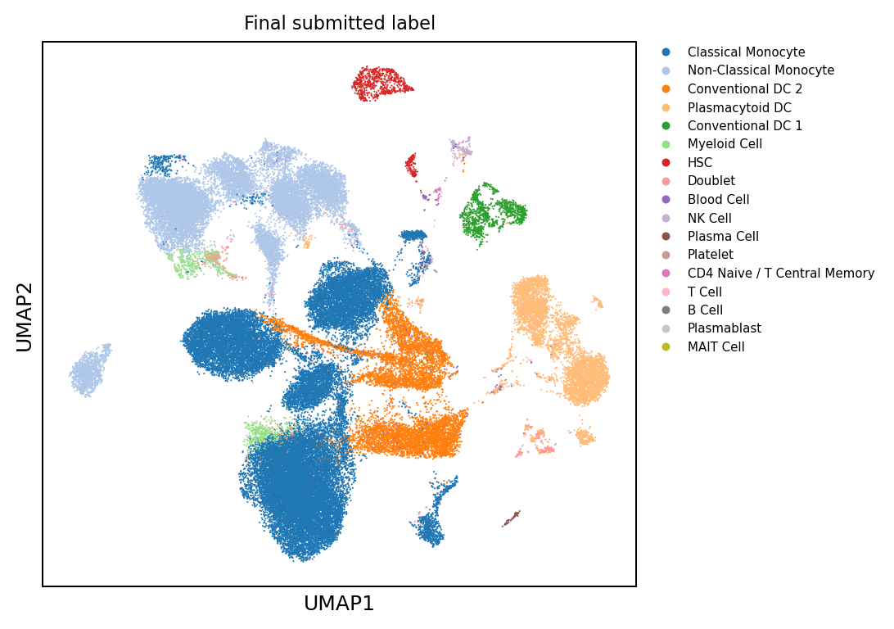
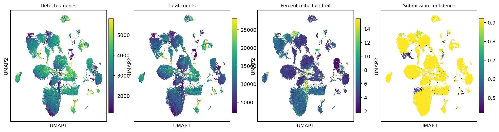
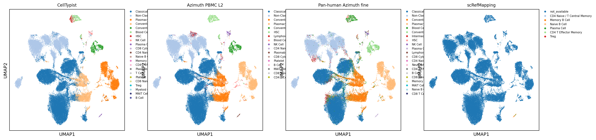
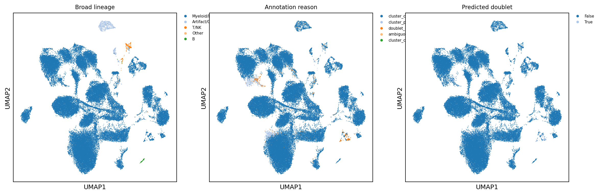
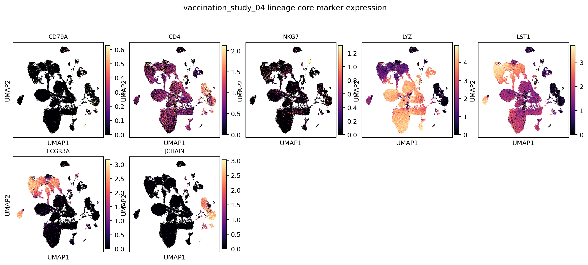
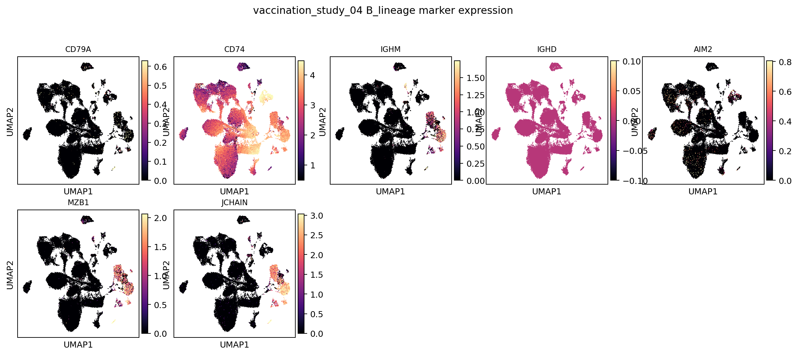
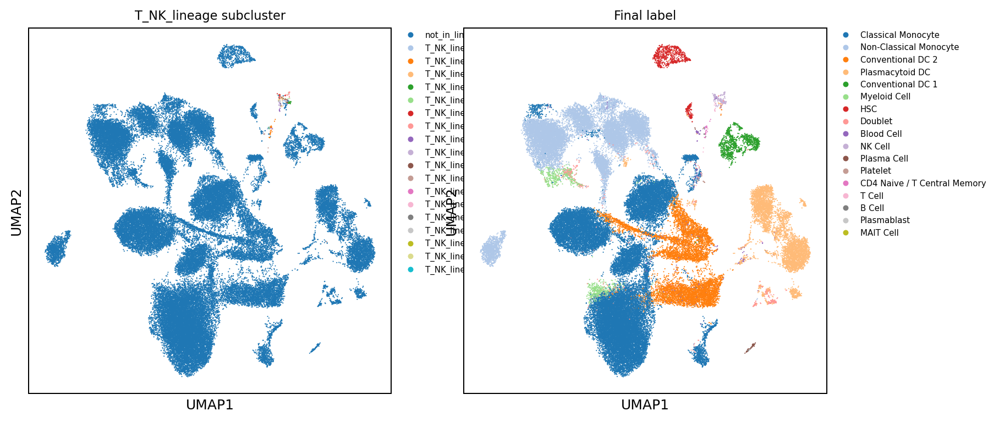
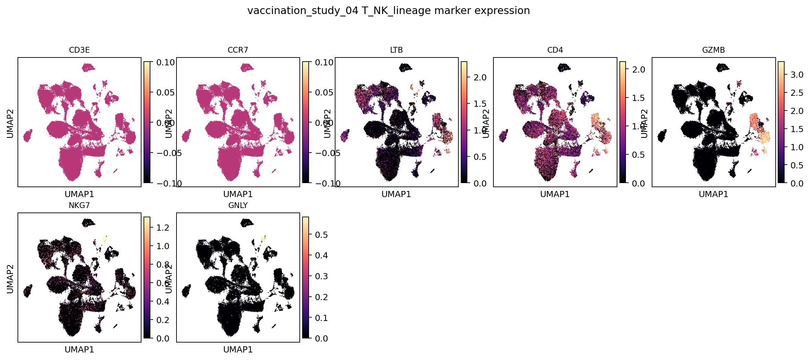
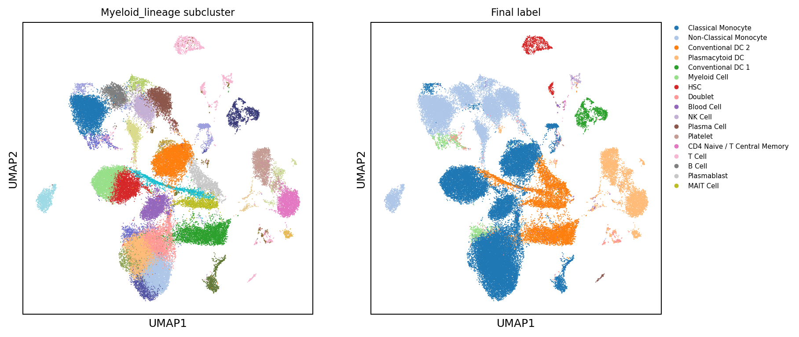
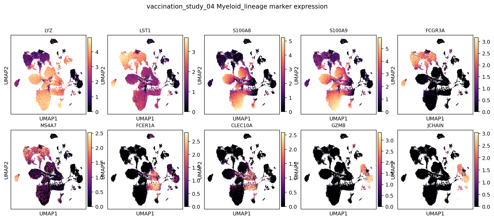

# vaccination_study_04 Annotation Report

Updated: 2026-06-03 EDT

## Dataset-Specific Assessment

This sample is strongly myeloid/DC-skewed relative to a balanced PBMC expectation. DC/pDC-like calls should be read with marker panels, not single-marker evidence alone.

## Key Metrics

| Metric                         | Value        |
|:-------------------------------|:-------------|
| Cells                          | 66,065       |
| Genes in H5AD var              | 16,983       |
| Submitted labels               | 17           |
| Parent or Blood fallback cells | 1,321 (2.0%) |
| Doublet calls                  | 647          |
| Median confidence              | 0.92         |
| CD4 T Effector Memory calls    | 0            |
| Generic T Cell calls           | 23           |
| Generic B Cell calls           | 12           |

## Review Priorities

- Review final labels together with source-label UMAPs; exact agreement is not required, but spatially coherent disagreement needs interpretation.
- Use marker-expression panels before accepting narrow labels such as pDC, plasma/plasmablast, Treg, and effector-memory T states.
- Treat `Doublet` as a submitted label, not as filtered-out cells.
- Parent or Blood fallback labels indicate conservative uncertainty and should be checked on UMAP rather than silently forced to terminal labels.

## Inline Figures

### Final submitted labels

### QC and confidence

### Annotation source labels

### Lineage, reason, and doublet overlays

### Lineage core marker expression

### B-lineage subcluster labels

### B-lineage marker expression

### T/NK-lineage subcluster labels

### T/NK-lineage marker expression

### Myeloid/DC-lineage subcluster labels

### Myeloid/DC-lineage marker expression

## Label Composition

| predicted_cell_type          |   n_cells | fraction   |
|:-----------------------------|----------:|:-----------|
| Classical Monocyte           |     32748 | 49.6%      |
| Non-Classical Monocyte       |     15624 | 23.6%      |
| Conventional DC 2            |      7770 | 11.8%      |
| Plasmacytoid DC              |      5615 | 8.5%       |
| Conventional DC 1            |      1099 | 1.7%       |
| Myeloid Cell                 |       984 | 1.5%       |
| HSC                          |       884 | 1.3%       |
| Doublet                      |       647 | 1.0%       |
| Blood Cell                   |       302 | 0.5%       |
| NK Cell                      |       210 | 0.3%       |
| Plasma Cell                  |        82 | 0.1%       |
| Platelet                     |        26 | 0.0%       |
| CD4 Naive / T Central Memory |        26 | 0.0%       |
| T Cell                       |        23 | 0.0%       |
| B Cell                       |        12 | 0.0%       |

## Cluster Consensus Evidence

| broad_lineage   | cluster            |   n_cells | chosen_label           | accepted   | best_candidate_before_parent_fallback   |   score_margin |   marker_pct |   source_fraction | cluster_reason                          |
|:----------------|:-------------------|----------:|:-----------------------|:-----------|:----------------------------------------|---------------:|-------------:|------------------:|:----------------------------------------|
| Myeloid/DC      | Myeloid_lineage:0  |      5886 | Non-Classical Monocyte | True       | Non-Classical Monocyte                  |           1.73 |         0.92 |              0.71 | cluster_consensus_marker_source_support |
| Myeloid/DC      | Myeloid_lineage:1  |      5457 | Classical Monocyte     | True       | Classical Monocyte                      |           1.6  |         0.91 |              0.71 | cluster_consensus_marker_source_support |
| Myeloid/DC      | Myeloid_lineage:2  |      5421 | Classical Monocyte     | True       | Classical Monocyte                      |           1.29 |         0.75 |              0.7  | cluster_consensus_marker_source_support |
| Myeloid/DC      | Myeloid_lineage:3  |      5343 | Classical Monocyte     | True       | Classical Monocyte                      |           1.14 |         0.7  |              0.7  | cluster_consensus_marker_source_support |
| Myeloid/DC      | Myeloid_lineage:4  |      3752 | Conventional DC 2      | True       | Conventional DC 2                       |           0.98 |         0.85 |              0.49 | cluster_consensus_marker_source_support |
| Myeloid/DC      | Myeloid_lineage:5  |      3677 | Classical Monocyte     | True       | Classical Monocyte                      |           1.04 |         0.74 |              0.71 | cluster_consensus_marker_source_support |
| Myeloid/DC      | Myeloid_lineage:6  |      3501 | Classical Monocyte     | True       | Classical Monocyte                      |           0.99 |         0.53 |              0.68 | cluster_consensus_marker_source_support |
| Myeloid/DC      | Myeloid_lineage:7  |      3017 | Classical Monocyte     | True       | Classical Monocyte                      |           1.47 |         0.79 |              0.71 | cluster_consensus_marker_source_support |
| Myeloid/DC      | Myeloid_lineage:8  |      2583 | Classical Monocyte     | True       | Classical Monocyte                      |           1.12 |         0.7  |              0.7  | cluster_consensus_marker_source_support |
| Myeloid/DC      | Myeloid_lineage:9  |      2565 | Non-Classical Monocyte | True       | Non-Classical Monocyte                  |           1.56 |         0.86 |              0.7  | cluster_consensus_marker_source_support |
| Myeloid/DC      | Myeloid_lineage:10 |      2458 | Non-Classical Monocyte | True       | Non-Classical Monocyte                  |           1.51 |         0.87 |              0.67 | cluster_consensus_marker_source_support |
| Myeloid/DC      | Myeloid_lineage:11 |      2348 | Plasmacytoid DC        | True       | Plasmacytoid DC                         |           1.57 |         0.95 |              0.71 | cluster_consensus_marker_source_support |
| Myeloid/DC      | Myeloid_lineage:12 |      2249 | Plasmacytoid DC        | True       | Plasmacytoid DC                         |           1.59 |         0.97 |              0.71 | cluster_consensus_marker_source_support |
| Myeloid/DC      | Myeloid_lineage:13 |      1717 | Non-Classical Monocyte | True       | Non-Classical Monocyte                  |           1.3  |         0.83 |              0.71 | cluster_consensus_marker_source_support |
| Myeloid/DC      | Myeloid_lineage:14 |      1577 | Conventional DC 2      | True       | Conventional DC 2                       |           1.18 |         0.85 |              0.44 | cluster_consensus_marker_source_support |
| Myeloid/DC      | Myeloid_lineage:15 |      1266 | Conventional DC 2      | True       | Conventional DC 2                       |           1.38 |         0.92 |              0.5  | cluster_consensus_marker_source_support |
| Myeloid/DC      | Myeloid_lineage:16 |      1241 | Non-Classical Monocyte | True       | Non-Classical Monocyte                  |           1.69 |         0.87 |              0.68 | cluster_consensus_marker_source_support |
| Myeloid/DC      | Myeloid_lineage:18 |      1197 | Non-Classical Monocyte | True       | Non-Classical Monocyte                  |           1.63 |         0.92 |              0.71 | cluster_consensus_marker_source_support |
| Myeloid/DC      | Myeloid_lineage:17 |      1175 | Conventional DC 2      | True       | Conventional DC 2                       |           0.67 |         0.77 |              0.37 | cluster_consensus_marker_source_support |
| Myeloid/DC      | Myeloid_lineage:19 |      1099 | Conventional DC 1      | True       | Conventional DC 1                       |           1.06 |         0.76 |              0.69 | cluster_consensus_marker_source_support |

## Output Files

- Label counts: `tables/label_counts.tsv`
- Cluster decisions: `tables/cluster_consensus_decisions.tsv`
- Local H5AD: `/vast/palmer/pi/hafler/yy693/HIPC-scRNAseq-Annotation/outputs/final_annotations/current_cluster_consensus/cellxgene/vaccination_study_04.final_annotation.cluster_consensus.cxg.h5ad`
- Local submission TSV: `/vast/palmer/pi/hafler/yy693/HIPC-scRNAseq-Annotation/outputs/final_annotations/current_cluster_consensus/submissions/vaccination_study_04_annotation.tsv`
