# vaccination_study_06 Annotation Report

Updated: 2026-06-03 EDT

## Dataset-Specific Assessment

parent/Blood residual fraction が最も高く、現状で一番弱い dataset です。fine label を final として扱う前に、T/NK と B の構造を QC/source disagreement と合わせて確認する必要があります。

## Key Metrics

| Metric                         | Value         |
|:-------------------------------|:--------------|
| Cells                          | 57,419        |
| Genes in H5AD var              | 11,878        |
| Submitted labels               | 19            |
| Parent or Blood fallback cells | 7,949 (13.8%) |
| Doublet calls                  | 1,502         |
| Median confidence              | 0.92          |
| CD4 T Effector Memory calls    | 445           |
| Generic T Cell calls           | 2,959         |
| Generic B Cell calls           | 29            |

## Review Priorities

- final label は source-label UMAP と合わせて確認する。完全一致は必須ではありませんが、UMAP 上でまとまった source disagreement は解釈が必要です。
- pDC、plasma/plasmablast、Treg、effector-memory T state など狭い label は marker-expression panel を見て判断します。
- `Doublet` は filter out ではなく submitted label として扱います。
- parent または Blood fallback label は conservative uncertainty を表すため、terminal label に無理に押し込まず UMAP 上で確認します。

## Inline Figures

### Final submitted labels

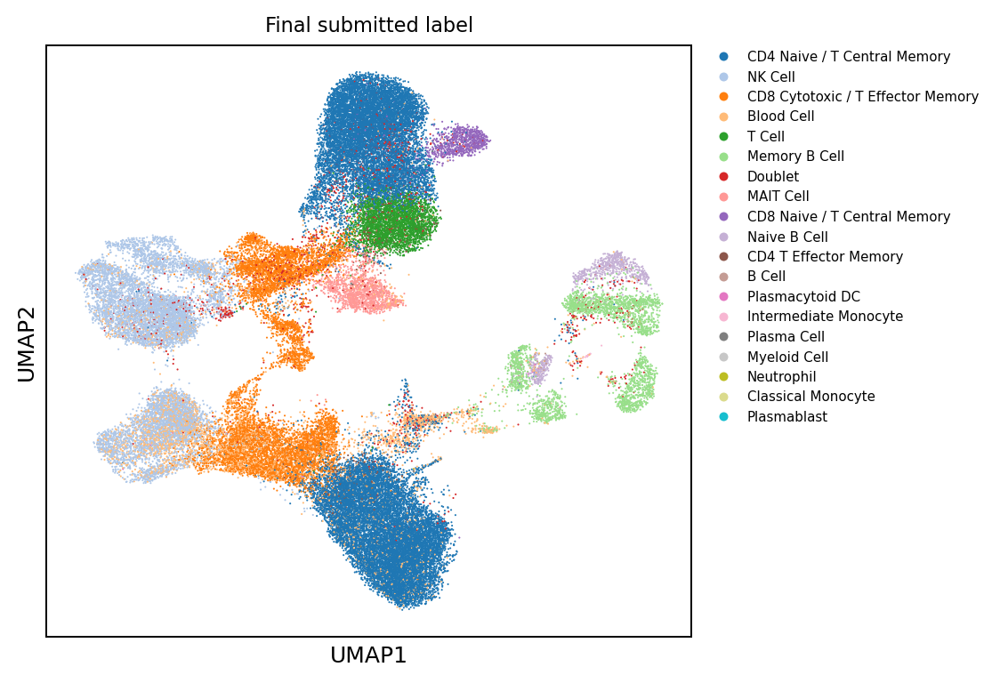

### QC and confidence

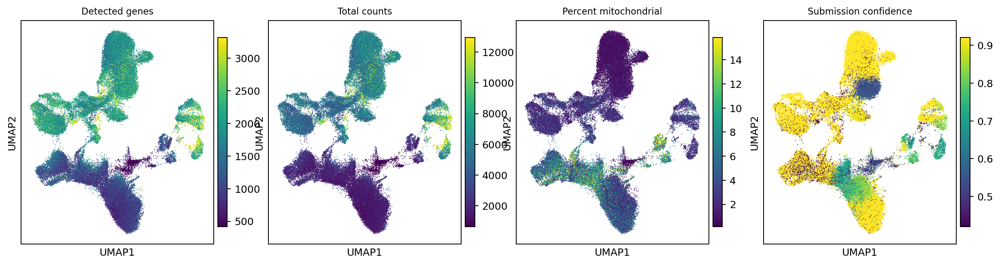

### Annotation source labels

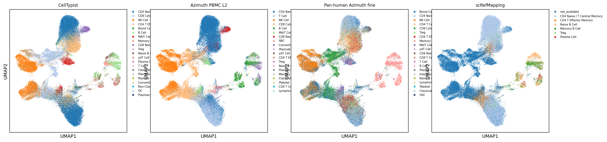

### Lineage, reason, and doublet overlays

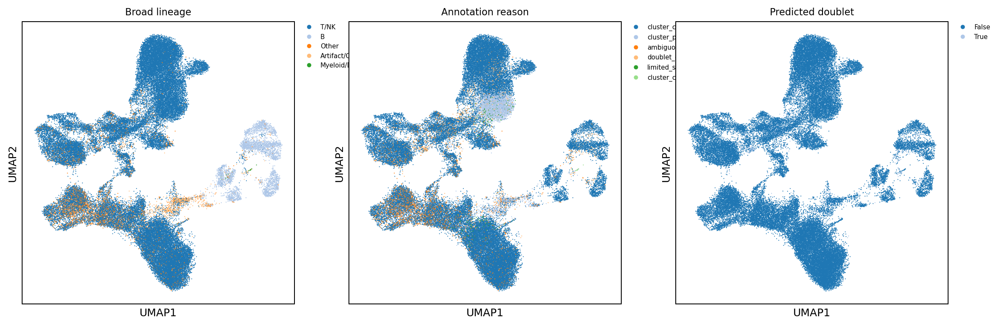

### Lineage core marker expression

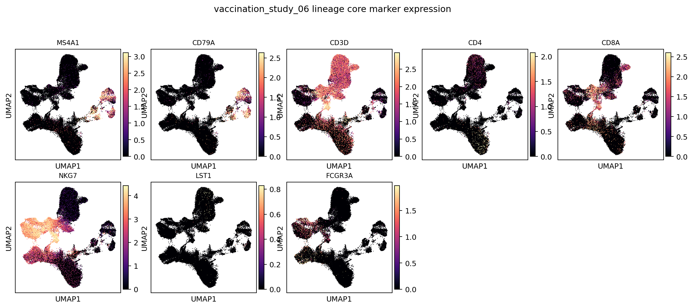

### B-lineage subcluster labels

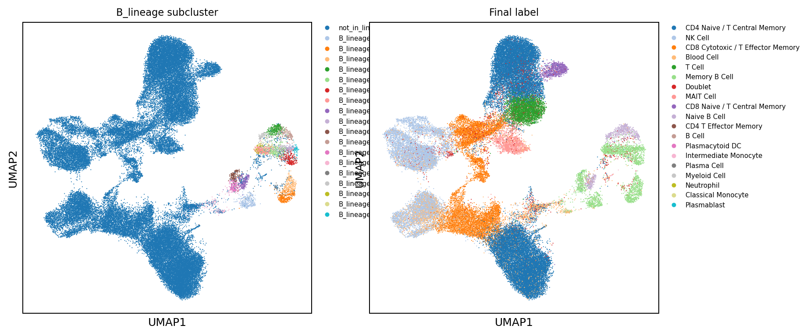

### B-lineage marker expression

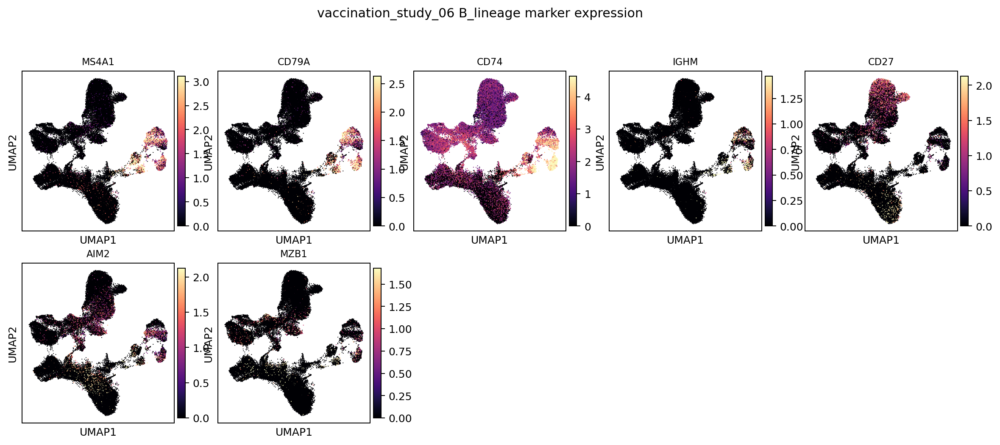

### T/NK-lineage subcluster labels

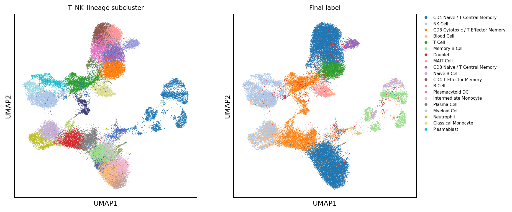

### T/NK-lineage marker expression

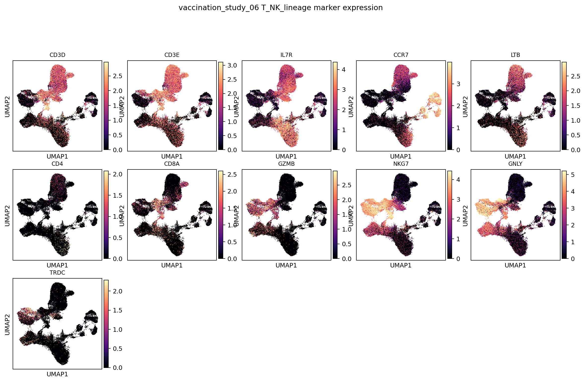

### Myeloid/DC-lineage subcluster labels

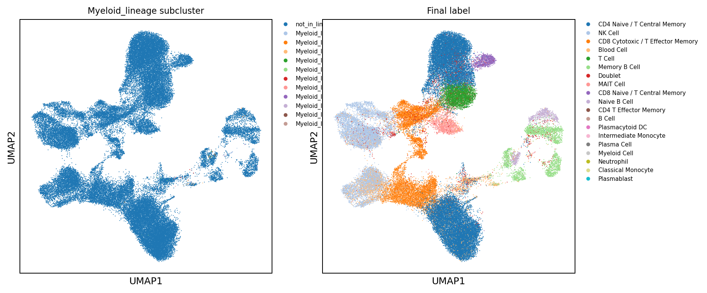

### Myeloid/DC-lineage marker expression

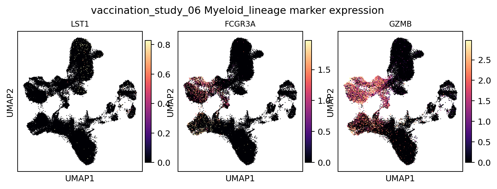

## Label Composition

| predicted_cell_type               |   n_cells | fraction   |
|:----------------------------------|----------:|:-----------|
| CD4 Naive / T Central Memory      |     25096 | 43.7%      |
| NK Cell                           |      8728 | 15.2%      |
| CD8 Cytotoxic / T Effector Memory |      7885 | 13.7%      |
| Blood Cell                        |      4957 | 8.6%       |
| T Cell                            |      2959 | 5.2%       |
| Memory B Cell                     |      2772 | 4.8%       |
| Doublet                           |      1502 | 2.6%       |
| MAIT Cell                         |      1339 | 2.3%       |
| CD8 Naive / T Central Memory      |       869 | 1.5%       |
| Naive B Cell                      |       791 | 1.4%       |
| CD4 T Effector Memory             |       445 | 0.8%       |
| B Cell                            |        29 | 0.1%       |
| Plasmacytoid DC                   |        18 | 0.0%       |
| Intermediate Monocyte             |        13 | 0.0%       |
| Plasma Cell                       |         6 | 0.0%       |

## Cluster Consensus Evidence

| broad_lineage   | cluster         |   n_cells | chosen_label                      | accepted   | best_candidate_before_parent_fallback   |   score_margin |   marker_pct |   source_fraction | cluster_reason                          |
|:----------------|:----------------|----------:|:----------------------------------|:-----------|:----------------------------------------|---------------:|-------------:|------------------:|:----------------------------------------|
| T/NK            | T_NK_lineage:0  |      3297 | NK Cell                           | True       | NK Cell                                 |           1.42 |         0.95 |              0.65 | cluster_consensus_marker_source_support |
| T/NK            | T_NK_lineage:1  |      3162 | T Cell                            | False      | CD4 T Effector Memory                   |           0.04 |         0.9  |              0.18 | cluster_parent_insufficient_consensus   |
| T/NK            | T_NK_lineage:2  |      2948 | CD4 Naive / T Central Memory      | True       | CD4 Naive / T Central Memory            |           0.84 |         0.61 |              0.49 | cluster_consensus_marker_source_support |
| T/NK            | T_NK_lineage:6  |      2810 | CD4 Naive / T Central Memory      | True       | CD4 Naive / T Central Memory            |           1.64 |         0.91 |              0.74 | cluster_consensus_marker_source_support |
| T/NK            | T_NK_lineage:7  |      2780 | CD4 Naive / T Central Memory      | True       | CD4 Naive / T Central Memory            |           0.83 |         0.83 |              0.5  | cluster_consensus_marker_source_support |
| T/NK            | T_NK_lineage:3  |      2743 | CD8 Cytotoxic / T Effector Memory | True       | CD8 Cytotoxic / T Effector Memory       |           1.56 |         0.95 |              0.49 | cluster_consensus_marker_source_support |
| T/NK            | T_NK_lineage:9  |      2730 | CD4 Naive / T Central Memory      | True       | CD4 Naive / T Central Memory            |           1.61 |         0.92 |              0.74 | cluster_consensus_marker_source_support |
| T/NK            | T_NK_lineage:4  |      2662 | CD4 Naive / T Central Memory      | True       | CD4 Naive / T Central Memory            |           0.18 |         0.55 |              0.35 | cluster_consensus_marker_source_support |
| T/NK            | T_NK_lineage:11 |      2587 | CD4 Naive / T Central Memory      | True       | CD4 Naive / T Central Memory            |           1.3  |         0.83 |              0.66 | cluster_consensus_marker_source_support |
| T/NK            | T_NK_lineage:10 |      2521 | CD4 Naive / T Central Memory      | True       | CD4 Naive / T Central Memory            |           0.92 |         0.69 |              0.5  | cluster_consensus_marker_source_support |
| T/NK            | T_NK_lineage:12 |      2177 | CD4 Naive / T Central Memory      | True       | CD4 Naive / T Central Memory            |           0.98 |         0.72 |              0.51 | cluster_consensus_marker_source_support |
| T/NK            | T_NK_lineage:5  |      2163 | CD8 Cytotoxic / T Effector Memory | True       | CD8 Cytotoxic / T Effector Memory       |           0.92 |         0.76 |              0.45 | cluster_consensus_marker_source_support |
| T/NK            | T_NK_lineage:8  |      1950 | NK Cell                           | True       | NK Cell                                 |           1.02 |         0.86 |              0.51 | cluster_consensus_marker_source_support |
| T/NK            | T_NK_lineage:13 |      1898 | CD8 Cytotoxic / T Effector Memory | True       | CD8 Cytotoxic / T Effector Memory       |           0.1  |         0.65 |              0.23 | cluster_consensus_marker_source_support |
| T/NK            | T_NK_lineage:14 |      1885 | CD4 Naive / T Central Memory      | True       | CD4 Naive / T Central Memory            |           0.34 |         0.64 |              0.41 | cluster_consensus_marker_source_support |
| T/NK            | T_NK_lineage:16 |      1353 | MAIT Cell                         | True       | MAIT Cell                               |           0.47 |         0.65 |              0.43 | cluster_consensus_marker_source_support |
| T/NK            | T_NK_lineage:17 |      1236 | NK Cell                           | True       | NK Cell                                 |           0.7  |         0.91 |              0.52 | cluster_consensus_marker_source_support |
| T/NK            | T_NK_lineage:15 |      1108 | NK Cell                           | True       | NK Cell                                 |           0.98 |         0.86 |              0.53 | cluster_consensus_marker_source_support |
| T/NK            | T_NK_lineage:18 |      1085 | NK Cell                           | True       | NK Cell                                 |           1.34 |         0.94 |              0.67 | cluster_consensus_marker_source_support |
| T/NK            | T_NK_lineage:22 |       869 | CD8 Naive / T Central Memory      | True       | CD8 Naive / T Central Memory            |           1.38 |         0.98 |              0.51 | cluster_consensus_marker_source_support |

## Output Files

- Label counts: `tables/label_counts.tsv`
- Cluster decisions: `tables/cluster_consensus_decisions.tsv`
- Local H5AD: `/vast/palmer/pi/hafler/yy693/HIPC-scRNAseq-Annotation/outputs/final_annotations/current_cluster_consensus/cellxgene/vaccination_study_06.final_annotation.cluster_consensus.cxg.h5ad`
- Local submission TSV: `/vast/palmer/pi/hafler/yy693/HIPC-scRNAseq-Annotation/outputs/final_annotations/current_cluster_consensus/submissions/vaccination_study_06_annotation.tsv`
