# vaccination_study_09 Annotation Report

Updated: 2026-06-03 EDT

## Dataset-Specific Assessment

B-cell labels are comparatively stable, but T-state calls remain conservative. The effector-memory T population should be inspected in the T/NK subcluster and marker panels.

## Key Metrics

| Metric                         | Value        |
|:-------------------------------|:-------------|
| Cells                          | 139,960      |
| Genes in H5AD var              | 19,141       |
| Submitted labels               | 20           |
| Parent or Blood fallback cells | 9,999 (7.1%) |
| Doublet calls                  | 579          |
| Median confidence              | 0.92         |
| CD4 T Effector Memory calls    | 865          |
| Generic T Cell calls           | 1            |
| Generic B Cell calls           | 0            |

## Review Priorities

- Review final labels together with source-label UMAPs; exact agreement is not required, but spatially coherent disagreement needs interpretation.
- Use marker-expression panels before accepting narrow labels such as pDC, plasma/plasmablast, Treg, and effector-memory T states.
- Treat `Doublet` as a submitted label, not as filtered-out cells.
- Parent or Blood fallback labels indicate conservative uncertainty and should be checked on UMAP rather than silently forced to terminal labels.

## Inline Figures

### Final submitted labels

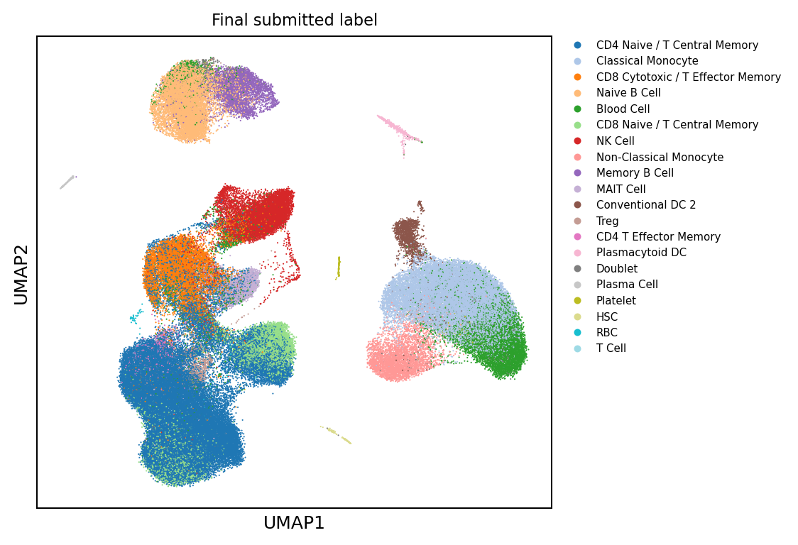

### QC and confidence

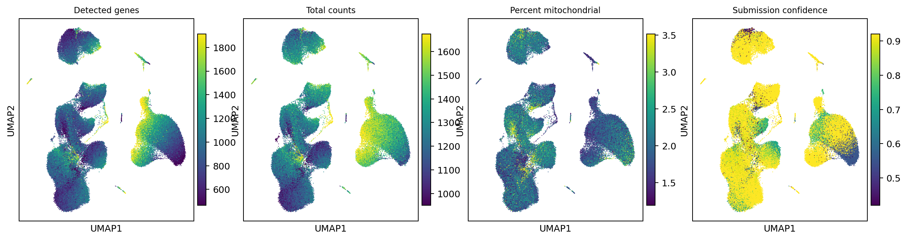

### Annotation source labels

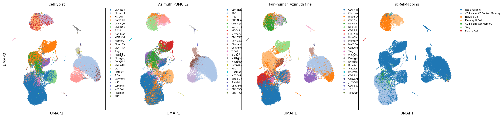

### Lineage, reason, and doublet overlays

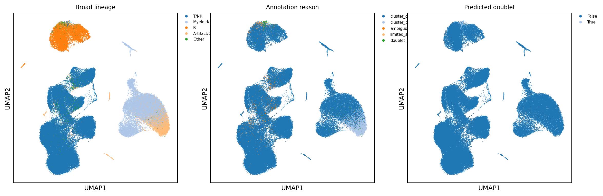

### Lineage core marker expression

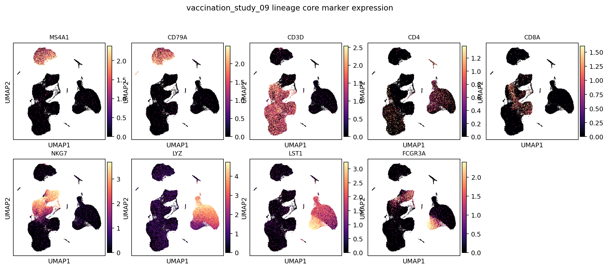

### B-lineage subcluster labels

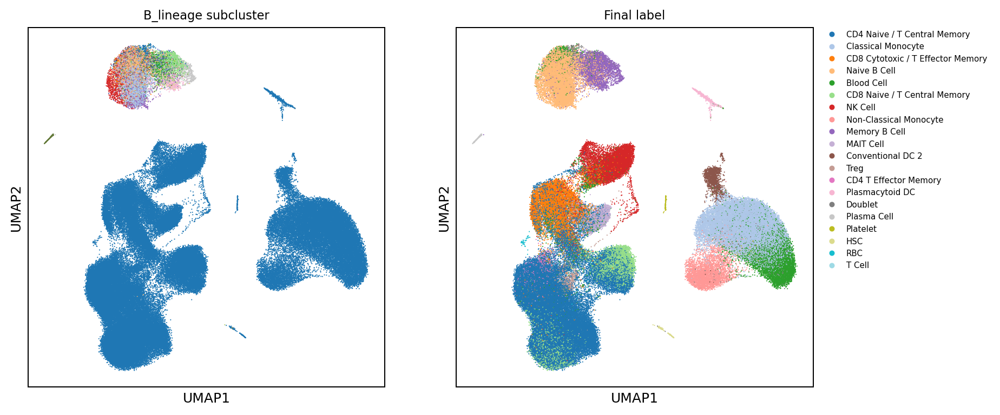

### B-lineage marker expression

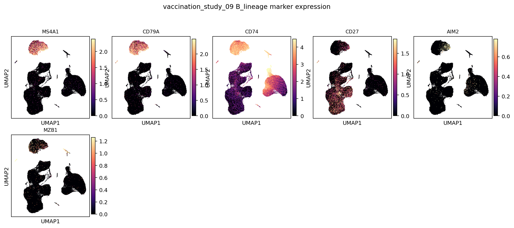

### T/NK-lineage subcluster labels

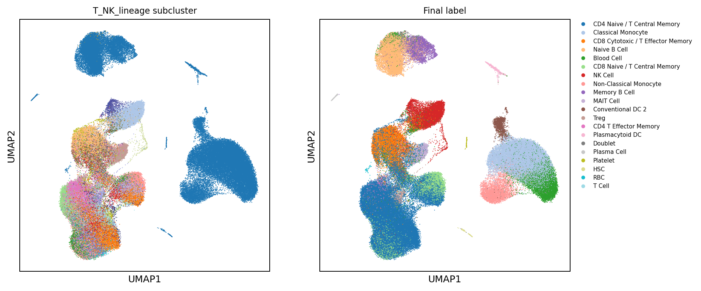

### T/NK-lineage marker expression

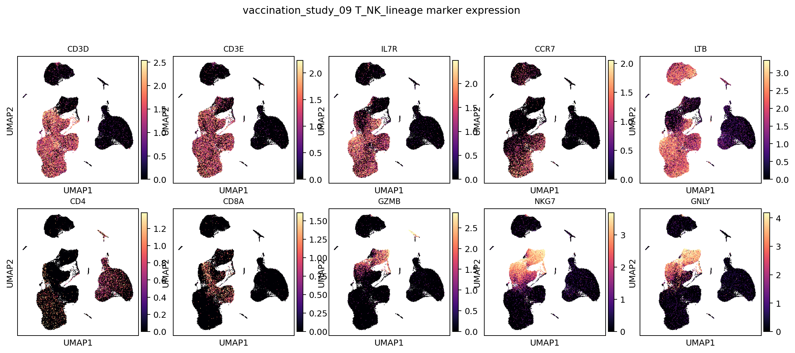

### Myeloid/DC-lineage subcluster labels

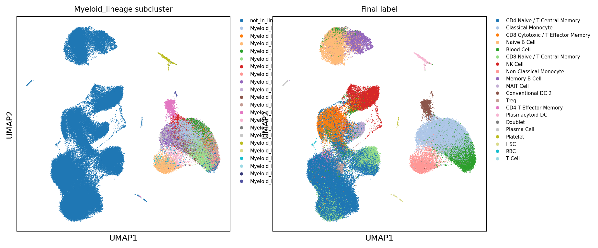

### Myeloid/DC-lineage marker expression

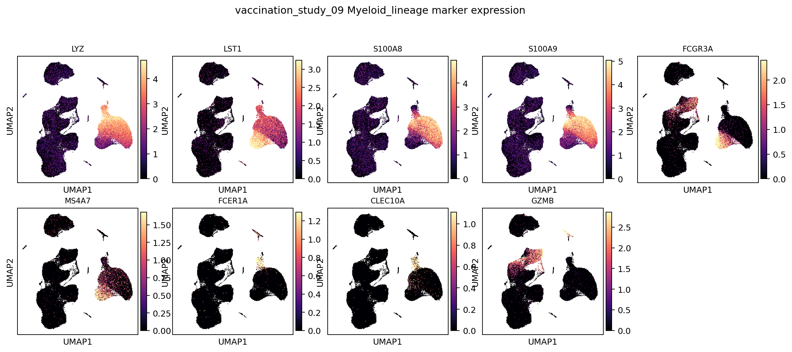

## Subcluster Marker Score Review

Marker scores below are recomputed within each lineage and summarized by lineage subcluster. These plots are the intended review layer for fine lineage labels, not the global marker-expression UMAP alone.

### B lineage subcluster marker scores

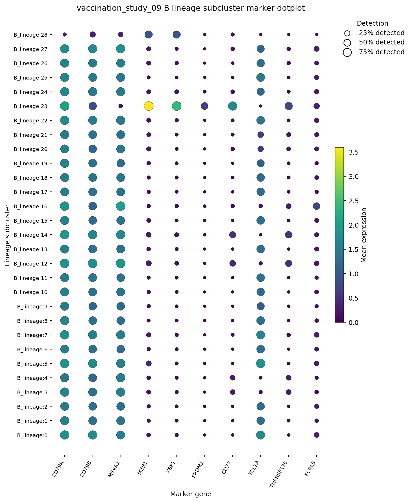

Tables: `tables/subcluster_marker_scores_B_lineage.tsv`, `tables/subcluster_marker_score_top3_B_lineage.tsv`.

### T/NK lineage subcluster marker scores

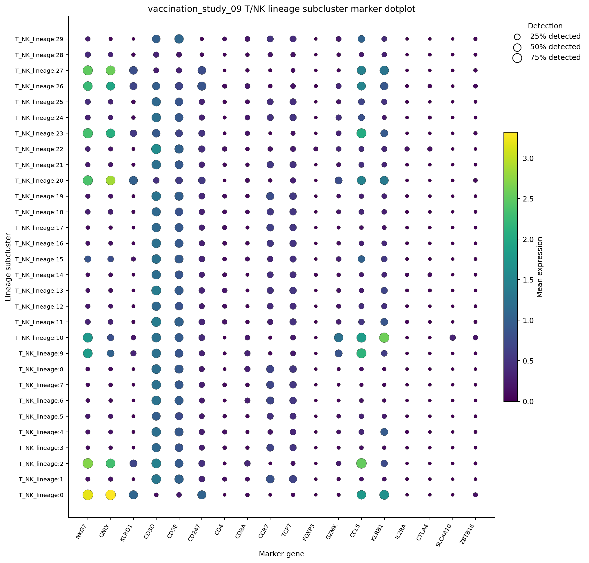

Tables: `tables/subcluster_marker_scores_T_NK_lineage.tsv`, `tables/subcluster_marker_score_top3_T_NK_lineage.tsv`.

### Myeloid/DC lineage subcluster marker scores

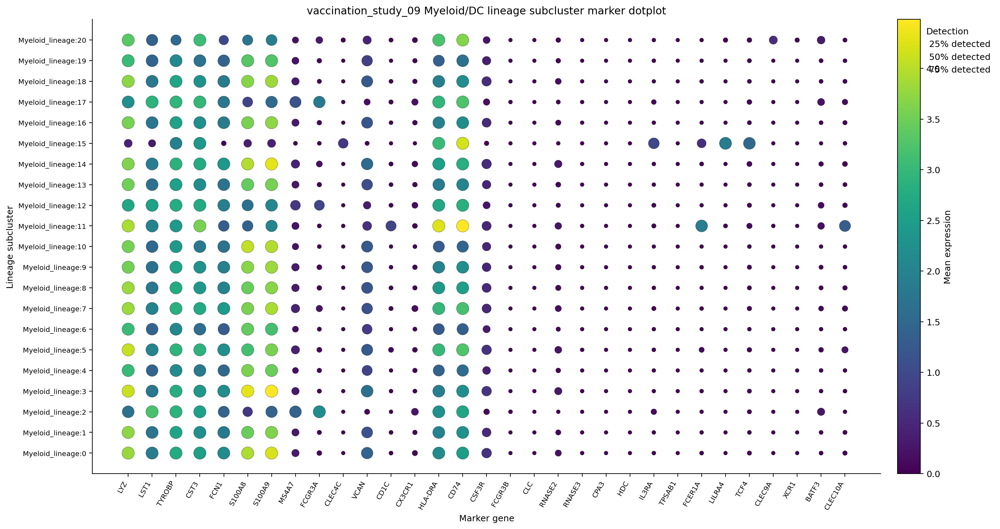

Tables: `tables/subcluster_marker_scores_Myeloid_lineage.tsv`, `tables/subcluster_marker_score_top3_Myeloid_lineage.tsv`.

## Label Composition

| predicted_cell_type               |   n_cells | fraction   |
|:----------------------------------|----------:|:-----------|
| CD4 Naive / T Central Memory      |     53666 | 38.3%      |
| Classical Monocyte                |     18932 | 13.5%      |
| CD8 Cytotoxic / T Effector Memory |     10915 | 7.8%       |
| Naive B Cell                      |     10783 | 7.7%       |
| Blood Cell                        |      9998 | 7.1%       |
| CD8 Naive / T Central Memory      |      9693 | 6.9%       |
| NK Cell                           |      9004 | 6.4%       |
| Non-Classical Monocyte            |      4238 | 3.0%       |
| Memory B Cell                     |      3849 | 2.8%       |
| MAIT Cell                         |      3420 | 2.4%       |
| Conventional DC 2                 |      1496 | 1.1%       |
| Treg                              |      1195 | 0.9%       |
| CD4 T Effector Memory             |       865 | 0.6%       |
| Plasmacytoid DC                   |       793 | 0.6%       |
| Doublet                           |       579 | 0.4%       |

## Cluster Consensus Evidence

| broad_lineage   | cluster           |   n_cells | chosen_label                      | accepted   | best_candidate_before_parent_fallback   |   score_margin |   marker_pct |   source_fraction | cluster_reason                          |
|:----------------|:------------------|----------:|:----------------------------------|:-----------|:----------------------------------------|---------------:|-------------:|------------------:|:----------------------------------------|
| T/NK            | T_NK_lineage:0    |      7308 | NK Cell                           | True       | NK Cell                                 |           1.47 |         0.97 |              0.65 | cluster_consensus_marker_source_support |
| T/NK            | T_NK_lineage:1    |      6935 | CD4 Naive / T Central Memory      | True       | CD4 Naive / T Central Memory            |           0.88 |         0.83 |              0.56 | cluster_consensus_marker_source_support |
| T/NK            | T_NK_lineage:3    |      6576 | CD4 Naive / T Central Memory      | True       | CD4 Naive / T Central Memory            |           1.03 |         0.78 |              0.59 | cluster_consensus_marker_source_support |
| T/NK            | T_NK_lineage:2    |      6487 | CD8 Cytotoxic / T Effector Memory | True       | CD8 Cytotoxic / T Effector Memory       |           0.81 |         0.94 |              0.38 | cluster_consensus_marker_source_support |
| T/NK            | T_NK_lineage:4    |      6070 | CD4 Naive / T Central Memory      | True       | CD4 Naive / T Central Memory            |           0.55 |         0.78 |              0.5  | cluster_consensus_marker_source_support |
| Artifact/Other  | leiden:8          |      5722 | Blood Cell                        | False      | RBC                                     |           0.51 |         0.91 |              0.29 | cluster_parent_insufficient_consensus   |
| T/NK            | T_NK_lineage:5    |      5379 | CD4 Naive / T Central Memory      | True       | CD4 Naive / T Central Memory            |           0.91 |         0.71 |              0.51 | cluster_consensus_marker_source_support |
| T/NK            | T_NK_lineage:6    |      5179 | CD8 Naive / T Central Memory      | True       | CD8 Naive / T Central Memory            |           0.09 |         0.86 |              0.3  | cluster_consensus_marker_source_support |
| T/NK            | T_NK_lineage:7    |      4788 | CD4 Naive / T Central Memory      | True       | CD4 Naive / T Central Memory            |           0.97 |         0.79 |              0.58 | cluster_consensus_marker_source_support |
| T/NK            | T_NK_lineage:8    |      4521 | CD8 Naive / T Central Memory      | True       | CD8 Naive / T Central Memory            |           0.34 |         0.85 |              0.33 | cluster_consensus_marker_source_support |
| T/NK            | T_NK_lineage:9    |      3668 | CD8 Cytotoxic / T Effector Memory | True       | CD8 Cytotoxic / T Effector Memory       |           0.94 |         0.9  |              0.35 | cluster_consensus_marker_source_support |
| T/NK            | T_NK_lineage:11   |      3560 | CD4 Naive / T Central Memory      | True       | CD4 Naive / T Central Memory            |           0.46 |         0.81 |              0.43 | cluster_consensus_marker_source_support |
| T/NK            | T_NK_lineage:10   |      3500 | MAIT Cell                         | True       | MAIT Cell                               |           0.17 |         0.67 |              0.35 | cluster_consensus_marker_source_support |
| T/NK            | T_NK_lineage:12   |      3041 | CD4 Naive / T Central Memory      | True       | CD4 Naive / T Central Memory            |           1    |         0.75 |              0.55 | cluster_consensus_marker_source_support |
| T/NK            | T_NK_lineage:13   |      2969 | CD4 Naive / T Central Memory      | True       | CD4 Naive / T Central Memory            |           1.14 |         0.82 |              0.59 | cluster_consensus_marker_source_support |
| T/NK            | T_NK_lineage:14   |      2886 | CD4 Naive / T Central Memory      | True       | CD4 Naive / T Central Memory            |           0.57 |         0.78 |              0.46 | cluster_consensus_marker_source_support |
| T/NK            | T_NK_lineage:15   |      2834 | CD4 Naive / T Central Memory      | True       | CD4 Naive / T Central Memory            |           0.43 |         0.67 |              0.37 | cluster_consensus_marker_source_support |
| Myeloid/DC      | Myeloid_lineage:0 |      2657 | Classical Monocyte                | True       | Classical Monocyte                      |           0.86 |         0.92 |              0.44 | cluster_consensus_marker_source_support |
| Myeloid/DC      | Myeloid_lineage:2 |      2543 | Non-Classical Monocyte            | True       | Non-Classical Monocyte                  |           2.24 |         0.99 |              0.68 | cluster_consensus_marker_source_support |
| Myeloid/DC      | Myeloid_lineage:3 |      2302 | Classical Monocyte                | True       | Classical Monocyte                      |           1    |         0.94 |              0.42 | cluster_consensus_marker_source_support |

## Output Files

- Label counts: `tables/label_counts.tsv`
- Cluster decisions: `tables/cluster_consensus_decisions.tsv`
- Local H5AD: `/vast/palmer/pi/hafler/yy693/HIPC-scRNAseq-Annotation/outputs/final_annotations/current_cluster_consensus/cellxgene/vaccination_study_09.final_annotation.cluster_consensus.cxg.h5ad`
- Local submission TSV: `/vast/palmer/pi/hafler/yy693/HIPC-scRNAseq-Annotation/outputs/final_annotations/current_cluster_consensus/submissions/vaccination_study_09_annotation.tsv`
